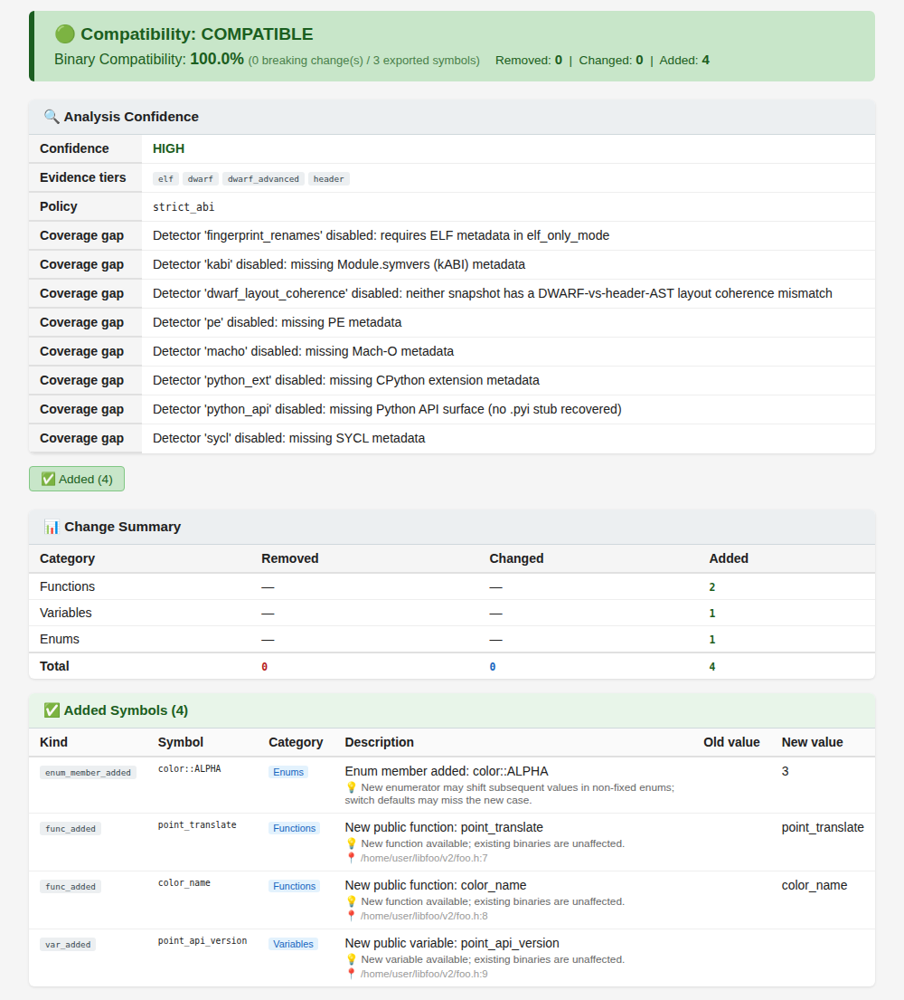
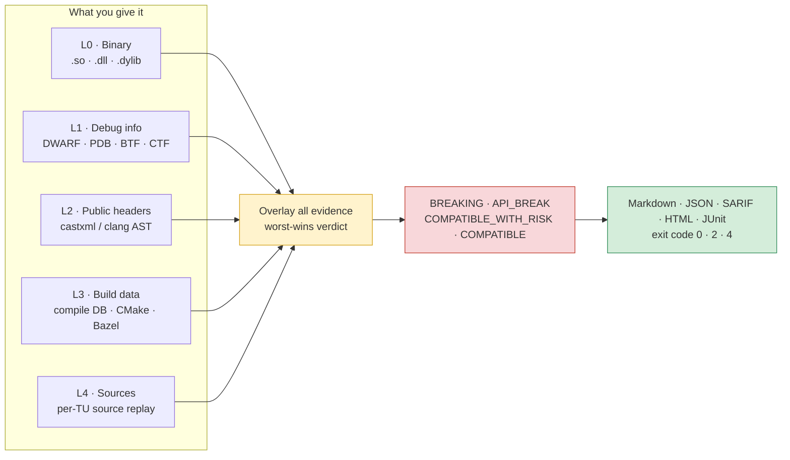

<div align="center">

# abicheck

**Know before you ship whether a C/C++ library upgrade will break the programs already built against it.**

[](https://github.com/abicheck/abicheck/actions/workflows/ci.yml)
[](https://codecov.io/gh/abicheck/abicheck)
[](https://pypi.org/project/abicheck/)
[](https://anaconda.org/conda-forge/abicheck)
[](https://pypi.org/project/abicheck/)
[](LICENSE)

[Documentation](https://abicheck.github.io/abicheck/) ·
[Getting started](https://abicheck.github.io/abicheck/start/getting-started/) ·
[Which command do I need?](#which-command-do-i-need) ·
[Benchmarks](https://abicheck.github.io/abicheck/reference/tool-comparison/) ·
[Migrate from ABICC / libabigail](#migrating-from-another-tool)

</div>

---

## The problem

You ship a shared library. Other people's programs were compiled against version 1, and you are about to release version 2. If an exported function vanished, a struct field moved, a vtable slot shifted, or an enum was renumbered, those programs **crash, corrupt data silently, or refuse to load**. No compiler warns you, and a test suite that rebuilds from source never sees it.

abicheck compares the two versions, with whatever headers, debug info, build data, and sources you have, and tells you what breaks, why, and which version bump you owe.

```bash
abicheck compare libfoo.so.1 libfoo.so.2 --header old=include/v1/ --header new=include/v2/
```

## Why abicheck

- **Five layers of evidence, not one.** Binary, debug info, headers, build flags, sources. Each layer finds breaks the others miss and removes false positives the weaker ones raise.
- **It says what it could not check.** Missing evidence is reported, never silently passed.
- **397 ABI/API change types**, and it keeps binary breaks (`BREAKING`) apart from source-only breaks (`API_BREAK`). No other tool in the [benchmark](#how-it-compares-to-other-tools) makes that distinction.
- **Zero false positives** on the benchmark catalog, at 95.9% accuracy with headers and 99.5% with full evidence, where `abidiff` scores 28.5% and ABICC 44.6%.
- **Made for CI.** Deterministic exit codes, SARIF/JSON/Markdown/HTML/JUnit, baselines, policies, suppressions, a [GitHub Action](#github-action), a typed [Python API](#python-api), and a drop-in `compat` mode for `abi-compliance-checker`. Pure Python, Linux/Windows/macOS.

## What a report looks like

The run below compares two builds where version 2 only grows the ABI surface: two new functions, a new exported variable, and a new enum member. The HTML report, rendered from real output:

<p align="center"></p>

The same content ships as Markdown (the default, and what the [GitHub Action](#github-action) posts as a PR comment), JSON, SARIF, and JUnit. Before the report, a CLI run prints which checks were on and which were off for the evidence you supplied:

```text
$ abicheck compare v1/libfoo.so.1 v2/libfoo.so.2 --header old=v1/foo.h --header new=v2/foo.h

Evidence coverage:
  L0 binary metadata         present, high confidence: elf
  L1 debug info              present, high confidence: DWARF
  L2 public header AST       present, high confidence: header-scoped
  L3 build context           not_collected
  L4 source ABI replay       not_collected
  L5 source graph summary    present, reduced confidence
Checks enabled for this scan (and why others are not):
  [on]  Symbol presence & linkage (added/removed/SONAME) — from the binary's dynamic symbol table
  [on]  Type layout, members, vtables, signatures — from DWARF/PDB debug info
  [on]  API decls absent from the symbol table; public-surface scoping — from the public header AST
  [off] Build-flag & toolchain drift (visibility, std, ABI flags) — no build data
  [off] Macros, default args, inline/template/constexpr bodies — no source replay evidence
  [on]  Impact / call / reachability graph — from the source graph summary
```

<details>
<summary>Markdown output for the same run (abridged)</summary>

```markdown
# ABI Report: libfoo.so.1

| | |
|---|---|
| **Old version** | `old` |
| **New version** | `new` |
| **Verdict** | ✅ `COMPATIBLE` |
| Breaking changes | 0 |
| Source-level breaks | 0 |
| Deployment risk changes | 0 |
| Compatible changes | 4 |

## Analysis Confidence

| Field | Value |
|---|---|
| Confidence | HIGH |
| Evidence tier | `header_aware` |
| Evidence tiers | `elf`, `dwarf`, `dwarf_advanced`, `header` |
| Coverage gap | Detector 'fingerprint_renames' disabled: requires ELF metadata in elf_only_mode |
| Coverage gap | Detector 'kabi' disabled: missing Module.symvers (kABI) metadata |
| Coverage gap | Detector 'dwarf_layout_coherence' disabled: neither snapshot has a DWARF-vs-header-AST layout coherence mismatch |
| Coverage gap | Detector 'pe' disabled: missing PE metadata |
| Coverage gap | Detector 'macho' disabled: missing Mach-O metadata |
| Coverage gap | Detector 'python_ext' disabled: missing CPython extension metadata |
| Coverage gap | Detector 'python_api' disabled: missing Python API surface (no .pyi stub recovered) |
| Coverage gap | Detector 'sycl' disabled: missing SYCL metadata |

> **Policy**: `strict_abi`

## Release Recommendation

| Field | Value |
|---|---|
| Version bump | 🟢 **MINOR** |
| SONAME action | `no_bump_needed` |
| Recommendation state | `actionable` |

Backward-compatible additions to the public API — release a new MINOR version.

## ✅ Additions

- **enum_member_added**: Enum member added: color::ALPHA (`3`)
  > New enumerator may shift subsequent values in non-fixed enums; switch defaults may miss the new case.
- **func_added**: New public function: point_translate (`point_translate`) — `v2/foo.h:7`
  > New function available; existing binaries are unaffected.
- **func_added**: New public function: color_name (`color_name`) — `v2/foo.h:8`
  > New function available; existing binaries are unaffected.
- **var_added**: New public variable: point_api_version — `v2/foo.h:9`
  > New variable available; existing binaries are unaffected.
```

</details>

Exit code `0`, with a `MINOR` version-bump recommendation and no SONAME change. Had a struct field moved or a function vanished, the verdict would be `BREAKING`, the recommendation `MAJOR` with an SONAME bump, and the exit code `4`. Every finding names the change kind and the consumer-visible consequence; where the evidence allows, it also carries the header location and the exported symbols it reaches.

## How it works: five layers of evidence

abicheck treats compatibility as a question of **evidence**. The more independent sources you give it, the more it can prove and the fewer false positives it raises. You provide up to five; each adds facts the previous one cannot see.



| Layer | You provide | Read by | What it newly reveals |
|:-----:|-------------|---------|-----------------------|
| **L0** | Just the binary, even stripped | ELF / PE / Mach-O parsers | Exported symbols, SONAME, symbol versions, visibility, dependencies |
| **L1** | + Debug symbols (`-g` build or sidecar) | DWARF, PDB, BTF, CTF | Struct sizes and field offsets, enum values, vtable slots, calling conventions, packing |
| **L2** | + Public headers (`-H include/`) | castxml or clang AST | Signatures, overloads, access levels, `noexcept`/`final`/`explicit`, templates, what is public vs internal |
| **L3** | + Build data (`--build-info build/`) | compile DB, CMake, Ninja, Bazel, Make | The flags the library was actually built with: `-std`, `_GLIBCXX_USE_CXX11_ABI`, `-fvisibility`, export maps |
| **L4** | + Sources | Per-translation-unit source replay | Facts that never reach the binary: macro and `constexpr` values, default-argument values, inline and template bodies |

The layers are **additive, not a fallback chain**. abicheck overlays everything you give it and computes one worst-wins verdict under an *authority rule*: artifact evidence (L0 to L2) decides the shipped-ABI verdict, while build and source evidence (L3, L4) explains, localizes, scopes, or adds findings of its own, but never deletes an artifact-proven break. A derived source-reachability graph, `L5`, is computed from whatever evidence is present (reduced confidence from headers alone, full confidence with build and source data) and feeds the impact and reachability checks; it is never an input.

With less input abicheck degrades gracefully instead of failing. `abicheck dump --dry-run` reports which layers it found. The best input is **old library + new library + matching headers + debug info + build data**. Read more in [Evidence & Detectability](https://abicheck.github.io/abicheck/learn/evidence-and-detectability/) and [Architecture](https://abicheck.github.io/abicheck/learn/architecture/).

### What each layer buys

Measured on the [`examples/`](examples/README.md) catalog, which holds 197 cases today: 185 of them are compare-style cases with a minimum-evidence label, and the table shows the cumulative share of those whose *every* expected change kind is discovered once a layer is present.

| Evidence available | Cases fully covered |
|--------------------|:-------------------:|
| Just the binary (L0) | 64 / 185 (35%) |
| + Debug symbols (L1) | 133 / 185 (72%) |
| + Public headers (L2) | 157 / 185 (85%) |
| + Build data (L3) | 167 / 185 (90%) |
| + Sources (L4) | 172 / 185 (93%) |
| + Derived source graph (L5) | 185 / 185 (100%) |

This is a discoverability floor, not an accuracy score; the [tool comparison page](https://abicheck.github.io/abicheck/reference/tool-comparison/#which-source-discovers-what) explains the methodology and the handful of cases whose *verdict* is reachable earlier than their last correlated kind.

## How it compares to other tools

`abidiff` (libabigail) reads the binary and its DWARF. `abi-compliance-checker` (ABICC) reads headers and a compiled dump. abicheck runs each pass its input supports: a symbol-table pass on every comparison, a header-AST pass when you supply headers, a DWARF/PDB cross-check when the binaries carry debug info (Linux and Windows; Mach-O has none yet), and build and source evidence layered on top when given, feeding **397 change types** of detection. A bare stripped binary gets only the first pass, and the report says so. That is where the gap comes from.

| | abicheck | libabigail `abidiff` | ABICC |
|---|:---:|:---:|:---:|
| Symbol-table pass (SONAME, visibility, versions) | ✅ | ✅ | ❌ |
| Header AST pass (`noexcept`, `static`, `const`, access, pure-virtual) | ✅ | ❌ | ✅ |
| Debug-info layouts, vtable slots, cross-checked against the AST | ✅ | ✅ (no AST to cross-check) | abi-dumper mode only |
| Build-flag and toolchain drift detection (L3) | ✅ | ❌ | ❌ |
| Distinct `API_BREAK` verdict (source break, binary still works) | ✅ | ❌ | ❌ |
| Reports which checks it could *not* run | ✅ | ❌ | ❌ |

Full-catalog benchmark from 2026-07-18, when the catalog held 193 cases, every tool pointed at the whole catalog blind. A crash, hang, or "no mode for this case" counts as a miss, same as a wrong verdict.

| Tool | Accuracy | False positives | False negatives |
|------|:---:|:---:|:---:|
| **abicheck** (headers, L2) | **95.9%** | **0** | 8 |
| **abicheck** (+ build and sources, L3 to L5) | **99.5%** | **0** | 1 |
| libabigail `abidiff` (with or without headers) | 28.5% | 5 | 133 |
| ABICC (abi-dumper mode) | 44.6% | 8 | 99 |
| ABICC (xml/legacy mode) | 40.4% | 7 | 108 |

Run against abicheck 0.5.0, libabigail 2.4.0, and ABICC 2.3. The table is pinned to commit `ffa860c` and the 193-case catalog of that date; the exact reproduction procedure, ground-truth digest, per-case matrix, and the pinned cross-tool subset used for release-to-release tracking are in [Tool Comparison & Benchmarks](https://abicheck.github.io/abicheck/reference/tool-comparison/#full-catalog-benchmark-2026-07-18-all-195-cases). `python scripts/benchmark_comparison.py --suite all` reruns the *current* catalog against the current checkout rather than reproducing that historical run.

`abidiff` is still the right choice for a sub-second sanity check, especially on a stripped binary where only the symbol table is available. For anything you gate a release on, the numbers above are the argument.

## Installation

**Full installation (recommended)**: conda-forge bundles abicheck with a castxml that passes abicheck's own version gate, so header analysis (L2) works out of the box.

```bash
conda create -n abicheck -c conda-forge python=3.12 abicheck "castxml>=0.6.11,<0.8.0"
conda activate abicheck
```

Pin castxml as shown: the feedstock's own floor is looser than abicheck's gate, which also requires castxml's bundled Clang to be recent. The exact supported bounds live in the [environment reference](https://abicheck.github.io/abicheck/reference/environment/).

**Lightweight/core installation**: the PyPI package is pure Python with no native dependencies.

```bash
pip install abicheck
```

This gives you binary-only (L0) and debug-info (L1) analysis, snapshot comparison, and every report format. For header analysis (L2) you also need a castxml inside the supported range, or a direct clang, on your `PATH`. Do **not** `pip install castxml`: that is an unmaintained 2022 package abicheck rejects.

Per-platform setup, cross-compilation, and Windows/macOS toolchains: [Install](https://abicheck.github.io/abicheck/start/install/) and [Platform Support](https://abicheck.github.io/abicheck/reference/platforms/).

> **Same name, different tool.** The PyPI/conda-forge `abicheck` is unrelated to the older SourceForge `abicheck` some Linux distributions still package. `abicheck --version` should print `abicheck X.Y.Z (abicheck/abicheck)`; if it does not, run `python -m abicheck`.

## Quick start

Compare two versions of a library:

```bash
abicheck compare libfoo.so.1 libfoo.so.2 \
  --header old=include/v1/foo.h --header new=include/v2/foo.h
```

Save a baseline at release time, then check every build against it:

```bash
abicheck dump libfoo.so -H include/foo.h --version 1.0 -o baseline.json
abicheck compare baseline.json ./build/libfoo.so --header new=include/foo.h
```

Pick an output format with `--format markdown|json|sarif|html|junit`:

```bash
abicheck compare old.so new.so -H foo.h --format sarif -o report.sarif
```

Inputs can be shared libraries, JSON snapshots, release directories, or packages (`.rpm`, `.deb`, `.tar`, conda, wheel), mixed freely. Full walkthrough: [Getting Started](https://abicheck.github.io/abicheck/start/getting-started/). Decision guide by artifact and CI policy: [Choose Your Workflow](https://abicheck.github.io/abicheck/start/choose-your-workflow/).

## Which command do I need?

The whole CLI is seven root commands. Most single-library projects only ever need `compare` and `dump`.

| I want to… | Use |
|------------|-----|
| Check whether a library upgrade breaks existing consumers | [`abicheck compare`](https://abicheck.github.io/abicheck/use/cli-usage/) |
| Compare a co-versioned **multi-library release** as one bundle (bundle-level analysis is [ELF/Linux-only](https://abicheck.github.io/abicheck/use/multi-binary/#platform-support)) | [`abicheck compare old-release/ new-release/`](https://abicheck.github.io/abicheck/use/multi-binary/) |
| Check whether **my application** survives a library upgrade | [`abicheck compare --used-by ./myapp`](https://abicheck.github.io/abicheck/use/appcompat/) |
| Check whether a **plugin** still satisfies its host's entrypoints | [`abicheck compare --required-symbol SYM`](https://abicheck.github.io/abicheck/use/plugin-systems/) |
| Scan a PR with source and build context, against a baseline | [`abicheck scan ARTIFACT --against baseline.json`](https://abicheck.github.io/abicheck/use/scan-levels/) |
| Validate a binary's whole dependency stack across two sysroots | [`abicheck deps compare`](https://abicheck.github.io/abicheck/use/cli-usage/) |
| Save a reusable ABI snapshot | [`abicheck dump`](https://abicheck.github.io/abicheck/use/create-baseline/) |
| Replace `abi-compliance-checker` without changing flags | [`abicheck compat`](https://abicheck.github.io/abicheck/use/from-abicc/) |
| Fold per-target reports from a CI build matrix into one gate | [`abicheck aggregate`](https://abicheck.github.io/abicheck/use/aggregate-reports/) |
| Declare and validate a multi-target, multi-profile **project** (advanced) | [`abicheck project`](https://abicheck.github.io/abicheck/reference/project-targets-schema/) |

`compare --used-by` does more than flag an affected application: with source evidence on the library side it shows the public-to-internal call chain that makes the app depend on the changed declaration. When one target is built under several compilers, `aggregate` tells you whether a break is universal or profile-specific.

## Continuous integration

### GitHub Action

```yaml
- uses: abicheck/abicheck@v0.5.0
  with:
    old-library: abi-baseline.json
    new-library: build/libfoo.so
    new-header: include/foo.h
    format: sarif
    upload-sarif: true
```

The action installs Python, castxml, and abicheck, runs the comparison, sets the exit code, and can post a PR comment or upload SARIF to the Security tab. Outputs: `verdict`, `exit-code`, `report-path`. The default compare path needs only checkout access; grant `pull-requests: write` for PR comments and `security-events: write` for SARIF upload. Matrix builds, cross-compilation, and gating flags: [GitHub Action](https://abicheck.github.io/abicheck/use/github-action/).

### Exit codes

| Exit | Verdict | Meaning |
|:----:|---------|---------|
| `0` | `NO_CHANGE` / `COMPATIBLE` / `COMPATIBLE_WITH_RISK` | Safe. No binary ABI break |
| `2` | `API_BREAK` | Source-level break. Consumers must recompile; existing binaries still run |
| `4` | `BREAKING` | Binary ABI break. Existing binaries will crash or misbehave |
| `8` | any | A library vanished from a multi-library release and `--fail-on-removed-library` is set; under the default scheme, only when no `2`/`4` already applies |
| `64` | usage error | Bad flags or inputs |

`--severity-preset` (or a `severity:` block in `.abicheck.yml`) switches `compare` to a severity-based scheme where `1` means an error-level finding in the addition/quality categories. Opt-in `--contract` adds an orthogonal axis that raises a clean `0` to `1` when the declared contract's evidence is incomplete. `scan`, `deps compare`, and `compat` add per-command codes. Full matrix: [Exit Codes](https://abicheck.github.io/abicheck/reference/exit-codes/); how snapshots, policies, suppressions, and severity combine: [CI Gating](https://abicheck.github.io/abicheck/use/ci-gating/).

### Policies and suppressions

Policies decide how a change kind is classified; suppressions silence known or intentional changes, with justification and expiry.

```bash
abicheck compare old.so new.so -H foo.h --policy sdk_vendor --suppress suppressions.yaml
```

Built-in profiles: `strict_abi` (default), `sdk_vendor`, `plugin_abi`; custom YAML policies are supported. See [Policy Profiles](https://abicheck.github.io/abicheck/use/policies/) and [Suppressions](https://abicheck.github.io/abicheck/use/suppressions/).

## Python API

```python
from pathlib import Path
from abicheck.service import run_compare

result = run_compare(
    old_input=Path("libfoo.so.1"),
    new_input=Path("libfoo.so.2"),
    old_headers=[Path("include/v1/foo.h")],
    new_headers=[Path("include/v2/foo.h")],
)

print(result.diff.verdict)       # e.g. Verdict.BREAKING
print(len(result.diff.changes))  # number of detected changes
```

`run_compare` returns a `CompareResult` with `diff`, `old_snapshot`, `new_snapshot`, and the resolved suppressions. The CLI and the API resolve through the same typed request objects and compatibility semantics, so a script or an AI agent gets the same answer a human gets at the terminal. There is no separate protocol server; agents use the CLI's JSON/SARIF output or this API directly. A portable [Agent Skill](https://abicheck.github.io/abicheck/use/agent-skills/) (an internal candidate, not yet externally published) is generated from [`skills-src/`](skills-src/check-abi-compatibility/) with `python scripts/install_dev_skill.py`, so a coding agent can answer "will this break existing consumers?" on its own.

Snapshots, custom policies, rendering, and the CLI/API parity table: [Python API guide](https://abicheck.github.io/abicheck/use/python-api/).

## Migrating from another tool

- **From `abi-compliance-checker`:** `abicheck compat` accepts ABICC's flags, including `-symbols-list` / `-types-list` whitelists, so an existing pipeline keeps working while you move to `compare`. [Migrating from ABICC](https://abicheck.github.io/abicheck/use/from-abicc/).
- **From libabigail:** `abidiff old.so new.so` becomes `abicheck compare old.so new.so`; the guide maps every header, suppression, and debug-info flag and translates `abidiff`'s exit bitmask to abicheck's scalar codes. [Migrating from libabigail](https://abicheck.github.io/abicheck/use/from-libabigail/).

## Platform support

| Platform | Binary + header AST | Debug-info cross-check | CI status |
|----------|:---:|:---:|-----------|
| Linux (ELF) | ✅ | ✅ DWARF, BTF, CTF | Fully validated; canonical lane |
| Windows (PE/COFF) | ✅ | ✅ PDB (layout depth best-effort) | MinGW DLLs validated end-to-end; native MSVC+PDB verdicts experimental (non-blocking lane) |
| macOS (Mach-O) | ✅ | — | Apple-clang dylibs validated end-to-end; no debug-info cross-check yet |

Details, including which toolchains each lane exercises: [Platform Support](https://abicheck.github.io/abicheck/reference/platforms/). What abicheck does *not* catch: [Limitations](https://abicheck.github.io/abicheck/learn/limitations/).

## Examples and validation

The [`examples/`](examples/README.md) directory contains **197 real-world ABI/API scenarios** with ground-truth verdicts: 192 single-library cases (most are `v1`/`v2` pairs with a consumer app; the rest are single-snapshot audits and hand-built L3 to L5 evidence-model fixtures for breaks no artifact layer can see) plus 5 multi-library bundle releases. They double as the regression corpus and as a case encyclopedia of how real breaks look ([browse it](https://abicheck.github.io/abicheck/reference/examples/)).

CI validates the full **197-case catalog** on every push to `main` and every pull request that touches the engine, the tests, or the examples; `python scripts/benchmark_comparison.py --suite all` runs the same sweep locally. Each GitHub Release additionally runs and attaches the pinned 74-case cross-tool subset (`case01` to `case73` plus `case26b`; `python scripts/benchmark_comparison.py --suite pinned74`) for apples-to-apples comparison with libabigail and ABICC. The [validation runbook](docs/contribute/examples-validation-runbook.md) describes the full proof matrix.

## Documentation

- **Start:** [Getting Started](https://abicheck.github.io/abicheck/start/getting-started/) · [Install](https://abicheck.github.io/abicheck/start/install/) · [Choose Your Workflow](https://abicheck.github.io/abicheck/start/choose-your-workflow/)
- **Use:** [CLI Usage](https://abicheck.github.io/abicheck/use/cli-usage/) · [Output Formats](https://abicheck.github.io/abicheck/use/output-formats/) · [Baselines](https://abicheck.github.io/abicheck/use/baseline-management/) · [Application Compatibility](https://abicheck.github.io/abicheck/use/appcompat/) · [GitHub Action](https://abicheck.github.io/abicheck/use/github-action/) · [Troubleshooting](https://abicheck.github.io/abicheck/use/troubleshooting/)
- **Learn:** [ABI in Five Minutes](https://abicheck.github.io/abicheck/learn/abi-series/abi-in-5-minutes/) · [ABI/API Compatibility](https://abicheck.github.io/abicheck/learn/abi-api-handling/) · [Verdicts](https://abicheck.github.io/abicheck/learn/verdicts/) · [Architecture](https://abicheck.github.io/abicheck/learn/architecture/) · [Limitations](https://abicheck.github.io/abicheck/learn/limitations/)
- **Reference:** [Change Kinds](https://abicheck.github.io/abicheck/reference/change-kinds/) · [Exit Codes](https://abicheck.github.io/abicheck/reference/exit-codes/) · [CLI Reference](https://abicheck.github.io/abicheck/reference/cli-reference/) · [Platforms](https://abicheck.github.io/abicheck/reference/platforms/) · [Tool Comparison](https://abicheck.github.io/abicheck/reference/tool-comparison/)

Machine-readable metadata: [CITATION.cff](CITATION.cff) (GitHub's **Cite this repository**), [CodeMeta](codemeta.json), [Zenodo](.zenodo.json), and the published [JSON Schemas](https://abicheck.github.io/abicheck/reference/machine-readable-metadata/) for every output contract.

## Contributing

See [CONTRIBUTING.md](CONTRIBUTING.md) for setup, testing, code style, and the PR workflow, and [goals.md](docs/contribute/goals.md) for status and roadmap. Coding agents (Claude Code, Copilot, Cursor, or otherwise): the canonical repository contract is [AGENTS.md](AGENTS.md).

## License

Licensed under the Apache License, Version 2.0. See [LICENSE](LICENSE) and [NOTICE](NOTICE).

Copyright 2026 Nikolay Petrov
