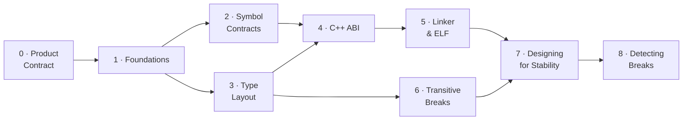

# ABI/API Handling — A Learning Series

This is the **conceptual hub** for understanding ABI/API compatibility — written
to *teach* the subject, not just catalog it. It is the front door to a nine-part
**learning series** that starts from first principles ("what is a symbol? what
does the loader do?") and builds up to the design patterns that keep a C/C++
shared library compatible across releases.

The series is for **two audiences at once**: developers who maintain or consume
shared libraries, and AI agents reasoning about whether a change is safe to ship.
Every break is explained as a *mechanism* — what the compiler baked in, what the
loader does, what byte moves — and then as a *fix*. abicheck's verdicts and
change kinds are woven in throughout, so the same page that teaches you *why* a
struct-field insertion corrupts memory also tells you what abicheck will report
when it sees one.

!!! tip "New to the topic? Don't start here — start with the on-ramp."
    This hub is dense (it doubles as a deep reference, and points to a full
    evidence-model walk-through on its own page —
    [What Each Level Sees](what-each-level-sees.md)). If binary compatibility is
    new to you, read the five-minute on-ramp first and follow the series in order:

    1. [**ABI in Five Minutes**](abi-series/abi-in-5-minutes.md) — the gentlest introduction.
    2. [Part 0 — Compatibility as a Product Contract](abi-series/00-product-contract.md) — the framing.
    3. [Part 1 — Foundations](abi-series/01-foundations.md) — symbols, linking, the loader.

    Then come back here to navigate the rest of the series.

> **Looking for something faster?** For a 2-minute scannable card, see the
> [ABI Cheat Sheet](abi-cheat-sheet.md). For per-case runnable reproductions with
> code and a real failure demo, see the
> [Examples & Case Encyclopedia](../examples/index.md). For verdict semantics and
> CI exit codes, see [Verdicts](verdicts.md). For unfamiliar terms (SONAME,
> vtable, IFUNC, install name, TLS model…), see the
> [Glossary](abi-series/glossary.md).
>
> **Going deep on class layout?** The
> [Class Layout ABI & API guide](class-layout-abi.md) is the single page that maps
> every class-layout change (base offsets, EBO, vptr, vtable slots, RTTI,
> standard-layout / trivially-copyable, packing) to the exact `ChangeKind`
> abicheck emits, the evidence tier that reveals it, and a worked example.

!!! note "Scope & assumptions"
    - **Examples are mostly ELF/Linux and Itanium-C++-ABI flavored** unless a
      section says otherwise. PE/COFF (Windows) and Mach-O (macOS) have their own
      loader, export, and versioning rules — see the per-platform parallels in
      [Part 5](abi-series/05-linker-elf.md#pecoff-and-mach-o-parallels) and the
      [Platform Support reference](../reference/platforms.md). For example, the
      "lookup by name" model in Part 2 is exact for ELF and for most C/C++
      exports, but **Windows DLLs can also export/import by ordinal**, where the
      contract is a *number*, not a name.
    - **Detectability depends on the inputs you give abicheck** — symbols only,
      DWARF/PDB debug info, or public headers. Some changes (e.g. `#define`
      macros, inline/template *bodies*, uninstantiated templates) are invisible
      to *any* artifact comparison. See the per-change matrix in
      [Limitations](limitations.md#source-only-changes-invisible-to-binaryobject-analysis).

---

## How to read this series

The parts are ordered. If you're new to ABI compatibility, read them in
sequence — each builds on the mental models established by the last. If you're
here for a specific problem, jump straight to the relevant part.

| Part | Page | What it covers | Read it when… |
|------|------|----------------|---------------|
| **0** | [Compatibility as a Product Contract](abi-series/00-product-contract.md) | Public surface, SemVer mapping, contract shapes — the *framing* | …before anything else: a change is only a "break" if it breaks a promise |
| **1** | [Foundations](abi-series/01-foundations.md) | Source → object → link → load; what a symbol is; API vs ABI | …you want the ground-up mental model (start here) |
| **2** | [Symbol Contracts](abi-series/02-symbol-contracts.md) | Removal, rename, signature, pointer-level, globals | …a symbol disappeared or changed meaning |
| **3** | [Type Layout](abi-series/03-type-layout.md) | Struct size/offset, alignment, enums, unions, bitfields | …you changed a struct, enum, or union |
| **4** | [C++ ABI](abi-series/04-cpp-abi.md) | Vtables, mangling, templates, `noexcept`, trivial→non-trivial, bases | …you maintain a C++ library |
| **5** | [Linker & ELF](abi-series/05-linker-elf.md) | SONAME, visibility, versioning, calling conv., TLS, security metadata | …a load-time/linker contract changed |
| **6** | [Transitive Breaks](abi-series/06-transitive-breaks.md) | Dependency leaks, anonymous structs, type-kind swaps, reserved fields | …the symbol table looks identical but consumers still break |
| **7** | [Designing for Stability](abi-series/07-designing-for-stability.md) | Opaque handles, Pimpl, version scripts, CI gating — with full code | …you're designing an API to evolve safely |
| **8** | [Detecting Breaks](abi-series/08-detection.md) | Tracking approaches, evidence each break family needs, why single-method checkers miss whole families | …you're deciding *how* to catch all of the above in CI |



> **Cross-cutting companion:** [Evidence & Detectability](evidence-and-detectability.md)
> explains *which inputs* (symbols, debug info, headers, app, bundle) let a tool
> see a given change at all — read it alongside any part when you're wondering
> "why did the tool catch this but not that?"

## Pick a reading path for your role

The series is ordered, but you rarely need all of it at once. These paths get
each audience to the pages that matter for them fastest:

| Audience | Recommended path |
|----------|------------------|
| **New C/C++ library author** | [Product Contract](abi-series/00-product-contract.md) → [Foundations](abi-series/01-foundations.md) → [Symbol Contracts](abi-series/02-symbol-contracts.md) → [Type Layout](abi-series/03-type-layout.md) → [Designing for Stability](abi-series/07-designing-for-stability.md) |
| **C++ library maintainer** | [Foundations](abi-series/01-foundations.md) → [C++ ABI](abi-series/04-cpp-abi.md) → [Type Layout](abi-series/03-type-layout.md) → [Transitive Breaks](abi-series/06-transitive-breaks.md) → [Designing for Stability](abi-series/07-designing-for-stability.md) |
| **CI / release engineer** | [Product Contract](abi-series/00-product-contract.md) → [Detecting Breaks](abi-series/08-detection.md) → [Tool Comparison](../reference/tool-comparison.md) → [Policy Profiles](../user-guide/policies.md) → [Baselines](../user-guide/baseline-management.md) → [Exit Codes](../reference/exit-codes.md) → [Output Formats](../user-guide/output-formats.md) |
| **Distribution / package maintainer** | [Linker & ELF](abi-series/05-linker-elf.md) → [Transitive Breaks](abi-series/06-transitive-breaks.md) → [Multi-Binary Releases](../user-guide/multi-binary.md) → [Application Compatibility](../user-guide/appcompat.md) |
| **Plugin / SDK author** | [Symbol Contracts](abi-series/02-symbol-contracts.md) → [Plugin Systems](../user-guide/plugin-systems.md) → [Policy Profiles](../user-guide/policies.md) → [Product Contract §4](abi-series/00-product-contract.md#4-name-your-contract-shape) |
| **AI agent / automated reviewer** | [Overview](abi-api-handling.md) → [Evidence & Detectability](evidence-and-detectability.md) → [Examples Encyclopedia](../examples/index.md) → [Change Kind Reference](../reference/change-kinds.md) |

---

## Break families at a glance

Every detected change maps to one of these families. The verdict column shows the
typical classification; the exact verdict per fixture lives in
`examples/ground_truth.json` and the [Examples Encyclopedia](../examples/index.md).
The **Part** column points to where the mechanism is explained.

Case numbers link straight to the generated example page; the **Typical verdict**
column says "mixed" where the verdict is case-dependent (the per-fixture verdict
is the source of truth).

| Family | Representative cases | Typical verdict | Explained in |
|--------|---------------------|-----------------|--------------|
| Symbol/function removal & rename | [01](../examples/case01_symbol_removal.md), [12](../examples/case12_function_removed.md), [58](../examples/case58_var_removed.md), [66](../examples/case66_language_linkage_changed.md) | 🔴 BREAKING | [Part 2](abi-series/02-symbol-contracts.md) |
| Signature changes (params, return, pointer level) | [02](../examples/case02_param_type_change.md), [10](../examples/case10_return_type.md), [33](../examples/case33_pointer_level.md), [46](../examples/case46_pointer_chain_type_change.md) | 🔴 BREAKING | [Part 2](abi-series/02-symbol-contracts.md) |
| Global variable type/qualifier/removal | [11](../examples/case11_global_var_type.md), [39](../examples/case39_var_const.md), [58](../examples/case58_var_removed.md) | 🔴 BREAKING | [Part 2](abi-series/02-symbol-contracts.md) |
| Struct/class layout, alignment & packing | [07](../examples/case07_struct_layout.md), [14](../examples/case14_cpp_class_size.md), [40](../examples/case40_field_layout.md), [42](../examples/case42_type_alignment_changed.md), [43](../examples/case43_base_class_member_added.md), [56](../examples/case56_struct_packing_changed.md), [117](../examples/case117_no_unique_address.md) | 🔴 BREAKING | [Part 3](abi-series/03-type-layout.md) |
| Enum value/underlying changes | [08](../examples/case08_enum_value_change.md), [19](../examples/case19_enum_member_removed.md), [20](../examples/case20_enum_member_value_changed.md), [57](../examples/case57_enum_underlying_size_changed.md) | 🔴 BREAKING | [Part 3](abi-series/03-type-layout.md) |
| Union layout | [24](../examples/case24_union_field_removed.md), [26](../examples/case26_union_field_added.md) (grows) · [26b](../examples/case26b_union_field_added_compatible.md) (no growth) | mixed — 🔴 if size grows, else 🟢 | [Part 3](abi-series/03-type-layout.md) |
| C++ vtable & virtual methods | [09](../examples/case09_cpp_vtable.md), [23](../examples/case23_pure_virtual_added.md), [38](../examples/case38_virtual_methods.md), [68](../examples/case68_virtual_method_added.md), [72](../examples/case72_covariant_return_changed.md) | 🔴 BREAKING | [Part 4](abi-series/04-cpp-abi.md) |
| C++ qualifiers, mangling & ABI tags | [21](../examples/case21_method_became_static.md), [22](../examples/case22_method_const_changed.md), [30](../examples/case30_field_qualifiers.md), [71](../examples/case71_inline_namespace_moved.md), [86](../examples/case86_tag_struct_renamed.md), [101](../examples/case101_inline_namespace_version_bumped.md), [113](../examples/case113_abi_tag_changed.md) | mixed — 🔴 BREAKING or 🟠 API_BREAK | [Part 4](abi-series/04-cpp-abi.md) |
| Trivial → non-trivial (calling convention) | [64](../examples/case64_calling_convention_changed.md), [69](../examples/case69_trivial_to_nontrivial.md) | 🔴 BREAKING | [Part 4](abi-series/04-cpp-abi.md) |
| Templates, inline & ODR | [16](../examples/case16_inline_to_non_inline.md), [17](../examples/case17_template_abi.md), [47](../examples/case47_inline_to_outlined.md), [59](../examples/case59_func_became_inline.md), [79](../examples/case79_missing_template_instantiation.md), [85](../examples/case85_internal_template_signature_changed.md), [87](../examples/case87_default_template_arg_changed.md) | mixed — 🔴 BREAKING or 🟢 COMPATIBLE | [Part 4](abi-series/04-cpp-abi.md) |
| Modern C/C++ contract shifts (char8_t, _BitInt, _Atomic, concepts) | [105](../examples/case105_concept_tightening.md), [114](../examples/case114_char8t_migration.md), [115](../examples/case115_bit_int_width_changed.md), [116](../examples/case116_atomic_qualifier_changed.md) | mixed — 🔴 BREAKING or 🟢 COMPATIBLE | [Part 4 §Modern](abi-series/04-cpp-abi.md#modern-cc-and-toolchain-abi-hazards) |
| ELF/linker metadata (SONAME, visibility, versioning, RPATH, TLS) | [05](../examples/case05_soname.md), [06](../examples/case06_visibility.md), [13](../examples/case13_symbol_versioning.md), [49](../examples/case49_executable_stack.md), [51](../examples/case51_protected_visibility.md), [52](../examples/case52_rpath_leak.md), [65](../examples/case65_symbol_version_removed.md), [67](../examples/case67_tls_var_size_changed.md) | mixed — 🔴 BREAKING or 🟢 COMPATIBLE | [Part 5](abi-series/05-linker-elf.md) |
| Transitive/dependency & `detail::` leaks | [18](../examples/case18_dependency_leak.md), [48](../examples/case48_leaf_struct_through_pointer.md), [74](../examples/case74_detail_base_class_changed.md), [75](../examples/case75_detail_embedded_by_value.md), [76](../examples/case76_detail_pimpl_vtable_changed.md), [77](../examples/case77_detail_templated_base_changed.md), [80](../examples/case80_pimpl_shared_to_unique.md), [97](../examples/case97_api_depends_on_consumer_env.md), [104](../examples/case104_glibcxx_dual_abi_flip.md), [112](../examples/case112_lp64_ilp64.md) | 🔴 BREAKING | [Part 6](abi-series/06-transitive-breaks.md) |
| Source-only / API-level (rename, access, explicit, default args, hidden friends) | [31](../examples/case31_enum_rename.md), [34](../examples/case34_access_level.md), [96](../examples/case96_hidden_friend_removed.md), [106](../examples/case106_ctor_became_explicit.md), [123](../examples/case123_default_argument_removed.md), [124](../examples/case124_header_constant_value_changed.md) | 🟠 API_BREAK | [Part 6 §Source-only API breaks](abi-series/06-transitive-breaks.md#source-only-api-breaks-binary-identical) |
| Deployment risk (noexcept, ISA dispatch, version-require) | [15](../examples/case15_noexcept_change.md), [83](../examples/case83_cpu_dispatch_isa_dropped.md) | 🟡 COMPATIBLE_WITH_RISK | [Part 4](abi-series/04-cpp-abi.md) |
| Dependency / runtime floors & environment drift (glibc/libstdc++ floor, DT_RELR, RPATH type, time64) | [170](../examples/case170_env_runtime_floor_raised.md) | 🟡 COMPATIBLE_WITH_RISK — 🔴 or 🟢 once a floor is declared | [§ Dependency floors](#dependency-floors-the-contract-below-your-library) + [Environment & Toolchain Drift](environment-drift.md) |
| Compatible additions & quality signals | [03](../examples/case03_compat_addition.md), [25](../examples/case25_enum_member_added.md), [26b](../examples/case26b_union_field_added_compatible.md), [27](../examples/case27_symbol_binding_weakened.md), [29](../examples/case29_ifunc_transition.md), [61](../examples/case61_var_added.md), [62](../examples/case62_type_field_added_compatible.md), [99](../examples/case99_experimental_graduated.md) | 🟢 COMPATIBLE | [Part 7](abi-series/07-designing-for-stability.md) |
| Scoped/non-public internal changes | [118](../examples/case118_internal_struct_field_added_scoped.md), [119](../examples/case119_internal_struct_field_removed_scoped.md), [120](../examples/case120_internal_struct_reordered_scoped.md) | ✅ NO_CHANGE | [Part 6](abi-series/06-transitive-breaks.md) |
| Security-hardening & deployment metadata (RELRO, canary, exec-stack, RUNPATH, `DT_NEEDED`, TLS model, symbol binding) — artifact/linker facts (L0/L3) | [128](../examples/case128_symbol_binding_strengthened.md), [133](../examples/case133_tls_model_flip.md), [134](../examples/case134_relro_weakened.md), [135](../examples/case135_stack_canary_removed.md), [136](../examples/case136_executable_stack_removed.md), [137](../examples/case137_runpath_changed.md), [138](../examples/case138_needed_added.md) | mixed — 🟡 risk (RELRO/canary/TLS) or 🟢 COMPATIBLE (exec-stack/RUNPATH/`DT_NEEDED`/binding) | [Part 5](abi-series/05-linker-elf.md) |
| **Build-flag & toolchain drift (L3)** — the flags the library was *built* with, as a finding on their own | [130](../examples/case130_exceptions_mode_flip.md), [131](../examples/case131_rtti_mode_flip.md), [132](../examples/case132_threadsafe_statics_flip.md) | 🟡 COMPATIBLE_WITH_RISK | [Source & Build Data](build-source-data.md) |
| **Source-only bodies & macros (L4)** — `#define` macro values, inline/template/`constexpr` **bodies**, uninstantiated templates (none header-reachable) | [122](../examples/case122_template_signature_uninstantiated.md) *(the documented `NO_CHANGE` gap — even L4 can't close it; a detected macro/body change is 🟠 API_BREAK / 🟡 risk)* | mixed — 🟠 API_BREAK / 🟡 risk, or ✅ NO_CHANGE (residual gap) | [Source & Build Data](build-source-data.md) |
| **Intra-version ABI hygiene / audit** — accidental export, private-header leak, unversioned export, RTTI leak (no baseline needed) | [143](../examples/case143_audit_accidental_export.md), [144](../examples/case144_audit_private_header_leak.md), [145](../examples/case145_audit_unversioned_export.md), [146](../examples/case146_audit_rtti_for_internal.md) | 🟡 risk | [§ source scan](#going-deeper-than-artifacts-the-source-scan) |
| **Cross-source validation** — one fact, two sources: header↔build mismatch, ODR variant, export↔decl pair | [148](../examples/case148_xcheck_header_build_mismatch.md), [149](../examples/case149_xcheck_odr_variant.md), [150](../examples/case150_xcheck_export_public_pair.md), [151](../examples/case151_xcheck_provider_matrix.md) | mixed — 🟠 API_BREAK or 🟡 risk | [§ source scan](#going-deeper-than-artifacts-the-source-scan) |

Of these rows the **security-hardening & deployment** row is *artifact/linker*
coverage (L0/L3, mixed verdicts — an object-size change like
[case127](../examples/case127_data_object_size_changed.md) is a separate 🔴
BREAKING layout finding, not a hardening risk). The **last four rows** are the
families a plain two-version `compare` of L0–L2 artifacts does **not** produce on
its own — build-flag drift needs the build data (L3), source-only bodies & macros
need the sources (L4), and the intra-version hygiene and cross-source families
need the scan's cross-source pass (which reads L0/L1/L2 evidence — no L4 source
replay required; the audit fixtures resolve at L0/L2). All five new rows are the
subject of the
[level-by-level walk-through](what-each-level-sees.md)
and the [source-scan section](#going-deeper-than-artifacts-the-source-scan) below.

---

## The one idea to carry through the whole series

If you remember nothing else:

> **The compiler bakes the library's ABI facts — sizes, offsets, register
> choices, vtable slot numbers, symbol names — into every caller, as immediate
> constants, and never re-checks them.** When the library changes one of those
> facts in a later release, the old caller keeps using the old number. Nobody
> re-validates it. That is why an ABI break is *silent*: no linker error, often
> no crash, just wrong bytes at the wrong address.
>
> Every fix in [Part 7](abi-series/07-designing-for-stability.md) is therefore a
> variation on a single move: **stop publishing the fact** — hide it behind a
> pointer, a version node, or hidden visibility — so you stay free to change it.

abicheck exists to catch these breaks *before* they ship: it dumps a snapshot of
each binary, diffs them structurally, and classifies every difference into one of
five verdicts mapped to CI exit codes. See
[Part 1 §7](abi-series/01-foundations.md#7-where-abicheck-fits) for how that
pipeline works, and [Verdicts](verdicts.md) for the exit-code semantics.

### Runtime calls are not the same as ABI dependencies

A public entry point may call a long chain of private helpers at runtime. That
runtime call graph is **not** automatically the consumer's ABI contract. Existing
binaries are bound only to the symbols, types, constants, layouts, and inline
code that cross the **compile / link / load boundary**: what appears in installed
public headers, what the consumer object directly references, and what the loader
must resolve.

```text
Safe runtime call chain:
app -> public_func
       public_func -> hidden internal_helper

Consumer binary depends on public_func only. internal_helper can change because
it is not exported, not referenced by public headers, and not part of public
layout or inline code.
```

The same private helper becomes an ABI dependency if the boundary shifts:

```text
Unsafe link-time dependency:
inline public_func in an installed header -> detail::internal_helper

The consumer object now directly references detail::internal_helper. Removing,
renaming, hiding, or changing that helper can break already-built consumers.
```

Private types follow the same rule. A helper struct is safely private while it is
fully hidden behind an opaque pointer or implementation file, but not when the
public header exposes it by value:

```text
Unsafe compile-time layout dependency:
public header exposes InternalType by value

The consumer bakes sizeof(InternalType), alignment, field offsets, base-class
layout, and calling-convention facts into its own object code.
```

Use this checklist before calling an internal change ABI-safe. A private change
is safe only when **all** of these remain true:

- the private symbol is not exported or otherwise load-resolvable by consumers;
- public inline, template, `constexpr`, or macro bodies do not reference it;
- it is not part of any public struct/class layout, base class, field, parameter,
  return value, exception specification, allocator/deallocator rule, or calling
  convention;
- it is absent from installed public headers except behind an opaque declaration
  that reveals no size, members, bases, or required helper symbols;
- no plugin, callback, subclassing, serialization, or user-extension model
  promises that consumers may provide or observe the changed detail;
- the public behavior contract remains compatible, even if the binary boundary is
  intact.

This distinction is why [Part 5](abi-series/05-linker-elf.md) treats leaked
private exports as dangerous, [Part 4](abi-series/04-cpp-abi.md) treats
inline/template bodies as part of the contract, and
[Part 6](abi-series/06-transitive-breaks.md) treats exposed dependency types as
transitive ABI.

### App-swap (ASW): the consumer-scoped runtime check

The most realistic *consumer-level* test is **application software swap (ASW)** —
build an app against the old library, drop in the new one, and run it. abicheck
exposes this as [`appcompat`](../user-guide/appcompat.md): it parses the app's
required symbols, compares old/new in full mode, and **filters** findings to the
changes that affect *that* app. ASW is powerful and narrow at the same time:

- It **proves** real loader/linker behavior and tested execution paths — "this
  app does not import the removed symbol", "this app needs symbol version X the
  new lib lacks".
- It **cannot** speak for the whole contract: untested public API, *future*
  consumers, silent layout corruption a test never exercises, and source-only
  (recompile) breaks all stay invisible.

So ASW is **consumer-scoped** compatibility; library `compare`/`scan` is
**contract-scoped**. Use both — `compare`/`scan` protect the library contract,
ASW protects a specific deployment. ASW is one of several *methods*, each seeing
different evidence; the full comparison of methods (libabigail, ABICC, app-swap,
bundle scan) is in
[Evidence & Detectability](evidence-and-detectability.md#2-methods-compared-by-the-evidence-they-use).

---

### Feed abicheck `.so` + debug info + headers for the best result

abicheck's three analysis tiers are additive, and the highest-coverage setup is
a single comparison of **debug-enabled libraries with their public headers
supplied**:

```bash
abicheck compare libfoo_v1.so libfoo_v2.so \
    --old-header include/v1/foo.h --new-header include/v2/foo.h   # both built with -g
```

- **`.so` + DWARF (`-g` / `/Zi`)** gives the ground-truth *emitted* ABI — struct
  layout, field offsets, alignment/packing, enum values, calling convention.
- **public headers (castxml or clang, `--ast-frontend`)** add the source-level API surface the binary cannot
  carry — `final`, access, ref-qualifiers, `noexcept`/`explicit`, default-argument
  values, and `const`/`constexpr` constant values (the last two have *no symbol*,
  so only header analysis can reach them).

Comparing a **stripped binary with no headers** yields only symbol add/remove
coverage and silently misses every layout and source-level break. If you ship
stripped, build a debug copy purely as an analysis input and compare *that* with
headers. A handful of changes remain invisible to any artifact comparison
(`#define` macros, inline/template **bodies**, uninstantiated templates) — see
[Limitations → Source-only changes](limitations.md#source-only-changes-invisible-to-binaryobject-analysis)
for the full per-change detectability matrix.

These three tiers are artifact layers **L0–L2**. Two optional layers go
further without overriding an artifact-proven break: **L3** build context
(`-p build/`) pins the exact ABI-affecting flags, and **L4** source/evidence
packs recover several of the otherwise-invisible source-only facts above
(macro/`constexpr` values, uninstantiated templates). See [Build & Source Packs](build-source-data.md) and the full [L0–L4
model](evidence-and-detectability.md).

> **The layering principle — more evidence cuts *both* error kinds.** Each layer
> you add reduces **false negatives** (breaks a weaker input is blind to) **and**
> **false positives** (internal churn a weaker input cannot scope) — not one at
> the expense of the other. Symbols-only is blind to layout; add DWARF and it
> sees layout but *over-reports* internal-type churn; add headers and that churn
> is scoped out while every real break stays; add build context and it catches a
> cross-toolchain break no artifact tier could see; add source (L4) and it
> catches macro/`constexpr`/inline-body breaks **no artifact tier can *ever* see**.
> The one rule that never bends: more evidence may *scope away* a false positive
> but must never *hide* an artifact-proven break (the *authority rule*). abicheck
> tracks each layer's FP/FN contribution as a CI gate — see
> [Evidence & Detectability → What each layer buys](evidence-and-detectability.md#what-each-layer-buys-fewer-false-negatives-and-fewer-false-positives)
> for the tracked per-tier matrix.

### Which input proves which family — and what each level actually sees

The three artifact tiers above (L0–L2) are only half the picture, and *which*
input first reveals a given change is worth seeing concretely rather than in the
abstract. That entire story — the summary matrices (artifact **L0–L2** and
source-scan **L3–L5**) **and** a single tiny library walked up every evidence
level so you can watch each change appear or stay invisible — now lives on its own
digestible, diagram-driven page:

➡️ **[What Each Level Sees — a level-by-level walk-through](what-each-level-sees.md)**

The short version, if you only remember one row per level:

| Level | Newly reveals | Blind to |
|:-----:|---------------|----------|
| **L0** symbols | symbol add/remove/rename, SONAME, versioning, visibility | anything that keeps the symbol name |
| **L1** debug | struct/enum layout, offsets, vtables, calling convention | source intent, macros, public-vs-internal |
| **L2** headers | signatures, access, `noexcept`, default-arg & `constexpr` values, public scoping | `#define` macros, inline/template **bodies** |
| **L3** build | ABI-relevant flags & toolchain (`-std`, `_GLIBCXX_USE_CXX11_ABI`) | anything *inside* the source |
| **L4** sources | macro / `constexpr` values, inline/template/uninstantiated bodies | the layout actually *emitted* (L1's job) |
| **L5** graph | reachability / impact ranking | proves nothing on its own — it prioritizes |

Two rules the walk-through makes concrete: **no single level sees every change**
(a stripped-binary L0 compare calls a genuinely breaking release "clean"), and
the **authority rule** — the artifact tiers (L0–L2) set any `BREAKING` gate, while
the build/source tiers (L3–L5) add findings and explanation but never manufacture
or delete a proven binary break. abicheck tracks each layer's FP/FN contribution
as a CI gate — see
[Evidence & Detectability → What each layer buys](evidence-and-detectability.md#what-each-layer-buys-fewer-false-negatives-and-fewer-false-positives).

## Going deeper than artifacts: the source scan

Artifact comparison (L0–L2) proves what the *shipped binary* did. To recover the
source-only facts it cannot see — `#define` macros, `constexpr` values,
default-argument values, inline/template **bodies**, uninstantiated templates —
abicheck can read the build's compile database (**L3**) and replay the sources
(**L4**), and fold a source/build reachability graph (**L5**). The one-shot
driver is `abicheck scan`. It has one evidence dial — `--depth`
(`binary|headers|build|source|full`) — that selects how far down the `L0`–`L5`
*evidence layers* (what it sees + authority) to collect; fully explained in
[Evidence Layers & Scan Depth](scan-and-evidence-levels.md). The governing
**authority rule**: source/build evidence (L3/L4/L5) explains, localizes, scopes,
or raises its own source-/API-level findings, but **never deletes an
artifact-proven break**.

**Who produces the source facts.** The default is a post-build
`compile_commands.json` replay — nothing in your build changes (`abicheck scan`
/ `dump --sources`). If you'd rather have the build *emit* the facts itself, two
producers write the identical schema for `abicheck merge` to fold in: the
portable **`abicheck-cc`** compiler wrapper, and — for large/template-heavy
builds where a companion parse hurts — an optional **Clang plugin** that rides
the compile's own AST (zero extra parse). The three are one interchangeable
family; see [Build & Source data](build-source-data.md) for enable steps.

`scan --depth` picks the evidence level: `source` (the per-PR gate — diff-seeded
L4 replay + the L5 graph) and `full` (a full-depth release snapshot). Orthogonal
to depth, `scan --audit` is an **intra-version single-build hygiene lint that
needs no previous version**. Audit surfaces "bad ABI hygiene" visible from one
build: accidental
exports, private-header leaks, unversioned symbols, exported RTTI for internal
types, and cross-source mismatches. Worked example cases:

| Family | Example case | What it shows |
|--------|--------------|---------------|
| Accidental export (`exported_not_public`) | [case143](../examples/case143_audit_accidental_export.md) | symbol exported but in no public header |
| Private-header leak (`private_header_leak`) | [case144](../examples/case144_audit_private_header_leak.md) | public API pulls an unshipped header |
| Unversioned export (`unversioned_exported_symbol`) | [case145](../examples/case145_audit_unversioned_export.md) | export with no version node though a scheme exists |
| Exported RTTI for internal type (`rtti_for_internal_type`) | [case146](../examples/case146_audit_rtti_for_internal.md) | `_ZTI`/`_ZTV` leaked for a private-header type |
| Header/build mismatch (`header_build_context_mismatch`) | [case148](../examples/case148_xcheck_header_build_mismatch.md) | L2 macros ↔ L3 flags disagree |
| ODR type variant (`odr_type_variant`) | [case149](../examples/case149_xcheck_odr_variant.md) | one type, two per-TU layouts (L4 ↔ L4) |
| Bidirectional export ↔ decl (`exported_not_public`/`public_not_exported`) | [case150](../examples/case150_xcheck_export_public_pair.md) | L0 exports ↔ L2 decls, both directions |
| Provider corroboration | [case151](../examples/case151_xcheck_provider_matrix.md) | confidence grows with how many sources agree |
| Depth ladder | [case147](../examples/case147_scan_depth_ladder.md) | same input answered at S3 vs deeper, honest coverage |

The throughline of the cross-source cases: a finding invisible or ambiguous to
**any single source** resolves only by crosschecking two — and `case147` shows
the scan stating the depth it *actually reached*, never a bare "scan failed".

### Now run it — the practical flow, plugin, and CI guides

This page is the *concept*. When you are ready to enable a source scan on a real
project, the tool-track guides carry the exact commands, flags, and CI YAML:

| You want to… | Go to |
|--------------|-------|
| Pick the right command for your situation (binary compare → full source scan → merge → plugin) | [Choose Your Workflow](../user-guide/choose-your-workflow.md) |
| Run `abicheck scan` and pin a depth | [Source-Scan Depth](../user-guide/scan-levels.md) |
| *Produce* the source facts — post-build replay (Flow A), `abicheck-cc` wrapper (Flow B), or the Clang plugin (Flow C) | [Producing Source Facts](../user-guide/producing-source-facts.md) |
| Fold build/source evidence into a baseline snapshot | [Source & Build Data](build-source-data.md) |
| Wire a **full source scan into GitHub Actions** — `sources`/`build-info`/`depth`, audit, estimate, cross-check gating | [GitHub Action § Source scans](../user-guide/github-action.md#source-scans-build-source-evidence) |
| Check a host↔plugin ABI contract | [Plugin Systems](../user-guide/plugin-systems.md) |
| Gate CI on the right verdict tier (binary break vs. source/API break) | [CI Gating](../user-guide/ci-gating.md) |

The CI recipes there go beyond the binary-only compare: a minimal PR scan is
four inputs (binary + headers + `sources: .` + `baseline`), and the same guide
shows enabling each source layer independently — `depth: build` for cheap L3
build-flag drift, `depth: source` for full L4 replay plus the change-scoped L5
graph, and `mode: merge` for build-emitted (`abicheck-cc` / Clang plugin) packs.

## Dependency floors: the contract below your library

Everything above treats compatibility as a question about your library's own
surface — the symbols, layouts, and headers *you* publish. But every binary
also carries the mirror-image contract: what it **requires from the platform
underneath it** — libc, the C++ runtime, OpenSSL, a vendor SDK. abicheck calls
the minimum version of each such dependency the binary demands its
**runtime floor** (detected as
[`runtime_floor_raised`](../reference/change-kinds.md), gated with
`compare --env-matrix`). This section builds the idea up from the trivial case
to the one that surprises performance-library maintainers.

### The simple version: your binary states a minimum runtime

On Linux, glibc and libstdc++ version every symbol they export. When you link
against them, each import in your `.so` is bound to a specific **version
node** — `memcpy@GLIBC_2.14`, `std::filesystem` symbols at `GLIBCXX_3.4.26` —
and the ELF file records the set of required nodes (`.gnu.version_r`). At load
time the dynamic loader checks that list **eagerly, before running any of your
code**: if the host's libc doesn't provide `GLIBC_2.34`, the load fails with
`version GLIBC_2.34 not found` — a hard, immediate break, not a subtle one.

So the highest version node your binary references *is* its deployment floor,
and the floor translates directly into **which OS releases can run it**,
because each distro ships one glibc/libstdc++ for its lifetime:

| Requires | Runs on (examples) | Cut off |
|----------|--------------------|---------|
| `GLIBC_2.28` | RHEL 8+, Ubuntu 20.04+, Debian 11+ | CentOS 7 (2.17) |
| `GLIBC_2.31` | Ubuntu 20.04+, RHEL 9+ | RHEL 8 (2.28) |
| `GLIBC_2.34` | RHEL 9+, Ubuntu 22.04+ | RHEL 8, Ubuntu 20.04 |
| `GLIBC_2.39` | Ubuntu 24.04+, Fedora 40+ | everything above |
| `GLIBCXX_3.4.29` (GCC 11 runtime) | distros shipping libstdc++ ≥ GCC 11 | RHEL 8's default libstdc++ |

That is why a floor change is a *compatibility* event even though your own
API/ABI surface is byte-identical: raising the floor from `GLIBC_2.28` to
`GLIBC_2.34` de-supports every consumer on RHEL 8 and Ubuntu 20.04 as surely
as deleting a symbol would — they just find out from the loader instead of
the linker.

### The floor moves even when you change nothing

The uncomfortable part: **merely rebuilding on a newer distro raises the
floor.** Linking on a glibc ≥ 2.34 host rebinds startup plumbing like
`__libc_start_main` to `@GLIBC_2.34` with zero source change. abicheck
reports this at two granularities
(worked fixture: [case170](../examples/case170_env_runtime_floor_raised.md)):

- `symbol_version_required_added` — the per-node fact (`GLIBC_2.34` from
  `libc.so.6` is newer than the old maximum);
- `runtime_floor_raised` — the roll-up headline per *(provider library,
  version prefix)*: `GLIBC_2.28 → GLIBC_2.34`, **with the list of imported
  symbols that pulled the floor up**.

That evidence list is the diagnostic: a floor pulled up only by
`__libc_start_main` is a relink artifact (fix: build on your oldest supported
distro or a matching sysroot — the manylinux approach); a floor pulled up by a
real API symbol means the code now genuinely depends on the newer runtime
(next subsection). Both are 🟡 `COMPATIBLE_WITH_RISK` by default — whether
anyone breaks depends on deployment targets the binary can't name — and become
decidable the moment you declare your targets:

```yaml
# env-rhel8.yaml — "we still ship to RHEL 8 / Ubuntu 20.04"
runtime_floors:
  GLIBC: "2.28"
  GLIBCXX: "3.4.25"
```

With `--env-matrix env-rhel8.yaml`, a new requirement at or below the declared
floor is 🟢 `COMPATIBLE`; one above it is 🔴 `BREAKING` (exit 4 — CI gates).
Run the check once per supported tier ("does this cut off RHEL 8?" and "does
it cut off Ubuntu 22.04?" are different invocations with possibly different
verdicts). The mechanism is generic over **every versioned `DT_NEEDED`
dependency**, not just glibc — a rebuild that starts requiring `OPENSSL_3.0`
or a newer version node from your own SDK dependency reports and gates the
same way. Full flag/CI details:
[Environment & Toolchain Drift](environment-drift.md).

### macOS and Windows: same contract, different plumbing

The floor concept exists on every platform; only ELF makes it per-symbol and
machine-checkable from the artifact alone
(see [Platform Support](../reference/platforms.md)):

- **macOS** — no symbol versioning; the floor is declared up front as the
  **deployment target** (`-mmacosx-version-min`, recorded in the
  `LC_BUILD_VERSION`/`LC_VERSION_MIN_MACOSX` load command, which abicheck
  parses as `min_os_version`). Rebuilding with a newer SDK's default target is
  the exact analogue of the glibc relink drift. The escape hatch is
  **weak linking** + availability attributes: a symbol marked
  `__attribute__((availability(macos, introduced=14.0)))` resolves to `NULL`
  on older systems instead of failing the load, so code can check at run time —
  macOS's idiomatic answer to "use the new API without raising the floor".
  Dylibs also carry a coarse `compatibility_version` — a single number playing
  the role ELF version nodes play per-symbol.
- **Windows** — imports are (DLL name, function) pairs with **no version
  node**, so the floor hides in *which* DLLs and functions you import: pull in
  a function that only exists in a newer `kernel32.dll` or a newer
  `api-ms-win-*` API set, and the DLL fails to load on older Windows with
  "entry point not found" — same eager pre-execution check, less evidence in
  the artifact. The C runtime adds a second axis (UCRT vs classic
  `msvcrt`, the `vcruntime140.dll` redistributable version), and the PE header
  carries a coarse `MajorSubsystemVersion` floor. The idiomatic
  keep-the-floor-down patterns are `LoadLibrary`/`GetProcAddress` and
  **delay-loading** — the dynamic counterparts of macOS weak linking.

The detection asymmetry follows the evidence: unversioned imports (Windows,
and any ELF dependency that doesn't version its symbols) surface only as
`needed_added`/`needed_removed` and export-set diffs — there is no per-version
fact in the artifact to compare — while ELF's versioned deps give abicheck
enough to name the exact old → new floor and the symbols responsible.

### Adopting new runtime features on purpose

Sometimes the floor raise is the point: you switched to
`pthread_cond_clockwait` (glibc 2.30), `arc4random` (2.36), C++20 library
features whose symbols live in a newer `GLIBCXX_3.4.x` node. Then
`runtime_floor_raised`'s evidence list shows real API symbols, and you have a
product decision, not a build bug:

1. **Raise the supported-OS floor** — legitimate, but it is a compatibility
   break at the product level: version it, release-note it, and update the
   `runtime_floors` in your env matrices so CI ratifies the new floor rather
   than fighting it.
2. **Keep the floor** — take the new API through a run-time lookup
   (`dlsym`/`dlvsym` with a fallback path, weak references), so the version
   node never enters your `.gnu.version_r` and old targets keep loading.

Either answer is fine; shipping the raise *unknowingly* is the failure mode
the detector exists to prevent.

### Dynamic dispatch and new hardware: the oneDAL / OpenBLAS scenario

Performance libraries (oneDAL, OpenBLAS, oneDNN, BLIS…) keep one stable ABI
across wildly different hardware by **runtime CPU dispatch**: a single `.so`
exports one `dgemm`, and at load or first call a resolver (CPUID check, GNU
IFUNC — [case29](../examples/case29_ifunc_transition.md)) picks the SSE2 /
AVX2 / AVX-512 / AMX kernel. Dispatch is exactly the right pattern — callers
see one symbol forever — and abicheck checks its *own* surface too
(`cpu_dispatch_isa_dropped`,
[case83](../examples/case83_cpu_dispatch_isa_dropped.md): silently dropping a
previously-dispatched ISA strands consumers pinned to it).

The subtle interaction with runtime floors: **enabling new hardware often
needs new platform support, and that dependency binds at link time — for
every user, not just the new-hardware ones.** Concrete shapes this takes:

- an AVX-512 kernel calls vectorized libm routines (`libmvec`) — on AArch64,
  vector math variants only exist from glibc 2.38, so the *import itself*
  demands a new floor;
- new ISA state changes low-level plumbing: AVX-512/AMX enlarge signal frames,
  which is what glibc 2.34's dynamic `AT_MINSIGSTKSZ` handling exists for, and
  AMX tile state must be requested from the kernel before use;
- feature detection itself modernizes — `getauxval` hwcap queries, or relying
  on **glibc-hwcaps** directories (glibc ≥ 2.33 selects
  `glibc-hwcaps/x86-64-v3/libfoo.so` automatically) instead of hand-rolled
  CPUID.

Now replay the mechanism from the top of this section: the loader validates
*all* required version nodes **before any code runs**. So a release whose only
change is "added an AMX kernel for the newest Xeons" can refuse to load on a
five-year-old datacenter node that would never execute one AMX instruction —
the Sandy Bridge user pays the Sapphire Rapids kernel's glibc floor. The
dispatch *keeps the ABI* stable and *still moves the deployment envelope*.

What the floor check buys you here is precisely the triage: the
`runtime_floor_raised` evidence list tells you whether the pulled-up symbols
are relink plumbing, core-path API, or confined to the new kernel — and per-tier
`--env-matrix` runs tell you which supported OS versions the release just cut
off. If the answer is "only the AMX path needs it, but it cut off RHEL 8", the
established fixes keep both audiences:

- **isolate the new-HW path behind runtime resolution** — `dlopen` a per-ISA
  sub-library (dispatch loads it only where usable) or `dlvsym` the new libc
  symbols with a fallback, so the main `.so`'s floor stays put;
- **split packaging per target** — glibc-hwcaps directories or per-distro
  builds, each with its own honest floor;
- **declare and gate** — one env matrix per deployment tier in CI, so the day
  a kernel drags a new version node into the shared code path, the RHEL 8
  lane goes red before the release ships.

## Detection coverage and roadmap

abicheck detects **318 change kinds** today (see the
[Change Kind Reference](../reference/change-kinds.md)), spanning every family in
the table above — including the calling-convention, alignment/packing, bit-field,
dual-ABI (`_GLIBCXX_USE_CXX11_ABI`), ABI-tag, `char8_t`, `_BitInt`, `_Atomic`,
and CPU-dispatch cases. Areas still deepening: richer cross-compiler ABI-drift
modelling (GCC vs Clang vs MSVC for the same headers) and LTO/visibility
interactions where an inlined symbol disappears. The authoritative, always-current
taxonomy is the generated [Change Kind Reference](../reference/change-kinds.md)
and [Examples Encyclopedia](../examples/index.md).

---

➡️ **Start the series: [Part 1 — Foundations](abi-series/01-foundations.md)**
