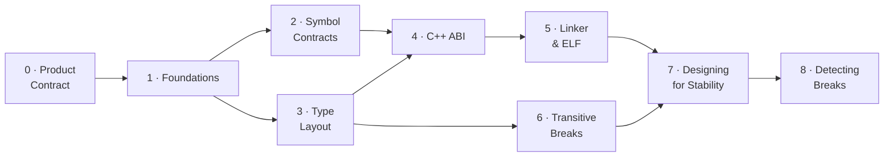

# ABI/API Handling — A Learning Series

This is the **conceptual hub** for understanding ABI/API compatibility — written
to *teach* the subject, not just catalog it. It is the front door to a nine-part
**learning series** that starts from first principles ("what is a symbol? what
does the loader do?") and builds up to the design patterns that keep a C/C++
shared library compatible across releases.

The series is for **two audiences at once**: developers who maintain or consume
shared libraries, and AI agents reasoning about whether a change is safe to ship.
Every break is explained as a *mechanism* — what the compiler baked in, what the
loader does, what byte moves — and then as a *fix*. abicheck's verdicts and
change kinds are woven in throughout, so the same page that teaches you *why* a
struct-field insertion corrupts memory also tells you what abicheck will report
when it sees one.

!!! tip "New to the topic? Don't start here — start with the on-ramp."
    This hub is dense (it doubles as a deep reference, including a full
    evidence-model walk-through further down). If binary compatibility is new to
    you, read the five-minute on-ramp first and follow the series in order:

    1. [**ABI in Five Minutes**](abi-series/abi-in-5-minutes.md) — the gentlest introduction.
    2. [Part 0 — Compatibility as a Product Contract](abi-series/00-product-contract.md) — the framing.
    3. [Part 1 — Foundations](abi-series/01-foundations.md) — symbols, linking, the loader.

    Then come back here to navigate the rest of the series.

> **Looking for something faster?** For a 2-minute scannable card, see the
> [ABI Cheat Sheet](abi-cheat-sheet.md). For per-case runnable reproductions with
> code and a real failure demo, see the
> [Examples & Case Encyclopedia](../examples/index.md). For verdict semantics and
> CI exit codes, see [Verdicts](verdicts.md). For unfamiliar terms (SONAME,
> vtable, IFUNC, install name, TLS model…), see the
> [Glossary](abi-series/glossary.md).
>
> **Going deep on class layout?** The
> [Class Layout ABI & API guide](class-layout-abi.md) is the single page that maps
> every class-layout change (base offsets, EBO, vptr, vtable slots, RTTI,
> standard-layout / trivially-copyable, packing) to the exact `ChangeKind`
> abicheck emits, the evidence tier that reveals it, and a worked example.

!!! note "Scope & assumptions"
    - **Examples are mostly ELF/Linux and Itanium-C++-ABI flavored** unless a
      section says otherwise. PE/COFF (Windows) and Mach-O (macOS) have their own
      loader, export, and versioning rules — see the per-platform parallels in
      [Part 5](abi-series/05-linker-elf.md#pecoff-and-mach-o-parallels) and the
      [Platform Support reference](../reference/platforms.md). For example, the
      "lookup by name" model in Part 2 is exact for ELF and for most C/C++
      exports, but **Windows DLLs can also export/import by ordinal**, where the
      contract is a *number*, not a name.
    - **Detectability depends on the inputs you give abicheck** — symbols only,
      DWARF/PDB debug info, or public headers. Some changes (e.g. `#define`
      macros, inline/template *bodies*, uninstantiated templates) are invisible
      to *any* artifact comparison. See the per-change matrix in
      [Limitations](limitations.md#source-only-changes-invisible-to-binaryobject-analysis).

---

## How to read this series

The parts are ordered. If you're new to ABI compatibility, read them in
sequence — each builds on the mental models established by the last. If you're
here for a specific problem, jump straight to the relevant part.

| Part | Page | What it covers | Read it when… |
|------|------|----------------|---------------|
| **0** | [Compatibility as a Product Contract](abi-series/00-product-contract.md) | Public surface, SemVer mapping, contract shapes — the *framing* | …before anything else: a change is only a "break" if it breaks a promise |
| **1** | [Foundations](abi-series/01-foundations.md) | Source → object → link → load; what a symbol is; API vs ABI | …you want the ground-up mental model (start here) |
| **2** | [Symbol Contracts](abi-series/02-symbol-contracts.md) | Removal, rename, signature, pointer-level, globals | …a symbol disappeared or changed meaning |
| **3** | [Type Layout](abi-series/03-type-layout.md) | Struct size/offset, alignment, enums, unions, bitfields | …you changed a struct, enum, or union |
| **4** | [C++ ABI](abi-series/04-cpp-abi.md) | Vtables, mangling, templates, `noexcept`, trivial→non-trivial, bases | …you maintain a C++ library |
| **5** | [Linker & ELF](abi-series/05-linker-elf.md) | SONAME, visibility, versioning, calling conv., TLS, security metadata | …a load-time/linker contract changed |
| **6** | [Transitive Breaks](abi-series/06-transitive-breaks.md) | Dependency leaks, anonymous structs, type-kind swaps, reserved fields | …the symbol table looks identical but consumers still break |
| **7** | [Designing for Stability](abi-series/07-designing-for-stability.md) | Opaque handles, Pimpl, version scripts, CI gating — with full code | …you're designing an API to evolve safely |
| **8** | [Detecting Breaks](abi-series/08-detection.md) | Tracking approaches, evidence each break family needs, why single-method checkers miss whole families | …you're deciding *how* to catch all of the above in CI |



> **Cross-cutting companion:** [Evidence & Detectability](evidence-and-detectability.md)
> explains *which inputs* (symbols, debug info, headers, app, bundle) let a tool
> see a given change at all — read it alongside any part when you're wondering
> "why did the tool catch this but not that?"

## Pick a reading path for your role

The series is ordered, but you rarely need all of it at once. These paths get
each audience to the pages that matter for them fastest:

| Audience | Recommended path |
|----------|------------------|
| **New C/C++ library author** | [Product Contract](abi-series/00-product-contract.md) → [Foundations](abi-series/01-foundations.md) → [Symbol Contracts](abi-series/02-symbol-contracts.md) → [Type Layout](abi-series/03-type-layout.md) → [Designing for Stability](abi-series/07-designing-for-stability.md) |
| **C++ library maintainer** | [Foundations](abi-series/01-foundations.md) → [C++ ABI](abi-series/04-cpp-abi.md) → [Type Layout](abi-series/03-type-layout.md) → [Transitive Breaks](abi-series/06-transitive-breaks.md) → [Designing for Stability](abi-series/07-designing-for-stability.md) |
| **CI / release engineer** | [Product Contract](abi-series/00-product-contract.md) → [Detecting Breaks](abi-series/08-detection.md) → [Tool Comparison](../reference/tool-comparison.md) → [Policy Profiles](../user-guide/policies.md) → [Baselines](../user-guide/baseline-management.md) → [Exit Codes](../reference/exit-codes.md) → [Output Formats](../user-guide/output-formats.md) |
| **Distribution / package maintainer** | [Linker & ELF](abi-series/05-linker-elf.md) → [Transitive Breaks](abi-series/06-transitive-breaks.md) → [Multi-Binary Releases](../user-guide/multi-binary.md) → [Application Compatibility](../user-guide/appcompat.md) |
| **Plugin / SDK author** | [Symbol Contracts](abi-series/02-symbol-contracts.md) → [Plugin Systems](../user-guide/plugin-systems.md) → [Policy Profiles](../user-guide/policies.md) → [Product Contract §4](abi-series/00-product-contract.md#4-name-your-contract-shape) |
| **AI agent / automated reviewer** | [Overview](abi-api-handling.md) → [Evidence & Detectability](evidence-and-detectability.md) → [Examples Encyclopedia](../examples/index.md) → [Change Kind Reference](../reference/change-kinds.md) |

---

## Break families at a glance

Every detected change maps to one of these families. The verdict column shows the
typical classification; the exact verdict per fixture lives in
`examples/ground_truth.json` and the [Examples Encyclopedia](../examples/index.md).
The **Part** column points to where the mechanism is explained.

Case numbers link straight to the generated example page; the **Typical verdict**
column says "mixed" where the verdict is case-dependent (the per-fixture verdict
is the source of truth).

| Family | Representative cases | Typical verdict | Explained in |
|--------|---------------------|-----------------|--------------|
| Symbol/function removal & rename | [01](../examples/case01_symbol_removal.md), [12](../examples/case12_function_removed.md), [58](../examples/case58_var_removed.md), [66](../examples/case66_language_linkage_changed.md) | 🔴 BREAKING | [Part 2](abi-series/02-symbol-contracts.md) |
| Signature changes (params, return, pointer level) | [02](../examples/case02_param_type_change.md), [10](../examples/case10_return_type.md), [33](../examples/case33_pointer_level.md), [46](../examples/case46_pointer_chain_type_change.md) | 🔴 BREAKING | [Part 2](abi-series/02-symbol-contracts.md) |
| Global variable type/qualifier/removal | [11](../examples/case11_global_var_type.md), [39](../examples/case39_var_const.md), [58](../examples/case58_var_removed.md) | 🔴 BREAKING | [Part 2](abi-series/02-symbol-contracts.md) |
| Struct/class layout, alignment & packing | [07](../examples/case07_struct_layout.md), [14](../examples/case14_cpp_class_size.md), [40](../examples/case40_field_layout.md), [42](../examples/case42_type_alignment_changed.md), [43](../examples/case43_base_class_member_added.md), [56](../examples/case56_struct_packing_changed.md), [117](../examples/case117_no_unique_address.md) | 🔴 BREAKING | [Part 3](abi-series/03-type-layout.md) |
| Enum value/underlying changes | [08](../examples/case08_enum_value_change.md), [19](../examples/case19_enum_member_removed.md), [20](../examples/case20_enum_member_value_changed.md), [57](../examples/case57_enum_underlying_size_changed.md) | 🔴 BREAKING | [Part 3](abi-series/03-type-layout.md) |
| Union layout | [24](../examples/case24_union_field_removed.md), [26](../examples/case26_union_field_added.md) (grows) · [26b](../examples/case26b_union_field_added_compatible.md) (no growth) | mixed — 🔴 if size grows, else 🟢 | [Part 3](abi-series/03-type-layout.md) |
| C++ vtable & virtual methods | [09](../examples/case09_cpp_vtable.md), [23](../examples/case23_pure_virtual_added.md), [38](../examples/case38_virtual_methods.md), [68](../examples/case68_virtual_method_added.md), [72](../examples/case72_covariant_return_changed.md) | 🔴 BREAKING | [Part 4](abi-series/04-cpp-abi.md) |
| C++ qualifiers, mangling & ABI tags | [21](../examples/case21_method_became_static.md), [22](../examples/case22_method_const_changed.md), [30](../examples/case30_field_qualifiers.md), [71](../examples/case71_inline_namespace_moved.md), [86](../examples/case86_tag_struct_renamed.md), [101](../examples/case101_inline_namespace_version_bumped.md), [113](../examples/case113_abi_tag_changed.md) | mixed — 🔴 BREAKING or 🟠 API_BREAK | [Part 4](abi-series/04-cpp-abi.md) |
| Trivial → non-trivial (calling convention) | [64](../examples/case64_calling_convention_changed.md), [69](../examples/case69_trivial_to_nontrivial.md) | 🔴 BREAKING | [Part 4](abi-series/04-cpp-abi.md) |
| Templates, inline & ODR | [16](../examples/case16_inline_to_non_inline.md), [17](../examples/case17_template_abi.md), [47](../examples/case47_inline_to_outlined.md), [59](../examples/case59_func_became_inline.md), [79](../examples/case79_missing_template_instantiation.md), [85](../examples/case85_internal_template_signature_changed.md), [87](../examples/case87_default_template_arg_changed.md) | mixed — 🔴 BREAKING or 🟢 COMPATIBLE | [Part 4](abi-series/04-cpp-abi.md) |
| Modern C/C++ contract shifts (char8_t, _BitInt, _Atomic, concepts) | [105](../examples/case105_concept_tightening.md), [114](../examples/case114_char8t_migration.md), [115](../examples/case115_bit_int_width_changed.md), [116](../examples/case116_atomic_qualifier_changed.md) | mixed — 🔴 BREAKING or 🟢 COMPATIBLE | [Part 4 §Modern](abi-series/04-cpp-abi.md#modern-cc-and-toolchain-abi-hazards) |
| ELF/linker metadata (SONAME, visibility, versioning, RPATH, TLS) | [05](../examples/case05_soname.md), [06](../examples/case06_visibility.md), [13](../examples/case13_symbol_versioning.md), [49](../examples/case49_executable_stack.md), [51](../examples/case51_protected_visibility.md), [52](../examples/case52_rpath_leak.md), [65](../examples/case65_symbol_version_removed.md), [67](../examples/case67_tls_var_size_changed.md) | mixed — 🔴 BREAKING or 🟢 COMPATIBLE | [Part 5](abi-series/05-linker-elf.md) |
| Transitive/dependency & `detail::` leaks | [18](../examples/case18_dependency_leak.md), [48](../examples/case48_leaf_struct_through_pointer.md), [74](../examples/case74_detail_base_class_changed.md), [75](../examples/case75_detail_embedded_by_value.md), [76](../examples/case76_detail_pimpl_vtable_changed.md), [77](../examples/case77_detail_templated_base_changed.md), [80](../examples/case80_pimpl_shared_to_unique.md), [97](../examples/case97_api_depends_on_consumer_env.md), [104](../examples/case104_glibcxx_dual_abi_flip.md), [112](../examples/case112_lp64_ilp64.md) | 🔴 BREAKING | [Part 6](abi-series/06-transitive-breaks.md) |
| Source-only / API-level (rename, access, explicit, default args, hidden friends) | [31](../examples/case31_enum_rename.md), [34](../examples/case34_access_level.md), [96](../examples/case96_hidden_friend_removed.md), [106](../examples/case106_ctor_became_explicit.md), [123](../examples/case123_default_argument_removed.md), [124](../examples/case124_header_constant_value_changed.md) | 🟠 API_BREAK | [Part 6 §Source-only API breaks](abi-series/06-transitive-breaks.md#source-only-api-breaks-binary-identical) |
| Deployment risk (noexcept, ISA dispatch, version-require) | [15](../examples/case15_noexcept_change.md), [83](../examples/case83_cpu_dispatch_isa_dropped.md) | 🟡 COMPATIBLE_WITH_RISK | [Part 4](abi-series/04-cpp-abi.md) |
| Compatible additions & quality signals | [03](../examples/case03_compat_addition.md), [25](../examples/case25_enum_member_added.md), [26b](../examples/case26b_union_field_added_compatible.md), [27](../examples/case27_symbol_binding_weakened.md), [29](../examples/case29_ifunc_transition.md), [61](../examples/case61_var_added.md), [62](../examples/case62_type_field_added_compatible.md), [99](../examples/case99_experimental_graduated.md) | 🟢 COMPATIBLE | [Part 7](abi-series/07-designing-for-stability.md) |
| Scoped/non-public internal changes | [118](../examples/case118_internal_struct_field_added_scoped.md), [119](../examples/case119_internal_struct_field_removed_scoped.md), [120](../examples/case120_internal_struct_reordered_scoped.md) | ✅ NO_CHANGE | [Part 6](abi-series/06-transitive-breaks.md) |
| Security-hardening & deployment metadata (RELRO, canary, exec-stack, RUNPATH, `DT_NEEDED`, TLS model, symbol binding) — artifact/linker facts (L0/L3) | [128](../examples/case128_symbol_binding_strengthened.md), [133](../examples/case133_tls_model_flip.md), [134](../examples/case134_relro_weakened.md), [135](../examples/case135_stack_canary_removed.md), [136](../examples/case136_executable_stack_removed.md), [137](../examples/case137_runpath_changed.md), [138](../examples/case138_needed_added.md) | mixed — 🟡 risk (RELRO/canary/TLS) or 🟢 COMPATIBLE (exec-stack/RUNPATH/`DT_NEEDED`/binding) | [Part 5](abi-series/05-linker-elf.md) |
| **Build-flag & toolchain drift (L3)** — the flags the library was *built* with, as a finding on their own | [130](../examples/case130_exceptions_mode_flip.md), [131](../examples/case131_rtti_mode_flip.md), [132](../examples/case132_threadsafe_statics_flip.md) | 🟡 COMPATIBLE_WITH_RISK | [Source & Build Data](build-source-data.md) |
| **Source-only bodies & macros (L4)** — `#define` macro values, inline/template/`constexpr` **bodies**, uninstantiated templates (none header-reachable) | [122](../examples/case122_template_signature_uninstantiated.md) *(the documented `NO_CHANGE` gap — even L4 can't close it; a detected macro/body change is 🟠 API_BREAK / 🟡 risk)* | mixed — 🟠 API_BREAK / 🟡 risk, or ✅ NO_CHANGE (residual gap) | [Source & Build Data](build-source-data.md) |
| **Intra-version ABI hygiene / audit** — accidental export, private-header leak, unversioned export, RTTI leak (no baseline needed) | [143](../examples/case143_audit_accidental_export.md), [144](../examples/case144_audit_private_header_leak.md), [145](../examples/case145_audit_unversioned_export.md), [146](../examples/case146_audit_rtti_for_internal.md) | 🟡 risk | [§ source scan](#going-deeper-than-artifacts-the-source-scan) |
| **Cross-source validation** — one fact, two sources: header↔build mismatch, ODR variant, export↔decl pair | [148](../examples/case148_xcheck_header_build_mismatch.md), [149](../examples/case149_xcheck_odr_variant.md), [150](../examples/case150_xcheck_export_public_pair.md), [151](../examples/case151_xcheck_provider_matrix.md) | mixed — 🟠 API_BREAK or 🟡 risk | [§ source scan](#going-deeper-than-artifacts-the-source-scan) |

Of these rows the **security-hardening & deployment** row is *artifact/linker*
coverage (L0/L3, mixed verdicts — an object-size change like
[case127](../examples/case127_data_object_size_changed.md) is a separate 🔴
BREAKING layout finding, not a hardening risk). The **last four rows** are the
families a plain two-version `compare` of L0–L2 artifacts does **not** produce on
its own — build-flag drift needs the build data (L3), source-only bodies & macros
need the sources (L4), and the intra-version hygiene and cross-source families
need the scan's cross-source pass (which reads L0/L1/L2 evidence — no L4 source
replay required; the audit fixtures resolve at L0/L2). All five new rows are the
subject of the
[level-by-level walk-through](#what-each-level-actually-sees-a-level-by-level-walk-through)
and the [source-scan section](#going-deeper-than-artifacts-the-source-scan) below.

---

## The one idea to carry through the whole series

If you remember nothing else:

> **The compiler bakes the library's ABI facts — sizes, offsets, register
> choices, vtable slot numbers, symbol names — into every caller, as immediate
> constants, and never re-checks them.** When the library changes one of those
> facts in a later release, the old caller keeps using the old number. Nobody
> re-validates it. That is why an ABI break is *silent*: no linker error, often
> no crash, just wrong bytes at the wrong address.
>
> Every fix in [Part 7](abi-series/07-designing-for-stability.md) is therefore a
> variation on a single move: **stop publishing the fact** — hide it behind a
> pointer, a version node, or hidden visibility — so you stay free to change it.

abicheck exists to catch these breaks *before* they ship: it dumps a snapshot of
each binary, diffs them structurally, and classifies every difference into one of
five verdicts mapped to CI exit codes. See
[Part 1 §7](abi-series/01-foundations.md#7-where-abicheck-fits) for how that
pipeline works, and [Verdicts](verdicts.md) for the exit-code semantics.

### Runtime calls are not the same as ABI dependencies

A public entry point may call a long chain of private helpers at runtime. That
runtime call graph is **not** automatically the consumer's ABI contract. Existing
binaries are bound only to the symbols, types, constants, layouts, and inline
code that cross the **compile / link / load boundary**: what appears in installed
public headers, what the consumer object directly references, and what the loader
must resolve.

```text
Safe runtime call chain:
app -> public_func
       public_func -> hidden internal_helper

Consumer binary depends on public_func only. internal_helper can change because
it is not exported, not referenced by public headers, and not part of public
layout or inline code.
```

The same private helper becomes an ABI dependency if the boundary shifts:

```text
Unsafe link-time dependency:
inline public_func in an installed header -> detail::internal_helper

The consumer object now directly references detail::internal_helper. Removing,
renaming, hiding, or changing that helper can break already-built consumers.
```

Private types follow the same rule. A helper struct is safely private while it is
fully hidden behind an opaque pointer or implementation file, but not when the
public header exposes it by value:

```text
Unsafe compile-time layout dependency:
public header exposes InternalType by value

The consumer bakes sizeof(InternalType), alignment, field offsets, base-class
layout, and calling-convention facts into its own object code.
```

Use this checklist before calling an internal change ABI-safe. A private change
is safe only when **all** of these remain true:

- the private symbol is not exported or otherwise load-resolvable by consumers;
- public inline, template, `constexpr`, or macro bodies do not reference it;
- it is not part of any public struct/class layout, base class, field, parameter,
  return value, exception specification, allocator/deallocator rule, or calling
  convention;
- it is absent from installed public headers except behind an opaque declaration
  that reveals no size, members, bases, or required helper symbols;
- no plugin, callback, subclassing, serialization, or user-extension model
  promises that consumers may provide or observe the changed detail;
- the public behavior contract remains compatible, even if the binary boundary is
  intact.

This distinction is why [Part 5](abi-series/05-linker-elf.md) treats leaked
private exports as dangerous, [Part 4](abi-series/04-cpp-abi.md) treats
inline/template bodies as part of the contract, and
[Part 6](abi-series/06-transitive-breaks.md) treats exposed dependency types as
transitive ABI.

### App-swap (ASW): the consumer-scoped runtime check

The most realistic *consumer-level* test is **application software swap (ASW)** —
build an app against the old library, drop in the new one, and run it. abicheck
exposes this as [`appcompat`](../user-guide/appcompat.md): it parses the app's
required symbols, compares old/new in full mode, and **filters** findings to the
changes that affect *that* app. ASW is powerful and narrow at the same time:

- It **proves** real loader/linker behavior and tested execution paths — "this
  app does not import the removed symbol", "this app needs symbol version X the
  new lib lacks".
- It **cannot** speak for the whole contract: untested public API, *future*
  consumers, silent layout corruption a test never exercises, and source-only
  (recompile) breaks all stay invisible.

So ASW is **consumer-scoped** compatibility; library `compare`/`scan` is
**contract-scoped**. Use both — `compare`/`scan` protect the library contract,
ASW protects a specific deployment. ASW is one of several *methods*, each seeing
different evidence; the full comparison of methods (libabigail, ABICC, app-swap,
bundle scan) is in
[Evidence & Detectability](evidence-and-detectability.md#2-methods-compared-by-the-evidence-they-use).

---

### Feed abicheck `.so` + debug info + headers for the best result

abicheck's three analysis tiers are additive, and the highest-coverage setup is
a single comparison of **debug-enabled libraries with their public headers
supplied**:

```bash
abicheck compare libfoo_v1.so libfoo_v2.so \
    --old-header include/v1/foo.h --new-header include/v2/foo.h   # both built with -g
```

- **`.so` + DWARF (`-g` / `/Zi`)** gives the ground-truth *emitted* ABI — struct
  layout, field offsets, alignment/packing, enum values, calling convention.
- **public headers (castxml or clang, `--ast-frontend`)** add the source-level API surface the binary cannot
  carry — `final`, access, ref-qualifiers, `noexcept`/`explicit`, default-argument
  values, and `const`/`constexpr` constant values (the last two have *no symbol*,
  so only header analysis can reach them).

Comparing a **stripped binary with no headers** yields only symbol add/remove
coverage and silently misses every layout and source-level break. If you ship
stripped, build a debug copy purely as an analysis input and compare *that* with
headers. A handful of changes remain invisible to any artifact comparison
(`#define` macros, inline/template **bodies**, uninstantiated templates) — see
[Limitations → Source-only changes](limitations.md#source-only-changes-invisible-to-binaryobject-analysis)
for the full per-change detectability matrix.

These three tiers are artifact layers **L0–L2**. Two optional layers go
further without overriding an artifact-proven break: **L3** build context
(`-p build/`) pins the exact ABI-affecting flags, and **L4** source/evidence
packs recover several of the otherwise-invisible source-only facts above
(macro/`constexpr` values, uninstantiated templates). See [Build & Source Packs](build-source-data.md) and the full [L0–L4
model](evidence-and-detectability.md).

> **The layering principle — more evidence cuts *both* error kinds.** Each layer
> you add reduces **false negatives** (breaks a weaker input is blind to) **and**
> **false positives** (internal churn a weaker input cannot scope) — not one at
> the expense of the other. Symbols-only is blind to layout; add DWARF and it
> sees layout but *over-reports* internal-type churn; add headers and that churn
> is scoped out while every real break stays; add build context and it catches a
> cross-toolchain break no artifact tier could see; add source (L4) and it
> catches macro/`constexpr`/inline-body breaks **no artifact tier can *ever* see**.
> The one rule that never bends: more evidence may *scope away* a false positive
> but must never *hide* an artifact-proven break (the *authority rule*). abicheck
> tracks each layer's FP/FN contribution as a CI gate — see
> [Evidence & Detectability → What each layer buys](evidence-and-detectability.md#what-each-layer-buys-fewer-false-negatives-and-fewer-false-positives)
> for the tracked per-tier matrix.

#### Which input proves which family

The minimum input needed to *detect* each family — and the most common reason a
real change is missed:

| Change family | Symbols only | + DWARF/PDB | + Headers | Common false negative |
|---------------|:---:|:---:|:---:|------|
| Exported function/variable removed or renamed | ✅ | ✅ | ✅ | symbol filtered as non-public (visibility/scope) |
| Parameter / return / pointer-level signature change | ⚠️ partial¹ | ✅ | ✅ | stripped binary, C symbol carries no type |
| Struct/class layout, alignment, packing, bitfields | ❌ | ✅ | ✅ | stripped **and** no headers → reported `NO_CHANGE` |
| Enum value / underlying-type change | ❌ | ✅ | ✅ | no debug info and no headers |
| C++ vtable / virtual-method change | ❌ | ✅ | ✅ | mangled symbols stripped or demangled-away |
| Calling convention (trivial→non-trivial) | ⚠️ | ✅ | ⚠️ | no debug info to see triviality |
| Source-only API (access, `explicit`, default args, renames, constants) | ❌ | ❌² | ✅ | no headers supplied (no symbol exists at all) |
| Templates / inline bodies | ⚠️ instantiated only | ⚠️ | ⚠️ | uninstantiated / header-only body — invisible to any artifact |
| Modern C/C++ (dual-ABI, ABI tags, `char8_t`, `_BitInt`, `_Atomic`) | ⚠️ mangling only | ✅ | ✅ | demangled view hides the tag/ABI flip |
| SONAME / visibility / versioning / RPATH / TLS metadata | ✅ | ✅ | ✅ | platform-specific (PE/Mach-O differ — see [Part 5](abi-series/05-linker-elf.md)) |

¹ C++ mangled names encode parameter types, so symbol-only catches many C++
signature changes; C symbols do not. ² A few source-only changes (e.g. enum/field
*renames*) are visible in DWARF too; most (default args, `explicit`, `const`
values) leave no binary trace and require headers. The authoritative per-change
table is in [Limitations](limitations.md#source-only-changes-invisible-to-binaryobject-analysis).

The table above stops at the three **artifact** inputs (L0–L2) — but four
families in [Break families at a glance](#break-families-at-a-glance) live
*entirely* beyond the shipped artifact and need the **source scan** (build-flag
drift, source-only bodies & macros, intra-version hygiene, and cross-source
validation). Here is the
companion matrix for the **source-scan layers (L3–L5)**: which source input each
such family (plus the derived L5 reachability layer) needs, and — crucially — the
fact that these findings are
**corroborating, never breaking on their own** (the [authority
rule](build-source-data.md#the-authority-rule-the-one-rule-that-matters)):

| Source-scan family | + Build data (L3) | + Sources (L4) | + Graph (L5, derived) | Emitted verdict | Common false negative |
|---|:---:|:---:|:---:|---|------|
| ABI-relevant build-flag / toolchain drift (`-std`, `_GLIBCXX_USE_CXX11_ABI`, `-fvisibility`, `-fexceptions`, `-frtti`) | ✅ | ✅ | ✅ | 🟡 risk | no compile DB — a command-string DB under-reports normalized flags |
| Macro (`#define`) value change with no symbol move | ❌ | ✅ | ✅ | 🟠 API_BREAK | no sources **or** no clang — L4 disabled, silently skipped (a `const`/`constexpr`/default-arg **value** change is L2, already caught by `compare -H`) |
| Inline / template **body** change (signature unchanged) | ❌ | ✅ | ✅ | 🟡 risk | body never becomes a symbol; only L4 replay fingerprints it — an *uninstantiated template signature* change ([case122](../examples/case122_template_signature_uninstantiated.md)) is a documented `NO_CHANGE` gap even at L4 |
| Intra-version hygiene: accidental export, private-header leak, unversioned export, RTTI-for-internal | ⚠️ partial | ❌ | ✅ localizes | 🟡 risk | resolves at L0+L2 (binary exports **and** the header AST); the scan's cross-source pass computes it — no L4 replay needed |
| Cross-source disagreement — *minimum evidence varies by check* | ⚠️ header↔build | ⚠️ ODR only | ✅ | 🟠 API_BREAK / 🟡 risk | evidence on only one side → the check is *skipped*, never faked green. Export↔decl & provider checks need only L0+L2; header↔build needs L3; ODR variant needs L4 |
| Cross-symbol impact / reachability (what a changed internal reaches) | ⚠️ structural | ✅ | ✅ | 🟡 risk | `s4` graph has no call edges — call-impact needs the L4 pass (`s5`/`pr-deep`) |

Two things this second matrix makes explicit that the first cannot:

1. **The source scan reaches a *different* set of changes** — macros, bodies,
   build flags, hygiene, cross-source conflicts — not a "better" version of the
   artifact scan. It is additive, not a replacement.
2. **None of these is `BREAKING` on its own.** A source/API change is `API_BREAK`
   or risk; a shipped-binary `BREAKING` verdict is *only ever* proven by the
   artifact tiers (L0–L2). That is the whole point of the authority rule — a
   weaker source can add findings and confidence but can never overturn (or
   silently manufacture) a proven binary break.

Read the two matrices together as one staircase: L0→L1→L2 climb *up the artifact*
(more of the same binary), and L3→L4→L5 step *off the artifact* into what the
build and sources know. The next section walks a single release up that whole
staircase so you can see the actual data each level produces.

## What each level actually sees — a level-by-level walk-through

The matrices above are the *summary*. This section is the *demonstration*: one
tiny library, one real release, walked up every evidence level so you can see —
concretely, with the actual data — **what each level knows, how the levels
correlate, and exactly where each one goes blind.** If you have read
[Evidence & Detectability](evidence-and-detectability.md) for the model, this is
the worked example that makes it stick.

### The running example

`libcart` is a two-file C++ shared library. Here is the public header of **v1**:

```cpp
// cart.h  (v1) — the public contract
#define CART_MAX_ITEMS 64                 // (a) a macro constant

namespace cart {
enum class Currency : int { USD = 0, EUR = 1 };

struct Money {                            // (b) a public value type
    long     cents;                       //   offset 0
    Currency ccy;                         //   offset 8
};

constexpr double kTaxRate = 0.20;         // (c) a constexpr constant

class Cart {
public:
    void  add(int sku, int qty = 1);      // (d) a default argument
    Money total(bool with_tax = true) const;
    int   size() const { return count_; } // (e) an inline body
private:
    int count_;
};
} // namespace cart
```

**v2** ships four independent changes, each chosen to land on a *different*
evidence level:

| # | Change | Lands on |
|---|--------|----------|
| ① | `struct Money` gains `long region;` **before** `ccy` — every following field shifts, `sizeof(Money)` grows 16→24 | **L1** (layout) |
| ② | `add(int sku, int qty = 1)` → `add(int sku, int qty)` — the default argument is **removed**; the mangled symbol does not change | **L2** (header API) |
| ③ | `#define CART_MAX_ITEMS 64` → `128` — a macro constant | **L4** (source only) |
| ④ | v2 is built with `-D_GLIBCXX_USE_CXX11_ABI=0` (v1 used `=1`) — the std::string/std::list ABI flips | **L3** (build flag) |

Watch the same four changes appear (or fail to appear) as we climb. The verdict
is computed **worst-wins across every level**, so the final answer is `BREAKING`
— but *which level proved it*, and what each other level added, is the whole
lesson.

### Level 0 — the shipped binary (symbols only)

**What you feed it:** a stripped `libcart.so`, nothing else.
**What abicheck extracts** (`abicheck dump libcart.so --show-data-sources`):

```text
L0 binary metadata   present  (ELF, SONAME=libcart.so.1, 4 exported symbols)
L1 debug info        absent   (stripped)
L2 public header AST  absent   (no -H)
```

The L0 view is just the exported, demangled symbol table:

```text
# nm -D --demangle libcart.so   (v1 and v2 — byte-for-byte identical)
cart::Cart::add(int, int)
cart::Cart::total(bool) const
cart::Cart::size() const
typeinfo for cart::Cart
```

**What L0 proves:** symbols present/absent, SONAME, versioning, visibility,
binding, `DT_NEEDED`. If v2 had *removed* `add`, L0 alone would prove
`func_deleted` → `BREAKING` ([case12](../examples/case12_function_removed.md)).

**What L0 is blind to — and this is the punchline:** *none of ①②③④ touch a
symbol name.* A struct field insertion, a default-argument removal, a macro bump,
and a build-flag flip are **all invisible at L0.** abicheck reports **`NO_CHANGE`**
— a true statement about the symbol table and a dangerous falsehood about
compatibility. This is exactly why a stripped-binary-only compare "passes" on
real breaks (see [Limitations → Stripped binaries](limitations.md#stripped-production-binaries)).

### Level 1 — + debug info (DWARF/PDB): layout ground truth

**What you feed it:** the same libraries built `-g` (or a `-dbg`/`debuginfo`
sidecar). **What L1 adds** is the *emitted layout* — the byte offsets the
compiler actually baked into every caller:

```text
# abicheck's L1 view of `struct Money`
              v1                         v2
  struct Money  (size 16)      struct Money  (size 24)
    +0   long      cents         +0   long      cents
    +8   Currency  ccy           +8   long      region    ← inserted (8 bytes)
                                 +16  Currency  ccy        ← was +8
                                 +20  (4 bytes padding → size 24)
```

Now change ① is *undeniable*. abicheck emits:

```text
🔴 BREAKING  struct_size_changed        cart::Money   16 → 24 bytes
🔴 BREAKING  struct_field_offset_changed cart::Money::ccy   +8 → +16
```

Any consumer compiled against v1 reads `ccy` at offset 8; in v2 that offset holds
`region`. The loader raises no error — the caller just reads the wrong four bytes
([case07](../examples/case07_struct_layout.md)). **L1 is where the real break is
proven**, and its verdict is authoritative.

**What L1 still cannot see:** the default-argument removal ② (a default argument
is a *source* fact, not a layout fact — DWARF stores no default arguments), the macro
③, and the build flag ④. L1 also has no notion of *public vs. internal* — if
`Money` were a private type, L1 would still shout `BREAKING`; only L2 can tell it
to relax ([case118](../examples/case118_internal_struct_field_added_scoped.md)).

### Level 2 — + public headers: the source-level API

**What you feed it:** `-H include/cart.h` (parsed by castxml or clang via
`--ast-frontend`). **What L2 adds** is the *declared* API surface — the intent the
binary cannot carry, plus the public/internal boundary:

```text
# abicheck's L2 view of Cart::add
  v1:  void cart::Cart::add(int sku, int qty = 1)
  v2:  void cart::Cart::add(int sku, int qty)
                                          └── default argument removed
```

L2 proves change ②, which every lower level missed:

```text
🟠 API_BREAK  param_default_value_removed  cart::Cart::add  qty: default `= 1` removed
```

A caller that wrote `cart.add(42)` **fails to recompile** — `qty` is now a
required argument. That is a source-level contract break with *no* binary trace
(a *changed* default value, by contrast, is only a `COMPATIBLE` quality signal —
`param_default_value_changed`; the removal is the API break). Only headers reach
it ([case123](../examples/case123_default_argument_removed.md)). L2 also supplies the
**public-surface scoping** that keeps L1 honest: it tells abicheck that `Money`
*is* public, so the L1 break stands, while an internal type's identical change
would be demoted.

**What L2 still cannot see:** the `#define` macro ③ — castxml emits no macros at
all, and the clang backend models declarations, not `#define` bodies — and the
build flag ④. It also cannot see an *inline body* change to `size()`: it has the
declaration, not the compiled body.

### Level 3 — + build data: the flags it was actually built with

**What you feed it:** `-p build/` or `--build-info build/` (a
`compile_commands.json` / CMake / Ninja / Bazel graph). **What L3 adds** is *how*
the binary was compiled — the ABI-relevant flags that silently change layout and
mangling without touching a single line of your source:

```text
# L3 build-flag delta abicheck normalizes out of the two compile DBs
  -std                        c++17            c++17          (same)
  -fvisibility                hidden           hidden         (same)
  _GLIBCXX_USE_CXX11_ABI      1                0     ← flipped
```

L3 proves change ④:

```text
🟡 risk  abi_relevant_build_flag_changed  _GLIBCXX_USE_CXX11_ABI  1 → 0
```

This is the [dual-ABI flip](../examples/case104_glibcxx_dual_abi_flip.md):
`_GLIBCXX_USE_CXX11_ABI=1` (v1) selects the `std::__cxx11` string/list ABI, and
`=0` (v2) reverts to the legacy pre-C++11 ABI — so any `std::string`/`std::list`
parameter changes its underlying type and mangled name, and **v2 drops the
`__cxx11` symbol variants v1 exported**. `libcart`'s exported functions take no
such types, so here the flip causes **no** L0 symbol churn (which is why L0 stays
silent above) — but in a library that *does* expose them, this same flag flip
renames those symbols and the L0 diff proves a `func_deleted`/`func_added`
`BREAKING` on its own. On its own L3 is a
**risk**, not a break; it *explains* and localizes that churn and tells you the two
builds are not comparing like-for-like. Per the authority rule, L3 never
*manufactures* a `BREAKING`; it corroborates.

**What L3 cannot see:** anything about *values* inside the source — it reads the
build's flags and target graph, not the code. Macro ③ is still invisible.

### Level 4 — + sources: the facts that never reach the binary

**What you feed it:** `--sources ./libcart-src/` (needs clang; replays each TU
under its real L3 flags). **What L4 adds** is the last mile — the source-only
facts that are in *no* artifact: macro constants, `constexpr` values,
default-argument *values*, and inline/template/uninstantiated **bodies**:

```text
# L4 source-fact delta (normalized source_facts, per public header)
  macro   CART_MAX_ITEMS   64  → 128        (public header)
  inline  cart::Cart::size body-fingerprint  a1b2… → a1b2…  (unchanged)
```

L4 proves change ③, which is invisible to *every* artifact level — L0, L1, and
L2 all emit `NO_CHANGE` for a `#define`:

```text
🟠 API_BREAK  public_macro_value_changed  CART_MAX_ITEMS  64 → 128
```

If v2 had instead changed the *body* of the inline `size()` while keeping its
signature, L4 would flag `inline_body_changed` (a mixed-build/ODR **risk**) — the
one class of change that is neither a symbol, a layout, nor a declaration, and so
reaches no lower level. This is the residual the whole source scan exists for:
[case124](../examples/case124_header_constant_value_changed.md) (a header
constant value change) is *detected* as `API_BREAK`, while
[case122](../examples/case122_template_signature_uninstantiated.md) (an
uninstantiated template *signature* change) is the documented `NO_CHANGE` **gap**
that even L4 cannot close — a reminder that the top of the ladder still has a
blind spot.

**What L4 cannot see:** it is only as good as the source checkout matching the
binary. Point it at the wrong tag and it raises `source_binary_provenance_mismatch`
rather than guessing. And it **never** upgrades a source-only finding to
`BREAKING` — a macro change is `API_BREAK`, full stop.

### Level 5 — the derived source/build graph: who reaches what

L5 is not an input you hand over — abicheck **derives** it from L3 (and any L4
surface). It answers *impact* questions the flat diffs cannot:

```text
# L5 reachability closure for the change to `struct Money`
  target libcart  ──has-public-header──▶ cart.h
    cart.h  ──declares──▶ cart::Money  ──maps-to-debug-type──▶ Money (DWARF)
      cart::Money  ◀──by-value return──  cart::Cart::total(bool) const
                                         └── exported symbol _ZNK4cart4Cart5totalEb
```

So the L1 layout break on `Money` is not an isolated struct change — the graph
shows it **reaches an exported entry point** (`total` returns `Money` by value),
which is why the break is consumer-visible and high-priority. Here L5's whole job
is **explanation and localization**: `Money` stays reachable and `total` maps to
the same symbol on both sides — only the layout changed — so *no* reachability
delta fires. The dedicated L5 risk findings are emitted only when those
relationships actually change: `public_reachability_changed` when a declaration
*enters or leaves* the public closure, and `source_to_binary_mapping_changed`
when a declaration now maps to a *different* exported symbol. Like L4 they never
override the artifact verdict. (`abicheck graph explain --symbol
_ZNK4cart4Cart5totalEb` prints exactly this closure to localize the L1 break.)

**What L5 cannot see:** it is a *structural* graph. The cheap `s4` form has no
call edges, so "what does this internal helper's change reach through the call
graph" needs the L4 pass (`s5`/`pr-deep`). And a graph never proves a break — it
prioritizes one.

### Two orthogonal sources: app-swap and bundle scan

The L-staircase is not the only evidence axis. Two *orthogonal* checks answer
different questions and see different things:

- **App-swap (`appcompat`)** — build a real consumer against v1, drop in v2, run
  it. It **proves** actual loader/linker behavior for *that* app ("this app does
  not import the removed symbol") but **cannot** speak for the whole contract:
  untested API, future consumers, and silent layout corruption a test never
  exercises stay invisible. It is *consumer-scoped*; library `compare` is
  *contract-scoped*. (See [App-swap](#app-swap-asw-the-consumer-scoped-runtime-check)
  above.)
- **Bundle scan** — many libraries at once, cross-DSO. It catches provider/
  dependency/entry-point problems *between* binaries that a single-library
  compare cannot, and is blind to pure source compatibility.

Neither is "higher" than L0–L5; they observe a different slice of reality. The
full method-by-method comparison is in
[Evidence & Detectability §2](evidence-and-detectability.md#2-methods-compared-by-the-evidence-they-use).

### How the levels correlate on one release

Here is the entire `libcart` v1→v2 release as one grid — every change against
every level. Read *down* a column to see what that level alone would report; read
*across* a row to see how many independent levels corroborate one change:

| Change | L0 symbols | L1 DWARF | L2 headers | L3 build | L4 sources | L5 graph | abicheck ChangeKind | Verdict |
|--------|:---:|:---:|:---:|:---:|:---:|:---:|---|---|
| ① `Money` field inserted | ❌ | ✅ **proves** | ✅ (castxml layout) | — | — ¹ | ✅ ranks | `struct_size_changed`, `struct_field_offset_changed` | 🔴 BREAKING |
| ② default arg `qty` removed | ❌ | ❌ | ✅ **proves** | — | ✅ | — | `param_default_value_removed` | 🟠 API_BREAK |
| ③ macro `CART_MAX_ITEMS` | ❌ | ❌ | ❌ | ❌ | ✅ **proves** | — | `public_macro_value_changed` | 🟠 API_BREAK |
| ④ `_GLIBCXX_USE_CXX11_ABI` | ❌ | ❌ | ❌ | ✅ **proves** | ✅ | ✅ | `abi_relevant_build_flag_changed` | 🟡 risk |
| **Release verdict (worst-wins)** | NO_CHANGE | BREAKING | BREAKING | risk | API_BREAK | risk | — | **🔴 BREAKING** |

¹ L4 source replay emits source-surface findings (macros, `constexpr`/default-arg
values, inline/template bodies, typedefs, ODR/mapping) — **not** emitted binary
layout; a record-layout edit like ① is L1/L2's job, so L4 adds nothing for it.

Three lessons fall straight out of the grid:

1. **No single level sees all four changes.** Each change is proven where its
   evidence first appears (some, like ①, by two levels at once). The bottom
   "worst-wins" row shows a stripped-binary compare (L0) would call this release
   **clean** — the single most important reason to feed abicheck more than the
   `.so`.
2. **Higher levels don't *replace* lower ones — they cover different rows.** L2
   proves ②'s default-arg break that L1 can't, while L1's DWARF layout and L2's
   castxml layout *both* catch ①. The value is in the overlay, which is why
   abicheck combines them instead of picking one.
3. **Authority is not the same as coverage.** L4 corroborates the *most* rows
   here, but the `BREAKING` gate is set by the authoritative artifact tiers —
   here L1's DWARF layout, with L2's castxml layout agreeing. L3/L4/L5 add real
   findings and the *explanation*, but a source-only finding tops out at
   `API_BREAK`.

### The one thing to remember: every level has a blind spot

No level is complete; each is chosen to see one slice and is structurally blind
to the rest. This is the ladder of what each level **cannot** catch, no matter how
carefully you run it:

| Level | Can prove | **Structurally cannot see** |
|-------|-----------|------------------------------|
| **L0** symbols | symbol add/remove/rename, SONAME, versioning, visibility | any change that keeps the symbol name — layout, default args, macros, flags |
| **L1** debug info | struct/enum layout, offsets, vtables, calling convention | source intent (default args, `explicit`, access), macros, whether a type is *public* |
| **L2** headers | signatures, access, `noexcept`, default-arg values, `const`/`constexpr` values, public scoping | `#define` macros, inline/template **bodies**, uninstantiated templates, what was actually compiled |
| **L3** build data | ABI-relevant flags, toolchain, target/option graph | anything *inside* the source — values, bodies, layout |
| **L4** sources | macros, `constexpr` values, inline/template/uninstantiated bodies | the layout actually *emitted* (that is L1's job); anything if the checkout ≠ the binary |
| **L5** graph | reachability / impact ranking, cross-symbol closure | it proves *nothing* on its own — it prioritizes; call impact needs the L4 pass |
| **app-swap** | real loader behavior for *one* app | unused API, future consumers, silent corruption a test misses, recompile breaks |

> **The takeaway of the whole page:** *different levels observe different
> evidence, and no single level detects every compatibility issue.* abicheck's
> answer is not to pick the "best" level but to **overlay all of them** and let
> the strongest evidence win under the authority rule — the artifact tiers
> (L0–L2) set any `BREAKING` gate, and the build/source tiers (L3–L5) add the
> findings and the explanation the artifact alone could never carry. Feed it as
> many levels as you can; each one closes a blind spot the others have.

## Going deeper than artifacts: the source scan

Artifact comparison (L0–L2) proves what the *shipped binary* did. To recover the
source-only facts it cannot see — `#define` macros, `constexpr` values,
default-argument values, inline/template **bodies**, uninstantiated templates —
abicheck can read the build's compile database (**L3**) and replay the sources
(**L4**), and fold a source/build reachability graph (**L5**). The one-shot
driver is `abicheck scan`. It has one evidence dial — `--depth`
(`binary|headers|build|source|full`) — that selects how far down the `L0`–`L5`
*evidence layers* (what it sees + authority) to collect; fully explained in
[Evidence Layers & Scan Depth](scan-and-evidence-levels.md). The governing
**authority rule**: source/build evidence (L3/L4/L5) explains, localizes, scopes,
or raises its own source-/API-level findings, but **never deletes an
artifact-proven break**.

**Who produces the source facts.** The default is a post-build
`compile_commands.json` replay — nothing in your build changes (`abicheck scan`
/ `dump --sources`). If you'd rather have the build *emit* the facts itself, two
producers write the identical schema for `abicheck merge` to fold in: the
portable **`abicheck-cc`** compiler wrapper, and — for large/template-heavy
builds where a companion parse hurts — an optional **Clang plugin** that rides
the compile's own AST (zero extra parse). The three are one interchangeable
family; see [Build & Source data](build-source-data.md) for enable steps.

`scan --depth` picks the evidence level: `source` (the per-PR gate — diff-seeded
L4 replay + the L5 graph) and `full` (a full-depth release snapshot). Orthogonal
to depth, `scan --audit` is an **intra-version single-build hygiene lint that
needs no previous version**. Audit surfaces "bad ABI hygiene" visible from one
build: accidental
exports, private-header leaks, unversioned symbols, exported RTTI for internal
types, and cross-source mismatches. Worked example cases:

| Family | Example case | What it shows |
|--------|--------------|---------------|
| Accidental export (`exported_not_public`) | [case143](../examples/case143_audit_accidental_export.md) | symbol exported but in no public header |
| Private-header leak (`private_header_leak`) | [case144](../examples/case144_audit_private_header_leak.md) | public API pulls an unshipped header |
| Unversioned export (`unversioned_exported_symbol`) | [case145](../examples/case145_audit_unversioned_export.md) | export with no version node though a scheme exists |
| Exported RTTI for internal type (`rtti_for_internal_type`) | [case146](../examples/case146_audit_rtti_for_internal.md) | `_ZTI`/`_ZTV` leaked for a private-header type |
| Header/build mismatch (`header_build_context_mismatch`) | [case148](../examples/case148_xcheck_header_build_mismatch.md) | L2 macros ↔ L3 flags disagree |
| ODR type variant (`odr_type_variant`) | [case149](../examples/case149_xcheck_odr_variant.md) | one type, two per-TU layouts (L4 ↔ L4) |
| Bidirectional export ↔ decl (`exported_not_public`/`public_not_exported`) | [case150](../examples/case150_xcheck_export_public_pair.md) | L0 exports ↔ L2 decls, both directions |
| Provider corroboration | [case151](../examples/case151_xcheck_provider_matrix.md) | confidence grows with how many sources agree |
| Depth ladder | [case147](../examples/case147_scan_depth_ladder.md) | same input answered at S3 vs deeper, honest coverage |

The throughline of the cross-source cases: a finding invisible or ambiguous to
**any single source** resolves only by crosschecking two — and `case147` shows
the scan stating the depth it *actually reached*, never a bare "scan failed".

### Now run it — the practical flow, plugin, and CI guides

This page is the *concept*. When you are ready to enable a source scan on a real
project, the tool-track guides carry the exact commands, flags, and CI YAML:

| You want to… | Go to |
|--------------|-------|
| Pick the right command for your situation (binary compare → full source scan → merge → plugin) | [Choose Your Workflow](../user-guide/choose-your-workflow.md) |
| Run `abicheck scan` and pin a depth | [Source-Scan Depth](../user-guide/scan-levels.md) |
| *Produce* the source facts — post-build replay (Flow A), `abicheck-cc` wrapper (Flow B), or the Clang plugin (Flow C) | [Producing Source Facts](../user-guide/producing-source-facts.md) |
| Fold build/source evidence into a baseline snapshot | [Source & Build Data](build-source-data.md) |
| Wire a **full source scan into GitHub Actions** — `sources`/`build-info`/`depth`, audit, estimate, cross-check gating | [GitHub Action § Source scans](../user-guide/github-action.md#source-scans-build-source-evidence) |
| Check a host↔plugin ABI contract | [Plugin Systems](../user-guide/plugin-systems.md) |
| Gate CI on the right verdict tier (binary break vs. source/API break) | [CI Gating](../user-guide/ci-gating.md) |

The CI recipes there go beyond the binary-only compare: a minimal PR scan is
four inputs (binary + headers + `sources: .` + `baseline`), and the same guide
shows enabling each source layer independently — `depth: build` for cheap L3
build-flag drift, `depth: source` for full L4 replay plus the change-scoped L5
graph, and `mode: merge` for build-emitted (`abicheck-cc` / Clang plugin) packs.

## Detection coverage and roadmap

abicheck detects **284 change kinds** today (see the
[Change Kind Reference](../reference/change-kinds.md)), spanning every family in
the table above — including the calling-convention, alignment/packing, bit-field,
dual-ABI (`_GLIBCXX_USE_CXX11_ABI`), ABI-tag, `char8_t`, `_BitInt`, `_Atomic`,
and CPU-dispatch cases. Areas still deepening: richer cross-compiler ABI-drift
modelling (GCC vs Clang vs MSVC for the same headers) and LTO/visibility
interactions where an inlined symbol disappears. The authoritative, always-current
taxonomy is the generated [Change Kind Reference](../reference/change-kinds.md)
and [Examples Encyclopedia](../examples/index.md).

---

➡️ **Start the series: [Part 1 — Foundations](abi-series/01-foundations.md)**
