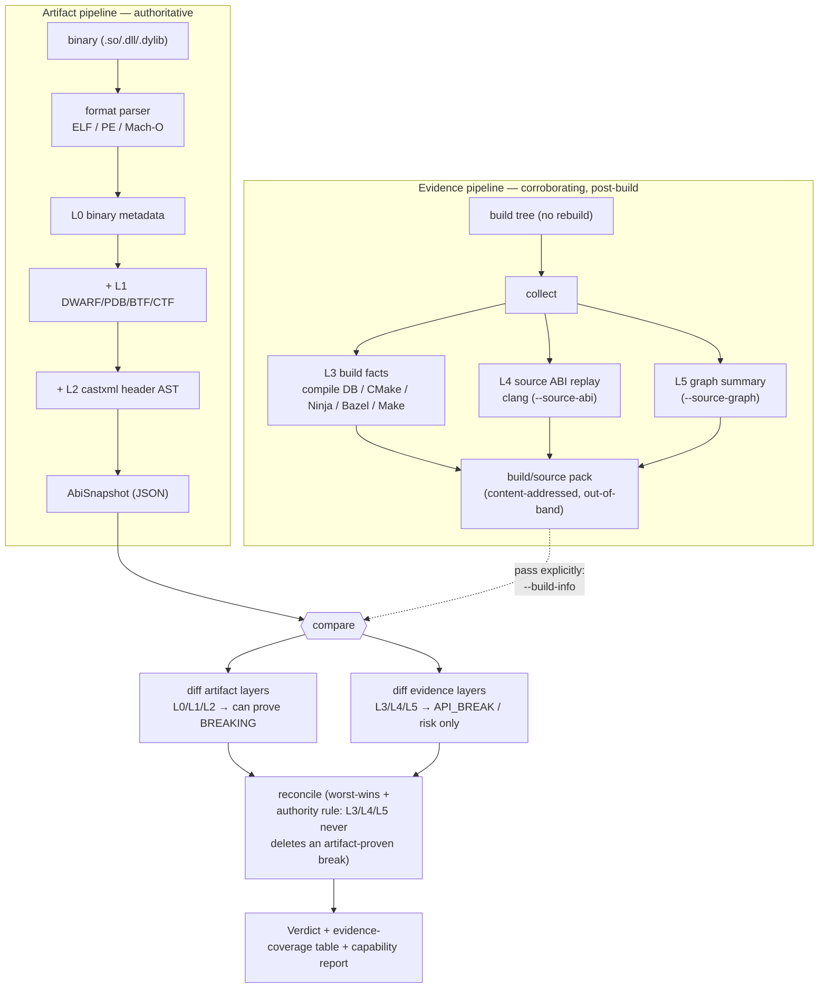

# Source & Build Data

abicheck primarily compares **built artifacts** — binaries (L0), debug info
(L1), and public headers (L2). A **build/source pack** is an *optional* sidecar
that augments a snapshot with **source and build evidence** (ADR-028): build
context (L3), source ABI replay (L4, ADR-030), and source graph summaries
(L5, ADR-031) — all three are implemented and shipped today; see "Evidence
layers" below for what each one requires and produces.

The pack exists to give the existing ABI/API decision engine **more facts** —
to reduce false positives, explain and localize breaks, and detect
source/API risks artifact comparison cannot see. It does **not** turn abicheck
into a general static analyzer.

## The authority rule (the one rule that matters)

> **Artifact-backed L0/L1/L2 evidence remains authoritative for shipped-ABI
> verdicts.** Source/build evidence (L3/L4/L5) may *explain, localize, scope,
> add confidence/provenance, or correlate* an artifact-proven break — but it
> **never silently deletes** one.

Findings produced *only* by build/source evidence are ordinary
[change kinds](../reference/change-kinds.md) that default to **`API_BREAK`**
(source-level breaks) or **risk** (deployment/context risk), never **breaking**
unless an artifact diff also proves the break. They flow through the normal
[verdict](verdicts.md) computation with worst-verdict-wins.

## Evidence layers

| Layer | Source | Purpose | Verdict authority |
|---|---|---|---|
| L0 | ELF/PE/Mach-O | Exported binary ABI facts | Authoritative |
| L1 | DWARF/PDB/BTF/CTF | Layout/type/calling-convention | Authoritative when matched to binary |
| L2 | castxml or clang / public headers | Public API declarations | Authoritative for header-visible API |
| **L3** | compile DB, CMake, Ninja, Bazel, Make | Toolchain, flags, target graph, generated-file provenance | Context/confidence |
| **L4** | per-TU source ABI replay | Source-visible ABI/API facts | API/source-risk evidence; never sole shipped-ABI authority |
| **L5** | Clang/Kythe/CodeQL graph summaries | Include/type/call/build reasoning | Explanation, localization, impact |

L3 and L4 are implemented today (ADR-029, ADR-030). L4 ships three extractor
backends — **clang** (the source-based default: inline/template/constexpr body
fingerprints + default arguments), **castxml** (declarations/types/const values),
and an **Android** header-checker adapter — plus the linker, source-replay diff,
replay scopes, and per-TU cache (see [L4 findings](#source-abi-replay-findings-l4)).

L5 has landed (ADR-031, phases 1–4): a compact, abicheck-owned **source graph
summary**. Folded from the L3 build evidence it carries `target`,
`compile_unit`, `source`, `header`, `generated_file`, and `build_option` nodes
linked by `TARGET_HAS_SOURCE` / `TARGET_HAS_PUBLIC_HEADER` / `TARGET_DEPENDS_ON`
/ `COMPILE_UNIT_BUILDS_SOURCE` / `COMPILE_UNIT_USES_OPTION` edges. When an L4
source surface was also collected (`--source-abi`), it additionally folds in
`source_decl` / `record_type` / `enum_type` / `typedef` / `macro` nodes linked
to their declaring public header (`SOURCE_DECLARES`) and to their exported
binary symbol / debug type (`SOURCE_DECL_MAPS_TO_SYMBOL`,
`SOURCE_TYPE_MAPS_TO_DEBUG_TYPE`, `BINARY_EXPORTS_SYMBOL`) — giving the full
`target → public header → declaration → exported symbol` reachability closure.
Every node and edge carries provenance and a confidence label. Collect it with
`--source-graph summary` and compare two summaries with `graph compare` (below).
When `--source-abi` (L4) is also given, two further edge kinds fold in
**automatically** — no separate flag for either, mirroring `dump --sources`'s
own behavior: approximate Clang call edges (`DECL_CALLS_DECL`) and
compile-unit include edges (`COMPILE_UNIT_INCLUDES_FILE`, preferring
already-recorded build-tool inputs over a fresh `clang -M` invocation). A
further, independent layer folds pre-captured Kythe/CodeQL backends
(`--kythe-entries`/`--codeql-results`). All six graph-derived findings flow
through `graph compare` and the verdict pipeline, and `graph explain`
localizes a single finding through the graph.

> **Source ABI replay (L4) requires clang** (or castxml for the declaration
> subset, or a pre-captured Android dump). It is the one tier gated on a C++
> front-end. If the tool is missing, abicheck **fails gracefully**: L4 is marked
> partial, the source-only checks are reported as disabled, and the
> artifact-backed tiers (L0–L2) remain fully authoritative — the comparison is
> never aborted.

## What the data actually looks like

The tables above name the *findings* each layer produces. This section shows the
normalized *facts* each layer stores before any diff runs — the records
`build_diff.py`/`source_diff.py`/`source_graph.py` actually compare. All three
are plain JSON (or JSON Lines) under the pack's `raw`/normalized split
described in [Schema & storage](#schema-storage); field names below are the
real `to_dict()` output of each layer's dataclass, not illustrative pseudo-JSON.

### L3 — one compile action, and the option record the diff actually reads

Each translation unit the build compiled becomes one `CompileUnit` record.
`abi_relevant_flags` is carried for provenance/localization, but it is **not**
what `build_diff.py` compares:

```json
{
  "id": "cu://src/money.cpp#cfg:9f3a2e",
  "source": "src/money.cpp",
  "compiler": "toolchain://gcc-14-cxx",
  "language": "CXX",
  "standard": "c++20",
  "defines": {"_GLIBCXX_USE_CXX11_ABI": "1", "NDEBUG": "1"},
  "include_paths": ["include/", "build/generated/"],
  "target_triple": "x86_64-linux-gnu",
  "abi_relevant_flags": ["-fvisibility=hidden", "-D_GLIBCXX_USE_CXX11_ABI=1"]
}
```

The actual L3 diff input is `BuildEvidence.build_options[]` — a separate,
flatter `BuildOption` record per canonical option key, which the adapters
*project* from `compile_units[].abi_relevant_flags` (and other sources):

```json
{
  "key": "define:_GLIBCXX_USE_CXX11_ABI",
  "value": "1",
  "abi_relevant": true,
  "scope": "global"
}
```

Comparing this record between old and new is exactly the "L3 build-flag delta"
table you see in a report: change `value` from `"1"` to `"0"` here and
`_diff_options()` emits `abi_relevant_build_flag_changed` — nothing about the
source itself needs to change for that finding to fire. **This is the record a
third-party/build-emitted producer must populate** (see
[Build-emitted facts](#build-emitted-facts-the-abicheck_inputs-protocol-flow-2)
below): shipping only `compile_units[].abi_relevant_flags` without the
corresponding `build_options[]` entries silently drops L3 flag-drift detection,
because only the built-in adapters (CMake/Ninja/Bazel/Make) perform that
projection automatically.

### L4 — one source declaration (`SourceAbiTu.macros[] / .functions[] / …`)

Per-TU source replay produces one `SourceEntity` per declaration, grouped by
kind (`declarations`, `types`, `functions`, `variables`, `macros`, `templates`,
`inline_bodies`, `constexpr_values`). The fields that matter for diffing are
`signature_hash` (stable across a *value*-only edit), `body_hash` (inline/
template bodies), and `value` (the normalized macro/`constexpr`/default-arg
string):

```json
{
  "id": "src://cart.h#CART_MAX_ITEMS",
  "kind": "macro",
  "qualified_name": "CART_MAX_ITEMS",
  "value": "64",
  "visibility": "public_header",
  "api_relevant": true,
  "confidence": "high"
}
```

A later TU dump with `"value": "128"` on the same `qualified_name` is exactly
what `diff_source_abi()` turns into `public_macro_value_changed` — the macro
never becomes a symbol, so this record is the *only* place that fact exists.
The same shape carries a function's default-argument value (`value`) separately
from its `signature_hash`, which is what lets abicheck tell "the default
changed" (`API_BREAK`) apart from "the parameter type changed" (a different
symbol, an add+remove).

### L5 — one graph edge (`SourceGraphSummary.edges[]`)

The graph is nodes (`GraphNode`: `id`, `kind` — `target`/`source`/`header`/
`source_decl`/`binary_symbol`/…) linked by typed, directed `GraphEdge`s. This is
the record `graph explain` walks to answer "what does this declaration reach":

```json
{
  "edge": "SOURCE_DECL_MAPS_TO_SYMBOL",
  "src": "decl://_ZNK4cart4Cart5totalEb",
  "dst": "binary_symbol://_ZNK4cart4Cart5totalEb",
  "provenance": "source_abi_link",
  "confidence": "high"
}
```

A `decl://` node id is `SourceEntity.identity()` — the **mangled** name when
one exists, not the qualified source name — precisely so overloads
(`total(bool)` vs. a hypothetical `total()`) get distinct source-decl nodes
instead of colliding on one `Cart::total`. For a C++ method this makes the
`decl://` and `binary_symbol://` ids look identical modulo prefix; that's
expected — the edge still records *two separate nodes* (a source declaration
and an exported binary symbol) so a rename on one side without the other shows
up as the edge moving to a different `dst`.

`diff_source_graph_findings()` compares the *edge set*, not individual nodes:
if this exact `(src, dst, kind)` triple disappears and a *different* `dst`
appears for the same `src`, that is `source_to_binary_mapping_changed` — the
declaration now compiles down to a different exported symbol, a fact neither
the binary diff nor the source diff alone would name.

### Why this matters in practice

None of L3/L4/L5's records are byte offsets or machine code — they are
normalized *facts about intent* (a flag, a macro value, a reachability edge),
which is exactly why the [authority rule](#the-authority-rule-the-one-rule-that-matters)
caps them at `API_BREAK`/`risk`: they describe what the source or build says
should happen, not what the compiler actually emitted. Only L0/L1 — the
`AbiSnapshot` derived straight from the binary and its DWARF/PDB — records what
*did* happen, which is why it alone can prove `BREAKING`.

## How the data flows

Two independent producers feed one decision engine. The **artifact pipeline**
(always on, authoritative) turns each binary into an `AbiSnapshot`; the
**evidence pipeline** (optional, post-build, never rebuilds) collects an
out-of-band `build/source pack`. At `compare` time both are diffed and reconciled
under the [authority rule](#the-authority-rule-the-one-rule-that-matters):



Three consequences fall out of this shape, all by design:

- The facts are **embedded in the snapshot**. `dump --build-info/--sources`
  folds the normalized build + source facts directly into the `.abi.json`, so a
  later `compare old.json new.json` carries them with **no out-of-band
  directories** (single-artifact UX). A separately produced pack directory
  (a raw source checkout or a build-emitted `abicheck_inputs/` pack) stays
  available as an explicit per-side override (`--build-info`, `--sources`),
  and raw provenance is never embedded — only the normalized facts that feed
  the comparison.
- Collection is **post-build and read-only**: it reads existing build outputs and
  build-system query interfaces; it never rebuilds your project or runs arbitrary
  commands.
- The verdict is only as strong as the evidence behind it, so every
  build/source-aware run prints the `layer_coverage` table and the capability
  report below.

## Workflow

The default path is unchanged. Build/source data is **post-build and opt-in** —
it never rebuilds your project or runs arbitrary commands; it reads existing
build outputs and build-system query interfaces only.

### The source-tree-centric flow (recommended)

The common case is a **shipped binary** (e.g. a prebuilt package) plus a
**source checkout at the tag it was built from**. Point `dump` straight at the
source tree — `--sources <tree>` runs L4 source ABI replay **and** the L5 graph
internally and embeds them; there are no separate `--source-abi`/`--source-graph`
toggles, and the graph is always built (it is compact by design):

```bash
# Source ABI replay (L4) + graph (L5) inline from a checkout, plus L3 from a
# compile DB auto-discovered inside the tree (or pass --build-info explicitly):
abicheck dump libfoo.so -H include/ \
  --sources ./libfoo-src/ -o new.abi.json

# Compare — the embedded L3/L4/L5 facts diff automatically, no pack dirs:
abicheck compare old.abi.json new.abi.json
```

`--build-info <path>` is the optional, **decoupled** L3 input: a build dir, a
`compile_commands.json`, or a pre-captured pack. When omitted, a
`compile_commands.json` inside the source tree is auto-discovered; if there is
none, L3 is reported as `not_collected` and the scan continues. Source ABI
replay (L4) still **requires clang** (or castxml for the declaration subset) and
degrades to partial coverage when the front-end is absent — the artifact tiers
stay authoritative (ADR-028 D3).

### Producing binary- and source-side facts separately

Build-side and source-side facts can still be produced independently — on
different machines, at different times. There is no longer a `collect`/`merge`
command to pre-combine them into one baseline file first (ADR-043 — the
library functions survive internally, but are not a documented CLI path).
Instead, feed `compare` (or a later `dump`) the out-of-band pack directly, per
side, and it is ingested inline:

```bash
abicheck dump libfoo.so -H include/   -o libfoo.bin.json   # L0/L1/L2 (+optional L3)
# … built on another machine, at another time …
abicheck compare libfoo.bin.old.json libfoo.bin.new.json \
  --sources old=./libfoo-src-v1/ --sources new=./libfoo-src-v2/
```

`compare` auto-ingests each side's embedded `build_source` facts (from the
binary-bearing snapshot) alongside whatever out-of-band pack `--build-info`/
`--sources` supplies for that side (each layer should come from exactly one
source), so the comparison still sees all of L0–L5 with no separate merge
step. `--build-info`/`--sources` also auto-detect a build-emitted
`abicheck_inputs/` Flow-2 pack directory (see below) the same way.

### Build-emitted facts — the `abicheck_inputs/` protocol (Flow 2)

When the **product build itself** can emit normalized facts (a Clang plugin, a
compiler wrapper, or any tooling that writes the schema), it skips the
source-side replay entirely: the build drops a self-describing
`abicheck_inputs/` directory next to its binary, and abicheck ingests it
**without re-running a compiler frontend** (ADR-035 D5). This is the
vendor/closed-source path — exact build-context facts contribute to the baseline
without shipping sources or letting abicheck rebuild the project.

```text
abicheck_inputs/
  manifest.json                  # kind: abicheck_inputs, library/version, paths
  binary/…  headers/…            # the shipped artifact + public headers (dumped normally)
  build/compile_commands.json    # optional → L3 build evidence
  source_facts/*.jsonl           # PREFERRED — normalized per-TU facts → L4/L5
  raw_ast/*.json.zst             # optional, forensic only — never ingested
```

The pack directory is auto-detected wherever a build/source input is accepted
— no separate combining step needed. Embed it directly on the same `dump`
call as the artifact side:

```bash
abicheck dump libfoo.so -H include/ --sources ./abicheck_inputs/ -o libfoo.full.json
```

or, if the binary was already dumped separately, hand `compare` the pack
per side:

```bash
abicheck compare libfoo.bin.old.json libfoo.bin.new.json \
  --sources old=./abicheck_inputs_v1/ --sources new=./abicheck_inputs_v2/
```

Normalized `source_facts/*.jsonl` are the canonical comparison format; `raw_ast/`
is an MVP-ingest / forensic fallback that abicheck does not read.

For setting up build/source evidence collection (wrappers, plugins, extractors,
packs), see [Build Evidence Setup](../user-guide/build-evidence-setup.md) — it
covers the `abicheck-cc` wrapper and the Clang plugin producers in full.

### Choosing how much to collect — `dump --depth`

`dump --depth` (the unified evidence-depth dial, ADR-037 D5) selects *which*
layers are collected from `--sources` / `--build-info`, trading cost for depth:

```bash
abicheck dump --sources ./src/ --depth build    -o s.json  # +L3 only
abicheck dump --sources ./src/ --depth source   -o s.json  # +L3+L4+L5
abicheck dump --sources ./src/ --depth headers  -o s.json  # embed nothing (L2 only)
abicheck dump --sources ./src/ --depth binary   -o s.json  # L0/L1 only
```

| `--depth` | Layers collected | Replay scope |
|-----------|------------------|--------------|
| `binary` | L0 binary + L1 debug info only | — |
| `headers` (default) | + L2 header AST | — |
| `build` | + L3 build context | — |
| `source` | + L4 source replay + L5 graph | target (the whole current library) |

`binary`, `headers`, `build`, `source` are the **only** four public rungs,
used identically by `dump`/`compare`/`scan --depth`. The old **`full` depth is
gone completely** (no alias) — it collapsed into `source` (the two differed
only in replay *scope*, not evidence kind, and `dump`/`compare` always use the
whole-target scope for `--depth source` anyway). `--max`, `--source-method`,
`--mode`, and the old `symbols`/`graph` depth spellings are all **rejected
outright** — a plain "not one of binary, headers, build, source" usage error,
not a deprecation warning.

`build` is the cheap PR default (build-flag/toolchain drift, no source parse);
the `source` rung adds the L4 source replay and the **L5 structural graph**
(target → source → header → build-option nodes) at target scope. (The graph
is an internal consequence of the `source` rung, never its own user-facing
depth.)

### Build-tool query configuration (`.abicheck.yml`)

A source checkout often *contains* the build system. abicheck can use existing
build outputs from the checkout, while executable build queries are gated by an
explicit trusted config path and the ADR-032 D5 action ceiling (**read by
default, trusted query opt-in, full build never**):

```yaml
# .abicheck.yml at the source-tree root for non-executing settings
# (pass a trusted --config <path> before build.query can run)
build:
  system: bazel            # bazel | cmake | make | meson | auto (default: auto-detect)
  # A command that EMITS flags/exports without performing a full project build —
  # e.g. a configured-graph/action query, not `cmake --build` / `make all`.
  query: "bazel cquery 'deps(//cpp/oneapi/dal:core)' --output=jsonproto"
  compile_db: bazel-out/.../compile_commands.json   # where the flags land
sources:
  public_headers: ["cpp/oneapi/dal/**/*.hpp"]
  exclude: ["**/test/**", "**/backend/**"]
```

- **`inspect` (default, always on):** read existing build outputs / compile DBs
  the checkout already has. No config needed.
- **`query_build_system` (automatic when `--sources` is given):** if no compile
  DB exists, abicheck **detects the build system and runs its own fixed query**
  (`cmake -DCMAKE_EXPORT_COMPILE_COMMANDS=ON`, `bazel aquery`, or a GNU Make
  dry-run `make -B -n -k -w`) to emit flags/exports — no `--allow-build-query` flag
  (that flag is deprecated to a no-op). Make dry-run evidence is reduced confidence
  because it is a transcript scrape rather than an authoritative target graph;
  prefer a real compile DB (`bear -- make` → `--compile-db`) when available. It
  also runs an
  *operator-supplied* `build.query` automatically (an
  explicit `--config` or `--build-query`) — but note that path ingests only an
  emitted `compile_commands.json`, so the query must *write* a DB (e.g.
  `bear -- make`), not just print a `make -n` transcript. All commands run with no shell
  (parsed via `shlex`) in the source-tree directory. A `.abicheck.yml`
  auto-discovered from `--sources` is still used for non-executing settings such
  as `build.compile_db`, but its `build.query` is **never** auto-run (it may be
  attacker-controlled) — pass it via an explicit `--config` to trust it. (The
  external-CLI-extractor / manifest plugin path formerly run via the separate
  `collect --extractor-manifest` command is gone from the CLI (ADR-043); its
  action-ceiling gate survives as a library-level mechanism only — see
  [External CLI extractors](../user-guide/build-evidence-setup.md#external-cli-extractors-the-security-model-adr-032)
  for what remains documented.)
- **`run_build` / `wrap_build` (denied):** abicheck never performs a full
  project build or compiler-wrapper interception. The inferred queries above are
  configure/dry-run/aquery only — they do not compile the project. Make dry-run
  can still execute recursive/`+` recipes on some Makefiles; this is now part of
  the default source-query trust boundary.

For setting up build/source evidence collection — the `.abicheck.yml` project-contract block, out-of-band packs, a full worked CMake example, and external CLI extractors — see [Build Evidence Setup](../user-guide/build-evidence-setup.md).

## Build-evidence findings (L3)

When two packs are compared, abicheck diffs their normalized build evidence and
emits these change kinds (ADR-029 D9):

| Kind | Category | Meaning |
|---|---|---|
| `build_context_changed` | compatible (quality) | Non-ABI build metadata changed |
| `abi_relevant_build_flag_changed` | risk | An ABI-affecting flag changed (`-std`, `_GLIBCXX_USE_CXX11_ABI`, `-fvisibility`, `-fpack-struct`, `-fabi-version`, …) |
| `header_parse_context_drift` | risk | Headers were parsed under a different context than the real build |
| `toolchain_version_changed` | risk | Compiler/stdlib/sysroot changed |
| `generated_file_dependency_unstable` | risk | Build graph indicates generated-file dependency risk |
| `link_export_policy_changed` | risk | Version script / export map / `.def` file changed |
| `enum_size_flag_changed` | risk | `-fshort-enums` was toggled — enum storage size (and struct layout using it) changes ([case152](../examples/case152_enum_size_flag_flip.md)) |
| `struct_packing_mode_changed` | risk | Default struct packing changed (`-fpack-struct` / `/Zp`) — member offsets shift ([case153](../examples/case153_struct_packing_flip.md)) |
| `lto_mode_changed` | risk | LTO was toggled — cross-TU inlining, devirtualization and vtable/typeinfo emission can differ ([case154](../examples/case154_lto_mode_flip.md)) |
| `char_signedness_changed` | risk | Plain-`char` signedness flipped (`-fsigned-char` ↔ `-funsigned-char`); both sides must be explicit ([case155](../examples/case155_char_signedness_flip.md)) |
| `whole_program_vtables_mode_changed` | risk | `-fwhole-program-vtables` was toggled — cross-TU devirtualization / vtable-slot elision differs |
| `sanitizer_mode_changed` | risk | The `-fsanitize=` set changed — object layout (ASan redzones), instrumentation and the runtime allocator differ |
| `float_abi_changed` | risk | `-mfloat-abi=` changed the float calling convention (ARM soft/softfp/hard); both sides must be explicit |
| `stdlib_debug_mode_changed` | risk | A stdlib debug/hardening mode was toggled (`_GLIBCXX_DEBUG` / `_GLIBCXX_ASSERTIONS` / `_ITERATOR_DEBUG_LEVEL`) — std:: container layout differs |

The runtime-model flips also live here: `exceptions_mode_changed`,
`rtti_mode_changed`, `tls_model_changed`, `threadsafe_statics_mode_changed`
(cases 130–133). None of these escalate to *breaking* on their own. When an export-policy change
actually removes exported symbols, the artifact diff (L0) emits the breaking
`symbol_removed` finding separately; `link_export_policy_changed` explains and
localizes it.

## Source ABI replay findings (L4)

Some API/ABI-relevant facts are weakly represented or absent in final
binary/debug artifacts — macro constants, default arguments, inline/template
bodies, `constexpr` values, and uninstantiated templates. ADR-030 adds an
**optional** source ABI replay layer that parses selected translation units and
public headers under their real per-TU build context (from L3) and links the
result against the library's exported surface (`source/source_abi.json`).

Comparing two linked source surfaces emits these change kinds (ADR-030 D6):

| Kind | Category | Meaning |
|---|---|---|
| `public_macro_value_changed` | API break | A macro constant in a public header changed value |
| `default_argument_changed` | API break | A default argument changed (signature unchanged) |
| `constexpr_value_changed` | API break | A public `constexpr` constant changed value |
| `uninstantiated_template_removed` | API break | A public template was removed without any binary presence |
| `public_typedef_target_changed` | API break | A public typedef/alias now resolves to a different underlying type (clang backend) |
| `public_macro_removed` | API break | A public header macro was removed — source that referenced it no longer compiles ([case156](../examples/case156_public_macro_removed.md)) |
| `inline_function_removed` | API break | A public header-only inline function was removed (no exported symbol) ([case157](../examples/case157_inline_function_removed.md)) |
| `public_typedef_removed` | API break | A public typedef/alias was removed (no exported symbol of its own) ([case158](../examples/case158_public_typedef_removed.md)) |
| `inline_body_changed` | risk | A public inline body changed with no exported-symbol change — also covers a public `constexpr` *function* body change, which the extractor emits as an inline (mixed-build/ODR risk) |
| `template_body_changed` | risk | An uninstantiated public template implementation changed (the ADR-026 `case122` residual) |
| `source_decl_binary_symbol_mismatch` | risk | A public declaration no longer maps to an exported symbol |
| `source_binary_provenance_mismatch` | risk | Most of the source tree's public declarations fail to map to any exported symbol — the source checkout likely does not correspond to the binary (wrong tag/commit) |
| `odr_source_conflict` | risk | The same type name resolves to different definitions across TUs |
| `generated_header_changed` | risk | A generated public configuration header changed (policy may escalate) |

Per the authority rule, **none of these are `breaking` on their own**: they are
source/API findings (`API_BREAK`) or deployment/context risks. Every L4 finding
carries an explicit `L4_SOURCE_ABI` evidence-tier boundary (ADR-030 D10) so a
source/API risk is never read as a proven shipped-binary ABI break. A shipped
binary ABI break is still proven only by the artifact diff (L0/L1/L2), and
policy profiles decide whether a source-only finding blocks a release.

## Source graph findings (L5)

When both packs carry an L5 source graph summary, comparing them (via `compare`
with `--build-info`, or directly with `graph compare`) produces
graph-derived **risk** findings (ADR-031 D6):

| ChangeKind | verdict | meaning |
|---|---|---|
| `public_reachability_changed` | risk | A declaration entered or left the public-API reachability closure (target → public header → declaration → exported symbol) |
| `source_to_binary_mapping_changed` | risk | A declaration present in both versions now maps to a different exported binary symbol |
| `generated_header_reaches_public_api` | risk | A generated file newly participates in the public declaration closure (it is a public header) |
| `call_graph_public_entry_reachability_changed` | compatible (quality) | The implementation statically reachable from an exported entry point changed (approximate Clang call graph; needs `--source-abi` + `--source-graph summary`, folded automatically) |
| `include_graph_public_header_drift` | risk | A public header entered/left the compiled include graph (needs `--source-abi` + `--source-graph summary`, folded automatically) |
| `build_option_reaches_public_symbol` | risk | A changed ABI-relevant build option feeds a compile unit producing an exported symbol |
| `public_api_internal_dependency_added` | risk | A public entry newly reaches an internal (non-public) declaration via the call graph ([case160](../examples/case160_public_api_internal_dep_added.md)) |
| `target_dependency_added` | risk | The library gained an inter-target build/link dependency (new `DT_NEEDED` risk) ([case161](../examples/case161_target_dependency_added.md)) |
| `exported_symbol_source_owner_changed` | risk | An exported symbol's owning source file/TU moved — implementation relocated behind a stable symbol ([case162](../examples/case162_symbol_source_owner_changed.md)) |

These **explain and prioritize** impact; like the L4 findings they are never
`breaking` on their own. Each carries the `L5_SOURCE_GRAPH` evidence-tier
boundary, and per ADR-028 D3 they never override or suppress an artifact-proven
ABI break.

## Cross-source validation findings (intra-version hygiene)

The checks above all compare *two versions*. abicheck also runs an
**intra-version** cross-source validation pass (ADR-035 D4) that diffs **one**
merged snapshot's evidence sources against *each other* — binary exports vs.
header declarations vs. build flags vs. header provenance vs. per-TU source
layouts vs. the source graph — to surface "bad ABI hygiene" that is visible from
a single build, no baseline required:

| ChangeKind | verdict | meaning |
|---|---|---|
| `exported_not_public` | risk | A symbol is exported by the binary but declared in no public header (accidental ABI surface) — hide it or document it |
| `public_not_exported` | risk | A public header declares an entity with an export obligation (a non-inline, non-template, default-visibility function/extern variable) that the binary does not export — consumers get an undefined-symbol link error |
| `header_build_context_mismatch` | api_break | The build records ABI-relevant flags/macros but the headers were parsed context-free, so the declared API surface may not match the shipped translation units — re-dump headers with the build's `compile_commands.json` |
| `private_header_leak` | risk | A public API exposes a type declared only in a private (non-installed) header, so consumers pull in an unshipped declaration — make the header self-contained or install the leaked header |
| `odr_type_variant` | api_break | One type has divergent per-translation-unit definitions (the L4 source-replay surface recorded an ODR conflict), so mixing them at link time is undefined behavior — reconcile the definitions (usually a macro/flag that changes the type per TU) |
| `public_to_internal_dependency` | risk | A public/exported declaration reaches an internal (private-header / source-file) entity through the L5 source graph, so a change to that hidden entity is an undeclared behavioral risk — elevated when the internal entity is among the revision's changed files |
| `unversioned_exported_symbol` | risk | The library defines a symbol-versioning scheme (version script / `.gnu.version_d`) yet exports a symbol with no version node, so it can't be evolved compatibly later — add it to the version script or hide it (single-release hygiene, ADR-035 D8) |
| `rtti_for_internal_type` | risk | The binary exports RTTI (`_ZTI`/`_ZTV`/`_ZTS`) for a polymorphic type declared only in a private header, leaking its run-time type info onto the ABI surface — hide the type or stop exporting its typeinfo (single-release hygiene, ADR-035 D8) |
| `identity_collision_detected` | risk | Two distinct declarations (proven distinct by differing clang-computed USR) were linked onto the same L4 `SourceEntity.identity()` key — a rare fallback-chain collision for unmangled cross-scope declarations; any L4/L5 finding under that identity may describe either declaration (ADR-041 P1 #5) |

Each finding records which evidence sources (`binary_exports`,
`public_header_ast`, `build_config`, `source_index`) corroborate it, driving its
confidence tag. A check whose required evidence is absent (e.g. no public-header
provenance) is reported as a *skipped* coverage row — never counted as clean and
never emitting a false positive. Like the L4/L5 findings these are advisory and
never `breaking` on their own.

## Evidence coverage

Every compare run that involves a pack prints an **evidence-coverage table** so
you can tell which findings are artifact-proven vs. build-context-only:

```text
Evidence coverage:
  L0 binary metadata         present, high confidence
  L1 debug info              present, high confidence: DWARF
  L2 public header AST       present, high confidence: header-scoped
  L3 build context           present, high confidence: cmake+ninja, 142 compile units, 1 target
  L4 source ABI replay       present, high confidence: clang extractor, scope=target, parsed 142/142 TUs
  L5 source graph summary    not_collected
```

The same rows are emitted as a structured `layer_coverage` array in the
`--format json` report (schema `report_schema_version` 2.0+; the key was
`evidence_coverage` in 1.x), so machine consumers can key off layer status
and confidence.

### Evidence metrics (timing & finding split)

Alongside the coverage table, a pack-aware compare prints an **evidence-metrics
summary** (ADR-033 D6/D9) so CI can tune which evidence mode to run by cost and
signal:

```text
Evidence metrics:
  collection time            0.0142s
  findings                   artifact-backed=3, source-only=0, build-context-drift=1
```

The same numbers are emitted as a structured `evidence_metrics` object in the
`--format json` report (schema `report_schema_version` 2.1+), keyed by the D9
metric names:

```json
"evidence_metrics": {
  "extractor.duration_seconds": 0.0142,
  "coverage.build_context.present": true,
  "coverage.source_abi.mode": "not_collected",
  "coverage.graph.mode": "not_collected",
  "findings.artifact_backed.count": 3,
  "findings.source_only.count": 0,
  "findings.build_context_drift.count": 1,
  "findings.evidence_required_missing.count": 0,
  "findings.demoted_by_surface.count": 0,
  "findings.suppressed_with_reason.count": 0
}
```

`artifact-backed` findings are proven by the binary/debug/header tiers (L0–L2);
`source-only` and `build-context-drift` come from the optional L3–L5 layers and
never override an artifact-backed verdict. Both blocks are additive and present
only when build-info/source facts were involved in the compare.

### What is being checked — and what is not, and why

Right below the coverage table, every pack-aware compare prints a **capability
report** that translates the available evidence into the concrete *check
categories* it enables — and, for each disabled category, the precise reason.
This makes the cumulative picture explicit as you add inputs (binary → +debug
info → +headers → +build data → +sources):

```text
Checks enabled for this scan (and why others are not):
  [on]  Symbol presence & linkage (added/removed/SONAME) — from the binary's dynamic symbol table
  [on]  Type layout, members, vtables, signatures — from DWARF/PDB debug info
  [on]  API decls absent from the symbol table; public-surface scoping — from the public header AST
  [on]  Build-flag & toolchain drift (visibility, std, ABI flags) — from build-system data
  [off] Macros, default args, inline/template/constexpr bodies — no sources/clang: source-only API changes are not detected
  [off] Impact / call / reachability graph — no graph evidence: cross-symbol impact is not analyzed
```

Each category is gated on exactly one evidence layer, so a `[off]` line tells you
exactly which input (or tool) to add to enable it — e.g. installing clang and
passing `--source-abi` turns on the macro / default-argument / inline-body /
template-body / constexpr checks.

### Header parse context

`header_parse_context_drift` fires when the new side carries a public-header AST
that was **not** parsed with the build's ABI-relevant flags. To avoid this,
dump the snapshot with the build's compile database — `abicheck dump … -p build/`
records `parsed_with_build_context` on the snapshot, and a later `compare`
honors it and suppresses the drift finding.

## Inputs, expectations & cost — a field guide

Source/build data is opt-in and its value (and price) depends entirely on **what
you can feed it**. This guide maps each realistic input to what you get, what it
*cannot* see, and the rough cost. (Times are order-of-magnitude from a field
evaluation across ~30 conda-forge libraries up to LLVM/oneDAL on a 4-core box;
your numbers scale with translation-unit count and per-TU header weight.)

### What each input buys you

| You have | Layers | Detects | Key limitation | Typical cost |
|---|---|---|---|---|
| Just the `.so`/`.dll`/`.dylib` | L0 | added/removed/renamed symbols, SONAME, linkage, symbol-versioning, binary-only vtable/RTTI size deltas | no types/layout — shipped release binaries are usually DWARF-stripped, so you run `elf_only` (LOW confidence) | dump 0.3–0.6 s small, ~17 s for a 150 MB/150k-symbol lib |
| + debug info (DWARF/PDB/BTF/CTF) | +L1 | struct layout, member/enum/typedef changes, calling convention, signatures | only as good as the debug info shipped; release packages rarely include it (install the `-dbg`/`debuginfo` package) | adds a few seconds + a larger snapshot |
| + public headers (`-H`) | +L2 | API decls absent from the symbol table; **public-surface scoping** to cut internal noise | needs an AST frontend (`--ast-frontend auto\|castxml\|clang`): castxml is the default/reference but castxml ≤0.6.3 cannot parse a modern libstdc++ (`<string>` etc.), so on heavy C++ prefer the **clang** backend (syntactic AST — declarations/signatures only, no record layout/offsets/vtables, so pair it with DWARF/L1 for layout); `-H` should be given the build's `-I` dirs (generated headers) | sub-second per header set |
| + build dir / compile DB (`--build-info` / `--build-query`) | +L3 | toolchain & build-flag drift (visibility, `-std`, ABI flags), target/source/option graph | a plain `compile_commands.json` carries compile units but not targets/toolchains (use the CMake File API for those); command-string DBs under-report normalized options | **flat ~0.3–0.5 s** regardless of project size — it only parses the DB |
| + source checkout (`--sources`) | +L4+L5 | macro / default-arg / inline / template / constexpr **body** changes; full source→symbol graph | **needs clang** and the **generated headers to exist** (configure-only fails on tablegen `*.inc`); the default clang extractor emits body fingerprints, not full decl tables (a pure-C public API yields little) | **dominated by clang re-parsing every TU**: ~0.3 s/TU (simple C) → ~2 s/TU (C++); LLVM-scale = tens of minutes to hours |

### Source-phase by build system

`--sources` needs a `compile_commands.json`. How you get one differs:

| Build system | Compile DB | abicheck flow |
|---|---|---|
| **CMake** | `-DCMAKE_EXPORT_COMPILE_COMMANDS=ON` at configure | auto-discovered if it lands in `build/` (or pass `--build-info`) |
| **Meson** | always emitted by `meson setup` (no build needed) | auto-discovered in `build/`/`builddir` — the smoothest path |
| **Autotools** | none, ever | run `bear -- make` (a real build), or wire `--build-query` |
| **Bazel / custom** | via `bazel aquery` or a wrapper | pre-capture and pass `--build-info`; heavyweight toolchains (e.g. oneDAL: Bazel + oneMKL/DPC++) are impractical to configure in a generic CI box — use the artifact tiers there |

abicheck never runs your build by default. To let it run the configure/query step
itself, pass the command on the CLI (no config file needed):

```bash
abicheck dump libfoo.so --sources ./src \
  --build-query 'cmake -S . -B build -DCMAKE_EXPORT_COMPILE_COMMANDS=ON' \
  --build-compile-db build/compile_commands.json
```

(or set `build.query` / `build.compile_db` in `.abicheck.yml`). An
operator-supplied `--build-query` (or a trusted `--config`) runs on its own — the
old `--allow-build-query` gate is now a deprecated no-op — and it still never runs
`make all` / `cmake --build`.

### Time & resource model

- **L0/L1 (artifact)** — fast and memory-frugal even at extreme scale: a 150 MB,
  ~150k-symbol library dumps in ~17 s using ~330 MB RAM; the snapshot is tens of MB.
- **L3 (build data)** — effectively free (~0.3–0.5 s), independent of project size.
- **L4+L5 (source replay)** — the expensive tier; cost ≈ *TUs × per-TU parse*.
  It does **not** scale to monorepos as a full pass. Control it with:
  - `--depth source` with a `--since`/`--changed-path` seed — replay only the TUs a PR touches;
  - `--depth build` — L3 + the L5 structural graph (build options +
    target/source/header nodes) with **no** L4 parse — feasible on LLVM in seconds;
  - the content-addressed per-TU cache (internal, ADR-033 D5) — unchanged TUs are skipped on re-runs automatically.
- **`compare`** — cost is driven less by raw symbol count than by the **fuzzy
  rename matcher** (≈ O(removed × added)). Naming schemes that churn the whole
  surface (ICU's `_NN` version suffix) are the worst case; the
  `versioned_symbol_scheme_detected` advisory flags that situation.

### Recommended defaults

- **PR gate:** dump the two binaries (L0/L1) + `--depth build` for cheap
  build-flag drift. Add `--depth source` only if you need source-level API checks.
- **Release:** the full `--sources` pass on the changed library, with `-H` for
  public-surface scoping.
- **Monorepo / huge project:** stay on the artifact tiers + `--depth build`; never
  run a full L4 pass over thousands of TUs.

## Schema & storage

- The pack is **content-addressed** and **versioned independently**
  (`evidence_pack_version`) from the ABI snapshot schema, so it never bloats an
  ordinary dump. The snapshot stores only a lightweight `evidence_pack`
  reference (content hash + coverage summary); old readers ignore it.
- Every extractor writes both a **raw** artifact (under `raw/`, for
  provenance/debugging) and an abicheck-owned **normalized** fact model (e.g.
  `build/build_evidence.json`). Only normalized facts feed comparison and the
  content hash.
- Command lines and paths are **redacted** (home prefixes, secret-looking
  `-D` macros) before they are persisted.

See ADR-028 (umbrella) and ADR-029 (build context) under
[Development → ADRs](../development/adr/index.md) for the full design.
