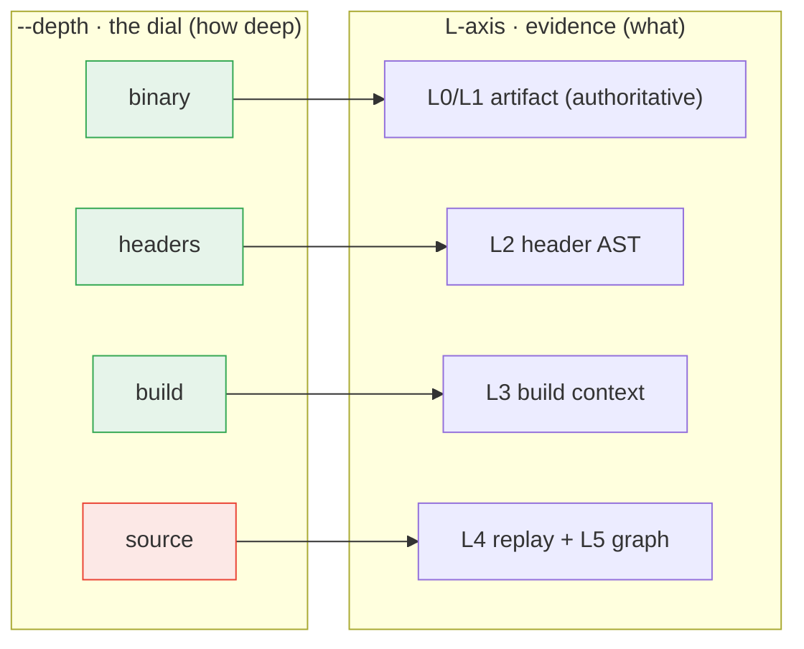

# Evidence & Detectability: What Each Method Can and Cannot See

> **One idea drives this whole page:** *different methods observe different
> evidence, and **no single method detects every compatibility issue.*** A tool
> can only report what its inputs let it see. Feed it symbols only and it sees
> symbol changes; feed it debug info and it sees layout; feed it headers and it
> sees source-level API. Some changes (`#define` macros, inline/template
> *bodies*, uninstantiated templates) are invisible to *any* artifact
> comparison.

!!! info "This topic in three pages — you are on **Model**"
    **Model** — this page: the `L0`–`L5` evidence layers, what each can and
    cannot see, and the `--depth` dial that collects them.
    **Worked example** — [What Each Level Sees](what-each-level-sees.md): one
    tiny library walked up every level, with the actual data.
    **Flags** — [Source-Scan Depth](../user-guide/scan-levels.md): the `scan`
    command reference with recipes.

This page is the conceptual companion to the practical
[Limitations](limitations.md) and [Tool Comparison](../reference/tool-comparison.md)
pages; for the teaching-track version — which break families need which evidence,
with worked example cases — see
[Part 8 of the learning series](abi-series/08-detection.md). It answers the
question users ask most often:

> "Why did tool A catch this and tool B didn't?"

Almost always, the answer is **evidence**: the two tools were looking at
different inputs.

---

## 0. The five sources of information

> **Canonical evidence-model reference.** The `L0`–`L5` table below is the
> source of truth for the evidence layers. Other pages (getting-started,
> choose-your-workflow, scan levels, architecture, build & source data) show
> the same model tailored to their context and link back here — when the model
> changes, update this table first.

A release engineer can hand a compatibility checker up to **five different
sources of information** about a library, ordered from the least to the most.
Each one *adds* facts the previous cannot see; none of them is complete on its
own. abicheck names them with the layer codes `L0`–`L4`. A **sixth** layer,
`L5`, is not something you hand over — it is a source/build *graph* abicheck
**derives** from L3 (and any L4 surface) to localize and explain findings. So
the full model is **six evidence layers, `L0`–`L5`** (matching
[Build Info & Sources](build-source-data.md)), of which the **five `L0`–`L4`
are inputs you provide** and `L5` is derived. This section covers the five you
provide; the derived `L5` layer is detailed below and in
[Build Info & Sources](build-source-data.md). You can see which **artifact**
layers (`L0`–`L2`) a given input exposes
with `abicheck dump --dry-run` (its "Available data layers" section reports
L0–L5 presence/absence without writing a snapshot); the build/source layers
(`L3`/`L4`) are not reported there — they surface in the pack-aware `compare`
`layer_coverage` table once you supply a build/source pack:

| # | Source you provide | Layer | abicheck input | What it newly reveals | Authority |
|---|--------------------|:-----:|----------------|------------------------|-----------|
| 1 | **Just the binary** | **L0** | a stripped `.so`/`.dll`/`.dylib` | Exported symbols, SONAME/install-name, symbol versions, visibility, binding, `DT_NEEDED`/`LC_LOAD_DYLIB` dependencies | **Authoritative** |
| 2 | **+ Debug symbols** | **L1** | a `-g` build (DWARF/PDB) or sidecar debug file | Type **layout**: struct/class sizes, field offsets, enum *values*, vtable slots, calling convention, packing/alignment | **Authoritative** (matched to binary) |
| 3 | **+ Public headers** | **L2** | `-H include/` (parsed by castxml or clang — `--ast-frontend`) | Source-level **API**: signatures, overloads, access (`public`/`private`), `final`/`explicit`/`noexcept`, templates, declared default args, public/internal **scoping** | **Authoritative** for header-visible API |
| 4 | **+ Build system data & options** | **L3** | `-p build/` (compile DB, CMake/Ninja/Bazel/Make) | The **flags the library was actually built with**: `-std`, `_GLIBCXX_USE_CXX11_ABI`, `-fvisibility`, `-fabi-version`, toolchain/sysroot, target graph, export maps | Corroborating |
| 5 | **+ Sources** | **L4** | a build/source pack (per-TU source ABI replay, ADR-030) | Facts that never reach the binary: macro constants, `constexpr` values, default-argument *values*, inline/template **bodies**, uninstantiated templates | Corroborating (→ `API_BREAK`/risk) |

Read this as a staircase: **each step up the table can both *find* breaks the
step below is blind to and *prevent false positives* the step below would
raise.** A struct-field insertion is invisible at L0 but obvious at L1
([case07](../examples/case07_struct_layout.md)); an internal-struct change that
*looks* like a break at L1 is correctly dismissed once L2 headers reveal the
struct is non-public ([case118](../examples/case118_internal_struct_field_added_scoped.md)).

### What each layer buys: fewer false negatives *and* fewer false positives

Current scan-depth status is measured on the comparable v1/v2 shared-library
targets: **141/141 targets scanned at every pinned depth**. FP/FN math uses the
**141 targets** in that scope: `NO_CHANGE` sentinel cases are checked as
compatible/no-change outcomes. Bundle-component results are structural
diagnostics only; the catalog keeps one canonical case-level verdict.

> **Freshness note.** This 141-target pin predates the catalog's growth to
> 193 cases (159 of them compilable `.so`-pair lanes today — see [Tool
> Comparison's "Which denominator is which"](../reference/tool-comparison.md)
> for how that split is derived and kept in sync). The table below has not
> been re-run against the current catalog; treat the percentages as
> directionally representative of each depth's value, not as current exact
> counts. Regenerating it against all current `.so`-pair targets is a
> tracked follow-up, matching the same caveat on the [scan-depth matrix
> row](../reference/tool-comparison.md#current-scan-quality-snapshot) in
> Tool Comparison.

| Pinned scan depth | Eval targets | Correct verdicts | Correct verdict coverage | False positives | False negatives | What this says about the layer today |
|---|---:|---:|---:|---:|---:|---|
| `binary` | 141 | 79 | 56.0% | 1 | 61 | Cheap artifact floor; many API/header/source-only breaks are invisible. |
| `headers` | 141 | 115 | 81.6% | 0 | 26 | Best low-cost gate: public-header evidence removes many misses without FP. |
| `build` | 141 | 115 | 81.6% | 0 | 26 | Adds build context; no advisory-crosscheck false positives after policy fix. |
| `source` | 141 | 141 | 100.0% | 0 | 0 | Highest recall; source-smoke proofs cover consumer-only API hazards. |

The full example catalog is covered by multiple proof lanes. This table is only
the compare-style scan-depth lane, so its compare-style scope is complete at 141/141.
(An earlier `full` rung — whole-library replay, as opposed to `source`'s
changed-TU replay — scored identically on this comparable-target set, which is
why the two were collapsed into one public `source` rung; see the appendix
below.)

Across the full staircase, adding evidence drives **both** error axes down — it
is not a trade-off where you must choose between missing breaks and crying wolf.
The gain is not perfectly monotonic at *every single* step (a middle layer can
see a change before it has the context to scope it — L1 below is exactly that),
but each higher layer either recovers a false negative or removes a false
positive the layer beneath could not. abicheck tracks this as a CI
gate (`scripts/check_tier_accuracy.py`): it runs one labelled change per case at
each evidence level and records, per level, whether the tool *under-calls* it
(a **false negative** — the layer is structurally *blind* to a real break) or
*over-calls* it (a **false positive** — the layer sees the change but lacks the
*context* to tell public from internal):

| Change (ground truth)                       | L0 | L1 | L2 | L3 |
|---------------------------------------------|:--:|:--:|:--:|:--:|
| public struct grew — *breaking*             | ❌ FN | ✅ | ✅ | ✅ |
| C function parameter widened — *breaking*   | ❌ FN | ✅ | ✅ | ✅ |
| public enum value changed — *breaking*      | ❌ FN | ✅ | ✅ | ✅ |
| internal struct grew — *non-breaking*       | ✅ | ❌ FP | ✅ | ✅ |
| internal enum value changed — *non-breaking*| ✅ | ❌ FP | ✅ | ✅ |
| cross-stdlib embed, same size — *risk*      | ❌ FN | ❌ FN | ❌ FN | ✅ |

Read the columns as a story:

- **L0 (symbols only)** is *blind*: it misses every layout / signature / enum
  break (false negatives) — yet raises *no* layout false positives, precisely
  because it sees no layout at all. Low false positives here are an artefact of
  blindness, not of accuracy.
- **L1 (+ debug info)** *catches the real breaks* L0 missed — and, seeing layout
  for the first time, now **over-calls** internal-type churn it cannot tell
  apart from public churn (false positives *appear*).
- **L2 (+ public headers)** knows the public/private boundary, so it **removes
  those false positives** by scoping internal churn out — while keeping every
  real break. This is the single biggest false-positive reduction.
- **L3 (+ build context)** catches a last class of break no artifact tier can
  see: a public type embedding `std::` by value across two *different* stdlib
  implementations at the *same* size — invisible until the build flags reveal
  the mismatch.

So the honest shape is not "false positives fall monotonically" — L1 actually
*introduces* false positives that L0 was too blind to raise, and L2 clears them.
What holds monotonically, and what the gate enforces, is the **false-negative**
side: **more evidence never hides a break a weaker tier already caught** (the
[*authority rule*](build-source-data.md), ADR-028 — corroborating evidence may
scope away a false positive, but never delete an artifact-proven break). With
full evidence every case is correct (0 FP, 0 FN); CI publishes this matrix on
every run, so each layer's contribution is a tracked number, not a claim.

> **What about L4/L5?** The tracked matrix stops at L3 because L4 (source replay)
> and the derived L5 graph cannot be projected from a synthetic binary snapshot
> — they need real source. But they move **both** axes just as strongly. L4 is
> the *only* layer that can catch a macro / `constexpr` / default-argument /
> inline- or template-body change — a false negative invisible to **every**
> artifact tier L0–L3 (a stripped binary, its debug info, and its headers all
> compile the same emitted ABI). And L4/L5 cut false positives by proving which
> declarations are genuinely reachable and exported (the cross-source checks —
> `exported_not_public`, `private_header_leak`). Their accuracy is tracked
> separately: by the cross-check FP/FN corpus (also in `check_fp_rate.py`) and by
> each example's `min_evidence` tier in `examples/ground_truth.json`.
>
> **The derived sixth layer, `L5`.** Beyond the five sources above, abicheck
> *derives* an `L5` source/build graph (include/type/call reachability, ADR-031)
> from L3 (and any L4 surface) to **localize and explain** findings and
> prioritize cross-symbol impact. It is covered with the other build/source
> layers in [Build Info & Sources](build-source-data.md).
>
> **Layers (`L`) vs. the depth dial.** The `L0`–`L5` codes name *evidence
> layers* — *what* abicheck sees and how much that evidence is trusted. The
> `abicheck scan` command has one knob, `--depth`
> (`binary|headers|build|source` — exactly four public rungs), that selects
> **how far down** these layers to collect. The [`--depth` dial section
> below](#the-depth-dial-how-much-evidence-to-collect) explains the mapping
> (and the removed `s0`–`s6`/`--mode`/`--source-method` axes it replaced —
> see the [appendix](#appendix-removed-scan-axes-s0s6-mode-source-method-max)).

### How they combine

The layers are **independent and additive**, not a fallback chain — abicheck
overlays every source you give it and lets the strongest evidence win, under
one rule (the *authority rule*, see [Build & Source Packs](build-source-data.md)):

> **Artifact-backed evidence (L0/L1/L2) is authoritative for the shipped-ABI
> verdict.** Build/source evidence (L3/L4) *explains, localizes, scopes, or
> adds confidence to* a finding, and can raise source-/API-level findings of
> its own — but it never silently deletes an artifact-proven break.

Concretely: L0 says *a symbol changed*; L1 says *its layout changed by N
bytes*; L2 says *and the public declaration that names it changed too*; L3 says
*and it was built with a different `-std`, so expect churn*; L4 says *and the
macro it expands actually changed value*. The verdict is computed worst-wins
across all of them. The **design** of how the layers are collected and
reconciled is in [Architecture](architecture.md#evidence-layers-the-five-sources);
the per-case evidence each example needs is benchmarked in
[Tool Comparison §Benchmarking by evidence tier](../reference/tool-comparison.md#benchmarking-by-evidence-tier).

> **Best input you can give abicheck:** old + new library, **matching public
> headers**, **debug info**, and the **build's compile database** — L0+L1+L2+L3
> together. With less, abicheck degrades *down the staircase* and tells you
> exactly which layers it had via the `dump --dry-run` / `layer_coverage`
> report.

### Why call it "evidence"?

First, concretely: "evidence" is just the umbrella term for the **sources of
information** in the table above. The artifact sources are the binary (L0), its
debug info (L1), and its public headers (L2); the additional sources are the
project's **build-system data** (L3 — compile flags, toolchain, target graph),
its **source tree** (L4 — per-TU source ABI replay), and a **source/build graph**
(L5 — include/type/call reachability). When the docs say "build/source evidence
(L3/L4/L5)", that is exactly what they mean.

The umbrella word is a deliberate **forensic metaphor**, not decoration: abicheck
treats "is this compatible?" as something it must **prove from facts**, the way a
case is built from evidence, rather than as a single computation over one data
source. Three properties of evidence are exactly the properties abicheck needs,
and "tier" or "level" would imply the wrong ones:

- **Independent and partial.** Each source contributes *some* facts and none is
  complete on its own — a binary shows symbols but not layout, headers show API
  but not what was actually built. Evidence is **additive and overlaid**, not a
  ranked ladder you fall back down. (Call them "tiers" and readers assume a
  fallback chain; they aren't one.)
- **Different authority.** Just like physical vs. circumstantial evidence in a
  courtroom, not all of it carries equal weight. **Artifact evidence (L0–L2) is
  what was actually built and shipped, so it is *authoritative*** — only it can
  declare a binary `BREAKING`. **Build/source evidence (L3/L4/L5) is
  *corroborating*** — it explains, localizes, scopes, adds confidence, removes
  false positives, and can raise its *own* source-/API-level findings, but it can
  **never overturn or silently delete an artifact-proven break**. This is the
  *authority rule* ([ADR-028](../development/adr/028-source-build-evidence-pack.md)).
- **Honest about what it had.** Because the verdict is only as strong as the
  evidence behind it, every run reports the evidence it actually collected (the
  `layer_coverage` table and the "checks enabled… and why others are not"
  capability report). The output literally says *"here is the evidence I had, so
  here is what I could and couldn't check."*

So "evidence" + the authority rule is the mental model that lets abicheck keep
*adding* sources for more accuracy without ever letting a weaker source override
a proven break. This four-way authority split (artifact-proven / corroborating
source-level / corroborating risk / consumer-demonstrated) is exactly what each
finding's `evidence_status` field spells out in machine-readable form — see
[Output Formats § Per-finding epistemic status](../user-guide/output-formats.md#per-finding-epistemic-status-evidence_status).

---

## The `--depth` dial: how much evidence to collect

The layers above describe *what* abicheck can see. `dump`, `compare`, and
`scan` share **one** knob that decides how much of it to gather — `--depth`,
each rung **named by the evidence you get** (ADR-037 D5) and additive over the
one below it. As of the pre-1.0 CLI reset, the ladder has **exactly four
public rungs — no more, no fewer:**

| `--depth` | Reaches | Needs |
|-----------|---------|-------|
| `binary` | L0/L1 exported symbols + binary metadata + debug-info *presence* (no deep DWARF type walk, no L2 AST) + the always-on pattern scan | just the artifact(s) |
| `headers` | + **L2** header AST (the public/internal boundary) | a public-header directory + a C/C++ frontend |
| `build` | + **L3** build context (flag/toolchain drift) | a compile DB / build dir |
| `source` | + **L4** source-ABI replay + the **L5** graph | sources **and** `clang` |

There is no fifth `full` rung. The old `full` depth (whole-library L4 replay,
as opposed to `source`'s changed-TU replay) has been **collapsed into
`source`** — the two rungs only ever differed in replay *scope*, never in
which evidence layer they reached, so keeping both as separate public options
was pure surface area. See the [appendix](#appendix-removed-scan-axes-s0s6-mode-source-method-max)
for the full removal list and migration mapping.

**Scope rule — which translation units `--depth source` actually replays:**

- On `dump` and `compare`, `--depth source` always uses **TARGET scope** — it
  replays the whole current library target. There is no seed-driven narrowing
  on these two commands.
- On `scan`, `--depth source` uses **CHANGED scope** (just the TUs touched by
  a `--since`/`--changed-path` seed) **only when a valid seed is present**;
  otherwise it falls back to **TARGET scope** (the whole current library),
  never an empty replay. This is a deliberate bug fix: previously, pinning
  `scan --depth source` with no seed could silently collect **zero**
  translation units and report clean by omission. That gap is closed — an
  unseeded `--depth source` scan now always replays *something*.

**Omit `--depth` for `auto`** (on `scan`) — the default. `auto` is risk-driven
when a `--since`/`--changed-path` diff seed is present (it reads the numeric
risk of the changed paths and picks a rung), and falls back to a sensible
preset otherwise. `auto` **never** fires for a pinned depth — a rung you pin
always produces the same scan for the same inputs, which is what CI wants.
`scan` without `--against` is already a one-build audit/hygiene/source
consistency scan — that's not a separate `--audit` flag (there isn't one
anymore), it's simply what omitting `--against` means; passing `--against`
additionally compares `ARTIFACT` against it.

!!! warning "A pinned deep depth is a contract (fail-loud)"
    Pinning `--depth build|source` with **no source input**
    (`--sources`/`--build-info`) is an error, not a silent shallow scan: there
    is nothing to collect L3/L4/L5 from. Pass the evidence, or use the default
    `auto` for a best-effort binary scan (on `scan`; `dump`/`compare` degrade
    the same way without erroring, since they have no `auto`).

`scan` is a front-end over `dump`/`compare`: the resolved depth selects an
internal collection mode, which decides which L-layers get collected and at
what replay scope:

Three properties of the dial worth internalizing:

- **There is no `graph` rung.** The L5 reachability graph is an internal
  consequence of `--depth source`, never its own user-facing rung (ADR-037
  D6) — you do not select the graph directly.
- **Cost has exactly one cliff, at L4.** `binary`/`headers`/`build` are one
  cheap price; `source` pays for clang per-TU AST replay, and the cliff
  height tracks C++ template/STL instantiation depth, not TU count. On
  `scan`, a `--since`/`--changed-path` seed keeps that replay to the changed
  TUs (CHANGED scope); without one, `scan` (and always, on `dump`/`compare`)
  pays the cliff for the whole target (TARGET scope). Flag-level detail:
  [Source-Scan Depth](../user-guide/scan-levels.md); measured numbers:
  [Performance § scan-level cost model](../development/performance.md#scan-level-cost-model-one-cliff-at-l4).
- **Coverage is honest.** A scan can request a deep level and only reach a
  shallow one (clang missing, no sources); abicheck never reports that as
  "scan failed" — every scan states the L-depth it *actually reached* and, for
  each disabled check, the precise input or tool to add (the capability report
  in [Build Info & Sources § Evidence coverage](build-source-data.md#evidence-coverage);
  worked illustration: [case147](../examples/case147_scan_depth_ladder.md)).

Combining two layers can also resolve a finding that is invisible or ambiguous
to either alone: [case148](../examples/case148_xcheck_header_build_mismatch.md)
crosschecks L2 header macros against L3 build flags;
[case149](../examples/case149_xcheck_odr_variant.md) crosschecks two L4 per-TU
layouts; [case150](../examples/case150_xcheck_export_public_pair.md) crosschecks
the L0 export table against L2 declarations in both directions.

Migrating an old command line? The removed `s0…s6`/`--mode`/`--source-method`/
`--max` axes map onto `--depth` in the
[appendix at the end of this page](#appendix-removed-scan-axes-s0s6-mode-source-method-max).

---

## 1. The detectability matrix

The most important table on this page. Read it as: *given only this evidence,
what can a checker conclude — and what is it structurally blind to?*

| Evidence available | Detects well | Cannot detect well |
|--------------------|--------------|--------------------|
| **Exported symbol table only** (stripped binary, no headers) | Removed/added exported symbols, symbol versions, visibility, SONAME/install-name, dependency (`DT_NEEDED`) changes | Struct layout, enum values, calling convention, source-only API changes, macro changes, inline/template body changes |
| **Debug info (DWARF / PDB / BTF)** | Type layout, field offsets, enum values, class sizes, vtables, calling convention, packing/alignment | Source-only API *intent*, macros, default arguments, some template/header-only changes |
| **Headers / AST** (CastXML / Clang) | Source signatures, overloads, default args, access/`final`/`explicit`/`noexcept`, templates visible in headers | Inline body *semantics*, macro expansion policy (unless modeled), runtime behavior |
| **Source diff / compiler-based API extraction** | Macros, inline function bodies, `constexpr` bodies, uninstantiated templates, source-level API | The binary layout actually *emitted* into a shipped library (unless paired with the binary/debug info) |
| **Runtime app swap / integration test** | Real loader/linker behavior and tested execution paths | Untested public API, *future* consumers, silent layout corruption (unless a test happens to expose it) |
| **Bundle scan** (multi-library) | Cross-DSO dependency / provider / entry-point problems | Pure source compatibility and semantic behavior not represented in artifacts or manifests |

> The first four rows are the artifact + source sources of [§0](#0-the-five-sources-of-information)
> (L0/L1/L2 and the L4 source row); **L3 build-context is a separate corroborating
> layer and is intentionally not a row here**. The last two — runtime app swap and
> bundle scan — are *orthogonal* evidence axes, not extra rungs on the staircase.

### Why abicheck combines layers

abicheck is strongest because it does **not** rely on a single row. It overlays
the five **independent, additive** sources of
[§0 above](#0-the-five-sources-of-information) — plus the derived `L5` graph —
for **six evidence layers in all** (`L0`–`L5`; see the
[§0 table](#0-the-five-sources-of-information) for what each layer reveals, and
[Architecture](architecture.md) and ADR-003 / ADR-028 for how they are
reconciled).

The best input you can give it is therefore:

> **old library + new library + matching public headers + debug info + build
> context** — L0+L1+L2+L3 together.

With less, abicheck degrades gracefully *down the staircase* — a stripped binary
with no headers collapses toward symbol-only checking, where layout and
source-only breaks are invisible. See
[Recommendation: feed `.so` + debug info + headers](limitations.md#recommendation-feed-abicheck-so-debug-info-headers-for-the-best-result).

---

## 2. Methods compared, by the evidence they use

Each method is good at what its evidence exposes and blind to the rest. None is a
complete contract check on its own.

### a. Build an app and swap the library

The most realistic *consumer-level* test — but **not** a complete contract
check. It only exercises what one app imports and runs.

| Strength | Example |
|----------|---------|
| Loader/linker failures | App fails because a required symbol is missing |
| Real runtime behavior | App crashes when it calls into changed ABI |
| Consumer-specific risk | App doesn't use the removed function, so *this* app still works |
| End-to-end deployment validation | RPATH/RUNPATH, search path, symbol versions all exercised |

| It misses | Why |
|-----------|-----|
| Unused public APIs | The app only tests what it imports/executes |
| Silent data corruption | Tests may pass while layout is subtly wrong |
| Source compatibility | Binary may run, but *recompiling* may fail |
| Future consumers | One app is not the whole public contract |
| Header-only / source-only breaks | Existing binary doesn't exercise changed source |

This maps to abicheck's [`compare --used-by`](../user-guide/appcompat.md)
scoping (an application-scoped view folded into `compare`, not a separate
command). See [§4](#4-app-mode-consumer-scoped-vs-library-compare-contract-scoped)
for its exact scope.

### b. libabigail (`abidiff`)

Primarily **DWARF-based**: `abidw` extracts ABI XML, `abidiff` compares it. Falls
back to CTF/BTF or ELF symbol names; with no debug info it degrades toward
ELF-only.

- **Good for:** emitted binary ABI from debug builds (struct/class layout, type
  changes, symbols); no headers required in the common DWARF workflow; a mature
  ABI diff model.
- **Limits:** stripped binaries degrade to symbol-only; a header directory is
  mostly a *public-symbol filter*, not a full source-AST analysis, so source-only
  changes (default args, access changes, `noexcept`) stay hard; not
  product/bundle/app-policy oriented by default.

### c. ABI Compliance Checker (ABICC)

Two workflows:

- **`abi-dumper` workflow** — DWARF-based dump from a debug `.so`, optional
  public-header filter. Lacks a full AST, so it misses many source-only API
  breaks.
- **XML / header workflow** — GCC-compiled AST from headers. GCC-only, with
  known slowness/reliability issues, path sensitivity, and timeouts on complex
  C++. Lacks ELF binary metadata, so it's weaker on exported-symbol/platform
  linker facts.

Coarser verdict vocabulary than abicheck `compare` (no `API_BREAK` modeling).
abicheck's [`compat` mode](../reference/tool-comparison.md) is a drop-in
replacement for ABICC-style flags; new integrations should prefer `compare`.

### d. abicheck

The combined-evidence model above (§1). Strongest with library + headers + debug
info + build context. See [Tool Comparison](../reference/tool-comparison.md) for
the benchmark showing why combining ELF + CastXML + DWARF beats single-source
tools.

### e. Methods beyond ABI diff tools

ABI diffing is one tool in a release-engineering kit. Complementary methods:

| Method | What it adds |
|--------|--------------|
| Downstream rebuilds | Detect *source* API breaks by recompiling real consumers |
| Runtime smoke / [probe tests](../user-guide/probe-harness.md) | Detect loader errors and common runtime failures |
| [ABI/API snapshot baselines](../user-guide/baseline-management.md) | Treat release snapshots as immutable contract records |
| Symbol-version script / export-map linting | Enforce the intended public/private boundary |
| Header/source API extraction | Catch macros, inline definitions, template surface |
| Fuzz / integration tests | Catch *behavioral* changes behind a stable ABI |
| Reverse-dependency CI | Ecosystem/distribution-wide validation |
| [Security-hardening scanners](../user-guide/security-hardening.md) | Catch non-ABI deployment regressions (RELRO/PIE/canary/FORTIFY) |

The [security-hardening check](../user-guide/security-hardening.md) is the clean
example of "not ABI, but still a release-compatibility risk": an ABI-compatible
upgrade can weaken hardening while a normal ABI gate stays green. abicheck
reports that as **deployment risk**, not an ABI break.

---

## 3. Traditional shared libraries vs header-only libraries

This distinction trips people up constantly, so it gets its own section.

### Traditional `.so` / `.dll` / `.dylib`

There is a real **binary contract** to compare — exported symbols, symbol
versions, dependency metadata, layout in debug info, public declarations in
headers. abicheck's model is strongest here:

> For compiled shared libraries, ABI compatibility is mainly about whether
> existing, already-built consumers can keep linking, loading, and calling into
> the new binary using the *old* contract.

### Header-only libraries

A header-only library often has **no exported library ABI** — the code is
compiled into *each consumer*. Compatibility is therefore mostly:

| Compatibility type | Meaning |
|--------------------|---------|
| Source API compatibility | Will existing users recompile? |
| Generated ABI compatibility | Will rebuilt objects stay compatible with other objects? |
| Semantic compatibility | Does inline/`constexpr`/template behavior still mean the same thing? |
| Configuration compatibility | Do macros/features/flags produce the same public surface? |

abicheck can still help in *some* cases:

| Case | How abicheck helps |
|------|--------------------|
| Header-only API also gates a shared-library boundary | Header-AST comparison catches some API changes |
| Explicit template instantiations shipped in a `.so` | The emitted instantiations can be checked |
| Header constants / default args / source signatures in the AST | Some source-level API breaks are found |
| App links a runtime helper library | [App mode](../user-guide/appcompat.md) (`compare --used-by`) checks the app's imported symbols |

But it **cannot fully validate a pure header-only library**: implicit
header-only template instantiations are not in any shipped artifact (the
documented mitigation is *explicit instantiation* of public templates that form
part of the ABI — see [Template Instantiation](limitations.md#template-instantiation)).

!!! tip "Header-only compatibility strategy"
    Use **source API extraction**, **compile tests** across supported
    compilers/standards, **downstream rebuilds**, and **behavioral tests**. Use
    abicheck for emitted artifacts, explicit template instantiations, or
    companion runtime libraries — not as the sole gate for header-only code.

---

## 4. App mode: consumer-scoped vs library-compare: contract-scoped

[`compare --used-by`](../user-guide/appcompat.md) (repeatable; folds the old
`appcompat` command) answers a deliberately narrow question: *will **this**
application still work with the new library?* It parses the app's required
symbols, runs the full library comparison once, checks new-symbol
availability, and lets the worst app-scoped result **become the primary
verdict**, keeping the full-library verdict and unrelated changes as
informational context.

That scope cuts both ways:

| App mode **can** say | App mode **cannot** say |
|----------------------|-------------------------|
| "This app doesn't import the removed symbol." | "The library is generally ABI-compatible." |
| "This app needs symbol version X and the new lib lacks it." | "All *future* consumers are safe." |
| "This app is unaffected by this library-wide break." | "Header-only source users can recompile." |
| "This deployment path is OK for this app." | "No *semantic* behavior changed." |

> **App mode is consumer-scoped compatibility. Library `compare` is
> product-contract compatibility.** Use both: a plain `compare` protects the
> library contract; `compare --used-by` protects a specific consumer
> deployment.

For header-only libraries, app mode is less central unless there's a companion
runtime library — an existing app binary already contains the header-only code
it compiled earlier, so swapping a library may not exercise the changed
header-only implementation at all.

---

## 5. What ABI tools cannot prove

Even with perfect evidence, artifact comparison has hard boundaries. These are
**not abicheck's job** — they need tests, specs, or source-AST tooling. Treat
this as a guard against *over-trusting* any ABI tool (see
[Limitations](limitations.md) for the authoritative list):

| Case | Why it's invisible / out of scope |
|------|-----------------------------------|
| **Macro-only changes** | Macros are preprocessor behavior; not in the artifact |
| **Inline function body changed, same signature** | No exported ABI change; body is compiled into the consumer |
| **`constexpr` behavior changed** | Source/semantic compatibility, no symbol change |
| **Template body changed but not instantiated** | No emitted artifact to compare |
| **Uninstantiated template signature change** | Not in the shipped `.so` unless instantiated ([`case122`](../examples/case122_template_signature_uninstantiated.md)) |
| **Header-only change not affecting exports** | There may be no shared-library ABI surface |
| **Stripped binary, no headers/debug** | Mostly symbol-level comparison only |
| **Header/binary mismatch** | The tool may analyze a contract the binary wasn't built with — false results |
| **Static archives (`.a` / `.lib`) as archive containers** | abicheck analyzes linkable images/shared libraries/objects, not archive containers ([details](limitations.md#static-import-library-archives-a-lib)) |
| **Pure behavioral / semantic changes** | Same ABI/API, different meaning — needs tests/spec review |
| **Ownership / lifetime / thread-safety guarantee changes** | A signature can be byte-identical while the *contract* it implements flips |

The takeaway is the same one [Part 0](abi-series/00-product-contract.md) opens
with: **a stable ABI is necessary but not sufficient for a compatible release.**
ABI tools prove the binary contract held; behavioral compatibility still needs
your tests and your specification.

---

## Appendix — removed scan axes (`s0…s6`, `--mode`, `--source-method`, `--max`)

Earlier releases let you pick evidence in two other ways. As of the ADR-043
pre-1.0 CLI reset, both are **removed outright, not deprecated** — `scan`
no longer accepts `--mode`/`--source-method`/`--max` at all; passing any of
them is a plain "no such option" usage error (exit 64), same as any other
unrecognized flag. There is no warn-and-map compatibility shim: this table is
here only for anyone migrating an old command line, not as a live alias list.
The internal `s0`…`s6` / `ScanMode` vocabulary still exists inside the engine
(`buildsource/scan_levels.py`) — the internal Python service API
(`ScanRequest`, used by MCP-adjacent programmatic callers) still accepts it —
but it must never leak into the public CLI, `--help`, reports, the config
schema, MCP tool parameters, or GitHub Action inputs. Prefer `--depth`.

**`--source-method s0…s6`** (the old "how it gathers evidence" axis):

| Removed | Was | Use instead |
|------------|-----|-------------|
| `s0` / `s3` | diff classifier / lexical pattern scan (compiler-free) | `--depth binary` (or `headers` for +L2) |
| `s1` | compile-DB / build-flag scan (L3) | `--depth build` |
| `s2` | preprocessor macro/include capture | folded into `--depth build` (runs when `clang -E` + a compile DB are present) |
| `s4` | symbol/reference index → the *cheap* L5 structural graph (no L4 replay, no call edges) | **no user-facing `--depth` rung**: the graph-only level is internal. `--depth source` gives L5 edges but pays for the L4 replay; there is no cheap graph-only depth |
| `s5` | semantic AST replay of changed TUs (L4) | `--depth source` |
| `s6` | full AST replay of all TUs (L4) | `--depth source` — the old `full` rung collapsed into `source` (ADR-043 D6); they only ever differed in replay *scope*, and `scan --depth source` with no `--since`/`--changed-path` seed already analyses the whole target, matching what `s6`/`full` used to give |

**`--mode`** presets:

| Removed | Was | Use instead |
|------------|-----|-------------|
| `pr` | diff-seeded L4 replay (per-PR gate) | `--depth source --since <ref>` (or just `auto` with a seed) |
| `pr-deep` | `pr` + the *whole-library* L5 reachability graph (`GRAPH`) | no exact `--depth` equivalent — the full graph is internal-only. `--depth source` gives the change-scoped edges; the full-graph preset is reachable only via the internal Python service API now |
| `baseline` | whole-library replay of a release | `--depth source` with no `--since`/`--changed-path` seed (resolves to TARGET scope — the whole current library target, ADR-043 D7) |
| `audit` | intra-version hygiene lint, no baseline | omit `--against` — the always-on hygiene/cross-source checks run on every scan regardless, and omitting `--against` is already a one-build audit (the old standalone `--audit` flag was itself removed as redundant, ADR-043 D5) |

`--source-method auto` (risk-driven escalation) is now simply the default when
you **omit** `--depth`.

---

_See also: [Part 0 — Compatibility as a Product Contract](abi-series/00-product-contract.md) ·
[Limitations](limitations.md) · [Tool Comparison](../reference/tool-comparison.md) ·
[Application Compatibility](../user-guide/appcompat.md) ·
[Multi-Binary Releases](../user-guide/multi-binary.md)._
