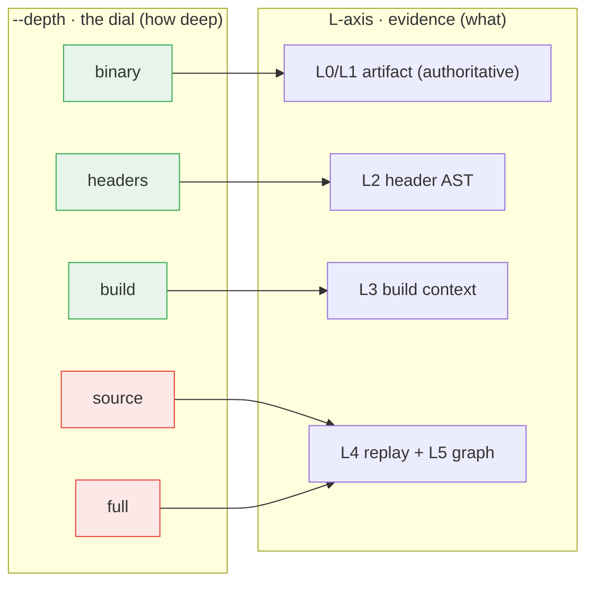

# Evidence layers (L) and scan depth

> **One idea drives this page:** abicheck has **one** knob you turn — `--depth`
> — and it selects how far down a fixed ladder of **evidence layers** (`L0`–`L5`)
> the scan collects. If you only remember one sentence: **`L` is the evidence
> (the *what* + how much it is trusted); `--depth` is the single dial that says
> how much of it to gather.**

This is the conceptual companion to the practical
[Source-Scan Depth](../user-guide/scan-levels.md) user-guide page (the `scan`
command's flags, with worked examples) and to
[Evidence & Detectability](evidence-and-detectability.md) (what each evidence
layer can and cannot see). Read this page when the `L0…L5` layers and the
`--depth` rungs look like they overlap and you want the model that relates them.

!!! note "There used to be more knobs"
    Earlier releases exposed a second `s0…s6` **"source-method"** axis plus
    `--mode` presets. Those are now **deprecated aliases** of `--depth`
    (ADR-037 D5) — they still parse but print a warning. The whole model is now
    just **evidence layers (`L`) + one depth dial**. The old vocabulary and its
    `--depth` mapping are in the [Deprecated axes appendix](#appendix-deprecated-scan-axes-s0s6-and-mode).

---

## The two things you need

| Axis | Codes | Answers | Set by |
|------|-------|---------|--------|
| **L — evidence layer** | `L0`–`L5` | *What* abicheck sees, and **how much that evidence is trusted** (authority) | the **inputs you give** (binary, debug, headers, build dir, sources) |
| **`--depth` — the dial** | `binary`,`headers`,`build`,`source`,`full` (+`auto`) | **How much** evidence to collect (which L-layers to reach) | `scan --depth` (or omit for `auto`) |

`--depth` is a selector *over* the L-axis: each rung names the evidence you get
back, so the dial and the evidence it reaches share one vocabulary and never
drift.

---

## 1. The L-axis — evidence layers (the *what* + authority)

The L-layers are the **sources of information** abicheck overlays, from least to
most. They are **additive, not a fallback chain**, and they carry **different
authority** — only artifact-backed evidence can declare a shipped binary
`BREAKING`:

| Layer | Input | Newly reveals | Authority |
|:-----:|-------|---------------|-----------|
| **L0** | the binary | exported symbols, SONAME, versions, visibility, dependencies | **Authoritative** |
| **L1** | + debug info | type layout, offsets, enum values, vtables, calling convention | **Authoritative** (matched to binary) |
| **L2** | + public headers | source-level API: signatures, access, `noexcept`, templates, public/internal scoping | **Authoritative** for header-visible API |
| **L3** | + build data | the flags it was *actually* built with (`-std`, `_GLIBCXX_USE_CXX11_ABI`, visibility) | Corroborating |
| **L4** | + sources | macro/`constexpr` values, default-arg *values*, inline/template *bodies* | Corroborating (→ `API_BREAK`/risk) |
| **L5** | *(derived)* graph | include/type/call reachability — localizes and explains | Corroborating (→ risk) |

You **provide** five of these (`L0`–`L4`); `L5` is **derived** by abicheck from
L3 (and any L4 surface). The governing principle is the **authority rule**:
build/source evidence (L3/L4/L5) *explains, localizes, scopes, or adds its own
source/API findings* — it **never silently deletes** an artifact-proven break.
The L-axis is explained in full, with the detectability matrix, in
[Evidence & Detectability](evidence-and-detectability.md); the build/source
layers (L3/L4/L5) in [Build Info & Sources](build-source-data.md).

Combining two layers can also resolve a finding that is invisible or ambiguous
to either alone: [case148](../examples/case148_xcheck_header_build_mismatch.md)
crosschecks L2 header macros against L3 build flags;
[case149](../examples/case149_xcheck_odr_variant.md) crosschecks two L4 per-TU
layouts; [case150](../examples/case150_xcheck_export_public_pair.md) crosschecks
the L0 export table against L2 declarations in both directions.

---

## 2. The `--depth` dial — how deep to collect

`abicheck scan` takes one evidence dial, **named by the evidence you get**
(ADR-037 D5). Each rung is additive over the one below it:

| `--depth` | Reaches | Needs |
|-----------|---------|-------|
| `binary` | L0/L1 exported symbols + binary metadata + debug-info *presence* (no deep DWARF type walk, no L2 AST) + the always-on pattern scan | just the artifact(s) |
| `headers` | + **L2** header AST (the public/internal boundary) | a public-header directory + a C/C++ frontend |
| `build` | + **L3** build context (flag/toolchain drift) | a compile DB / build dir |
| `source` | + **L4** source-ABI replay of changed TUs + the **L5** graph | sources **and** `clang` (+ a diff seed for scoping) |
| `full` | **L4** over the whole library | sources **and** `clang` |

**Omit `--depth` for `auto`** — the default. `auto` is risk-driven when a
`--since`/`--changed-path` diff seed is present (it reads the numeric risk of the
changed paths and picks a rung), and falls back to a sensible preset otherwise.
`auto` **never** fires for a pinned depth — a rung you pin always produces the
same scan for the same inputs, which is what CI wants.

`--audit` is **orthogonal** to `--depth`: it is a single-build, no-baseline
hygiene lint (it does not need a previous version). Combine it with any depth.

!!! warning "A pinned deep depth is a contract (fail-loud)"
    Pinning `--depth build|source|full` with **no source input**
    (`--sources`/`--build-info`) is an error, not a silent shallow scan: there
    is nothing to collect L3/L4/L5 from. Pass the evidence, or use the default
    `auto` for a best-effort binary scan.

### There is no `graph` rung

The L5 reachability graph is an **internal consequence** of `--depth source`/`full`,
never its own user-facing rung (ADR-037 D6). `--depth source` folds the L5 edges
that scope and localize a finding; you do not select the graph directly.

---

## 3. How `--depth` maps onto L

`scan` is a front-end over `dump`/`compare`: the resolved depth selects an
internal **collection mode** (the ADR-033 CI evidence mode), which decides which
L-layers get collected and at what replay scope. abicheck also reports the
**representative L-depth** each scan actually reached, so the coverage block
states the depth of what *ran*, not what you *requested*:



---

## 4. Cost: one cliff, at L4

The depth ladder is ordered by cost, and the cost curve has **exactly one cliff —
between `build` and `source` (i.e. reaching L4)**:

- **Cheap tier (`binary`, `headers`, `build`):** one price, dominated by the
  binary dump + lexical scan, *not* the source layer. `build` adds L3
  build-flag/toolchain drift for a flat ~0.3–0.5s regardless of project size.
- **Expensive tier (`source`, `full`):** clang per-TU AST replay (L4). The cliff
  height tracks **C++ template/STL instantiation depth**, not `.so`/TU count — a
  heavy-C++ library can be ~7× slower at `source` than `build`, while a plain-C
  library is barely affected (~1.3×).
- **`source` only beats `full` with a diff seed.** Without `--since`/`--changed-path`,
  the changed-TU set is empty and `source` replays every TU — the same cost as
  `full`. Always pass a seed in PR CI.

A key consequence: **the verdict usually does not change with depth.** The binary
diff (L0–L2) sets the gate; L3–L5 add localization, explanation, and their own
source/API findings. For a pass/fail **gate**, the cheap tier is enough; spend on
L4 (`source`/`full`) when you want source-body semantics or per-PR localization
for humans. The measured numbers are in
[Performance § scan-level cost model](../development/performance.md#scan-level-cost-model-one-cliff-at-l4).

---

## 5. Honest coverage — what actually ran

Because `--depth` requests a level but `L` is *evidence*, a scan can request a
deep level and still only reach a shallow one (clang missing, no sources, a parse
error). abicheck never reports that as "scan failed" — every `scan` prints a
coverage-annotated report stating the **L-depth it actually reached** and, for
each disabled check, the precise input or tool to add:

```text
Checks enabled for this scan (and why others are not):
  [on]  Symbol presence & linkage … — from the binary's dynamic symbol table
  [on]  Build-flag & toolchain drift … — from build-system data
  [off] Macros, default args, inline/template/constexpr bodies — no sources/clang:
        source-only API changes are not detected
```

This is the same evidence-coverage / capability report described in
[Build Info & Sources § Evidence coverage](build-source-data.md#evidence-coverage).
The rule is: **honest about what it had** — the verdict is only ever as strong as
the evidence behind it.
[case147](../examples/case147_scan_depth_ladder.md) is the worked illustration:
the *same* input scanned at `--depth headers` (pattern + AST, no source replay)
and at a deeper level, with the coverage block showing exactly what each depth
proved — never a bare "scan failed".

---

## Appendix — deprecated scan axes (`s0…s6` and `--mode`)

Earlier releases had you pick evidence in two other ways. Both still parse but
are **deprecated (ADR-037 D5)** — they print a warning and map onto `--depth`.
Prefer `--depth`; this table is here only for anyone migrating an old command
line.

**`--source-method s0…s6`** (the old "how it gathers evidence" axis):

| Deprecated | Was | Use instead |
|------------|-----|-------------|
| `s0` / `s3` | diff classifier / lexical pattern scan (compiler-free) | `--depth binary` (or `headers` for +L2) |
| `s1` | compile-DB / build-flag scan (L3) | `--depth build` |
| `s2` | preprocessor macro/include capture | folded into `--depth build` (runs when `clang -E` + a compile DB are present) |
| `s4` | symbol/reference index → L5 graph (no L4) | reached internally by `--depth source`; there is no user-facing graph rung (D6) |
| `s5` | semantic AST replay of changed TUs (L4) | `--depth source` |
| `s6` | full AST replay of all TUs (L4) | `--depth full` |

**`--mode`** presets:

| Deprecated | Was | Use instead |
|------------|-----|-------------|
| `pr` | diff-seeded L4 replay (per-PR gate) | `--depth source --since <ref>` (or just `auto` with a seed) |
| `pr-deep` | `pr` + full L5 reachability | `--depth source` (the L5 graph is folded in) |
| `baseline` | whole-library replay of a release | `--depth full` |
| `audit` | intra-version hygiene lint, no baseline | the `--audit` switch |

`--source-method auto` (risk-driven escalation) is now simply the default when
you **omit** `--depth`.

---

_See also: [Source-Scan Depth (user guide)](../user-guide/scan-levels.md) ·
[Evidence & Detectability](evidence-and-detectability.md) ·
[Build Info & Sources](build-source-data.md) ·
[Performance § scan-level cost model](../development/performance.md#scan-level-cost-model-one-cliff-at-l4)._
