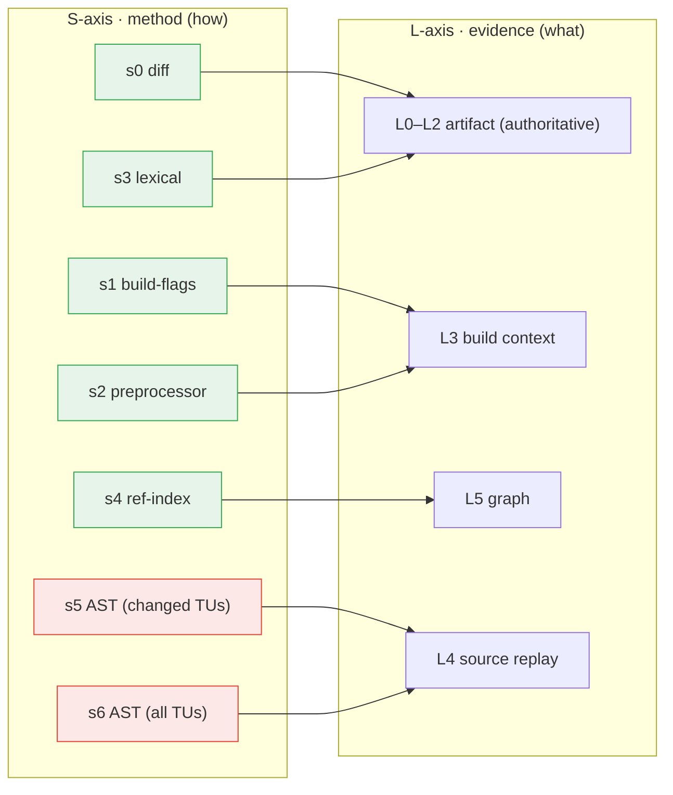

# Scan Levels (S vs L)

> **One idea drives this page:** the word **"level" names three different
> things** in abicheck, and they are routinely confused. This page separates
> them and shows how they connect. If you only remember one sentence:
> **`L` is the evidence (the *what* + how much it is trusted); `S` is the method
> that gathers it (the *how*); `--mode`/`--depth` are presets that pick an
> `(S, L)` pair.**

This is the conceptual companion to the practical
[Source-Scan Levels](../user-guide/scan-levels.md) user-guide page (the `scan`
command's flags, with worked examples) and to
[Evidence & Detectability](evidence-and-detectability.md) (what each evidence
layer can and cannot see). Read this page when the `s0…s6`, `L0…L5`,
`--mode`, and `--depth` knobs look like they overlap and you want the model that
relates them.

---

## The three things called "level"

| Axis | Codes | Answers | Set by | Lives where |
|------|-------|---------|--------|-------------|
| **L — evidence layer** | `L0`–`L5` | *What* abicheck sees, and **how much that evidence is trusted** (authority) | the **inputs you give** (binary, debug, headers, build dir, sources) | [Evidence & Detectability](evidence-and-detectability.md), [Build Info & Sources](build-source-data.md) |
| **S — source-analysis method** | `s0`–`s6` (+`auto`) | *How* abicheck gathers the L3–L5 evidence, and the **granularity coverage is reported at** | `scan --source-method` | [`scan` command](../user-guide/scan-levels.md) |
| **mode / depth — presets** | `pr`,`pr-deep`,`baseline`,`audit` / `headers`,`build`,`source`,`full`,`graph` | A convenient **fixed `(S, L)` selection** | `scan --mode` / `scan --depth` | [`scan` command](../user-guide/scan-levels.md) |

The two axes are **orthogonal**: `L` is a property of *evidence*, `S` is a
property of the *process* that produced it. You can reach the same L-layer by
more than one S-method, and a single S-method can contribute to more than one
L-layer.

---

## 1. The L-axis — evidence layers (the *what* + authority)

The L-layers are the **sources of information** abicheck overlays, from least to
most. They are **additive, not a fallback chain**, and they carry **different
authority** — only artifact-backed evidence can declare a shipped binary
`BREAKING`:

| Layer | Input | Newly reveals | Authority |
|:-----:|-------|---------------|-----------|
| **L0** | the binary | exported symbols, SONAME, versions, visibility, dependencies | **Authoritative** |
| **L1** | + debug info | type layout, offsets, enum values, vtables, calling convention | **Authoritative** (matched to binary) |
| **L2** | + public headers | source-level API: signatures, access, `noexcept`, templates, public/internal scoping | **Authoritative** for header-visible API |
| **L3** | + build data | the flags it was *actually* built with (`-std`, `_GLIBCXX_USE_CXX11_ABI`, visibility) | Corroborating |
| **L4** | + sources | macro/`constexpr` values, default-arg *values*, inline/template *bodies* | Corroborating (→ `API_BREAK`/risk) |
| **L5** | *(derived)* graph | include/type/call reachability — localizes and explains | Corroborating (→ risk) |

You **provide** five of these (`L0`–`L4`); `L5` is **derived** by abicheck from
L3 (and any L4 surface). The governing principle is the **authority rule**:
build/source evidence (L3/L4/L5) *explains, localizes, scopes, or adds its own
source/API findings* — it **never silently deletes** an artifact-proven break.
The L-axis is explained in full, with the detectability matrix, in
[Evidence & Detectability](evidence-and-detectability.md); the build/source
layers (L3/L4/L5) in [Build Info & Sources](build-source-data.md).

Combining two layers can also resolve a finding that is invisible or ambiguous
to either alone: [case148](../examples/case148_xcheck_header_build_mismatch.md)
crosschecks L2 header macros against L3 build flags;
[case149](../examples/case149_xcheck_odr_variant.md) crosschecks two L4 per-TU
layouts; [case150](../examples/case150_xcheck_export_public_pair.md) crosschecks
the L0 export table against L2 declarations in both directions.

---

## 2. The S-axis — source-analysis methods (the *how*)

`abicheck scan` can gather the build/source evidence in seven cost-ordered ways.
This is the `--source-method` knob (`abicheck/buildsource/scan_levels.py`). Each
method is a *technique*; the right-hand column is the **evidence it reaches**:

| Method | Technique | Reaches | Needs |
|--------|-----------|---------|-------|
| `s0` | diff classifier (risk tags/score) | L0/L1 + always-on pattern scan | nothing extra |
| `s1` | compile-DB / build-flag scan | **L3** build context | a compile DB / build dir |
| `s2` | preprocessor (macro values / include graph) | L3 + macro/include facts | L3 **and** `clang -E` |
| `s3` | lexical pattern scan (compiler-free) | pattern facts only (the always-on scan) | nothing |
| `s4` | symbol / reference index | + **L5** graph (no L4) | a compile DB |
| `s5` | targeted semantic AST (changed TUs) | + **L4** replay + L5 edges | sources **and** clang |
| `s6` | full AST (all TUs) | + **L4** over the whole library | sources **and** clang |

`auto` is an opt-in, risk-driven escalation (local/dev only): it reads the
numeric risk of the changed paths and picks an S-method, capped at `s5`. It
**never** fires for a pinned CI level — a mode/`--source-method` you pin always
produces the same scan for the same inputs.

> **Why the numbering isn't a straight ladder.** `s0`/`s3` are compiler-free
> (they reach no new L-layer beyond the always-on scan); `s4` deliberately skips
> L4 and goes straight to the L5 graph (it is the cheapest way to get
> reachability); only `s5`/`s6` pay for the L4 semantic replay. The S-axis is
> ordered by **cost**, and cost does not increase one L-layer at a time.

---

## 3. How S maps onto L

`scan` is a front-end over `dump`/`compare`: the resolved S-method selects an
internal **collection mode** (the ADR-033 CI evidence mode that the unified
`--depth` dial also resolves to), which decides which L-layers get collected and
at what replay scope. abicheck also reports the **representative L-depth** each
method actually reached, so the coverage block states the depth of what *ran*,
not what you *requested*:



The mapping is **lossy in the `--depth` direction** (see §4): `--depth build`
resolves to `s1`, and `s2`/`s3`/`s4` have no `--depth` form at all — so
`--source-method` is the precise knob and **wins if both are given**.

---

## 4. The presets — `--mode` and `--depth`

You rarely pick `(S, L)` by hand. Two presets do it for you:

**`--mode`** pins a fixed `(S, L)` pair — deterministic, so a CI gate that pins a
mode produces the same scan for the same inputs:

| `--mode` | `(S, L)` | Use it for |
|----------|----------|------------|
| `pr` *(default)* | `(s5, source)` | per-PR gate with a diff seed (`--since`) |
| `pr-deep` | `(s5, graph)` | PR gate **+** full L5 reachability |
| `baseline` | `(s6, full)` | the amortized full snapshot of a release |
| `audit` | `(s5, source)` *(intra-version)* | single-build hygiene lint, **no baseline** |

**`--depth`** is a coarse, *lossy* L-axis selector — convenient but less precise
than `--source-method`. Its five rungs are `binary`, `headers`, `build`,
`source`, `full` (ADR-037 D5):

| `--depth` | resolves to | reaches |
|-----------|-------------|---------|
| `binary` | `s0` (no S-method) | L0/L1 only — no L2 AST (+ always-on pattern scan) |
| `headers` | `s0` (no S-method — L2 is the intrinsic header AST) | L0–L2 (+ always-on pattern scan) |
| `build` | `s1` | + L3 |
| `source` | `s5` | + L4 scoped + L5 edges |
| `full` | `s6` | L4 full-scope |

There is **no `graph` rung** (ADR-037 D6): the L5 graph is an *internal
consequence* of `--depth source`/`full`, never its own user-facing rung. To pin
the graph-only level (`s4`, L5 without paying for L4) use `--source-method s4`;
to fold the *full* L5 reachability graph into a PR scan use `--mode pr-deep`
(= `(s5, graph)` internally).

Precedence, highest first: **`--source-method` > `--depth` > `--mode`**.

---

## 5. Cost: one cliff, at L4

The S-axis is ordered by cost, and the cost curve has **exactly one cliff —
between `s4` and `s5` (i.e. reaching L4)**:

- **Cheap tier (`s0`–`s4`):** one price, dominated by the binary dump + lexical
  scan, *not* the source layer. `s0` ≈ `s3`; `s1` adds L3; **`s4` adds the L5
  *structural* graph without paying for L4** — target → source → header →
  build-option nodes (`graph-build`), the best cheap level for build-structure
  reachability. Note `s4` does **not** fold call edges (`DECL_CALLS_DECL`): those
  need the L4 pass, so for call-impact reachability use `pr-deep`/`s5`/`s6`.
- **Expensive tier (`s5`, `s6`, and the modes that use them):** clang per-TU AST
  replay (L4). The cliff height tracks **C++ template/STL instantiation depth**,
  not `.so`/TU count — a heavy-C++ library can be ~7× slower at `s5` than `s4`,
  while a plain-C library is barely affected (~1.3×).
- **`s5`/`pr` only beats `s6` with a diff seed.** Without `--since`/`--changed-path`,
  the changed-TU set is empty and `s5` replays every TU — the same cost as `s6`.
  Always pass a seed in PR CI.

A key consequence: **the verdict usually does not change with depth.** The binary
diff (L0–L2) sets the gate; L3–L5 add localization, explanation, and their own
source/API findings. For a pass/fail **gate**, the cheap tier is enough; spend on
L4 (`s5`/`s6`) when you want source-body semantics or per-PR localization for
humans. The measured numbers are in
[Performance § scan-level cost model](../development/performance.md#scan-level-cost-model-one-cliff-at-l4).

---

## 6. Honest coverage — what actually ran

Because `S` is a *method* and `L` is *evidence*, a scan can request a deep level
and still only reach a shallow one (clang missing, no sources, a parse error).
abicheck never reports that as "scan failed" — every `scan` prints a
coverage-annotated report stating the **L-depth it actually reached** and, for
each disabled check, the precise input or tool to add:

```text
Checks enabled for this scan (and why others are not):
  [on]  Symbol presence & linkage … — from the binary's dynamic symbol table
  [on]  Build-flag & toolchain drift … — from build-system data
  [off] Macros, default args, inline/template/constexpr bodies — no sources/clang:
        source-only API changes are not detected
```

This is the same evidence-coverage / capability report described in
[Build Info & Sources § Evidence coverage](build-source-data.md#evidence-coverage).
The rule is: **honest about what it had** — the verdict is only ever as strong as
the evidence behind it.
[case147](../examples/case147_scan_depth_ladder.md) is the worked illustration:
the *same* input scanned at S3 (pattern only, no compiler) and at a deeper level,
with the coverage block showing exactly what each depth proved — never a bare
"scan failed".

---

_See also: [Source-Scan Levels (user guide)](../user-guide/scan-levels.md) ·
[Evidence & Detectability](evidence-and-detectability.md) ·
[Build Info & Sources](build-source-data.md) ·
[Performance § scan-level cost model](../development/performance.md#scan-level-cost-model-one-cliff-at-l4)._
