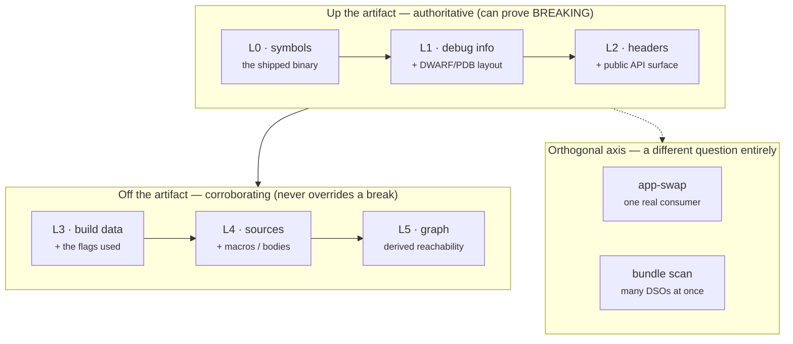
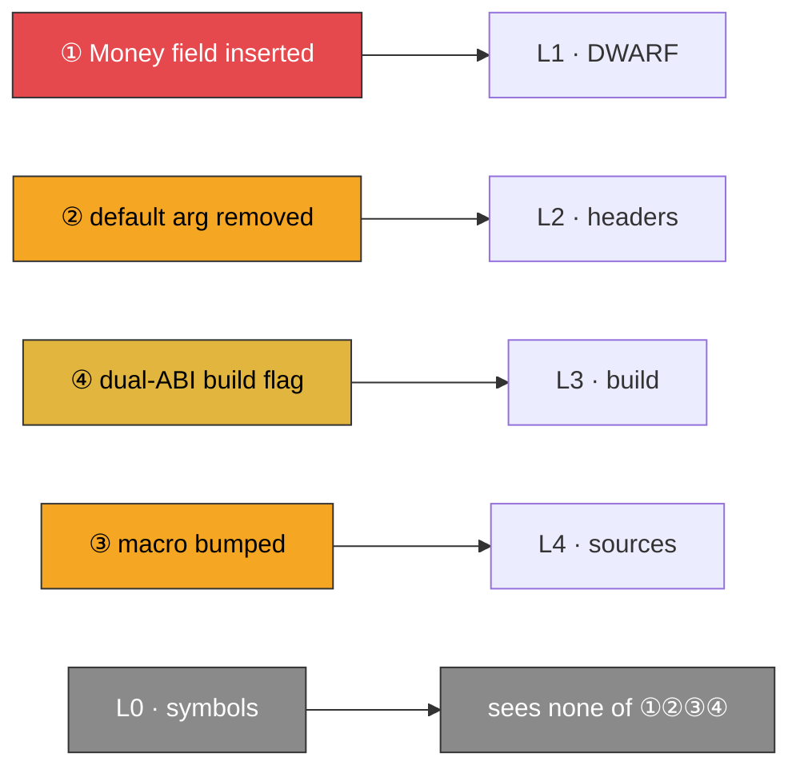

# What Each Level Sees — a level-by-level walk-through

Different evidence levels observe **different slices of reality**, and no single
level detects every compatibility issue. This page is the *demonstration* of that
idea: one tiny library, one real release, walked up **every evidence level** so
you can see — concretely, with the actual data — **what each level knows, how the
levels correlate, and exactly where each one goes blind.**

!!! info "This topic in three pages — you are on **Worked example**"
    **Model** — [Evidence & Detectability](evidence-and-detectability.md): the
    `L0`–`L5` evidence layers, what each can and cannot see, and the `--depth`
    dial that collects them.
    **Worked example** — this page: one tiny library walked up every level,
    with the actual data.
    **Flags** — [Source-Scan Depth](../user-guide/scan-levels.md): the `scan`
    command reference with recipes.

> For the *framing* (why a change is only a "break" if it breaks a promise)
> read [ABI/API Handling](abi-api-handling.md). **This page is the worked
> example that makes the model stick.**

---

## The evidence staircase, in one picture

There are **two directions** you can add evidence. The first three levels climb
*up the artifact* — more and more of what the shipped binary itself encodes. The
next three step *off the artifact* into what the build and sources know. Two more
checks (app-swap, bundle scan) are a wholly **orthogonal** axis — a different
question, not a higher rung.



The one rule that never bends is the **authority rule**: the artifact tiers
(L0–L2) set any `BREAKING` verdict; the build/source tiers (L3–L5) add findings,
scope out false positives, and *explain* — but **never manufacture or delete** an
artifact-proven break.

---

## The running example

`libcart` is a two-file C++ shared library. Here is the public header of **v1**:

```cpp
// cart.h  (v1) — the public contract
#define CART_MAX_ITEMS 64                 // (a) a macro constant

namespace cart {
enum class Currency : int { USD = 0, EUR = 1 };

struct Money {                            // (b) a public value type
    long     cents;                       //   offset 0
    Currency ccy;                         //   offset 8
};

constexpr double kTaxRate = 0.20;         // (c) a constexpr constant

class Cart {
public:
    void  add(int sku, int qty = 1);      // (d) a default argument
    Money total(bool with_tax = true) const;
    int   size() const { return count_; } // (e) an inline body
private:
    int count_;
};
} // namespace cart
```

**v2** ships four independent changes, each chosen to land on a *different*
evidence level:

| # | Change | Lands on |
|---|--------|----------|
| ① | `struct Money` gains `long region;` **before** `ccy` — every following field shifts, `sizeof(Money)` grows 16→24 | **L1** (layout) |
| ② | `add(int sku, int qty = 1)` → `add(int sku, int qty)` — the default argument is **removed**; the mangled symbol does not change | **L2** (header API) |
| ③ | `#define CART_MAX_ITEMS 64` → `128` — a macro constant | **L4** (source only) |
| ④ | v2 is built with `-D_GLIBCXX_USE_CXX11_ABI=0` (v1 used `=1`) — the std::string/std::list ABI flips | **L3** (build flag) |

Here is where each change **first becomes visible** as you climb — watch three of
the four stay completely invisible until you feed abicheck more than the `.so`:



The verdict is computed **worst-wins across every level**, so the final answer is
`BREAKING` — but *which level proved it*, and what each other level added, is the
whole lesson.

---

## Level 0 — the shipped binary (symbols only)

!!! abstract "L0 at a glance"
    **You feed it:** a stripped `libcart.so`, nothing else. &nbsp;·&nbsp;
    **Authority:** authoritative. &nbsp;·&nbsp; **Proves here:** nothing — all
    four changes keep every symbol name.

**What abicheck extracts** (`abicheck dump libcart.so --dry-run`, in its
"Available data layers" section):

```text
L0 binary metadata   present  (ELF, SONAME=libcart.so.1, 4 exported symbols)
L1 debug info        absent   (stripped)
L2 public header AST  absent   (no -H)
```

The L0 view is just the exported, demangled symbol table:

```text
# nm -D --demangle libcart.so   (v1 and v2 — byte-for-byte identical)
cart::Cart::add(int, int)
cart::Cart::total(bool) const
cart::Cart::size() const
typeinfo for cart::Cart
```

**What L0 proves:** symbols present/absent, SONAME, versioning, visibility,
binding, `DT_NEEDED`. If v2 had *removed* `add`, L0 alone would prove
`func_deleted` → `BREAKING` ([case12](../examples/case12_function_removed.md)).

!!! danger "The L0 blind spot — this is the punchline"
    *None of ①②③④ touch a symbol name.* A struct field insertion, a
    default-argument removal, a macro bump, and a build-flag flip are **all
    invisible at L0.** abicheck reports **`NO_CHANGE`** — a true statement about
    the symbol table and a dangerous falsehood about compatibility. This is exactly
    why a stripped-binary-only compare "passes" on real breaks (see
    [Limitations → Stripped binaries](limitations.md#stripped-production-binaries)).

---

## Level 1 — + debug info (DWARF/PDB): layout ground truth

!!! abstract "L1 at a glance"
    **You feed it:** the same libraries built `-g` (or a `-dbg`/`debuginfo`
    sidecar). &nbsp;·&nbsp; **Authority:** authoritative. &nbsp;·&nbsp;
    **Proves here:** ① the layout break — and its verdict is the final one.

**What L1 adds** is the *emitted layout* — the byte offsets the compiler actually
baked into every caller:

```text
# abicheck's L1 view of `struct Money`
              v1                         v2
  struct Money  (size 16)      struct Money  (size 24)
    +0   long      cents         +0   long      cents
    +8   Currency  ccy           +8   long      region    ← inserted (8 bytes)
                                 +16  Currency  ccy        ← was +8
                                 +20  (4 bytes padding → size 24)
```

Now change ① is *undeniable*. abicheck emits:

```text
🔴 BREAKING  struct_size_changed        cart::Money   16 → 24 bytes
🔴 BREAKING  struct_field_offset_changed cart::Money::ccy   +8 → +16
```

Any consumer compiled against v1 reads `ccy` at offset 8; in v2 that offset holds
`region`. The loader raises no error — the caller just reads the wrong four bytes
([case07](../examples/case07_struct_layout.md)). **L1 is where the real break is
proven**, and its verdict is authoritative.

!!! warning "The L1 blind spot"
    L1 still cannot see the default-argument removal ② (a default argument is a
    *source* fact, not a layout fact — DWARF stores no default arguments), the
    macro ③, or the build flag ④. L1 also has no notion of *public vs. internal* —
    if `Money` were a private type, L1 would still shout `BREAKING`; only L2 can
    tell it to relax ([case118](../examples/case118_internal_struct_field_added_scoped.md)).

---

## Level 2 — + public headers: the source-level API

!!! abstract "L2 at a glance"
    **You feed it:** `-H include/cart.h` (parsed by castxml or clang via
    `--ast-frontend`). &nbsp;·&nbsp; **Authority:** authoritative for
    header-visible API. &nbsp;·&nbsp; **Proves here:** ② the default-arg removal —
    plus it supplies the public/internal scoping that keeps L1 honest.

**What L2 adds** is the *declared* API surface — the intent the binary cannot
carry, plus the public/internal boundary:

```text
# abicheck's L2 view of Cart::add
  v1:  void cart::Cart::add(int sku, int qty = 1)
  v2:  void cart::Cart::add(int sku, int qty)
                                          └── default argument removed
```

L2 proves change ②, which every lower level missed:

```text
🟠 API_BREAK  param_default_value_removed  cart::Cart::add  qty: default `= 1` removed
```

A caller that wrote `cart.add(42)` **fails to recompile** — `qty` is now a
required argument. That is a source-level contract break with *no* binary trace
(a *changed* default value, by contrast, is only a `COMPATIBLE` quality signal —
`param_default_value_changed`; the removal is the API break). Only headers reach
it ([case123](../examples/case123_default_argument_removed.md)). L2 also supplies
the **public-surface scoping** that keeps L1 honest: it tells abicheck that
`Money` *is* public, so the L1 break stands, while an internal type's identical
change would be demoted.

!!! warning "The L2 blind spot"
    L2 still cannot see the `#define` macro ③ — castxml emits no macros at all,
    and the clang backend models declarations, not `#define` bodies — nor the
    build flag ④. It also cannot see an *inline body* change to `size()`: it has
    the declaration, not the compiled body.

---

## Level 3 — + build data: the flags it was actually built with

!!! abstract "L3 at a glance"
    **You feed it:** `-p build/` or `--build-info build/` (a
    `compile_commands.json` / CMake / Ninja / Bazel graph). &nbsp;·&nbsp;
    **Authority:** corroborating. &nbsp;·&nbsp; **Proves here:** ④ the dual-ABI
    flag flip — as a **risk**, and it explains latent symbol churn.

**What L3 adds** is *how* the binary was compiled — the ABI-relevant flags that
silently change layout and mangling without touching a single line of your source:

```text
# L3 build-flag delta abicheck normalizes out of the two compile DBs
  -std                        c++17            c++17          (same)
  -fvisibility                hidden           hidden         (same)
  _GLIBCXX_USE_CXX11_ABI      1                0     ← flipped
```

L3 proves change ④:

```text
🟡 risk  abi_relevant_build_flag_changed  _GLIBCXX_USE_CXX11_ABI  1 → 0
```

This is the [dual-ABI flip](../examples/case104_glibcxx_dual_abi_flip.md):
`_GLIBCXX_USE_CXX11_ABI=1` (v1) selects the `std::__cxx11` string/list ABI, and
`=0` (v2) reverts to the legacy pre-C++11 ABI — so any `std::string`/`std::list`
parameter changes its underlying type and mangled name, and **v2 drops the
`__cxx11` symbol variants v1 exported**. `libcart`'s exported functions take no
such types, so here the flip causes **no** L0 symbol churn (which is why L0 stays
silent above) — but in a library that *does* expose them, this same flag flip
renames those symbols and the L0 diff proves a `func_deleted`/`func_added`
`BREAKING` on its own. On its own L3 is a **risk**, not a break; it *explains* and
localizes that churn and tells you the two builds are not comparing like-for-like.
Per the authority rule, L3 never *manufactures* a `BREAKING`; it corroborates.

!!! warning "The L3 blind spot"
    Anything about *values* inside the source — it reads the build's flags and
    target graph, not the code. Macro ③ is still invisible.

---

## Level 4 — + sources: the facts that never reach the binary

!!! abstract "L4 at a glance"
    **You feed it:** `--sources ./libcart-src/` (needs clang; replays each TU
    under its real L3 flags). &nbsp;·&nbsp; **Authority:** corroborating (tops out
    at `API_BREAK`/risk). &nbsp;·&nbsp; **Proves here:** ③ the macro bump — visible
    to *no* artifact level.

**What L4 adds** is the last mile — the source-only facts that are in *no*
artifact: macro constants, `constexpr` values, default-argument *values*, and
inline/template/uninstantiated **bodies**:

```text
# L4 source-fact delta (normalized source_facts, per public header)
  macro   CART_MAX_ITEMS   64  → 128        (public header)
  inline  cart::Cart::size body-fingerprint  a1b2… → a1b2…  (unchanged)
```

L4 proves change ③, which is invisible to *every* artifact level — L0, L1, and
L2 all emit `NO_CHANGE` for a `#define`:

```text
🟠 API_BREAK  public_macro_value_changed  CART_MAX_ITEMS  64 → 128
```

If v2 had instead changed the *body* of the inline `size()` while keeping its
signature, L4 would flag `inline_body_changed` (a mixed-build/ODR **risk**) — the
one class of change that is neither a symbol, a layout, nor a declaration, and so
reaches no lower level. This is the residual the whole source scan exists for:
[case124](../examples/case124_header_constant_value_changed.md) (a header
constant value change) is *detected* as `API_BREAK`, while
[case122](../examples/case122_template_signature_uninstantiated.md) (an
uninstantiated template *signature* change) is the documented `NO_CHANGE` **gap**
that even L4 cannot close — a reminder that the top of the ladder still has a
blind spot.

!!! warning "The L4 blind spot"
    It is only as good as the source checkout matching the binary. Point it at the
    wrong tag and it raises `source_binary_provenance_mismatch` rather than
    guessing. And it **never** upgrades a source-only finding to `BREAKING` — a
    macro change is `API_BREAK`, full stop.

---

## Level 5 — the derived source/build graph: who reaches what

!!! abstract "L5 at a glance"
    **You feed it:** nothing — abicheck **derives** it from L3 (and any L4
    surface). &nbsp;·&nbsp; **Authority:** corroborating (prioritizes; proves
    nothing on its own). &nbsp;·&nbsp; **Proves here:** that the L1 break on
    `Money` *reaches an exported entry point* — so it ranks high.

L5 answers *impact* questions the flat diffs cannot:

```text
# L5 reachability closure for the change to `struct Money`
  target libcart  ──has-public-header──▶ cart.h
    cart.h  ──declares──▶ cart::Money  ──maps-to-debug-type──▶ Money (DWARF)
      cart::Money  ◀──by-value return──  cart::Cart::total(bool) const
                                         └── exported symbol _ZNK4cart4Cart5totalEb
```

So the L1 layout break on `Money` is not an isolated struct change — the graph
shows it **reaches an exported entry point** (`total` returns `Money` by value),
which is why the break is consumer-visible and high-priority. Here L5's whole job
is **explanation and localization**: `Money` stays reachable and `total` maps to
the same symbol on both sides — only the layout changed — so *no* reachability
delta fires. The dedicated L5 risk findings are emitted only when those
relationships actually change: `public_reachability_changed` when a declaration
*enters or leaves* the public closure, and `source_to_binary_mapping_changed`
when a declaration now maps to a *different* exported symbol. Like L4 they never
override the artifact verdict. (This closure is reported inline as part of the
`--depth source` report that localizes the L1 break on `_ZNK4cart4Cart5totalEb`
— there is no separate `graph` command; the L5 graph is an internal
consequence of `--depth source`, not its own CLI surface.)

!!! warning "The L5 blind spot"
    It is a *structural* graph. The cheap include/declares/maps-to closure has
    no call edges, so "what does this internal helper's change reach through
    the call graph" needs the full L4 replay pass (`--depth source`) — there
    is no cheaper, call-edge-aware depth. And a graph never proves a break —
    it prioritizes one.

---

## Two orthogonal sources: app-swap and bundle scan

The L-staircase is not the only evidence axis. Two *orthogonal* checks answer
different questions and see different things:

- **App-swap (`compare --used-by`)** — build a real consumer against v1, drop
  in v2, run it. It **proves** actual loader/linker behavior for *that* app
  ("this app does not import the removed symbol") but **cannot** speak for the
  whole contract: untested API, future consumers, and silent layout corruption
  a test never exercises stay invisible. It is *consumer-scoped*; library
  `compare` (without `--used-by`) is *contract-scoped*.
- **Bundle scan** — many libraries at once, cross-DSO. It catches provider/
  dependency/entry-point problems *between* binaries that a single-library
  compare cannot, and is blind to pure source compatibility.

Neither is "higher" than L0–L5; they observe a different slice of reality. The
full method-by-method comparison is in
[Evidence & Detectability §2](evidence-and-detectability.md#2-methods-compared-by-the-evidence-they-use).

---

## How the levels correlate on one release

Here is the entire `libcart` v1→v2 release as one grid — every change against
every level. Read *down* a column to see what that level alone would report; read
*across* a row to see how many independent levels corroborate one change:

| Change | L0 symbols | L1 DWARF | L2 headers | L3 build | L4 sources | L5 graph | abicheck ChangeKind | Verdict |
|--------|:---:|:---:|:---:|:---:|:---:|:---:|---|---|
| ① `Money` field inserted | ❌ | ✅ **proves** | ✅ (castxml layout) | — | — ¹ | ✅ ranks | `struct_size_changed`, `struct_field_offset_changed` | 🔴 BREAKING |
| ② default arg `qty` removed | ❌ | ❌ | ✅ **proves** | — | ✅ | — | `param_default_value_removed` | 🟠 API_BREAK |
| ③ macro `CART_MAX_ITEMS` | ❌ | ❌ | ❌ | ❌ | ✅ **proves** | — | `public_macro_value_changed` | 🟠 API_BREAK |
| ④ `_GLIBCXX_USE_CXX11_ABI` | ❌ | ❌ | ❌ | ✅ **proves** | ✅ | ✅ | `abi_relevant_build_flag_changed` | 🟡 risk |
| **Release verdict (worst-wins)** | NO_CHANGE | BREAKING | BREAKING | risk | API_BREAK | risk | — | **🔴 BREAKING** |

¹ L4 source replay emits source-surface findings (macros, `constexpr`/default-arg
values, inline/template bodies, typedefs, ODR/mapping) — **not** emitted binary
layout; a record-layout edit like ① is L1/L2's job, so L4 adds nothing for it.

Three lessons fall straight out of the grid:

1. **No single level sees all four changes.** Each change is proven where its
   evidence first appears (some, like ①, by two levels at once). The bottom
   "worst-wins" row shows a stripped-binary compare (L0) would call this release
   **clean** — the single most important reason to feed abicheck more than the
   `.so`.
2. **Higher levels don't *replace* lower ones — they cover different rows.** L2
   proves ②'s default-arg break that L1 can't, while L1's DWARF layout and L2's
   castxml layout *both* catch ①. The value is in the overlay, which is why
   abicheck combines them instead of picking one.
3. **Authority is not the same as coverage.** L4 corroborates the *most* rows
   here, but the `BREAKING` gate is set by the authoritative artifact tiers —
   here L1's DWARF layout, with L2's castxml layout agreeing. L3/L4/L5 add real
   findings and the *explanation*, but a source-only finding tops out at
   `API_BREAK`.

---

## The one thing to remember: every level has a blind spot

No level is complete; each is chosen to see one slice and is structurally blind
to the rest. This is the ladder of what each level **cannot** catch, no matter how
carefully you run it:

| Level | Can prove | **Structurally cannot see** |
|-------|-----------|------------------------------|
| **L0** symbols | symbol add/remove/rename, SONAME, versioning, visibility | any change that keeps the symbol name — layout, default args, macros, flags |
| **L1** debug info | struct/enum layout, offsets, vtables, calling convention | source intent (default args, `explicit`, access), macros, whether a type is *public* |
| **L2** headers | signatures, access, `noexcept`, default-arg values, `const`/`constexpr` values, public scoping | `#define` macros, inline/template **bodies**, uninstantiated templates, what was actually compiled |
| **L3** build data | ABI-relevant flags, toolchain, target/option graph | anything *inside* the source — values, bodies, layout |
| **L4** sources | macros, `constexpr` values, inline/template/uninstantiated bodies | the layout actually *emitted* (that is L1's job); anything if the checkout ≠ the binary |
| **L5** graph | reachability / impact ranking, cross-symbol closure | it proves *nothing* on its own — it prioritizes; call impact needs the L4 pass |
| **app-swap** | real loader behavior for *one* app | unused API, future consumers, silent corruption a test misses, recompile breaks |

> **The takeaway of the whole page:** *different levels observe different
> evidence, and no single level detects every compatibility issue.* abicheck's
> answer is not to pick the "best" level but to **overlay all of them** and let
> the strongest evidence win under the authority rule — the artifact tiers
> (L0–L2) set any `BREAKING` gate, and the build/source tiers (L3–L5) add the
> findings and the explanation the artifact alone could never carry. Feed it as
> many levels as you can; each one closes a blind spot the others have.

---

## Reference: which input proves which family

The walk-through above is the demonstration on one release. These two matrices
are the *summary* across every break family — the minimum input needed to
*detect* each, and the most common reason a real change is missed.

**Artifact tiers (L0–L2)** — the shipped binary and its headers:

| Change family | Symbols only | + DWARF/PDB | + Headers | Common false negative |
|---------------|:---:|:---:|:---:|------|
| Exported function/variable removed or renamed | ✅ | ✅ | ✅ | symbol filtered as non-public (visibility/scope) |
| Parameter / return / pointer-level signature change | ⚠️ partial¹ | ✅ | ✅ | stripped binary, C symbol carries no type |
| Struct/class layout, alignment, packing, bitfields | ❌ | ✅ | ✅ | stripped **and** no headers → reported `NO_CHANGE` |
| Enum value / underlying-type change | ❌ | ✅ | ✅ | no debug info and no headers |
| C++ vtable / virtual-method change | ❌ | ✅ | ✅ | mangled symbols stripped or demangled-away |
| Calling convention (trivial→non-trivial) | ⚠️ | ✅ | ⚠️ | no debug info to see triviality |
| Source-only API (access, `explicit`, default args, renames, constants) | ❌ | ❌² | ✅ | no headers supplied (no symbol exists at all) |
| Templates / inline bodies | ⚠️ instantiated only | ⚠️ | ⚠️ | uninstantiated / header-only body — invisible to any artifact |
| Modern C/C++ (dual-ABI, ABI tags, `char8_t`, `_BitInt`, `_Atomic`) | ⚠️ mangling only | ✅ | ✅ | demangled view hides the tag/ABI flip |
| SONAME / visibility / versioning / RPATH / TLS metadata | ✅ | ✅ | ✅ | platform-specific (PE/Mach-O differ — see [Part 5](abi-series/05-linker-elf.md)) |

¹ C++ mangled names encode parameter types, so symbol-only catches many C++
signature changes; C symbols do not. ² A few source-only changes (e.g. enum/field
*renames*) are visible in DWARF too; most (default args, `explicit`, `const`
values) leave no binary trace and require headers. The authoritative per-change
table is in [Limitations](limitations.md#source-only-changes-invisible-to-binaryobject-analysis).

**Source-scan tiers (L3–L5)** — off the artifact, into build and sources. These
findings are **corroborating, never breaking on their own** (the [authority
rule](build-source-data.md#the-authority-rule-the-one-rule-that-matters)):

| Source-scan family | + Build data (L3) | + Sources (L4) | + Graph (L5, derived) | Emitted verdict | Common false negative |
|---|:---:|:---:|:---:|---|------|
| ABI-relevant build-flag / toolchain drift (`-std`, `_GLIBCXX_USE_CXX11_ABI`, `-fvisibility`, `-fexceptions`, `-frtti`) | ✅ | ✅ | ✅ | 🟡 risk | no compile DB — a command-string DB under-reports normalized flags |
| Macro (`#define`) value change with no symbol move | ❌ | ✅ | ✅ | 🟠 API_BREAK | no sources **or** no clang — L4 is reported `not_collected` (coverage shows the check was skipped, never a silent pass), so the macro check simply does not run (a `const`/`constexpr`/default-arg **value** change is L2, already caught by `compare -H`) |
| Inline / template **body** change (signature unchanged) | ❌ | ✅ | ✅ | 🟡 risk | body never becomes a symbol; only L4 replay fingerprints it — an *uninstantiated template signature* change ([case122](../examples/case122_template_signature_uninstantiated.md)) is a documented `NO_CHANGE` gap even at L4 |
| Intra-version hygiene: accidental export, private-header leak, unversioned export, RTTI-for-internal | ⚠️ partial | ❌ | ✅ localizes | 🟡 risk | resolves at L0+L2 (binary exports **and** the header AST); the scan's cross-source pass computes it — no L4 replay needed |
| Cross-source disagreement — *minimum evidence varies by check* | ⚠️ header↔build | ⚠️ ODR only | ✅ | 🟠 API_BREAK / 🟡 risk | evidence on only one side → the check is *skipped*, never faked green. Export↔decl & provider checks need only L0+L2; header↔build needs L3; ODR variant needs L4 |
| Cross-symbol impact / reachability (what a changed internal reaches) | ⚠️ structural | ✅ | ✅ | 🟡 risk | the structural graph alone has no call edges — call-impact needs the full L4 replay (`--depth source`) |

The source scan reaches a *different* set of changes — macros, bodies, build
flags, hygiene, cross-source conflicts — not a "better" version of the artifact
scan. It is additive, not a replacement. To enable it on a real project, see the
[source scan on the ABI/API Handling page](abi-api-handling.md#going-deeper-than-artifacts-the-source-scan)
and the [`--depth` dial](evidence-and-detectability.md#the-depth-dial-how-much-evidence-to-collect).

---

**Next:** [Evidence & Detectability](evidence-and-detectability.md) tracks each
layer's false-positive / false-negative contribution as a CI gate and maps the
`L0`–`L5` layers to the [`--depth` dial](evidence-and-detectability.md#the-depth-dial-how-much-evidence-to-collect) ·
[Limitations](limitations.md) is the authoritative per-change detectability
matrix.
