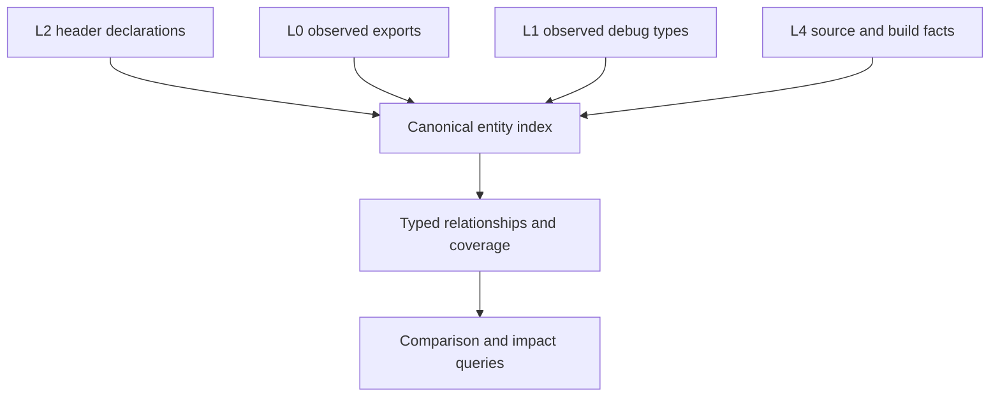

# Evidence entity model — one identity, explicit joins, typed coverage

**Origin:** An architecture review (2026-09-23) of how the L2 snapshot, the
header graph (`buildsource/header_graph.py`), and the public-surface graph
(`compare/surface_graph.py`) relate. Finding: abicheck has a rich L2
snapshot and a useful dependency graph, but they are **not yet one
consistently identified, queryable evidence model**.

**ADR:** none new. This plan finishes goals [ADR-063](../adr/063-one-semantic-pipeline.md)
already states (Phase 2 identity, Phase 3 "public surface as a graph query",
Phase 6 `SemanticIR`) and reuses the release-contract model of ADR-065 and
the "one contract, many providers" section of `AGENTS.md`. A phase that
changes a snapshot or report schema needs an ADR-063 amendment first.

**Type:** Initiative plan (cross-cutting: `model/`, `extract/`, `compare/`,
`buildsource/`, `storage/`).

**Effort:** L–XL overall. Expect roughly 8–15 PRs. **Risk:** Phases 1 and 2
change node IDs and the snapshot schema (`SCHEMA_VERSION` bump, golden-file
churn). Phases 0, 4 and 5 are additive.

**Relationship to other plans:** [One Semantic Pipeline](one-semantic-pipeline.md)
owns the IR and identity primitives. This plan owns *using them as the one
join key* across L0/L1/L2/L4 evidence. [Storage format v2](storage-format-v2.md)
owns persistence. This plan keeps the versioned JSON snapshot as the
external baseline format and does not propose replacing it.

## Problem

| # | Gap | Consequence |
|---|-----|-------------|
| 1 | **Entity identity.** The header graph and the public-surface builder can represent one declaration under different node IDs. `surface_graph.py` uses the parse-time `entity_id` when present and otherwise falls back to approximate `decl://`/`type://` IDs. Its own module docstring defers unifying the schemes to "a later phase". | A shared graph container does not guarantee that evidence joins onto one entity. Nodes can be duplicated, and cross-layer queries have to reconcile IDs themselves. |
| 2 | **Implicit L0/L1 ↔ L2 joins.** Ordinary L2 graphs hold header and type relationships. Exports and debug facts live in separate snapshot sections, or as per-declaration `Fact[bool]`s (`model/surface_facts.py`). Rich source↔symbol↔debug joins exist only with L4 evidence. | A graph traversal alone cannot answer "which public declaration is backed by this export and this debug type?" |
| 3 | **Scope and ownership.** Public/internal classification comes from header roots plus provenance. An include edge is a different fact. No graph-level owner says which package, component or namespace promises a declaration. | A release-wide header tree compared with one member binary can produce misleading public-vs-export findings (MKL/oneDAL). The release fan-out already solves this through `model/release_surface.py`, but graph queries cannot see that model. |
| 4 | **Coverage per relationship.** Coverage is tracked per extractor pass (`docs/learn/graph-coverage.md`). A generic query must interpret passes itself. | "No edge" is easily read as "no dependency", especially when comparing L2 with L4. |
| 5 | **Derived vs. observed edges.** `_add_export_edges` in `compare/surface_graph.py` emits `exports` edges from a declaration's *own linker name*. They are not matched against the observed export table, as the helper's docstring says. | Edges that look alike carry very different authority. A persisted derived edge can go stale relative to the snapshot records it was projected from. |
| 6 | **Cost of materialization.** The snapshot, graph nodes/edges, merge facts and indexes are all Python objects. `service_header_graph_attach.py` already skips a population pass after measuring it as 44–71% slower on small cases. | "Put everything in the graph" could worsen the oneDAL memory problem, however well the JSON compresses. |

## Goal

One **canonical entity index**, fed by separate evidence producers. Queries
run over typed relationships that carry their evidence class and coverage.

"Fed by" never forces a match. An ambiguous or absent join stays a
first-class state. A public inline declaration may have no export, and an
export may have no known public declaration. Both are valid.

### Invariants (the acceptance contract)

- **I1 — one ID per entity.** Every producer that names a declaration or type
  resolves it through the same identity function
  (`model/graph_entity_identity.py`, whose keys are in bijection with the
  linker-name tiers of ADR-063's `EntityId`; see "Phase 1 — landed"). Two producers that see the same declaration yield the
  same node ID. An entity with no resolvable identity gets an explicit
  `unresolved` node, never an approximate one that silently collides.
- **I2 — joins are evidence, not name equality.** A declaration's mangled
  name is never treated as proof of an observed export. Every cross-layer
  edge records its join state: `matched`, `ambiguous` (with candidates),
  `unmatched`, or `unknown` -- the other side was never observed (no export
  table, no debug section), which is incomplete evidence, never a failed
  match.
- **I3 — every edge kind declares its evidence class:** `observed` (an
  extractor saw it), `resolved_join` (two observations were joined under a
  stated rule) or `derived` (a projection of snapshot records). Each class
  names its producer, inputs, and recomputation rule. A `derived` edge is
  recomputed from the records, never trusted when persisted.
- **I4 — absence is typed.** A query for edge kind *K* in scope *S* returns
  `present`, `proven_absent` or `unknown`. `proven_absent` requires the
  producer of *K* to have covered *S*.
- **I5 — the contract is modelled once.** Public roots and any namespace
  selection are explicit contract inputs. Declarations and exports relate to
  providers through the existing release-surface model rather than a second
  one.
- **I6 — materialization is opt-in until measured.** No graph view becomes
  unconditional without a peak-RSS and latency measurement on a real
  large-product dump.

## Phases

Ordered by how many incorrect conclusions each phase prevents, not by size.

| Phase | Scope | Size | Depends on |
|---|---|---|---|
| **0 — Evidence-class retag** (**landed**: `model/graph_evidence_class.py`'s `EdgeEvidenceClass`, `compare/surface_graph.py`'s `EDGE_EVIDENCE_CLASS`; the linker-name edge is now `declares_linker_name`/`derived`; builder edges were confirmed not persisted — production never writes them into `AbiSnapshot.surface_graph` — so no schema change) | Add an evidence-class attribute to the surface-graph edge kinds. Rename or retag the linker-name `exports` edge as `derived` (for example `declares_linker_name`). Keep the name `exports` free for a future observed join. Update `tests/test_compare_surface_graph.py`. No schema change unless graph edges are persisted; check first. | S | — |
| **1 — Identity invariants** (**landed**: `model/graph_entity_identity.py` is the one node-id function for every declaration/type graph producer; see [Phase 1 — landed](#phase-1-landed)) | Small L2/L0/L1 fixtures stating I1 as property tests (the same declaration seen via castxml, clang, DWARF, and the export table → one node). Then route `surface_graph.py` and `header_graph.py` node IDs through `semantic_ir`/`EntityId`, with explicit alias and unresolved nodes. Migrate readers in the same PR as producers. | L | ADR-063 Phase 2/6 |
| **2 — Explicit cross-layer joins** (**landed**: `compare/export_join.py`, `compare/debug_type_join.py`, vocabulary in `model/graph_join.py`; see [Phase 2 — landed](#phase-2-landed)) | An observed `exports` join (export table → entity, via `model/export_index.py`'s projection) and an L1 debug-type → entity join, each carrying I2 join states. Replaces the per-query reconciliation readers do today. | M–L | 1 |
| **3 — Ownership in the graph** (**landed**, [ADR-075](../adr/075-target-ownership-and-extraction-scope.md) D5/D7; see [Phase 3 — landed](#phase-3-landed)) | Expose `model/release_surface.py` providers and contract inputs (public roots, namespace selection) as graph-level owner relations. Wiring, not new design. | M | 1 |
| **4 — Coverage-aware queries** (**landed**: `compare/edge_query.py`, vocabulary in `model/edge_coverage.py`, L5 pass table in `model/source_graph_coverage.py`; see [Phase 4 — landed](#phase-4-landed)) | A query API returning I4's three-valued answer per edge kind and scope, built on the existing per-pass coverage records and `Fact` statuses. | M | 0, 2 |
| **5 — Measure, then decide materialization** (**landed**: measured in "Phase 5 measurements"; its Recommendations 2–4 landed as 5a–5d below) | Profile a real large-product (oneDAL-class) dump with `ABICHECK_MEMORY_TRACE` and `scripts/bench_release_memory.py`: snapshot vs. graph vs. index cost. Decide which views to persist, which to compute on demand, and whether to use compact tables or lazy section loading (storage v2 Phase 2). | S to measure; follow-up TBD | — (can run in parallel) |
| **5a — Lazy graph-section loading** (**landed**) | storage-format-v2 Phase 2 A2.1 for the `graph` section: decoded on first read of `surface_graph` / `build_source.source_graph` (`model/lazy_graph.py`). A default compare still reads the graph; the L5 diff was deliberately not gated (ADR-062 D8 note). | S | 5 |
| **5b — Compact graph tables** (**landed**, schema v49) | `storage/graph_table_codec.py`: interned, columnar node/edge tables; pre-v49 graphs still load. ADR-063 D5 amended. | M | 5 |
| **5c — Persist observed, derive the rest** (**landed**) | No loader-rederived field and no public-surface-builder projection (`RECOMPUTABLE_FACT_PRODUCERS`) is stored; projections are rebuilt on demand. | S | 5b |
| **5d — Re-measure, incl. the multi-library release** (**landed**) | `scripts/bench_graph_materialization.py` per item and on `libonedal.so` + `libonedal_dpc.so` (release mode). Results in "Phase 5 follow-up measurements". | S | 5a–5c |

Phases 0 and 5 are independent and small, so they can start now. Phase 5's
numbers should inform Phases 1–2 before those choose what to materialize.

## Phase 1 — landed

Landed in [abicheck/abicheck#1358](https://github.com/abicheck/abicheck/pull/1358)
(ADR-063 amended, D3 "graph node identity"). Phases 2 and 3 are now
unblocked: both join onto the one key this phase established.

### ID schemes before and after

| Scheme | Producer | Readers | Before | After |
|---|---|---|---|---|
| Header-graph declaration seed | `buildsource/header_graph.py` `seed_decl` | L5 findings, `graph_reconcile`, `cli_graph` | `decl://<mangled or bare name>`; a castxml ctor/dtor placeholder used as if it were a linker name; unmangled overloads collapsed onto `decl://<name>` | `snapshot_identities()` table: `decl://<linker name>`, else explicit `unresolved://` |
| AST replay declarations | `model.source_graph.function_decl_identity` (call/type/override/macro/template graphs, `source_edges`) | same | C linkage keyed `decl://<qualified>#sha256:<qualType>`, so it never met its header node | delegates to `declaration_key`: the linker name whenever clang reported one (`mangledName == name` is the C-linkage symbol); unmangled fallback unchanged |
| L4 source-ABI fold | `buildsource/source_graph_build_source_abi.py` | same | `decl://SourceEntity.identity()` (C linkage: `qualified#hash`, linker name blanked by the extractor) | `source_entity_decl_node_id`: linker name from `mangled_name` or the new `names["linker"]`; the `identity()` spelling recorded as an alias |
| Flat header-graph types (no clang AST) | `header_graph._seed_flat_type_node` / `_flat_structural_type_edges` | L5 findings | `type://<bare leaf>`: `ns::W`/`other::W` one node | `type://<qualified>`; a spelling two declarations share becomes two `unresolved://` nodes |
| AST / L4 types | `header_graph_ast_projection`, `type_graph`, L4 fold | same | `type://<clang qualified name>` | unchanged (= `type_identity`) |
| Public-surface builder | `compare/surface_graph.py` | `policy/public_surface_closure.py`, `export_surface.py` | `EntityId.key`, fallback `declaration::`/`type::`/`typedef::` (`_approximate_node_id`); kinds `declaration`/`type` | same `snapshot_identities()` table as the header graph; kinds `source_decl`/`record_type`/`enum_type`/`typedef`; readers look ids up via `ReferencedIdentifiers.node_id()`. `_approximate_node_id` and `node_id_for_*` deleted |
| Second spellings | (none) | — | a second node | `SourceGraphSummary.identity_aliases` (Mach-O decoration, L4 legacy `identity()`), persisted |
| `EntityId.key` / `OccurrenceId` | header-AST producers | diff matching, `finding_identity`, `semantic_ir` | also a surface-graph node id | unchanged, no longer a graph node id |
| ADR-048 `CanonicalIdentity`, ADR-046 `EntityResolver` | `model/entity_identity.py`, `SourceGraphSummary.resolve_entities` | `graph_reconcile`, `graph_impact` | reconciliation keys derived from a node | unchanged: derived from nodes, not node ids |
| `finding_identity` | `finding_identity.py` | dedup, reports | finding ids | unchanged (not graph identity) |
| Kythe/CodeQL ingest | `buildsource/graph_backends.py` | L5 | `decl://<VName signature>` | unchanged; see gaps |
| Linker-name projection | surface builder `_add_linker_name_edges` | none in production (tests, graph views) | `symbol://<mangled>` + `exports` edge | `symbol://<mangled>` + `declares_linker_name` edge (`derived`, Phase 0): the declaration's own linker name, never proof of an export |
| Observed export entries | `compare/export_join.py` (Phase 2) | `export_surface.py`, `policy/public_surface_closure.py`, surface builder | — | `binary_symbol://<platform>/<spelling>` (`binary_symbol` node, `exports` edge to the declaration, `resolved_join`). One node per table entry: the same spelling in an ELF and a Mach-O table is two observations |
| Observed debug types | `compare/debug_type_join.py` (Phase 2) | `compare/debug_type_scope.py` (`_diff_dwarf`, depth projection), surface builder | — | `debug_type://debug/<record\|enum>/<qualified>[#n]` (`debug_type` node, `debug_type_of` edge to the header type, `resolved_join`); `#n` (n ≥ 2) is a layout-distinct ODR definition, never merged with the first |
| AST-seeded bare names (`type_graph._decl_identity`, `call_graph._identity`) | AST passes | the passes' own resolution indexes | index keys, not node ids | unchanged |

### What landed

- **Tests first** (strict xfail, then flipped): `tests/test_graph_identity_invariants.py`
  (header graph + surface builder over one graph: one node per declaration,
  overloads/namespaced/inline-namespace types kept apart, explicit
  `unresolved`, Mach-O alias, L4 join, input-order independence),
  `tests/test_graph_identity_invariants_integration.py` (one header dumped
  through castxml, clang and hybrid: one id per entity, identical across
  frontends), `tests/test_graph_entity_identity.py` (hypothesis properties of
  the identity function against generated ground truth).
- **One identity function**, `model/graph_entity_identity.py`: linker name,
  else `qualified#signature` (non-callables: `qualified`), else
  `unresolved://`; types by qualified name; typedefs in the type space except
  a C tag-namespace clash; `UnresolvedOccurrences` keeps identical unresolved
  evidence apart; `snapshot_identities()` is the table both L2 producers read.
- **Storage**: snapshot schema v50, `SourceGraphSummary.schema_version` 3,
  persisted `identity_aliases`. Old ids cannot be rewritten from what a stored
  graph carries (the AST `qualType` behind a signature hash; the scope a
  bare-leaf node stood for), so a pre-v3/v3 graph pair is reported *not
  compared* (`compare/source_graph_identity_scheme.py`, on the L5 coverage row
  and as a warning) rather than diffed.

### Measured on oneDAL

Same setup as the Phase 5 measurements below (`libonedal_core.so.3`, PyPI
`daal`/`daal-include` 2025.10.0 vs 2025.11.0, `scripts/bench_graph_materialization.py`),
one repeat per variant, `main` at `87731bc` vs this phase:

| Variant | Measure | Before | After |
|---|---|---|---|
| `graph+facts` | nodes | 110,907 | 69,288 |
| `graph+facts` | graph section (compact / zstd-3) | 136.4 / 4.71 MB | 120.8 / 4.20 MB |
| `graph+facts` | snapshot raw | 353.0 MB | 326.7 MB |
| `graph+facts` | dump parent RSS | 2,157 MiB | 1,946 MiB |
| `graph+facts` | compare | 367 s / 2,656 MiB | 331 s / 2,383 MiB |
| `graph` (default) | nodes | 49,523 | 49,264 |
| `graph` (default) | graph section (compact / zstd-3) | 74.4 / 2.70 MB | 75.6 / 2.81 MB |

- The 29,109 `declaration` and 3,142 `type` duplicates are gone. `symbol`
  nodes fall from 29,109 to 18,249, because only resolved declarations get a
  linker-name node.
- In the default graph, 259 C-linkage `decl://<name>`/`decl://<name>#sha256:…`
  pairs merged into one node each.
- The default graph section is 1.6% larger. About 11.6k castxml ctor/dtor
  placeholder nodes are now explicit `unresolved://` nodes: a longer prefix
  plus an `identity` attr. A first cut that also packed the `EntityId` key
  into those ids measured 81.4 MB and was trimmed.
- Both comparisons report the same 5,078 artifact-backed findings.

### Remaining documented gaps

- PDB/BTF/CTF function/variable identity stays `unresolved` (ADR-063 Phase 6):
  no linker name reaches those records here.
- A castxml-only constructor/destructor (synthetic placeholder, no mangling)
  was `unresolved` and did not join clang's mangled node. **Closed
  ([#1370](https://github.com/abicheck/abicheck/pull/1370)):** castxml 0.7.0
  records no `mangled` attribute on `Constructor`/`Destructor` elements, but
  the export table does. `model/special_member_identity.py` pairs each
  placeholder one-to-one with an exported Itanium variant family (exact owner;
  for a constructor, the demangled parameter list after normalization and
  typedef lookup) and keys the node on the complete-object `C1`/`D1`
  spelling clang reports, with the observed `C2`/`D0`/`D2` as aliases the
  exports join matches as one entity. Still `unresolved` by design: inline or
  unexported members, templated owners, overloads indistinguishable after
  namespace-leaf reduction, typedefs reachable only through using-declarations
  or base classes, and constructors when no demangler is available.
- castxml drops an inline-namespace segment (`ns::S` vs clang `ns::v1::S`);
  per G15 the two stay separate without further evidence.
- Kythe/CodeQL-ingested nodes keep their VName-signature ids.
- The DWARF (L1) and export-table (L0) sides of I1 are Phase 2's joins onto
  this key; this phase covers the L2 header-AST producers and L4/L5 replay.
  (Closed by [Phase 2](#phase-2-landed).)

## Phase 2 — landed

Explicit, evidence-backed joins from L0 (observed export tables) and L1
(observed debug types) onto the Phase 1 identity. This closes the L0/L1 side
of I1 and states I2/I3 for both.

### What landed

- **Vocabulary** (`model/graph_join.py`): `JoinState` (`matched`,
  `ambiguous`, `unmatched`, `unknown`), `JoinRecord` (candidates, rejected
  candidates, a stable reason code, with the state/candidate-count invariant
  enforced at construction), `CrossLayerJoin` (both sides, `complete`,
  `edges()`, `state_counts()`), and `JoinSpec`: each edge kind's evidence
  class (`resolved_join`), producer, inputs and recompute rule, in
  `JOIN_SPECS`.
- **Export join** (`compare/export_join.py`, edge `exports`, the name
  Phase 0 reserved). Left side: every function/variable entity by its I1 node
  id. Right side: every observed export-table entry, read only through
  `model/export_index.py` (ELF `all_export_names` with
  `default_versioned_names` marking what an unversioned link binds to; PE
  `pe_export_ids_with_ordinal_placeholder`; Mach-O `all_export_names`; every
  table a snapshot carries, via the new `build_raw_export_indexes`). Rule:
  the table *contains* the declaration's linker spelling (`mangled`, else
  `name`); on a Mach-O table only, Phase 1's one-underscore decoration alias,
  refused when another declaration owns the shifted spelling exactly. An x86
  PE `_foo@8` decoration carries no alias record and does not join.
  A declaration is `ambiguous` only when it joins two entries of one table
  (one entry per table is one entity observed twice); an export another
  entity also claims marks each claimant `export_contested`.
  No table at all: every declaration `unknown`, `complete=False`.
- **Debug-type join** (`compare/debug_type_join.py`, edge `debug_type_of`).
  Left side: every header record/enum entity. Right side: every occurrence in
  `AbiSnapshot.dwarf` (DWARF, or BTF/CTF/PDB reduced to it). Rule: identical
  qualified name and kind, and no contradiction on any layout fact both sides
  carry (union-ness, size, field offsets, enumerator values). A contradicted
  candidate goes to `rejected` with reason `layout_conflict`; a match
  records `layout_corroborated` or `layout_unavailable`. castxml's dropped
  inline namespace stays separate (G15). ODR conflicts are now *observed*:
  the DWARF walk keeps every further, layout-distinct definition
  (`DwarfMetadata.struct_odr_conflicts`/`enum_odr_conflicts`), each its own
  `#n` occurrence; layout may single one out, otherwise the header entity is
  `ambiguous`. `odr_conflicts_observed` says whether anyone looked (only
  the DWARF walk does), so a BTF/CTF/PDB shape or pre-v51 snapshot never
  reads "no conflict" by default. No debug info: every header entity
  `unknown`.
- **Graph**: the public-surface builder emits `binary_symbol` and
  `debug_type` nodes (every observed subject, orphans included, with its
  `join_state`), `exports` and `debug_type_of` edges, and an
  `export_join_state` attr on each declaration node, so an inline
  declaration with no export is visible as such. `declares_linker_name`
  stays `derived`.
- **Tests first** (strict xfail, flipped per commit): `tests/test_export_join.py`
  and `tests/test_debug_type_join.py` (every join state, each I2 fixture the
  plan names, both incomplete-evidence cases, each `JoinSpec`),
  `tests/test_cross_layer_join_properties.py` (hypothesis: ground-truth
  oracle, input-order independence, no join without a shared spelling,
  exhaustive states, ODR never merged, plus a vacuity guard on the
  generators), `tests/test_cross_layer_join_integration.py` (`integration`:
  gcc `-g` + castxml through the real `dump` -> stored `compare` CLI; join
  states, agreement with `binary_exported_fact` on every header-AST
  declaration, the DWARF-tier scope change, `--contract exports` roots, and a
  real two-CU ODR conflict), `tests/test_dwarf_odr_conflicts_storage.py`
  (v51 round trip and pre-v51 migration).

### Readers: which join replaces what

| Reader | Before | After |
|---|---|---|
| `export_surface.py` (`--contract exports` roots, `unmatched_exports`) | private `_matched_export_names`, `_macho_shifted_spellings`, `_exact_export_owners`, its own table read in `observed_exports_by_platform`, set subtraction for leftovers | the `exports` join: a root is a declaration whose record is `matched` or `ambiguous`; leftovers are the join's `unmatched` entries; `observed_exports_by_platform` is a projection of the join's export domain. The private matchers are deleted |
| `policy/public_surface_closure._seed_undeclared_exports` | default-versioned exports minus every declaration's `_symbol_keys` (display name, bare tail) | the join's `unmatched` default-version entries. **Documented fix:** a C export `foo` beside an unrelated `ns::foo` is undeclared now; the bare tail no longer "declares" it |
| `diff_platform._diff_dwarf` (`_allow_name`) and `policy/depth_projection` (`_allow_dwarf_name`, `_public_dwarf_scope`) | a debug name in scope when it, or its last `::` segment, equalled any header record's bare name | `compare/debug_type_scope.py`: a debug name in scope when the debug-type join names a same-kind header entity with it (joined or layout-rejected) on either side, minus types opaque in both. **Documented fix:** a private `impl::Foo` beside a public `api::Foo` is no longer diffed, so it no longer shows up as a filtered out-of-surface finding. Both callers share the function |
| `contract_evidence_collect.py` | reads `observed_exports_by_platform` for the provider digest; its own `decl:` node keys for the replay type graph | digest now over the join's export domain (same content). Its `decl:`/`record:` replay-graph keys are not export reconciliation and are unchanged (gap below) |
| `workflows/crosscheck_ownership.py`, `compare/bundle_export_index.py` | no per-declaration matcher: run-scoped ownership and `symbol -> member` providers over `default_versioned_names` | unchanged: provider ownership across members is Phase 3's |
| `extract/surface_fact_producers.py` (`binary_exported_fact`) | extraction-time lookup in the dynamic+static export sets (castxml/clang) or `dwarf_snapshot._is_exported` | unchanged, persisted observation. The join must not contradict it: the integration test asserts `matched` iff `binary_exported_fact` is true on every castxml declaration |

### Measured on oneDAL

Same operands and invocation as "Phase 5 measurements" (`libonedal_core.so.3`,
PyPI `daal`/`daal-include` 2025.10.0 vs 2025.11.0, `daal.h` through
`daal_all.hpp`, `-I include -I include/dal`), 4 vCPU / 15 GiB, Python 3.13,
castxml 0.7.0, one run per cell, `main` at `577d856` vs this phase:

| Variant | Build | Dump s (old / new) | Dump parent RSS | Compare s | Compare parent RSS | Graph section (compact / zstd-3) |
|---|---|---|---|---|---|---|
| `graph` | base | 90.0 / 87.9 | 898 MiB | 125.0 | 951 MiB | 9.9 MB / 0.97 MB |
| `graph` | Phase 2 | 92.2 / 93.4 | 896 MiB | 124.5 | 950 MiB | 9.9 MB / 0.97 MB |
| `graph+facts` | base | 98.9 / 100.4 | 965 MiB | 124.4 | 946 MiB | 9.9 MB / 0.97 MB |
| `graph+facts` | Phase 2 | 101.5 / 100.5 | 985 MiB | 123.4 | 949 MiB | 9.9 MB / 0.97 MB |

Join cost and states on the stored snapshots (old / new):

| Join | Time | Left (declarations / header types) | Right (exports / debug types) |
|---|---|---|---|
| `exports` | 0.20 / 0.23 s (+0.09 s identity table) | 2,494 / 2,495 matched, 11,687 unmatched, 0 ambiguous | 2,494 / 2,495 matched, 10,858 / 10,864 unmatched |
| `debug_type_of` | 0.003 s | 1,618 `unknown` | none |

- Nothing new is persisted for these operands: stored nodes/edges and the
  graph section are unchanged, since join edges are recomputed on demand and
  the PyPI wheels carry no DWARF (so no ODR observation is written either).
  Dump/compare time and RSS are within run-to-run noise; the `graph+facts`
  dump's +20 MiB is the builder materializing the join nodes/edges.
- The debug join is honestly `unknown` for every header type: a stripped
  wheel has no debug section, and the join never reports that as "all
  unmatched" (I4-ready).
- Of 14,181 declaration entities, 11,687 join no export and 10.9k exports
  join no declaration. This run did not break those orphans down by cause;
  it is a baseline for Phase 4's coverage queries.
- Both comparisons report the same 2,675 findings (verdict COMPATIBLE).

### Remaining documented gaps

Status after the gap-closing round (2026-09-25). Each gap got its own PR;
"closed" means a PR with the fix and a bug-class test, "kept" means the reason
below was checked and recorded.

- **Backfill onto the debug-type join — closed
  ([#1380](https://github.com/abicheck/abicheck/pull/1380)).**
  `backfill_dwarf_layout` now pairs records under the join's own rule
  (qualified spelling, no layout contradiction, mutually unique), shared from
  `model/debug_type_match.py`; the bare-name/suffix matcher is deleted.
  Measured on the clang backend with `-g`: 142 gcc-built catalog dumps
  168 -> 215 records backfilled, yaml-cpp 0.8.0 (git tag 0.8.0, CMake Debug
  `-g -O0`) 46 -> 60, no record lost its backfill. Every gained record has no
  data members, which the old field-name corroboration refused and reported as
  a mismatch. Records nested in class templates stay unmatched (clang's
  pattern scope has no template arguments, DWARF's instantiation scope does).
- **`binary_exported_fact` vs the export join — closed
  ([#1368](https://github.com/abicheck/abicheck/pull/1368)).** Decision in an
  ADR-063 dated note: the fact stays a separate observation, but every
  producer (castxml, clang, DWARF) classifies through
  `model.export_index.match_export`. Only `DYNAMIC`, the join's own rule, is
  `PRESENT(True)`; `.symtab`-only, bare-name and demangled-only hits are
  `PARTIAL(True)` with an `export-match:<tier>` diagnostic
  (`surface_facts.binary_export_match`), so they keep counting as exported
  and no finding moves. No schema change. Whether the weaker tiers should stop
  counting as exported is a separate policy question. The castxml
  constructor/destructor placeholders #1370 resolves stay `NOT_COLLECTED` for
  the fact while the join now matches them: an unknown, not a contradiction.
- **Findings-dedup name bridges — kept, both.**
  `diff_helpers.record_canonical_names` cannot make a false bridge: a header
  finding carries `Change.qualified_name` from its matched `RecordType` pair,
  which outranks the name table, and a type unqualified on both sides has a
  global competitor on each side, so the table never registers it (checked
  over an exhaustive 4,096-case two-snapshot enumeration; forcing the table
  empty changed no test). `debug_type_join` would add no identity here and
  would lose dedup where header and binary layout disagree. The table is
  effectively inert and a candidate for a separate cleanup.
  `buildsource/source_link.py`'s L4 matcher joins source-replay declarations,
  a different left side from the export join, and needs constructor/destructor
  clone folding, synthesized-symbol attribution and a demangled rematch that
  the export join deliberately refuses.
- **x86 PE decoration — closed
  ([#1367](https://github.com/abicheck/abicheck/pull/1367)).**
  `graph_entity_identity.pe_c_decoration_base` relates `_foo@N`, `@foo@N`,
  `foo@@N` and `_foo` to `foo` on `IMAGE_FILE_MACHINE_I386` only, never on a
  C++-mangled name or any other machine; the join applies it like the Mach-O
  shift (refused when another declaration owns the spelling, a non-one-to-one
  collapse stays `ambiguous`). `@N` is checked for shape only, not against
  parameter sizes, which L2 does not carry reliably. MinGW i386 `__Z` exports
  are not undecorated.
- PDB/BTF/CTF function/variable identity stays `unresolved` (ADR-063
  Phase 6), so those declarations join an export only through their recorded
  spelling. Their debug shapes do not observe ODR conflicts.
- **Replay type graph node keys — closed
  ([#1369](https://github.com/abicheck/abicheck/pull/1369)).** The
  `compare --contract` replay graph keys every declaration and type by its I1
  id, with `name:`/`alias:` spelling tiers owned by
  `policy/contract_graph_encoding.py` (report schema 5.6, `contract_evidence`
  schema 2). A stored schema-1 context is read under its own encoding and
  never remapped, since a `decl:` key does not say which entity it merged;
  replaying a stored pre-change report reproduces its decisions. Cost on the
  FP corpus: about 2x graph nodes/edges, +7.5% persisted context bytes, no
  decision changed.

### Join counts after the round (oneDAL)

Same operands and invocation as above, dumped with all five gap PRs merged on
`main` at 42cb529 (castxml backend):

| Join | main (old / new) | after the round (old / new) |
|---|---|---|
| `exports`, declarations matched / unmatched | 2,494 / 11,687 · 2,495 / 11,687 | 3,276 / 10,905 · 3,281 / 10,901 |
| `exports`, exports matched / unmatched | 2,494 / 10,858 · 2,495 / 10,864 | 3,794 / 9,558 · 3,799 / 9,560 |
| `debug_type_of` | 1,618 `unknown` | 1,618 `unknown` |
| `binary_exported_fact` `PRESENT:True` / `PRESENT:False` / `NOT_COLLECTED` | 2,494 / 7,422 / 4,265 | unchanged |

The export-join gain is the castxml constructor/destructor families #1370
resolves (782 declarations, 1,300 exports on the old side). The PE, fact and
replay changes cannot move ELF counts, and the backfill does not run on the
castxml backend.

Findings on the same operands: `main` reports 2,671 (COMPATIBLE), and so
does the round with all five PRs merged. An earlier #1370 head added one
spurious `public_reachability_changed` on `BatchBase`: 2025.11 began exporting
the unchanged `BatchBase(ParameterType*)` constructor's `C2`, and because the
castxml placeholder was resolved from exports alone, its node id flipped from
`unresolved://` to `decl://…C1` between versions. #1370 now also resolves
placeholders from the header AST's own `C1`/`D1` manglings
(`buildsource/ast_special_members.py`), which do not depend on what the binary
exports, and records the export-only id as an alias; a generated test pins
that an export-only change never flips an unchanged member's identity.
Resolving from the AST adds cost: a standalone `join_exports` call on
oneDAL takes about 0.8 s instead of 0.33 s.

## Phase 3 — landed

Ownership as graph relations over the Phase 1 keys, on top of the
target-ownership plan's Phase 2 (per-entity ownership recorded in the
snapshot). Decided by ADR-075 D5/D7.

### What landed

- **Relations** (`compare/ownership_relations.py`), every entity endpoint an
  I1 node id:

  | Edge | From → to | Evidence class | Inputs / recompute rule |
  |---|---|---|---|
  | `owned_by` | declaration/type → `owner://<owner>` | `derived` | each entity's persisted `ownership_fact`; recomputed on demand, never persisted |
  | `in_contract` | declaration/type → `contract://<contract>` | `derived` | same |
  | `provided_by` | `binary_symbol://<platform>/<spelling>` (the Phase 2 node) → `release_member://<member>` | `resolved_join` | the release model's own `BundleExportIndex`; recomputed per release comparison, never persisted |

  **Why `derived`.** Classification needs the declaring file as the frontend
  saw it, the project root and castxml's `artificial` bit, so it runs once at
  extraction and is *recorded* per entity. The edge only projects that record
  onto the node id, so by I3 it is recomputed from the record; persisting it
  would add a copy that can go stale and nothing else (Phase 5's rule). An
  unclassified entity gets no edge and answers unknown.
- **Graph**: the public-surface builder emits `owner`/`contract` nodes and
  the two `derived` edges (`EDGE_EVIDENCE_CLASS`). Nothing new is persisted.
- **Typed absence (Phase 4)**: `owned_by`/`in_contract` are queryable
  through `compare/edge_query.py`. Their producer is the ownership stamp
  (`ownership_stamp[classified_declarations]`): absence is `proven_absent`
  only for an entity the stamp classified; an unclassified entity, a node two
  entities disagree on, or a snapshot with no recorded extraction scope (a
  binary-only or pre-v52 dump) answers `unknown`, and the report's
  relationship-coverage section lists it.
- **Contract inputs (I5)**: `CompatibilityEvaluationConfig.surface.ownership`
  records the target roots (`-H` directories and `scope.public_header_dirs`,
  each its own D7 field), the dependency roots, the private headers and
  namespaces and `dependency_evidence`, with provenance
  (`workflows/ownership_contract_inputs.py`), persisted in the
  contract-context receipt when stated.
- **Readers moved onto the relations**:

  | Reader | Before | After |
  |---|---|---|
  | `buildsource.cross_source_checks._check_public_not_exported` (scalar, per member) | public-header `ScopeOrigin` only | also asks `in_contract`: a `private`/`external` declaration owes no export |
  | `workflows.release_surface_acquisition.surface_from_snapshot` (release obligations) | same private predicate | the same `in_contract` query, so the scalar path, a one-member package and a release agree |
  | `policy.release_contract_reconciliation.reconcile_side` (who provides an obligation) | `BundleExportIndex.providers` directly | the `provided_by` relation over that index; `BundleExportIndex.satisfies` deleted |
  | `workflows.crosscheck_ownership` | run-scoped "release owns `public_not_exported`" | **unchanged, deliberately**: it holds no derivation of ownership or providers (it states which *level* answers a check), so there was nothing private to move. The attribution it defers to is now the `provided_by` relation above |

- **Release classification**: member dumps and the acquired release surface
  are classified under the one project config
  (`workflows.ownership_request.project_ownership_scope`, a run-scoped
  `ContextVar`, the mechanism `crosscheck_ownership` already uses), folded
  into `SurfaceAcquisitionIdentity` (version 2).
- **Found and fixed on the way**: the release surface was acquired with
  `compare`'s default `lang="c++"` read as an explicit request, so a C header
  tree was parsed as C++ while every member parsed it as C, and every C
  declaration was listed under `missing_exports` by its C++ mangling. It now
  follows the member rule (`tests/test_release_surface_language_rule.py`).
- **Tests**: `tests/test_ownership_relations.py` (edges on I1 ids, unknown vs
  unresolved, conflicting records, evidence classes, the obligation
  predicate, provider relation keys, D7 provenance and receipt round trip,
  a hypothesis order-independence property), and
  `tests/test_release_ownership_integration.py` (`integration`, real
  directory `compare`): the MKL/oneDAL shape with one member, with two, and
  a one-member package matching the scalar path.

### Measured on oneDAL

Measured 2026-09-25 with `scripts/bench_graph_materialization.py`
(`graph` variant, one repetition, 4 vCPU / 15 GiB host, cold caches),
oneDAL 2025.10.0 -> 2025.11.0. Base is the ADR commit (#1364), candidate is
this stack's head. One sample per row, so a difference under ~10% is noise.

| Step | Base time | Candidate time | Base peak RSS | Candidate peak RSS |
|---|---|---|---|---|
| single `dump` OLD (`libonedal_core.so.3`) | 70.0 s | 78.6 s | 1041.8 MiB | 1042.4 MiB |
| single `dump` NEW | 73.7 s | 77.9 s | 1042.1 MiB | 1046.5 MiB |
| single `compare` | 77.1 s | 76.4 s | 691.9 MiB | 710.7 MiB |
| release: 4 member dumps | 53.3-58.9 s | 53.3-55.0 s | 609-645 MiB | 611-646 MiB |
| release `compare` (stored) | 42.7 s | 41.6 s | 589.8 MiB | 594.0 MiB |
| release `compare` (live directory) | 201.1 s | 187.7 s | 1517.5 MiB | **1740.6 MiB** |

Snapshot size: +0.2% single (127.94 -> 128.21 MB), +0.09% per release
member (55.44 -> 55.49 MB) -- the `extraction_scope` block and its interned
decision table.

Per-owner counts, NEW single snapshot (the bench passes a header *file* and
no `.abicheck.yml`, so there is no target root and nearly everything is
`unresolved`, which is the ADR's documented answer, not a guess): functions
13,818 unresolved / 4 toolchain; types 1,171 unresolved / 9 toolchain;
enums 438 and variables 360 unresolved.

Findings: the release reports (live and stored) are identical member by
member, including all 7 `missing_exports` and 1,980 shared findings. The
single-library compare drops exactly 4 `public_not_exported` findings --
`__atomic_add_fetch`, `__atomic_load_n`, `__atomic_store_n`,
`__atomic_sub_fetch`: compiler builtins now classified `toolchain/external`,
which owe no export (ADR-075 D6). That is the documented fix; nothing else
moved.

The live-release peak RSS rose 15% (+223 MiB) in this single sample and is
**not attributed**: the stored-release path, which runs the same
reconciliation, did not move. It is recorded as a gap below, to be
re-measured with `ABICHECK_MEMORY_TRACE` and three repetitions before it is
called either a regression or noise.

### Remaining documented gaps

- ~~The live-release RSS increase above is unexplained (one sample).~~
  **Measured and attributed (B4): not an ADR-075 regression.** Same oneDAL
  release (`libonedal.so.3` + `libonedal_dpc.so.3`, 2025.10.0 -> 2025.11.0),
  `scripts/bench_graph_materialization.py --repeat 3`, base #1364 vs
  `8d417ed` (after this round's Phase 3/4 work): live-directory compare
  parent peak 1,417/1,444/1,338 MiB vs 1,281/1,313/1,762 MiB -- two of three
  candidate runs below every base run; the original +223 MiB was one draw
  from a ~±200 MiB spread (two members dumping concurrently, so which
  phases overlap moves the peak). `ABICHECK_MEMORY_TRACE` on one live
  compare per commit puts all growth in the header-graph projection
  (`dump.header_graph.project_streaming`) and bisects it: sampled parent RSS
  978 MiB at #1364, 1,002 MiB after the ADR-075 implementation (#1376/#1377,
  within noise), 985-1,020 MiB through #1380, then **764 MiB sampled /
  1,061 MiB `VmHWM` at #1383** (its graph-memory work; 83 s vs 142 s). The
  stored-release path never moved (589.8 -> 594.0 MiB above; 1,161 MiB
  +-1 on `8d417ed` with the header graph attached). Findings identical at
  every point (964 across both members). Before #1383's ancestor 42cb529 the
  trace carried no `parent_rss_peak_bytes`, so only sampled RSS is
  comparable across the whole bisect.
- ~~A release's member dumps never receive `lang_explicit`.~~ **Fixed (B1):**
  `service.run_compare` takes `lang_explicit` onto its `CompareRequest`, and
  the pairwise fan-out (its thread-pool runner moved to
  `workflows/keyed_thread_pool.py` to stay under `no_growth`) and the
  stranded-member dump forward it. A one-member release now yields the same
  findings as the scalar pair under `compile.lang: c++`
  (`tests/test_release_lang_explicit.py`, real g++ fixture where C and C++
  layout of an empty struct differ).
- `scope.private_namespaces` narrows the contract but is not merged into
  `policy.internal_namespaces` (ADR-075 D7.1): that key scopes findings,
  which is the retention phase's decision.
- Ownership is recorded only for snapshots extracted through
  `resolve_input` and the release surface. A snapshot built by any other
  entry point, or a stored pre-v52 baseline, has none, so its readers fall
  back to `ScopeOrigin`.
- `provided_by` keys a release on one platform; a mixed-platform release
  records `platform="mixed"`, whose node ids join no Phase 2 export node.

## Phase 4 — landed

Invariant I4, "absence is typed": a query for edge kind *K* in scope *S*
about a subject answers `present`, `proven_absent` or `unknown`, and
`proven_absent` requires a producer of *K* whose coverage includes every
queried scope unit.

### What landed

- **Vocabulary** (`model/edge_coverage.py`): `EdgeAnswer`, `ProducerRun`
  (`ran`, `partial`, `not_run`, `failed`), `CoverageRecord` (a producer's
  scope units, what it covered, a stable reason and the snapshot field it
  was read from) and `EdgeQueryResult` (the answer plus the records it rests
  on, JSON-serializable for reports and replay).
- **One rule** (`compare/edge_query.decide`): an observed edge is `present`
  whatever the coverage; otherwise `proven_absent` iff every queried unit is
  covered by some record; else `unknown`. A failed or not-run producer covers
  nothing, so it can only ever yield `unknown`.
- **Query API** (`compare/edge_query.EdgeEvidence.query(edge_kind, subject,
  target=, scope=)`) over every kind in `EDGE_EVIDENCE_CLASS` and the L5
  kinds:

| Kind | Class | Absence rests on |
|---|---|---|
| `exports` (declaration subject) | resolved_join | one record per export table the snapshot owes. A carried block with no entry and no `machine`/`filetype`/`cpu_type` is `failed` (never parsed), not an empty table |
| `exports` (export subject) | resolved_join | the header AST; `partial` (library headers only) under the default dependency filtering, so a toolchain export (`std::`, `__gnu_cxx::`, read off the mangling) answers `unknown` |
| `debug_type_of` | resolved_join | the debug section (`not_run` on a stripped binary); the header AST for a debug-occurrence subject |
| `declares`, `references` | observed / resolved_join | the header AST; `references` is `failed` for a subject whose type spelling the index drops as ambiguous (`surface_graph.type_spelling_index`, split out so both read one rule) |
| `declares_linker_name` | derived | the snapshot records it projects |
| L5 (`DECL_CALLS_DECL`, type-graph kinds, `COMPILE_UNIT_INCLUDES_FILE`) | observed | `model/source_graph_coverage.pass_coverage_records`: extractor = `ran`, narrowed = `partial` over its compile units, degraded = `failed`, a header-only pass `partial` (header-written bodies only) for calls/references, no flag = `not_run` |

- **One owner for the L5 pass table**: `source_graph_findings.py`'s
  `_DEPENDENCY_EDGE_FAMILIES`/`_HEADER_PASS_ALIAS`/`_HEADER_FULL_VISIBILITY_KINDS`/
  `_pass_trusted_kinds` and `model/source_graph.finalize`'s literals are now
  views of `model/source_graph_coverage.py`; the header pass-name constants
  moved there too.
- **Report** (schema 5.4): `edge_coverage` per side and kind (records,
  `absence` under the default scope, and answer counts for the two joins);
  Markdown/HTML "Relationship Coverage" section listing only the kinds whose
  absence is `unknown` (`report/edge_coverage_section.py` /
  `report/render_edge_coverage.py`). ADR-063 amended.
- **Tests first** (strict xfail, flipped by the API commit):
  `tests/test_edge_coverage_query.py` (producer not run / partial / failed,
  stripped binary, exhaustive {ran, not_run, partial, failed} × {edge
  present/absent} × {in/out of scope} matrices for an L5 pass and the export
  tables, against hand-written truth tables),
  `tests/test_edge_coverage_properties.py` (hypothesis: order independence,
  more evidence never flips `present`, weakening a record only turns
  `proven_absent` into `unknown`; the oracle re-derives from record fields),
  `tests/test_edge_coverage_readers.py`, `tests/unit/report/test_edge_coverage_report.py`.

### Inventory: readers that treated "no edge" as absence

44 production sites were read. Classified:

| Site | Conclusion drawn | Class | Now |
|---|---|---|---|
| `diff_platform._diff_elf_deleted_fallback` | symbol missing from NEW `.dynsym` → BREAKING | wrong: an unparsed `ElfMetadata()` made every export deleted | asks `export_table_covered` |
| `policy/depth_projection._exported_symbol_names` | declaration not in the table → dropped from a `--depth binary` view | wrong: same, stripped every declaration | same |
| `buildsource/cross_source_checks_base._exported_symbol_names` | declaration not exported → HIGH `PUBLIC_NOT_EXPORTED` | wrong: same | same |
| `diff_symbols._detect_newly_deleted_functions` | not exported before → suppress a DWARF deletion | wrong: an OLD side with no read table | both tables must be read |
| `policy/contract_conflicts.detect_exported_but_undeclared` | no header declares an export → conflict | wrong: header side never checked | `exports` query, `scope={headers}` |
| `policy/public_surface_closure._seed_undeclared_exports` | unmatched export → undeclared (demotes findings) | wrong: header side never checked | same |
| `source_graph_findings._call_reachability_findings` | callee set difference → finding | wrong: no pass check (narrowed/degraded/header-only) | `source_graph_covers` |
| `export_surface` (`exclusion_is_provable`, `_unexplained_exports`), `contract_evaluation` exports/public decisions, `release_contract_reconciliation`, `undeclared_exports`, `diff_platform_elf_symbols`, `diff_platform._diff_dwarf`, `public_surface_query`, `cross_source_checks_coherence`, `_check_rtti_for_internal_type`, `_symbol_owner_findings` | various | correct: each checks `resolvable`/`complete`/`machine`/`has_dwarf` or intersects both sides | unchanged; `exclusion_is_provable` is a closure judgement over the same export-table record, kept as its one owner |
| `source_graph_findings` `_dependency_kinds_covered`, `_common_dependency_edge_kinds`, include-graph gates | pass flags, with an edge-presence fallback for unflagged graphs | correct, with a legacy caveat | table now read from the model owner; fallback kept (gap below) |
| `compare/debug_type_scope`, `export_transition` suppression guard, `ExportJoin.entries_in_state` | a debug type with no header candidate is not diffed; an OLD not-exported suppression | undecidable (false-negative direction) | gap below |

### oneDAL orphans by cause

Same operands as "Phase 2 — landed" (`libonedal_core.so.3`, PyPI
`daal`/`daal-include` 2025.10.0 vs 2025.11.0, `daal.h` through
`daal_all.hpp`, `-I include -I include/dal`, castxml 0.7.0), classified by
`scripts/export_orphan_breakdown.py` (first match wins; the `exports` query
decides `unknown` first). The counts reproduce Phase 2's baseline exactly.

Declarations with no export (11,687 / 11,687):

| Cause | Count |
|---|---|
| inline or header-only | 7,009 |
| compiler-generated (implicit, `= delete`, pure virtual, `__atomic_*` builtins) | 2,465 |
| hidden visibility | 991 |
| template, not instantiated | 0 (castxml records none) |
| `.symtab`-only | 0 (the binary has a `.symtab`; no remaining orphan's linker name is in it) |
| versioned alias | 0 |
| internal namespace | 0 |
| **unexplained** — a structor castxml records only by placeholder (see gap) | 1,222 |
| unknown | 0 (the export table was read) |

Exports with no declaration (10,858 / 10,864):

| Cause | Count |
|---|---|
| compiler-generated (vtable/typeinfo/VTT/thunks, structor variants) | 8,283 / 8,289 |
| internal namespace (`::internal::` kernels) | 1,769 |
| template instantiation of a header template | 790 |
| truly undeclared (`proven_absent`) | 12 |
| unknown (toolchain `std::` exports, dependency headers filtered) | 4 |
| versioned alias | 0 |

**Matching gap found:** 4,265 declaration orphans are constructors/
destructors whose castxml record carries a placeholder spelling
(`__abicheck_ctor__ns::T(...)`, `~ns::T`) and no linker name: 2,995 are
inline, 1,270 are not (the 1,222 "unexplained" plus some counted as
hidden). On the export side about 4,942 `C1`/`C2`/`D0`/`D1`/`D2` structor
symbols join no declaration and are counted under compiler-generated. They
are the same entities: the export join matches linker spellings exactly
and a placeholder has none. Handed to the Phase 2 gaps work (the
`export_join` owner); `buildsource/ctor_export_match.py` already matches
structor variants for the L4 link and is the natural rule to reuse.

Cost: the join takes 0.21–0.22 s and the queries over every declaration and
export 1.8–1.9 s per side; `edge_coverage_report` (every compare) adds the
same per side. `scripts/bench_graph_materialization.py --variants graph
--repeat 1` on this branch (same host class as "Phase 2 — landed", one run,
so within run-to-run noise): dump 66.3 / 71.1 s at 1,034 / 1,038 MiB parent
RSS, stored/stored compare 74.9 s at 690 MiB. Both are below Phase 2's
figures, but the base also moved (#1362's canonicalization speed-up), so no
Phase 4 delta is attributable beyond the ~2 s per side measured directly.

### Remaining documented gaps

- The structor placeholder gap above (export join; Phase 2 gaps owner).
- **A1, export fact decided from the read — fixed
  ([#1384](https://github.com/abicheck/abicheck/pull/1384)).** `extract/surface_fact_producers` recorded
  `binary_exported_fact = present(False)` whenever a binary was supplied,
  even if its export set came back empty. The builders' shared tail
  (`extract/export_table_read.finish_binary_snapshot`) and snapshot load now
  apply one rule, `model.export_index.snapshot_export_table_state`, which is
  `edge_query`'s own `exports` coverage rule moved to `model/` (a table is
  read when it holds an entry or its header fields show a parse). An unread
  (default or parse-failed) block makes every miss `FAILED`; a parsed binary
  exporting nothing stays a confirmed empty table, exactly as the coverage
  record already said. A pre-v46 `Visibility.HIDDEN` keeps its
  `PARTIAL(False)` reading when the table was read (it was assigned from a
  lookup against that table) and becomes `FAILED` when it was not; a stored
  baseline is reconciled on load, so live and stored operands agree. No
  finding moved on the FP corpus, the tier-accuracy corpus (both JSON
  reports byte-identical to base) or the goldens. oneDAL
  (`libonedal_core.so.3`, `graph` variant, one run, base e2baed5 vs this
  fix): `binary_exported_fact` 2,494/2,495 `PRESENT:True`, 7,422
  `PRESENT:False`, 4,265 `NOT_COLLECTED` per side on both; the same 5,078
  findings; dump 67.3/68.9 s -> 69.6/68.2 s at ~874 MiB, compare 71.6 ->
  72.1 s (noise). Its table is read, so nothing is withdrawn.
- `compare/bundle_export_index.member_export_names` still counts a member
  with an unparsed block as complete (release-surface owner).
- L5: `SOURCE_DECL_MAPS_TO_SYMBOL`, `SOURCE_DECLARES`,
  `TARGET_HAS_PUBLIC_HEADER`, `TARGET_DEPENDS_ON` and
  `BUILD_OPTION_AFFECTS_SYMBOL` producers stamp no coverage flag, so the
  mapping-drift, public-reachability, generated-closure, build-option and
  target-dependency findings still diff raw edge sets. An unflagged graph
  keeps the legacy edge-presence reading in `source_graph_covers` and
  `_dependency_kinds_covered`; the persisted `coverage.*.collected` summary
  (`SourceGraphSummary.finalize`) keeps it too.
- `compare/debug_type_scope` does not consult per-side header coverage, so
  a public type whose header failed to parse is silently not diffed (false
  negative, not a false absent).
- `export_transition`'s OLD-side suppression guard does not check OLD's
  table was read (false-negative direction).
- **C1, schema enum — fixed (PR C1).** The producer was right: with no OLD
  snapshot, `schema_staleness_status` is `not_evaluated`, like every sibling
  context status. The schema enum (report schema 5.7) and the merge scale
  gained it; `run_outcome.assurance` is now validated against the
  `analysis_assurance` shape in the compare and audit (1.6) schemas.
  `tests/test_report_schema_conformance.py` validates every compare mode's
  report and checks enum-vs-producer vocabulary.

## Tests

- Phase 1 needs primitive-level property tests of the identity function
  (order-independence, no merge without shared identity evidence, no
  collision of an unresolved node onto a resolved one), per `AGENTS.md`'s
  "Primitive-level property tests".
- Phase 2 needs fixtures for each join state: a public inline declaration
  with no export (`unmatched`, not a missing export), an export with no
  declaration, and two declarations competing for one export (`ambiguous`).
  (Landed: see "Phase 2 — landed".)
- Phase 4 needs an oracle test: an edge kind whose producer did not run
  answers `unknown` and never `proven_absent`. (Landed: see "Phase 4 —
  landed".)

## Out of scope

- Replacing the JSON snapshot format. Storage optimization follows once
  I1–I4 settle the semantics.
- Expanding the graph vocabulary beyond what I1–I5 require.
- Function/variable identity for PDB/BTF/CTF (ADR-063 Phase 6's documented
  gap). Phase 1 treats such entities as `unresolved` rather than inventing
  identity.

## Phase 5 measurements

Measured 2026-09-23/24 with `scripts/bench_graph_materialization.py`
(instrumentation only; no production behavior changed).

### What was measured

- **Operands:** real oneDAL, `libonedal_core.so.3` (113 MB) from PyPI
  `daal`/`daal-include` **2025.10.0 vs 2025.11.0**. Public header
  `daal.h` through a one-line `daal_all.hpp` wrapper (the CLI has no
  language flag and a `.h` root parses as C), `-I include -I include/dal`.
  Default castxml backend; the header graph uses the separate clang pass.
- **Host:** 4 vCPU, 15 GiB, Linux 6.18, Python 3.13, castxml 0.7.0.
- **Variants:** `none` (`_HEADER_GRAPH_ENABLED`/`_INCLUDES_ENABLED` off),
  `graph` (today's default attach), `graph+facts` (plus
  `build_public_surface_facts`, the pass `_attach_header_graph` skips; the
  populated graph is what gets serialized).
- **Steps**, each in its own process with cold private `ABICHECK_CACHE_DIR`
  and `XDG_CACHE_HOME`: `dump` OLD, `dump` NEW, stored/stored `compare`.
  Three repeats. A fourth, separate run per variant used
  `ABICHECK_MEMORY_TRACE_TRACEMALLOC` for attribution only.

### Results (mean of 3; ± is max deviation from the mean)

| Variant | Dump s (per side) | Dump parent RSS | Compare s | Compare parent RSS |
|---|---|---|---|---|
| `none` | 37.6 ± 0.7 | 683 MiB | 111.0 ± 0.6 | 738 MiB |
| `graph` | 119.0 ± 8 | 1,481 MiB | 222.6 ± 5 | 1,756 MiB |
| `graph+facts` | 147.6 ± 9 | 2,216 MiB | 312.2 ± 17 | 2,720 MiB |

Peak RSS varied by < 6 MiB across repeats. Process-tree RSS and PSS equal
parent RSS within 5 MiB in every run (tree PSS ≈ parent − 4 MiB): the cost
is Python in the abicheck process, not a child compiler. Cgroup
`memory.current` peak minus its launch value was 792 / 2,675 / 3,370 MiB
for the three dumps in the first repeat, but drifted down by up to 1.6 GB
in later repeats as the container's page cache grew. It is reported but
not relied on. `memory.peak` is the cgroup's lifetime maximum and cannot
be attributed to one run at all.

| Variant | Nodes | Edges | Snapshot raw | Snapshot zstd-3 | Graph section (compact / zstd-3) |
|---|---|---|---|---|---|
| `none` | 0 | 0 | 110 MB | 1.46 MB | — |
| `graph` | 49,872 | 102,388 | 251 MB | 4.59 MB | 79 MB / 2.81 MB |
| `graph+facts` | 111,232 | 180,151 | 364 MB | 6.99 MB | 142 MB / 4.83 MB |

`graph` nodes: 39,734 `source_decl`, 9,442 `record_type`, 532 `header`,
164 `file`. The facts pass adds 29,109 `declaration`, 29,109 `symbol` and
3,142 `type` nodes, plus 31,801 `declares`, 16,853 `references` and 29,109
`exports` edges. That is one derived `symbol` node and `exports` edge per
declaration with a linker name (gap 5), and a second node for each
declaration the header graph already holds as a `source_decl` (gap 1).

### Attribution (tracemalloc run, dump OLD)

- The header-graph attach took ~55–57 s of the ~119 s `graph` dump. Of
  that, ~220 s under tracemalloc (proportionally ~48 s untraced) is
  streaming the clang AST, with a 677 MiB Python allocation peak inside
  the streaming projection. The graph build itself is ~16 s.
- The retained graph is **~132 MiB of Python allocations** (193 MiB phase
  peak) and grows live objects from 0.95 M to 1.66 M.
- `build_public_surface_facts` takes 3.8 s untraced and retains
  **another ~78 MiB** (333 MiB phase peak), taking live objects to 2.36 M.
- The rest of the RSS difference (~800 MiB per dump for `graph`, a further
  ~735 MiB for `facts`) is the serialized JSON, whose raw size grows 2.3×
  and 3.3×, plus allocator arenas that are not returned after the AST
  stream. It is not held by the graph objects.
- In `compare`, the graph is paid for twice: decoding two 79–142 MB graph
  sections and diffing them. That doubles compare time (+112 s) and adds
  ~1 GiB RSS; the facts add a further +90 s and ~960 MiB. The comparison
  verdict came out the same (exit 0) in all three variants.

### Recommendation

1. **Do not make `build_public_surface_facts` unconditional, and do not
   persist its output** (I6 fails for it). It adds 30% dump time,
   +735 MiB dump RSS, +40% compare time and +960 MiB compare RSS, for data
   that is a pure projection of snapshot records. By I3 such data must
   be recomputed rather than trusted when persisted anyway. Compute it on
   demand for the query that needs it, as
   `policy.public_surface_closure` already does.
2. **The persisted header graph is the real cost and should become a view,
   not an always-on section.** On oneDAL it roughly triples dump time,
   doubles dump RSS, and doubles compare time and RSS. Most of that is
   JSON encode/decode of a 79 MB section, not the 132 MiB live graph.
   Phases 1–2 should not add node kinds to it until the cost is cut:
   - **Lazy section loading (storage v2 Phase 2) is warranted.** A
     compare that does not query the graph should not decode it. That
     alone removes most of the +112 s / +1 GiB compare delta.
   - **Compact tables are warranted for the graph section.** It
     compresses 28:1 (79 MB → 2.8 MB zstd), i.e. it is dominated by
     repeated IDs and keys, which interned, columnar node/edge tables
     remove.
   - Phase 1 (one ID per entity) should *remove* the duplicate
     `declaration`/`source_decl` nodes rather than add a third ID scheme.
     That is also a size win.
3. **Keep observed evidence persisted, derive the rest.** Persist nodes and
   edges an extractor observed (header, include, type and call passes),
   since recomputing them needs the clang AST, which costs ~50 s here.
   Compute `derived` edges (`exports`-from-linker-name,
   `declares`/`references` projections) on demand from the snapshot.
4. **Re-measure before any unconditional change** with the same script on
   the multi-library oneDAL release (`libonedal.so`, `libonedal_dpc.so`),
   where member count multiplies these figures.

## Phase 5 follow-up measurements (5a–5d)

Measured 2026-09-24 with `scripts/bench_graph_materialization.py` on the
same operands and invocation as "Phase 5 measurements" (PyPI
`daal`/`daal-include` 2025.10.0 vs 2025.11.0, `daal.h` through
`daal_all.hpp`, `-I include -I include/dal`), on a host of the same shape
(4 vCPU, 15 GiB, Python 3.13, castxml 0.7.0). One run per cell; every cell
was re-measured for the base commit on this host, so compare rows with each
other rather than with the earlier section's means. The script now imports
the checkout it lives in, so "base" is the script run from a worktree of the
pre-change commit.

### Single library (`libonedal_core.so.3`)

| Build | Variant | Dump s (old / new) | Dump parent RSS | Dump tree PSS | Compare s | Compare parent RSS | Compare tree PSS |
|---|---|---|---|---|---|---|---|
| base | `graph` | 161.1 / 162.6 | 1,481 MiB | 1,474 / 1,477 MiB | 301.2 | 1,757 MiB | 1,753 MiB |
| 5a | `graph` | 154.6 / 156.3 | 1,446 / 1,478 MiB | 1,441 / 1,473 MiB | 283.3 | 1,753 MiB | 1,748 MiB |
| 5b | `graph` | 125.9 / 123.6 | 961 / 958 MiB | 956 / 954 MiB | 176.8 | 1,002 MiB | 997 MiB |
| 5c | `graph` | 126.6 / 126.5 | 938 MiB | 934 / 933 MiB | 178.4 | 971 MiB | 966 MiB |
| base | `graph+facts` | 210.4 / 210.5 | 2,215 / 2,213 MiB | 2,210 / 2,208 MiB | 450.8 | 2,707 MiB | 2,702 MiB |
| 5c | `graph+facts` | 136.5 / 143.0 | 1,001 / 1,005 MiB | 997 / 1,001 MiB | 181.5 | 981 MiB | 976 MiB |

| Build | Variant | Snapshot raw | Snapshot zstd-3 | Graph section (compact / zstd-3) | Nodes / edges stored |
|---|---|---|---|---|---|
| base | `graph` | 250.6 MB | 4.59 MB¹ | 79.1 MB / 2.81 MB¹ | 49,872 / 102,388 |
| 5b | `graph` | 134.2 MB | 2.54 MB | 11.2 MB / 1.00 MB | 49,872 / 102,388 |
| 5c | `graph` | 125.9 MB | 2.46 MB | 9.8 MB / 0.95 MB | 49,872 / 102,388 |
| base | `graph+facts` | 356.2 MB | 6.97 MB | 138.3 MB / 4.81 MB | 111,232 / 180,151 |
| 5c | `graph+facts` | 125.9 MB | 2.46 MB | 9.8 MB / 0.95 MB | 49,872 / 102,388 |

¹ From the earlier "Phase 5 measurements" run (same operands); this host's
base snapshots were lost before their zstd size was read.

- **5a alone** saves ~4% of dump time (the shared graph is no longer
  encoded twice on save) and ~6% of compare time, with no RSS change. As
  the reader inventory predicted, a default compare still reads both graphs
  (L5 `diff_source_graph_findings`, the `private_header_leak` and
  `public_to_internal_dependency` cross-source checks, assurance
  `_graph_completeness`, the content digest), so it saves no decode on that
  path; a `--depth binary`/`debug` compare decodes nothing
  (`tests/test_lazy_graph_loading.py` observes this with a decoder spy).
- **5b** is the step change: the graph section shrinks 8× (79 → 11 MB) and
  the graph decode itself from 7.6 s to 4.7 s (interned tables plus a
  load-scoped identity-normalization memo). Dump time −22%, dump RSS −35%,
  compare time −41%, compare RSS −43% against base.
- **5c** removes the rest of the derived data (9.8 MB section). Its main
  effect is on `graph+facts`: the builder's projections are no longer
  persisted, so a graph with them saves to the same bytes as one without,
  and `graph+facts` compare falls from 451 s / 2.7 GiB to 182 s / 981 MiB.
- **Verdict and findings unchanged.** The base and 5c compare reports are
  identical after removing wall-clock fields and work-directory paths
  (2,675 findings, verdict `COMPATIBLE`), for `graph` and `graph+facts`.

### Multi-library release (`libonedal.so.3` + `libonedal_dpc.so.3`)

Header `oneapi/dal.hpp` through a one-line `dal_all.hpp` wrapper,
`-I include`, for both members (no SYCL macro, so the DPC library is
compared against the host API). Release mode dumps each member, compares
the stored directories, then runs the live directory compare.

| Build | Step | Seconds | Parent RSS | Tree PSS |
|---|---|---|---|---|
| base | `dump` per member (4) | 153.5–159.5 | 1,483–1,486 MiB | 1,479–1,481 MiB |
| 5c | `dump` per member (4) | 114.1–117.8 | 835–837 MiB | 831–833 MiB |
| base | stored/stored directory `compare` | 426.5 | 3,090 MiB | 3,085 MiB |
| 5c | stored/stored directory `compare` | 126.1 | 1,049 MiB | 1,044 MiB |
| base | live directory `compare` | 370.4 / 410.2² | 1,797 / 1,792 MiB | 1,792 / 1,787 MiB |
| 5c | live directory `compare` | 374.7 / 351.3² | 1,815 / 1,470 MiB | 1,811 / 1,465 MiB |

² Two runs each (the first release run of each build had no stored step).

- The stored release compare is where the member count multiplies the old
  cost: 3.4× faster and 2.9× less memory. Its report is identical to the
  base build's (both members `COMPATIBLE_WITH_RISK`, 1,993 and 2,928 risk
  findings).
- The **live** fan-out never serializes a graph, so 5a–5c cannot change it;
  the spread above is run-to-run noise.
- **The `ERROR` members were caused by the benchmark, not by the release
  workers.** In three of the four live runs above, one member (a different
  one each time) ended `ERROR` with CPython's `../Objects/tupleobject.c:911:
  bad argument to internal function`. That is `_PyTuple_Resize` refusing a
  tuple whose refcount is not 1. The extra reference came from this script's
  own attach hook, which recorded `len(gc.get_objects())` from inside each
  fan-out worker. That list references every GC-tracked object, including a
  tuple another worker is still building in `tuple(<generator>)` (the victim
  here was `qualified_name_segments_walk._walk_rewrite_strings`, during a
  member's dump). CPython 3.13 checks the eval breaker after a `CALL`, so the
  GIL can pass to the builder while that list is still alive. The census now
  goes through `memory_trace.gc_object_count()`, which returns `null` when
  any other Python thread exists. `tests/test_gc_census_thread_safety.py`
  holds the invariant and rejects any other first-party heap census.
  Measured on this host (4 vCPU, 15 GiB, cold caches, `graph` variant, this
  script's child):

  | Harness | Live runs | Runs with an `ERROR` member | Seconds per run |
  |---|---|---|---|
  | before (census in workers) | 4 | 2 (`libonedal.so.3`, then `libonedal_dpc.so.3`) | 204–211 |
  | after (`gc_object_count`) | 10 | 0 | 195–212 |
  | plain `abicheck compare` (no harness) | 6 | 0 | 177–276 |

  All ten post-fix reports equal the stored/stored directory compare of
  per-member dumps (122 s of dumps + 75 s of compare) after normalising the
  stored member names' `.json` suffix. Both members read
  `COMPATIBLE_WITH_RISK`, with identical findings. The fix costs nothing
  measurable, because the release path itself never changed.
- **Audit of state shared between release workers.** Checked: every
  `functools.lru_cache` on the member path (C-level, thread-safe, pure
  keys); the locked caches (`policy/type_spelling`,
  `compare/spelling_match_cache`, `compare/spelling_pattern_registry`,
  `model/graph_identity`'s normalize memo, `model/lazy_graph`'s decode-once
  lock, `extract/cache_header_scan`'s counters,
  `workflows/release_surface_acquisition`'s ledger); `compare/detection_memo`
  (a `ContextVar`, so per worker); and zstd (a fresh
  `ZstdCompressor`/`ZstdDecompressor` per call, never shared). The one
  unlocked candidate, `demangle`'s `_BATCH_CACHE_OK`/`_BATCH_CACHE_FAIL`
  (an `in`-then-`[]` read, and FIFO eviction), is safe on a GIL build: no
  eval-breaker point sits between those operations, so no other thread can
  run in the gap. A 6-thread stress test with the bound shrunk to 4 entries
  confirmed it. It would need a lock under free-threaded CPython, which CI
  does not run.

### Outcome against the recommendations

1. `build_public_surface_facts` stays opt-in and is never persisted (5c);
   I6 holds.
2. Lazy loading (5a) and compact tables (5b) landed for the `graph`
   section. With 5c, a `graph` dump on this host went from 162 s to 127 s
   and 1,481 to 938 MiB, and the graph section is 9.8 MB compact instead
   of 79 MB.
3. Observed evidence is persisted; derived fields and projections are
   recomputed (5c).
4. Re-measured on the multi-library release (5d, above).
