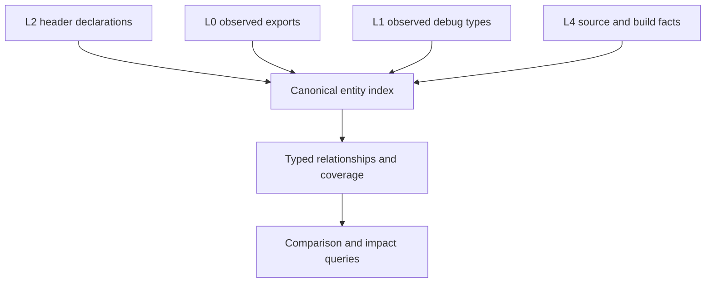

# Evidence entity model — one identity, explicit joins, typed coverage

**Origin:** An architecture review (2026-09-23) of how the L2 snapshot, the
header graph (`buildsource/header_graph.py`), and the public-surface graph
(`compare/surface_graph.py`) relate. Finding: abicheck has a rich L2
snapshot and a useful dependency graph, but they are **not yet one
consistently identified, queryable evidence model**.

**ADR:** none new. This plan finishes goals [ADR-063](../adr/063-one-semantic-pipeline.md)
already states (Phase 2 identity, Phase 3 "public surface as a graph query",
Phase 6 `SemanticIR`) and reuses the release-contract model of ADR-065 and
the "one contract, many providers" section of `AGENTS.md`. A phase that
changes a snapshot or report schema needs an ADR-063 amendment first.

**Type:** Initiative plan (cross-cutting: `model/`, `extract/`, `compare/`,
`buildsource/`, `storage/`).

**Effort:** L–XL overall. Expect roughly 8–15 PRs. **Risk:** Phases 1 and 2
change node IDs and the snapshot schema (`SCHEMA_VERSION` bump, golden-file
churn). Phases 0, 4 and 5 are additive.

**Relationship to other plans:** [One Semantic Pipeline](one-semantic-pipeline.md)
owns the IR and identity primitives. This plan owns *using them as the one
join key* across L0/L1/L2/L4 evidence. [Storage format v2](storage-format-v2.md)
owns persistence. This plan keeps the versioned JSON snapshot as the
external baseline format and does not propose replacing it.

## Problem

| # | Gap | Consequence |
|---|-----|-------------|
| 1 | **Entity identity.** The header graph and the public-surface builder can represent one declaration under different node IDs. `surface_graph.py` uses the parse-time `entity_id` when present and otherwise falls back to approximate `decl://`/`type://` IDs. Its own module docstring defers unifying the schemes to "a later phase". | A shared graph container does not guarantee that evidence joins onto one entity. Nodes can be duplicated, and cross-layer queries have to reconcile IDs themselves. |
| 2 | **Implicit L0/L1 ↔ L2 joins.** Ordinary L2 graphs hold header and type relationships. Exports and debug facts live in separate snapshot sections, or as per-declaration `Fact[bool]`s (`model/surface_facts.py`). Rich source↔symbol↔debug joins exist only with L4 evidence. | A graph traversal alone cannot answer "which public declaration is backed by this export and this debug type?" |
| 3 | **Scope and ownership.** Public/internal classification comes from header roots plus provenance. An include edge is a different fact. No graph-level owner says which package, component or namespace promises a declaration. | A release-wide header tree compared with one member binary can produce misleading public-vs-export findings (MKL/oneDAL). The release fan-out already solves this through `model/release_surface.py`, but graph queries cannot see that model. |
| 4 | **Coverage per relationship.** Coverage is tracked per extractor pass (`docs/learn/graph-coverage.md`). A generic query must interpret passes itself. | "No edge" is easily read as "no dependency", especially when comparing L2 with L4. |
| 5 | **Derived vs. observed edges.** `_add_export_edges` in `compare/surface_graph.py` emits `exports` edges from a declaration's *own linker name*. They are not matched against the observed export table, as the helper's docstring says. | Edges that look alike carry very different authority. A persisted derived edge can go stale relative to the snapshot records it was projected from. |
| 6 | **Cost of materialization.** The snapshot, graph nodes/edges, merge facts and indexes are all Python objects. `service_header_graph_attach.py` already skips a population pass after measuring it as 44–71% slower on small cases. | "Put everything in the graph" could worsen the oneDAL memory problem, however well the JSON compresses. |

## Goal

One **canonical entity index**, fed by separate evidence producers. Queries
run over typed relationships that carry their evidence class and coverage.

"Fed by" never forces a match. An ambiguous or absent join stays a
first-class state. A public inline declaration may have no export, and an
export may have no known public declaration. Both are valid.

### Invariants (the acceptance contract)

- **I1 — one ID per entity.** Every producer that names a declaration or type
  resolves it through the same identity function (ADR-063 `EntityId`/
  `OccurrenceId`). Two producers that see the same declaration yield the
  same node ID. An entity with no resolvable identity gets an explicit
  `unresolved` node, never an approximate one that silently collides.
- **I2 — joins are evidence, not name equality.** A declaration's mangled
  name is never treated as proof of an observed export. Every cross-layer
  edge records its join state: `matched`, `ambiguous` (with candidates) or
  `unmatched`.
- **I3 — every edge kind declares its evidence class:** `observed` (an
  extractor saw it), `resolved_join` (two observations were joined under a
  stated rule) or `derived` (a projection of snapshot records). Each class
  names its producer, inputs, and recomputation rule. A `derived` edge is
  recomputed from the records, never trusted when persisted.
- **I4 — absence is typed.** A query for edge kind *K* in scope *S* returns
  `present`, `proven_absent` or `unknown`. `proven_absent` requires the
  producer of *K* to have covered *S*.
- **I5 — the contract is modelled once.** Public roots and any namespace
  selection are explicit contract inputs. Declarations and exports relate to
  providers through the existing release-surface model rather than a second
  one.
- **I6 — materialization is opt-in until measured.** No graph view becomes
  unconditional without a peak-RSS and latency measurement on a real
  large-product dump.

## Phases

Ordered by how many incorrect conclusions each phase prevents, not by size.

| Phase | Scope | Size | Depends on |
|---|---|---|---|
| **0 — Evidence-class retag** | Add an evidence-class attribute to the surface-graph edge kinds. Rename or retag the linker-name `exports` edge as `derived` (for example `declares_linker_name`). Keep the name `exports` free for a future observed join. Update `tests/test_compare_surface_graph.py`. No schema change unless graph edges are persisted; check first. | S | — |
| **1 — Identity invariants** | Small L2/L0/L1 fixtures stating I1 as property tests (the same declaration seen via castxml, clang, DWARF, and the export table → one node). Then route `surface_graph.py` and `header_graph.py` node IDs through `semantic_ir`/`EntityId`, with explicit alias and unresolved nodes. Migrate readers in the same PR as producers. | L | ADR-063 Phase 2/6 |
| **2 — Explicit cross-layer joins** | An observed `exports` join (export table → entity, via `model/export_index.py`'s projection) and an L1 debug-type → entity join, each carrying I2 join states. Replaces the per-query reconciliation readers do today. | M–L | 1 |
| **3 — Ownership in the graph** | Expose `model/release_surface.py` providers and contract inputs (public roots, namespace selection) as graph-level owner relations. Wiring, not new design. | M | 1 |
| **4 — Coverage-aware queries** | A query API returning I4's three-valued answer per edge kind and scope, built on the existing per-pass coverage records and `Fact` statuses. | M | 0, 2 |
| **5 — Measure, then decide materialization** | Profile a real large-product (oneDAL-class) dump with `ABICHECK_MEMORY_TRACE` and `scripts/bench_release_memory.py`: snapshot vs. graph vs. index cost. Decide which views to persist, which to compute on demand, and whether to use compact tables or lazy section loading (storage v2 Phase 2). | S to measure; follow-up TBD | — (can run in parallel) |

Phases 0 and 5 are independent and small, so they can start now. Phase 5's
numbers should inform Phases 1–2 before those choose what to materialize.

## Tests

- Phase 1 needs primitive-level property tests of the identity function
  (order-independence, no merge without shared identity evidence, no
  collision of an unresolved node onto a resolved one), per `AGENTS.md`'s
  "Primitive-level property tests".
- Phase 2 needs fixtures for each join state: a public inline declaration
  with no export (`unmatched`, not a missing export), an export with no
  declaration, and two declarations competing for one export (`ambiguous`).
- Phase 4 needs an oracle test: an edge kind whose producer did not run
  answers `unknown` and never `proven_absent`.

## Out of scope

- Replacing the JSON snapshot format. Storage optimization follows once
  I1–I4 settle the semantics.
- Expanding the graph vocabulary beyond what I1–I5 require.
- Function/variable identity for PDB/BTF/CTF (ADR-063 Phase 6's documented
  gap). Phase 1 treats such entities as `unresolved` rather than inventing
  identity.

## Phase 5 measurements

Measured 2026-09-23/24 with `scripts/bench_graph_materialization.py`
(instrumentation only; no production behavior changed).

### What was measured

- **Operands:** real oneDAL, `libonedal_core.so.3` (113 MB) from PyPI
  `daal`/`daal-include` **2025.10.0 vs 2025.11.0**. Public header
  `daal.h` through a one-line `daal_all.hpp` wrapper (the CLI has no
  language flag and a `.h` root parses as C), `-I include -I include/dal`.
  Default castxml backend; the header graph uses the separate clang pass.
- **Host:** 4 vCPU, 15 GiB, Linux 6.18, Python 3.13, castxml 0.7.0.
- **Variants:** `none` (`_HEADER_GRAPH_ENABLED`/`_INCLUDES_ENABLED` off),
  `graph` (today's default attach), `graph+facts` (plus
  `build_public_surface_facts`, the pass `_attach_header_graph` skips; the
  populated graph is what gets serialized).
- **Steps**, each in its own process with cold private `ABICHECK_CACHE_DIR`
  and `XDG_CACHE_HOME`: `dump` OLD, `dump` NEW, stored/stored `compare`.
  Three repeats. A fourth, separate run per variant used
  `ABICHECK_MEMORY_TRACE_TRACEMALLOC` for attribution only.

### Results (mean of 3; ± is max deviation from the mean)

| Variant | Dump s (per side) | Dump parent RSS | Compare s | Compare parent RSS |
|---|---|---|---|---|
| `none` | 37.6 ± 0.7 | 683 MiB | 111.0 ± 0.6 | 738 MiB |
| `graph` | 119.0 ± 8 | 1,481 MiB | 222.6 ± 5 | 1,756 MiB |
| `graph+facts` | 147.6 ± 9 | 2,216 MiB | 312.2 ± 17 | 2,720 MiB |

Peak RSS varied by < 6 MiB across repeats. Process-tree RSS and PSS equal
parent RSS within 5 MiB in every run (tree PSS ≈ parent − 4 MiB): the cost
is Python in the abicheck process, not a child compiler. Cgroup
`memory.current` peak minus its launch value was 792 / 2,675 / 3,370 MiB
for the three dumps in the first repeat, but drifted down by up to 1.6 GB
in later repeats as the container's page cache grew. It is reported but
not relied on. `memory.peak` is the cgroup's lifetime maximum and cannot
be attributed to one run at all.

| Variant | Nodes | Edges | Snapshot raw | Snapshot zstd-3 | Graph section (compact / zstd-3) |
|---|---|---|---|---|---|
| `none` | 0 | 0 | 110 MB | 1.46 MB | — |
| `graph` | 49,872 | 102,388 | 251 MB | 4.59 MB | 79 MB / 2.81 MB |
| `graph+facts` | 111,232 | 180,151 | 364 MB | 6.99 MB | 142 MB / 4.83 MB |

`graph` nodes: 39,734 `source_decl`, 9,442 `record_type`, 532 `header`,
164 `file`. The facts pass adds 29,109 `declaration`, 29,109 `symbol` and
3,142 `type` nodes, plus 31,801 `declares`, 16,853 `references` and 29,109
`exports` edges. That is one derived `symbol` node and `exports` edge per
declaration with a linker name (gap 5), and a second node for each
declaration the header graph already holds as a `source_decl` (gap 1).

### Attribution (tracemalloc run, dump OLD)

- The header-graph attach took ~55–57 s of the ~119 s `graph` dump. Of
  that, ~220 s under tracemalloc (proportionally ~48 s untraced) is
  streaming the clang AST, with a 677 MiB Python allocation peak inside
  the streaming projection. The graph build itself is ~16 s.
- The retained graph is **~132 MiB of Python allocations** (193 MiB phase
  peak) and grows live objects from 0.95 M to 1.66 M.
- `build_public_surface_facts` takes 3.8 s untraced and retains
  **another ~78 MiB** (333 MiB phase peak), taking live objects to 2.36 M.
- The rest of the RSS difference (~800 MiB per dump for `graph`, a further
  ~735 MiB for `facts`) is the serialized JSON, whose raw size grows 2.3×
  and 3.3×, plus allocator arenas that are not returned after the AST
  stream. It is not held by the graph objects.
- In `compare`, the graph is paid for twice: decoding two 79–142 MB graph
  sections and diffing them. That doubles compare time (+112 s) and adds
  ~1 GiB RSS; the facts add a further +90 s and ~960 MiB. The comparison
  verdict came out the same (exit 0) in all three variants.

### Recommendation

1. **Do not make `build_public_surface_facts` unconditional, and do not
   persist its output** (I6 fails for it). It adds 30% dump time,
   +735 MiB dump RSS, +40% compare time and +960 MiB compare RSS, for data
   that is a pure projection of snapshot records. By I3 such data must
   be recomputed rather than trusted when persisted anyway. Compute it on
   demand for the query that needs it, as
   `policy.public_surface_closure` already does.
2. **The persisted header graph is the real cost and should become a view,
   not an always-on section.** On oneDAL it roughly triples dump time,
   doubles dump RSS, and doubles compare time and RSS. Most of that is
   JSON encode/decode of a 79 MB section, not the 132 MiB live graph.
   Phases 1–2 should not add node kinds to it until the cost is cut:
   - **Lazy section loading (storage v2 Phase 2) is warranted.** A
     compare that does not query the graph should not decode it. That
     alone removes most of the +112 s / +1 GiB compare delta.
   - **Compact tables are warranted for the graph section.** It
     compresses 28:1 (79 MB → 2.8 MB zstd), i.e. it is dominated by
     repeated IDs and keys, which interned, columnar node/edge tables
     remove.
   - Phase 1 (one ID per entity) should *remove* the duplicate
     `declaration`/`source_decl` nodes rather than add a third ID scheme.
     That is also a size win.
3. **Keep observed evidence persisted, derive the rest.** Persist nodes and
   edges an extractor observed (header, include, type and call passes),
   since recomputing them needs the clang AST, which costs ~50 s here.
   Compute `derived` edges (`exports`-from-linker-name,
   `declares`/`references` projections) on demand from the snapshot.
4. **Re-measure before any unconditional change** with the same script on
   the multi-library oneDAL release (`libonedal.so`, `libonedal_dpc.so`),
   where member count multiplies these figures.
