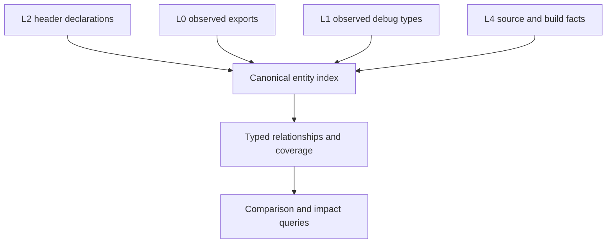

# Evidence entity model — one identity, explicit joins, typed coverage

**Origin:** An architecture review (2026-09-23) of how the L2 snapshot, the
header graph (`buildsource/header_graph.py`), and the public-surface graph
(`compare/surface_graph.py`) relate. Finding: abicheck has a rich L2
snapshot and a useful dependency graph, but they are **not yet one
consistently identified, queryable evidence model**.

**ADR:** none new. This plan finishes goals [ADR-063](../adr/063-one-semantic-pipeline.md)
already states (Phase 2 identity, Phase 3 "public surface as a graph query",
Phase 6 `SemanticIR`) and reuses the release-contract model of ADR-065 and
the "one contract, many providers" section of `AGENTS.md`. A phase that
changes a snapshot or report schema needs an ADR-063 amendment first.

**Type:** Initiative plan (cross-cutting: `model/`, `extract/`, `compare/`,
`buildsource/`, `storage/`).

**Effort:** L–XL overall. Expect roughly 8–15 PRs. **Risk:** Phases 1 and 2
change node IDs and the snapshot schema (`SCHEMA_VERSION` bump, golden-file
churn). Phases 0, 4 and 5 are additive.

**Relationship to other plans:** [One Semantic Pipeline](one-semantic-pipeline.md)
owns the IR and identity primitives. This plan owns *using them as the one
join key* across L0/L1/L2/L4 evidence. [Storage format v2](storage-format-v2.md)
owns persistence. This plan keeps the versioned JSON snapshot as the
external baseline format and does not propose replacing it.

## Problem

| # | Gap | Consequence |
|---|-----|-------------|
| 1 | **Entity identity.** The header graph and the public-surface builder can represent one declaration under different node IDs. `surface_graph.py` uses the parse-time `entity_id` when present and otherwise falls back to approximate `decl://`/`type://` IDs. Its own module docstring defers unifying the schemes to "a later phase". | A shared graph container does not guarantee that evidence joins onto one entity. Nodes can be duplicated, and cross-layer queries have to reconcile IDs themselves. |
| 2 | **Implicit L0/L1 ↔ L2 joins.** Ordinary L2 graphs hold header and type relationships. Exports and debug facts live in separate snapshot sections, or as per-declaration `Fact[bool]`s (`model/surface_facts.py`). Rich source↔symbol↔debug joins exist only with L4 evidence. | A graph traversal alone cannot answer "which public declaration is backed by this export and this debug type?" |
| 3 | **Scope and ownership.** Public/internal classification comes from header roots plus provenance. An include edge is a different fact. No graph-level owner says which package, component or namespace promises a declaration. | A release-wide header tree compared with one member binary can produce misleading public-vs-export findings (MKL/oneDAL). The release fan-out already solves this through `model/release_surface.py`, but graph queries cannot see that model. |
| 4 | **Coverage per relationship.** Coverage is tracked per extractor pass (`docs/learn/graph-coverage.md`). A generic query must interpret passes itself. | "No edge" is easily read as "no dependency", especially when comparing L2 with L4. |
| 5 | **Derived vs. observed edges.** `_add_export_edges` in `compare/surface_graph.py` emits `exports` edges from a declaration's *own linker name*. They are not matched against the observed export table, as the helper's docstring says. | Edges that look alike carry very different authority. A persisted derived edge can go stale relative to the snapshot records it was projected from. |
| 6 | **Cost of materialization.** The snapshot, graph nodes/edges, merge facts and indexes are all Python objects. `service_header_graph_attach.py` already skips a population pass after measuring it as 44–71% slower on small cases. | "Put everything in the graph" could worsen the oneDAL memory problem, however well the JSON compresses. |

## Goal

One **canonical entity index**, fed by separate evidence producers. Queries
run over typed relationships that carry their evidence class and coverage.

"Fed by" never forces a match. An ambiguous or absent join stays a
first-class state. A public inline declaration may have no export, and an
export may have no known public declaration. Both are valid.

### Invariants (the acceptance contract)

- **I1 — one ID per entity.** Every producer that names a declaration or type
  resolves it through the same identity function
  (`model/graph_entity_identity.py`, whose keys are in bijection with the
  linker-name tiers of ADR-063's `EntityId`; see "Phase 1 — landed"). Two producers that see the same declaration yield the
  same node ID. An entity with no resolvable identity gets an explicit
  `unresolved` node, never an approximate one that silently collides.
- **I2 — joins are evidence, not name equality.** A declaration's mangled
  name is never treated as proof of an observed export. Every cross-layer
  edge records its join state: `matched`, `ambiguous` (with candidates) or
  `unmatched`.
- **I3 — every edge kind declares its evidence class:** `observed` (an
  extractor saw it), `resolved_join` (two observations were joined under a
  stated rule) or `derived` (a projection of snapshot records). Each class
  names its producer, inputs, and recomputation rule. A `derived` edge is
  recomputed from the records, never trusted when persisted.
- **I4 — absence is typed.** A query for edge kind *K* in scope *S* returns
  `present`, `proven_absent` or `unknown`. `proven_absent` requires the
  producer of *K* to have covered *S*.
- **I5 — the contract is modelled once.** Public roots and any namespace
  selection are explicit contract inputs. Declarations and exports relate to
  providers through the existing release-surface model rather than a second
  one.
- **I6 — materialization is opt-in until measured.** No graph view becomes
  unconditional without a peak-RSS and latency measurement on a real
  large-product dump.

## Phases

Ordered by how many incorrect conclusions each phase prevents, not by size.

| Phase | Scope | Size | Depends on |
|---|---|---|---|
| **0 — Evidence-class retag** (**landed**: `model/graph_evidence_class.py`'s `EdgeEvidenceClass`, `compare/surface_graph.py`'s `EDGE_EVIDENCE_CLASS`; the linker-name edge is now `declares_linker_name`/`derived`; builder edges were confirmed not persisted — production never writes them into `AbiSnapshot.surface_graph` — so no schema change) | Add an evidence-class attribute to the surface-graph edge kinds. Rename or retag the linker-name `exports` edge as `derived` (for example `declares_linker_name`). Keep the name `exports` free for a future observed join. Update `tests/test_compare_surface_graph.py`. No schema change unless graph edges are persisted; check first. | S | — |
| **1 — Identity invariants** (**landed**: `model/graph_entity_identity.py` is the one node-id function for every declaration/type graph producer; see [Phase 1 — landed](#phase-1-landed)) | Small L2/L0/L1 fixtures stating I1 as property tests (the same declaration seen via castxml, clang, DWARF, and the export table → one node). Then route `surface_graph.py` and `header_graph.py` node IDs through `semantic_ir`/`EntityId`, with explicit alias and unresolved nodes. Migrate readers in the same PR as producers. | L | ADR-063 Phase 2/6 |
| **2 — Explicit cross-layer joins** | An observed `exports` join (export table → entity, via `model/export_index.py`'s projection) and an L1 debug-type → entity join, each carrying I2 join states. Replaces the per-query reconciliation readers do today. | M–L | 1 |
| **3 — Ownership in the graph** | Expose `model/release_surface.py` providers and contract inputs (public roots, namespace selection) as graph-level owner relations. Wiring, not new design. | M | 1 |
| **4 — Coverage-aware queries** | A query API returning I4's three-valued answer per edge kind and scope, built on the existing per-pass coverage records and `Fact` statuses. | M | 0, 2 |
| **5 — Measure, then decide materialization** (**landed**: measured in "Phase 5 measurements"; its Recommendations 2–4 landed as 5a–5d below) | Profile a real large-product (oneDAL-class) dump with `ABICHECK_MEMORY_TRACE` and `scripts/bench_release_memory.py`: snapshot vs. graph vs. index cost. Decide which views to persist, which to compute on demand, and whether to use compact tables or lazy section loading (storage v2 Phase 2). | S to measure; follow-up TBD | — (can run in parallel) |
| **5a — Lazy graph-section loading** (**landed**) | storage-format-v2 Phase 2 A2.1 for the `graph` section: decoded on first read of `surface_graph` / `build_source.source_graph` (`model/lazy_graph.py`). A default compare still reads the graph; the L5 diff was deliberately not gated (ADR-062 D8 note). | S | 5 |
| **5b — Compact graph tables** (**landed**, schema v49) | `storage/graph_table_codec.py`: interned, columnar node/edge tables; pre-v49 graphs still load. ADR-063 D5 amended. | M | 5 |
| **5c — Persist observed, derive the rest** (**landed**) | No loader-rederived field and no public-surface-builder projection (`RECOMPUTABLE_FACT_PRODUCERS`) is stored; projections are rebuilt on demand. | S | 5b |
| **5d — Re-measure, incl. the multi-library release** (**landed**) | `scripts/bench_graph_materialization.py` per item and on `libonedal.so` + `libonedal_dpc.so` (release mode). Results in "Phase 5 follow-up measurements". | S | 5a–5c |

Phases 0 and 5 are independent and small, so they can start now. Phase 5's
numbers should inform Phases 1–2 before those choose what to materialize.

## Phase 1 — landed

Landed in [abicheck/abicheck#1358](https://github.com/abicheck/abicheck/pull/1358)
(ADR-063 amended, D3 "graph node identity"). Phases 2 and 3 are now
unblocked: both join onto the one key this phase established.

### ID schemes before and after

| Scheme | Producer | Readers | Before | After |
|---|---|---|---|---|
| Header-graph declaration seed | `buildsource/header_graph.py` `seed_decl` | L5 findings, `graph_reconcile`, `cli_graph` | `decl://<mangled or bare name>`; a castxml ctor/dtor placeholder used as if it were a linker name; unmangled overloads collapsed onto `decl://<name>` | `snapshot_identities()` table: `decl://<linker name>`, else explicit `unresolved://` |
| AST replay declarations | `model.source_graph.function_decl_identity` (call/type/override/macro/template graphs, `source_edges`) | same | C linkage keyed `decl://<qualified>#sha256:<qualType>`, so it never met its header node | delegates to `declaration_key`: the linker name whenever clang reported one (`mangledName == name` is the C-linkage symbol); unmangled fallback unchanged |
| L4 source-ABI fold | `buildsource/source_graph_build_source_abi.py` | same | `decl://SourceEntity.identity()` (C linkage: `qualified#hash`, linker name blanked by the extractor) | `source_entity_decl_node_id`: linker name from `mangled_name` or the new `names["linker"]`; the `identity()` spelling recorded as an alias |
| Flat header-graph types (no clang AST) | `header_graph._seed_flat_type_node` / `_flat_structural_type_edges` | L5 findings | `type://<bare leaf>`: `ns::W`/`other::W` one node | `type://<qualified>`; a spelling two declarations share becomes two `unresolved://` nodes |
| AST / L4 types | `header_graph_ast_projection`, `type_graph`, L4 fold | same | `type://<clang qualified name>` | unchanged (= `type_identity`) |
| Public-surface builder | `compare/surface_graph.py` | `policy/public_surface_closure.py`, `export_surface.py` | `EntityId.key`, fallback `declaration::`/`type::`/`typedef::` (`_approximate_node_id`); kinds `declaration`/`type` | same `snapshot_identities()` table as the header graph; kinds `source_decl`/`record_type`/`enum_type`/`typedef`; readers look ids up via `ReferencedIdentifiers.node_id()`. `_approximate_node_id` and `node_id_for_*` deleted |
| Second spellings | (none) | — | a second node | `SourceGraphSummary.identity_aliases` (Mach-O decoration, L4 legacy `identity()`), persisted |
| `EntityId.key` / `OccurrenceId` | header-AST producers | diff matching, `finding_identity`, `semantic_ir` | also a surface-graph node id | unchanged, no longer a graph node id |
| ADR-048 `CanonicalIdentity`, ADR-046 `EntityResolver` | `model/entity_identity.py`, `SourceGraphSummary.resolve_entities` | `graph_reconcile`, `graph_impact` | reconciliation keys derived from a node | unchanged: derived from nodes, not node ids |
| `finding_identity` | `finding_identity.py` | dedup, reports | finding ids | unchanged (not graph identity) |
| Kythe/CodeQL ingest | `buildsource/graph_backends.py` | L5 | `decl://<VName signature>` | unchanged; see gaps |
| Symbols | surface builder / L4 | — | `symbol://`, `binary_symbol://` | unchanged (Phase 2) |
| AST-seeded bare names (`type_graph._decl_identity`, `call_graph._identity`) | AST passes | the passes' own resolution indexes | index keys, not node ids | unchanged |

### What landed

- **Tests first** (strict xfail, then flipped): `tests/test_graph_identity_invariants.py`
  (header graph + surface builder over one graph: one node per declaration,
  overloads/namespaced/inline-namespace types kept apart, explicit
  `unresolved`, Mach-O alias, L4 join, input-order independence),
  `tests/test_graph_identity_invariants_integration.py` (one header dumped
  through castxml, clang and hybrid: one id per entity, identical across
  frontends), `tests/test_graph_entity_identity.py` (hypothesis properties of
  the identity function against generated ground truth).
- **One identity function**, `model/graph_entity_identity.py`: linker name,
  else `qualified#signature` (non-callables: `qualified`), else
  `unresolved://`; types by qualified name; typedefs in the type space except
  a C tag-namespace clash; `UnresolvedOccurrences` keeps identical unresolved
  evidence apart; `snapshot_identities()` is the table both L2 producers read.
- **Storage**: snapshot schema v50, `SourceGraphSummary.schema_version` 3,
  persisted `identity_aliases`. Old ids cannot be rewritten from what a stored
  graph carries (the AST `qualType` behind a signature hash; the scope a
  bare-leaf node stood for), so a pre-v3/v3 graph pair is reported *not
  compared* (`compare/source_graph_identity_scheme.py`, on the L5 coverage row
  and as a warning) rather than diffed.

### Measured on oneDAL

Same setup as the Phase 5 measurements below (`libonedal_core.so.3`, PyPI
`daal`/`daal-include` 2025.10.0 vs 2025.11.0, `scripts/bench_graph_materialization.py`),
one repeat per variant, `main` at `87731bc` vs this phase:

| Variant | Measure | Before | After |
|---|---|---|---|
| `graph+facts` | nodes | 110,907 | 69,288 |
| `graph+facts` | graph section (compact / zstd-3) | 136.4 / 4.71 MB | 120.8 / 4.20 MB |
| `graph+facts` | snapshot raw | 353.0 MB | 326.7 MB |
| `graph+facts` | dump parent RSS | 2,157 MiB | 1,946 MiB |
| `graph+facts` | compare | 367 s / 2,656 MiB | 331 s / 2,383 MiB |
| `graph` (default) | nodes | 49,523 | 49,264 |
| `graph` (default) | graph section (compact / zstd-3) | 74.4 / 2.70 MB | 75.6 / 2.81 MB |

- The 29,109 `declaration` and 3,142 `type` duplicates are gone. `symbol`
  nodes fall from 29,109 to 18,249, because only resolved declarations get a
  linker-name node.
- In the default graph, 259 C-linkage `decl://<name>`/`decl://<name>#sha256:…`
  pairs merged into one node each.
- The default graph section is 1.6% larger. About 11.6k castxml ctor/dtor
  placeholder nodes are now explicit `unresolved://` nodes: a longer prefix
  plus an `identity` attr. A first cut that also packed the `EntityId` key
  into those ids measured 81.4 MB and was trimmed.
- Both comparisons report the same 5,078 artifact-backed findings.

### Remaining documented gaps

- PDB/BTF/CTF function/variable identity stays `unresolved` (ADR-063 Phase 6):
  no linker name reaches those records here.
- A castxml-only constructor/destructor (synthetic placeholder, no mangling)
  is `unresolved` and does not join clang's mangled node for the same
  constructor; only a hybrid dump, which reconciles the two, joins them.
- castxml drops an inline-namespace segment (`ns::S` vs clang `ns::v1::S`);
  per G15 the two stay separate without further evidence.
- Kythe/CodeQL-ingested nodes keep their VName-signature ids.
- The DWARF (L1) and export-table (L0) sides of I1 are Phase 2's joins onto
  this key; this phase covers the L2 header-AST producers and L4/L5 replay.

## Tests

- Phase 1 needs primitive-level property tests of the identity function
  (order-independence, no merge without shared identity evidence, no
  collision of an unresolved node onto a resolved one), per `AGENTS.md`'s
  "Primitive-level property tests".
- Phase 2 needs fixtures for each join state: a public inline declaration
  with no export (`unmatched`, not a missing export), an export with no
  declaration, and two declarations competing for one export (`ambiguous`).
- Phase 4 needs an oracle test: an edge kind whose producer did not run
  answers `unknown` and never `proven_absent`.

## Out of scope

- Replacing the JSON snapshot format. Storage optimization follows once
  I1–I4 settle the semantics.
- Expanding the graph vocabulary beyond what I1–I5 require.
- Function/variable identity for PDB/BTF/CTF (ADR-063 Phase 6's documented
  gap). Phase 1 treats such entities as `unresolved` rather than inventing
  identity.

## Phase 5 measurements

Measured 2026-09-23/24 with `scripts/bench_graph_materialization.py`
(instrumentation only; no production behavior changed).

### What was measured

- **Operands:** real oneDAL, `libonedal_core.so.3` (113 MB) from PyPI
  `daal`/`daal-include` **2025.10.0 vs 2025.11.0**. Public header
  `daal.h` through a one-line `daal_all.hpp` wrapper (the CLI has no
  language flag and a `.h` root parses as C), `-I include -I include/dal`.
  Default castxml backend; the header graph uses the separate clang pass.
- **Host:** 4 vCPU, 15 GiB, Linux 6.18, Python 3.13, castxml 0.7.0.
- **Variants:** `none` (`_HEADER_GRAPH_ENABLED`/`_INCLUDES_ENABLED` off),
  `graph` (today's default attach), `graph+facts` (plus
  `build_public_surface_facts`, the pass `_attach_header_graph` skips; the
  populated graph is what gets serialized).
- **Steps**, each in its own process with cold private `ABICHECK_CACHE_DIR`
  and `XDG_CACHE_HOME`: `dump` OLD, `dump` NEW, stored/stored `compare`.
  Three repeats. A fourth, separate run per variant used
  `ABICHECK_MEMORY_TRACE_TRACEMALLOC` for attribution only.

### Results (mean of 3; ± is max deviation from the mean)

| Variant | Dump s (per side) | Dump parent RSS | Compare s | Compare parent RSS |
|---|---|---|---|---|
| `none` | 37.6 ± 0.7 | 683 MiB | 111.0 ± 0.6 | 738 MiB |
| `graph` | 119.0 ± 8 | 1,481 MiB | 222.6 ± 5 | 1,756 MiB |
| `graph+facts` | 147.6 ± 9 | 2,216 MiB | 312.2 ± 17 | 2,720 MiB |

Peak RSS varied by < 6 MiB across repeats. Process-tree RSS and PSS equal
parent RSS within 5 MiB in every run (tree PSS ≈ parent − 4 MiB): the cost
is Python in the abicheck process, not a child compiler. Cgroup
`memory.current` peak minus its launch value was 792 / 2,675 / 3,370 MiB
for the three dumps in the first repeat, but drifted down by up to 1.6 GB
in later repeats as the container's page cache grew. It is reported but
not relied on. `memory.peak` is the cgroup's lifetime maximum and cannot
be attributed to one run at all.

| Variant | Nodes | Edges | Snapshot raw | Snapshot zstd-3 | Graph section (compact / zstd-3) |
|---|---|---|---|---|---|
| `none` | 0 | 0 | 110 MB | 1.46 MB | — |
| `graph` | 49,872 | 102,388 | 251 MB | 4.59 MB | 79 MB / 2.81 MB |
| `graph+facts` | 111,232 | 180,151 | 364 MB | 6.99 MB | 142 MB / 4.83 MB |

`graph` nodes: 39,734 `source_decl`, 9,442 `record_type`, 532 `header`,
164 `file`. The facts pass adds 29,109 `declaration`, 29,109 `symbol` and
3,142 `type` nodes, plus 31,801 `declares`, 16,853 `references` and 29,109
`exports` edges. That is one derived `symbol` node and `exports` edge per
declaration with a linker name (gap 5), and a second node for each
declaration the header graph already holds as a `source_decl` (gap 1).

### Attribution (tracemalloc run, dump OLD)

- The header-graph attach took ~55–57 s of the ~119 s `graph` dump. Of
  that, ~220 s under tracemalloc (proportionally ~48 s untraced) is
  streaming the clang AST, with a 677 MiB Python allocation peak inside
  the streaming projection. The graph build itself is ~16 s.
- The retained graph is **~132 MiB of Python allocations** (193 MiB phase
  peak) and grows live objects from 0.95 M to 1.66 M.
- `build_public_surface_facts` takes 3.8 s untraced and retains
  **another ~78 MiB** (333 MiB phase peak), taking live objects to 2.36 M.
- The rest of the RSS difference (~800 MiB per dump for `graph`, a further
  ~735 MiB for `facts`) is the serialized JSON, whose raw size grows 2.3×
  and 3.3×, plus allocator arenas that are not returned after the AST
  stream. It is not held by the graph objects.
- In `compare`, the graph is paid for twice: decoding two 79–142 MB graph
  sections and diffing them. That doubles compare time (+112 s) and adds
  ~1 GiB RSS; the facts add a further +90 s and ~960 MiB. The comparison
  verdict came out the same (exit 0) in all three variants.

### Recommendation

1. **Do not make `build_public_surface_facts` unconditional, and do not
   persist its output** (I6 fails for it). It adds 30% dump time,
   +735 MiB dump RSS, +40% compare time and +960 MiB compare RSS, for data
   that is a pure projection of snapshot records. By I3 such data must
   be recomputed rather than trusted when persisted anyway. Compute it on
   demand for the query that needs it, as
   `policy.public_surface_closure` already does.
2. **The persisted header graph is the real cost and should become a view,
   not an always-on section.** On oneDAL it roughly triples dump time,
   doubles dump RSS, and doubles compare time and RSS. Most of that is
   JSON encode/decode of a 79 MB section, not the 132 MiB live graph.
   Phases 1–2 should not add node kinds to it until the cost is cut:
   - **Lazy section loading (storage v2 Phase 2) is warranted.** A
     compare that does not query the graph should not decode it. That
     alone removes most of the +112 s / +1 GiB compare delta.
   - **Compact tables are warranted for the graph section.** It
     compresses 28:1 (79 MB → 2.8 MB zstd), i.e. it is dominated by
     repeated IDs and keys, which interned, columnar node/edge tables
     remove.
   - Phase 1 (one ID per entity) should *remove* the duplicate
     `declaration`/`source_decl` nodes rather than add a third ID scheme.
     That is also a size win.
3. **Keep observed evidence persisted, derive the rest.** Persist nodes and
   edges an extractor observed (header, include, type and call passes),
   since recomputing them needs the clang AST, which costs ~50 s here.
   Compute `derived` edges (`exports`-from-linker-name,
   `declares`/`references` projections) on demand from the snapshot.
4. **Re-measure before any unconditional change** with the same script on
   the multi-library oneDAL release (`libonedal.so`, `libonedal_dpc.so`),
   where member count multiplies these figures.

## Phase 5 follow-up measurements (5a–5d)

Measured 2026-09-24 with `scripts/bench_graph_materialization.py` on the
same operands and invocation as "Phase 5 measurements" (PyPI
`daal`/`daal-include` 2025.10.0 vs 2025.11.0, `daal.h` through
`daal_all.hpp`, `-I include -I include/dal`), on a host of the same shape
(4 vCPU, 15 GiB, Python 3.13, castxml 0.7.0). One run per cell; every cell
was re-measured for the base commit on this host, so compare rows with each
other rather than with the earlier section's means. The script now imports
the checkout it lives in, so "base" is the script run from a worktree of the
pre-change commit.

### Single library (`libonedal_core.so.3`)

| Build | Variant | Dump s (old / new) | Dump parent RSS | Dump tree PSS | Compare s | Compare parent RSS | Compare tree PSS |
|---|---|---|---|---|---|---|---|
| base | `graph` | 161.1 / 162.6 | 1,481 MiB | 1,474 / 1,477 MiB | 301.2 | 1,757 MiB | 1,753 MiB |
| 5a | `graph` | 154.6 / 156.3 | 1,446 / 1,478 MiB | 1,441 / 1,473 MiB | 283.3 | 1,753 MiB | 1,748 MiB |
| 5b | `graph` | 125.9 / 123.6 | 961 / 958 MiB | 956 / 954 MiB | 176.8 | 1,002 MiB | 997 MiB |
| 5c | `graph` | 126.6 / 126.5 | 938 MiB | 934 / 933 MiB | 178.4 | 971 MiB | 966 MiB |
| base | `graph+facts` | 210.4 / 210.5 | 2,215 / 2,213 MiB | 2,210 / 2,208 MiB | 450.8 | 2,707 MiB | 2,702 MiB |
| 5c | `graph+facts` | 136.5 / 143.0 | 1,001 / 1,005 MiB | 997 / 1,001 MiB | 181.5 | 981 MiB | 976 MiB |

| Build | Variant | Snapshot raw | Snapshot zstd-3 | Graph section (compact / zstd-3) | Nodes / edges stored |
|---|---|---|---|---|---|
| base | `graph` | 250.6 MB | 4.59 MB¹ | 79.1 MB / 2.81 MB¹ | 49,872 / 102,388 |
| 5b | `graph` | 134.2 MB | 2.54 MB | 11.2 MB / 1.00 MB | 49,872 / 102,388 |
| 5c | `graph` | 125.9 MB | 2.46 MB | 9.8 MB / 0.95 MB | 49,872 / 102,388 |
| base | `graph+facts` | 356.2 MB | 6.97 MB | 138.3 MB / 4.81 MB | 111,232 / 180,151 |
| 5c | `graph+facts` | 125.9 MB | 2.46 MB | 9.8 MB / 0.95 MB | 49,872 / 102,388 |

¹ From the earlier "Phase 5 measurements" run (same operands); this host's
base snapshots were lost before their zstd size was read.

- **5a alone** saves ~4% of dump time (the shared graph is no longer
  encoded twice on save) and ~6% of compare time, with no RSS change. As
  the reader inventory predicted, a default compare still reads both graphs
  (L5 `diff_source_graph_findings`, the `private_header_leak` and
  `public_to_internal_dependency` cross-source checks, assurance
  `_graph_completeness`, the content digest), so it saves no decode on that
  path; a `--depth binary`/`debug` compare decodes nothing
  (`tests/test_lazy_graph_loading.py` observes this with a decoder spy).
- **5b** is the step change: the graph section shrinks 8× (79 → 11 MB) and
  the graph decode itself from 7.6 s to 4.7 s (interned tables plus a
  load-scoped identity-normalization memo). Dump time −22%, dump RSS −35%,
  compare time −41%, compare RSS −43% against base.
- **5c** removes the rest of the derived data (9.8 MB section). Its main
  effect is on `graph+facts`: the builder's projections are no longer
  persisted, so a graph with them saves to the same bytes as one without,
  and `graph+facts` compare falls from 451 s / 2.7 GiB to 182 s / 981 MiB.
- **Verdict and findings unchanged.** The base and 5c compare reports are
  identical after removing wall-clock fields and work-directory paths
  (2,675 findings, verdict `COMPATIBLE`), for `graph` and `graph+facts`.

### Multi-library release (`libonedal.so.3` + `libonedal_dpc.so.3`)

Header `oneapi/dal.hpp` through a one-line `dal_all.hpp` wrapper,
`-I include`, for both members (no SYCL macro, so the DPC library is
compared against the host API). Release mode dumps each member, compares
the stored directories, then runs the live directory compare.

| Build | Step | Seconds | Parent RSS | Tree PSS |
|---|---|---|---|---|
| base | `dump` per member (4) | 153.5–159.5 | 1,483–1,486 MiB | 1,479–1,481 MiB |
| 5c | `dump` per member (4) | 114.1–117.8 | 835–837 MiB | 831–833 MiB |
| base | stored/stored directory `compare` | 426.5 | 3,090 MiB | 3,085 MiB |
| 5c | stored/stored directory `compare` | 126.1 | 1,049 MiB | 1,044 MiB |
| base | live directory `compare` | 370.4 / 410.2² | 1,797 / 1,792 MiB | 1,792 / 1,787 MiB |
| 5c | live directory `compare` | 374.7 / 351.3² | 1,815 / 1,470 MiB | 1,811 / 1,465 MiB |

² Two runs each (the first release run of each build had no stored step).

- The stored release compare is where the member count multiplies the old
  cost: 3.4× faster and 2.9× less memory. Its report is identical to the
  base build's (both members `COMPATIBLE_WITH_RISK`, 1,993 and 2,928 risk
  findings).
- The **live** fan-out never serializes a graph, so 5a–5c cannot change it;
  the spread above is run-to-run noise.
- **The `ERROR` members were caused by the benchmark, not by the release
  workers.** In three of the four live runs above, one member (a different
  one each time) ended `ERROR` with CPython's `../Objects/tupleobject.c:911:
  bad argument to internal function`. That is `_PyTuple_Resize` refusing a
  tuple whose refcount is not 1. The extra reference came from this script's
  own attach hook, which recorded `len(gc.get_objects())` from inside each
  fan-out worker. That list references every GC-tracked object, including a
  tuple another worker is still building in `tuple(<generator>)` (the victim
  here was `qualified_name_segments_walk._walk_rewrite_strings`, during a
  member's dump). CPython 3.13 checks the eval breaker after a `CALL`, so the
  GIL can pass to the builder while that list is still alive. The census now
  goes through `memory_trace.gc_object_count()`, which returns `null` when
  any other Python thread exists. `tests/test_gc_census_thread_safety.py`
  holds the invariant and rejects any other first-party heap census.
  Measured on this host (4 vCPU, 15 GiB, cold caches, `graph` variant, this
  script's child):

  | Harness | Live runs | Runs with an `ERROR` member | Seconds per run |
  |---|---|---|---|
  | before (census in workers) | 4 | 2 (`libonedal.so.3`, then `libonedal_dpc.so.3`) | 204–211 |
  | after (`gc_object_count`) | 10 | 0 | 195–212 |
  | plain `abicheck compare` (no harness) | 6 | 0 | 177–276 |

  All ten post-fix reports equal the stored/stored directory compare of
  per-member dumps (122 s of dumps + 75 s of compare) after normalising the
  stored member names' `.json` suffix. Both members read
  `COMPATIBLE_WITH_RISK`, with identical findings. The fix costs nothing
  measurable, because the release path itself never changed.
- **Audit of state shared between release workers.** Checked: every
  `functools.lru_cache` on the member path (C-level, thread-safe, pure
  keys); the locked caches (`policy/type_spelling`,
  `compare/spelling_match_cache`, `compare/spelling_pattern_registry`,
  `model/graph_identity`'s normalize memo, `model/lazy_graph`'s decode-once
  lock, `extract/cache_header_scan`'s counters,
  `workflows/release_surface_acquisition`'s ledger); `compare/detection_memo`
  (a `ContextVar`, so per worker); and zstd (a fresh
  `ZstdCompressor`/`ZstdDecompressor` per call, never shared). The one
  unlocked candidate, `demangle`'s `_BATCH_CACHE_OK`/`_BATCH_CACHE_FAIL`
  (an `in`-then-`[]` read, and FIFO eviction), is safe on a GIL build: no
  eval-breaker point sits between those operations, so no other thread can
  run in the gap. A 6-thread stress test with the bound shrunk to 4 entries
  confirmed it. It would need a lock under free-threaded CPython, which CI
  does not run.

### Outcome against the recommendations

1. `build_public_surface_facts` stays opt-in and is never persisted (5c);
   I6 holds.
2. Lazy loading (5a) and compact tables (5b) landed for the `graph`
   section. With 5c, a `graph` dump on this host went from 162 s to 127 s
   and 1,481 to 938 MiB, and the graph section is 9.8 MB compact instead
   of 79 MB.
3. Observed evidence is persisted; derived fields and projections are
   recomputed (5c).
4. Re-measured on the multi-library release (5d, above).
