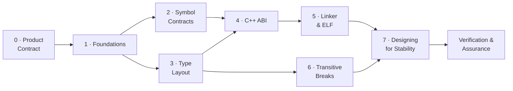

# ABI/API Compatibility — A Learning Series

This is the **conceptual hub** for understanding ABI/API compatibility — written
to *teach* the subject, not just catalog it. It is the front door to a nine-part
**learning series** that starts from first principles ("what is a symbol? what
does the loader do?") and builds up to the design patterns that keep a C/C++
shared library compatible across releases.

The series is for **two audiences at once**: developers who maintain or consume
shared libraries, and AI agents reasoning about whether a change is safe to ship.
Every break is explained as a *mechanism* — what the compiler baked in, what the
loader does, what byte moves — and then as a *fix*. abicheck's verdicts and
change kinds are woven in throughout, so the same page that teaches you *why* a
struct-field insertion corrupts memory also tells you what abicheck will report
when it sees one.

!!! tip "New to the topic? Don't start here — start with the on-ramp."
    This hub is a navigator: it maps the series, the deep-dive pages, and the
    break families, and points each to its own page (e.g. the evidence-model
    walk-through, [What Each Level Sees](what-each-level-sees.md)). If binary
    compatibility is new to you, read the five-minute on-ramp first and follow
    the series in order:

    1. [**ABI in Five Minutes**](abi-series/abi-in-5-minutes.md) — the gentlest introduction.
    2. [Part 0 — Compatibility as a Product Contract](abi-series/00-product-contract.md) — the framing.
    3. [Part 1 — Foundations](abi-series/01-foundations.md) — symbols, linking, the loader.

    Then come back here to navigate the rest of the series.

> **Looking for something faster?** For a 2-minute scannable card, see the
> [ABI Cheat Sheet](abi-cheat-sheet.md). For per-case runnable reproductions with
> code and a real failure demo, see the
> [Examples & Case Encyclopedia](../reference/examples/index.md). For verdict semantics and
> CI exit codes, see [Verdicts](verdicts.md). For unfamiliar terms (SONAME,
> vtable, IFUNC, install name, TLS model…), see the
> [Glossary](abi-series/glossary.md).
>
> **Going deep on class layout?** The
> [Class Layout ABI & API guide](class-layout-abi.md) is the single page that maps
> every class-layout change (base offsets, EBO, vptr, vtable slots, RTTI,
> standard-layout / trivially-copyable, packing) to the exact `ChangeKind`
> abicheck emits, the evidence tier that reveals it, and a worked example.
>
> **Shipping one binary to several OS releases?** The
> [Dependency & Runtime Floors guide](dependency-floors.md) covers the contract
> *below* your library — why glibc/libstdc++ version requirements decide which
> distros can load a release, how a mere rebuild raises that floor, the
> macOS/Windows parallels, and the CPU-dispatch (oneDAL/OpenBLAS) scenario where
> a new-hardware kernel moves the floor for every consumer.
>
> **Asking about behavior, data formats, ownership, threading, direction, or
> library shape — not the ordinary source/binary comparison above?**
> [Part 0 §2](abi-series/00-product-contract.md#2-compatibility-is-not-one-question-name-which-kind-you-mean)
> maps all eight compatibility dimensions and links each to its own deep
> dive: [behavioral](behavioral-compatibility.md),
> [data/wire](data-wire-compatibility.md),
> [ownership/lifetime](ownership-and-lifetime.md), and
> [concurrency/initialization](concurrency-and-initialization.md) are
> structurally outside what a static checker can decide the way it decides
> source/binary compatibility (see each page for what execution-based
> evidence covers instead); [compatibility direction](compatibility-direction.md)
> is genuinely checkable with `compare` (just via a workflow this hub's
> default examples don't show); [static/header-only contracts](static-and-header-only.md)
> are a mixed case — a static library has a practical, if indirect, path to
> a real comparison, while a genuinely binary-less header-only library hits
> an actual gap in today's tooling, not just an undocumented workflow;
> [build-profile comparability](build-profile-comparability.md) is the
> question that has to be answered *before* any of the above — were OLD and
> NEW even built under conditions that make comparing them meaningful? A
> separate axis from all eight — *which shape is the consumer* rather than
> *which promise broke* — is covered by [Consumer Models](consumer-models.md).

!!! note "Scope & assumptions"
    - **Examples are mostly ELF/Linux and Itanium-C++-ABI flavored** unless a
      section says otherwise. PE/COFF (Windows) and Mach-O (macOS) have their own
      loader, export, and versioning rules — see the per-platform parallels in
      [Part 5](abi-series/05-linker-elf.md#pecoff-and-mach-o-parallels) and the
      [Platform Support reference](../reference/platforms.md). For example, the
      "lookup by name" model in Part 2 is exact for ELF and for most C/C++
      exports, but **Windows DLLs can also export/import by ordinal**, where the
      contract is a *number*, not a name.
    - **Detectability depends on the inputs you give abicheck** — symbols only,
      DWARF/PDB debug info, or public headers. Some changes (e.g. `#define`
      macros, inline/template *bodies*, uninstantiated templates) are invisible
      to *any* artifact comparison. See the per-change matrix in
      [Limitations](limitations.md#source-only-changes-invisible-to-binaryobject-analysis).

---

## How to read this series

The parts are ordered. If you're new to ABI compatibility, read them in
sequence — each builds on the mental models established by the last. If you're
here for a specific problem, jump straight to the relevant part.

| Part | Page | What it covers | Read it when… |
|------|------|----------------|---------------|
| **0** | [Compatibility as a Product Contract](abi-series/00-product-contract.md) | The [kinds of compatibility](abi-series/00-product-contract.md#2-compatibility-is-not-one-question-name-which-kind-you-mean) (source, binary, behavioral, data, deployment, ecosystem, operational, build-profile), public surface, SemVer mapping, contract shapes — the *framing* | …before anything else: a change is only a "break" if it breaks a promise, and "compatible" needs a dimension named |
| **1** | [Foundations](abi-series/01-foundations.md) | Source → object → link → load; what a symbol is; API vs ABI | …you want the ground-up mental model (start here) |
| **2** | [Symbol Contracts](abi-series/02-symbol-contracts.md) | Removal, rename, signature, pointer-level, globals | …a symbol disappeared or changed meaning |
| **3** | [Type Layout](abi-series/03-type-layout.md) | Struct size/offset, alignment, enums, unions, bitfields | …you changed a struct, enum, or union |
| **4** | [C++ ABI](abi-series/04-cpp-abi.md) | Vtables, mangling, templates, `noexcept`, trivial→non-trivial, bases | …you maintain a C++ library |
| **5** | [Linker & ELF](abi-series/05-linker-elf.md) | SONAME, visibility, versioning, calling conv., TLS, security metadata | …a load-time/linker contract changed |
| **6** | [Transitive Breaks](abi-series/06-transitive-breaks.md) | Dependency leaks, anonymous structs, type-kind swaps, reserved fields | …the symbol table looks identical but consumers still break |
| **7** | [Designing for Stability](abi-series/07-designing-for-stability.md) | Opaque handles, Pimpl, version scripts, CI gating — with full code | …you're designing an API to evolve safely |
| **Capstone** | [Detecting Breaks](abi-series/08-detection.md) — grouped under **Verification & Assurance**, not the numbered series | Tracking approaches, evidence each break family needs, why single-method checkers miss whole families | …you're deciding *how* to catch all of the above in CI |
| **Capstone companion** | [Assurance Beyond Static Checking](assurance-methods.md) — same **Verification & Assurance** group as the capstone above | What to run for the part no static tool (abicheck included) can reach: consumer rebuild, binary-swap, golden/differential, wire-format, ASan/TSan tests | …a change touches behaviour, lifetime, concurrency, or a wire/storage format — anything past the static ABI/API boundary |



> **Cross-cutting companion:** [Evidence & Detectability](evidence-and-detectability.md)
> explains *which inputs* (symbols, debug info, headers, app, bundle) let a tool
> see a given change at all — read it alongside any part when you're wondering
> "why did the tool catch this but not that?"

## The ladder

Every page has a tier and a level. Read tiers in order; within a tier follow
the arrows. "Go deeper" pages are optional side reads that return you to the
spine. Both tables below are rendered from `docs/_meta/learning-ladder.yaml`,
the one owner of the reading order.

<!-- BEGIN GENERATED: learning-ladder -->
<!-- This block is rendered from docs/_meta/learning-ladder.yaml by gen_learning_ladder.py — do not edit by hand. Edit the YAML and run `python scripts/gen_learning_ladder.py`. -->

**ABI/API Compatibility**

| Tier | Level | Pages |
|---|---|---|
| Tier 0 · Orientation | beginner | [ABI in Five Minutes](abi-series/abi-in-5-minutes.md) → [ABI Cheat Sheet](abi-cheat-sheet.md) → [Glossary](abi-series/glossary.md) |
| Tier 1 · Foundations | beginner → intermediate | [Part 0 — Compatibility as a Product Contract](abi-series/00-product-contract.md) → [Part 1 — Foundations: From Source Code to a Running Process](abi-series/01-foundations.md) → [What Is Part of Your ABI Surface?](abi-surface.md) |
| Tier 2 · Mechanics | intermediate | [Part 2 — Symbol Contract Breaks](abi-series/02-symbol-contracts.md) → [Part 3 — Type Layout Breaks](abi-series/03-type-layout.md) → [Part 4 — C++ ABI Specifics](abi-series/04-cpp-abi.md) (go deeper: [Class Layout ABI & API: Problems and Detection](class-layout-abi.md), [Exception Unwinding: The Machinery Behind `noexcept`](exception-unwinding-abi.md), [Modern C/C++ and Toolchain ABI Hazards](modern-cpp-toolchain-hazards.md)) → [Part 5 — ELF & Linker-Level Concerns](abi-series/05-linker-elf.md) (go deeper: [The MSVC/PE ABI Model](msvc-pe-abi-model.md)) → [Part 6 — Subtle & Transitive Breaks](abi-series/06-transitive-breaks.md) |
| Tier 3 · Define the contract | intermediate | [Compatibility Direction](compatibility-direction.md) → [Consumer Models](consumer-models.md) → [Build Profile Comparability](build-profile-comparability.md) → [Static & Header-Only Contracts](static-and-header-only.md)<br>also: [Contract-Aware Compatibility](contract-aware-compatibility.md) (on the Concepts tab) |
| Tier 4 · Evidence and detection | intermediate | [Detecting Breaks: Evidence, Tools, and Why One Method Is Never Enough](abi-series/08-detection.md) → [Assurance Beyond Static Checking: What Each Verification Method Actually Proves](assurance-methods.md)<br>also: [Evidence & Detectability: What Each Method Can and Cannot See](evidence-and-detectability.md) (on the Concepts tab); [What Each Level Sees — a level-by-level walk-through](what-each-level-sees.md) (on the Concepts tab) |
| Tier 5 · Practice | intermediate | *(pages land as the plan's PRs merge)*<br>also: [Baseline Management](../use/baseline-management.md) (tool guide) |
| Tier 6 · Design | intermediate | [Part 7 — Designing for Stability](abi-series/07-designing-for-stability.md) |
| Tier 7 · At scale | advanced | [Dependency & Runtime Floors](dependency-floors.md) → [Environment & Toolchain Drift](environment-drift.md) |
| Tier 8 · Beyond static ABI | advanced | [Behavioral & Semantic Compatibility](behavioral-compatibility.md) → [Data, Wire & Storage Compatibility](data-wire-compatibility.md) → [Ownership & Lifetime Contracts](ownership-and-lifetime.md) → [Concurrency & Initialization Contracts](concurrency-and-initialization.md) |

**Concepts**

| Tier | Level | Pages |
|---|---|---|
| c1 · Reading a result | intermediate | [Verdicts](verdicts.md) → [Contract-Aware Compatibility](contract-aware-compatibility.md) |
| c2 · The evidence model | intermediate | [Evidence & Detectability: What Each Method Can and Cannot See](evidence-and-detectability.md) → [What Each Level Sees — a level-by-level walk-through](what-each-level-sees.md) → [ELF-Only Mode and Symbol Filtering](elf-symbol-filtering.md) → [Limitations & Known Boundaries](limitations.md) |
| c3 · Internals | advanced | [Architecture](architecture.md) → [Source & Build Data](build-source-data.md) → [Graph Coverage & Negative Evidence](graph-coverage.md) → [Unified Impact Assessment](impact-analysis.md) |

<!-- END GENERATED: learning-ladder -->

### Reading paths by role

<!-- BEGIN GENERATED: learning-paths -->
<!-- This block is rendered from docs/_meta/learning-ladder.yaml by gen_learning_ladder.py — do not edit by hand. Edit the YAML and run `python scripts/gen_learning_ladder.py`. -->

| Role | Path (tier · page) | Then |
|---|---|---|
| New C/C++ library author | 0 · [ABI in Five Minutes](abi-series/abi-in-5-minutes.md) → 1 · [Part 0 — Compatibility as a Product Contract](abi-series/00-product-contract.md) → 1 · [Part 1 — Foundations: From Source Code to a Running Process](abi-series/01-foundations.md) → 2 · [Part 2 — Symbol Contract Breaks](abi-series/02-symbol-contracts.md) → 2 · [Part 3 — Type Layout Breaks](abi-series/03-type-layout.md) → 6 · [Part 7 — Designing for Stability](abi-series/07-designing-for-stability.md) | [Choose Your Workflow](../start/choose-your-workflow.md) |
| C++ library maintainer | 1 · [Part 1 — Foundations: From Source Code to a Running Process](abi-series/01-foundations.md) → 2 · [Part 4 — C++ ABI Specifics](abi-series/04-cpp-abi.md) → 2 · [Class Layout ABI & API: Problems and Detection](class-layout-abi.md) → 2 · [Part 6 — Subtle & Transitive Breaks](abi-series/06-transitive-breaks.md) → 6 · [Part 7 — Designing for Stability](abi-series/07-designing-for-stability.md) | [Choose Your Workflow](../start/choose-your-workflow.md) |
| CI / release engineer | 3 · [Compatibility Direction](compatibility-direction.md) → 4 · [Detecting Breaks: Evidence, Tools, and Why One Method Is Never Enough](abi-series/08-detection.md) → c1 · [Verdicts](verdicts.md) | [Choose Your Workflow](../start/choose-your-workflow.md) |
| Distribution / package maintainer | 2 · [Part 5 — ELF & Linker-Level Concerns](abi-series/05-linker-elf.md) → 7 · [Dependency & Runtime Floors](dependency-floors.md) | [Choose Your Workflow](../start/choose-your-workflow.md) |
| Product / SDK owner (several binaries) | 1 · [Part 0 — Compatibility as a Product Contract](abi-series/00-product-contract.md) → 3 · [Consumer Models](consumer-models.md) | [Choose Your Workflow](../start/choose-your-workflow.md) |
| Plugin / SDK author | 2 · [Part 2 — Symbol Contract Breaks](abi-series/02-symbol-contracts.md) → 3 · [Compatibility Direction](compatibility-direction.md) → 3 · [Consumer Models](consumer-models.md) → 6 · [Part 7 — Designing for Stability](abi-series/07-designing-for-stability.md) | [Choose Your Workflow](../start/choose-your-workflow.md) |
| AI agent / automated reviewer | c1 · [Verdicts](verdicts.md) → c2 · [Evidence & Detectability: What Each Method Can and Cannot See](evidence-and-detectability.md) | [Output Formats](../use/output-formats.md) |

<!-- END GENERATED: learning-paths -->

## Pick a reading path for your role

The series is ordered, but you rarely need all of it at once. These paths get
each audience to the pages that matter for them fastest:

| Audience | Recommended path |
|----------|------------------|
| **New C/C++ library author** | [Product Contract](abi-series/00-product-contract.md) → [Foundations](abi-series/01-foundations.md) → [Symbol Contracts](abi-series/02-symbol-contracts.md) → [Type Layout](abi-series/03-type-layout.md) → [Designing for Stability](abi-series/07-designing-for-stability.md) |
| **C++ library maintainer** | [Foundations](abi-series/01-foundations.md) → [C++ ABI](abi-series/04-cpp-abi.md) → [Type Layout](abi-series/03-type-layout.md) → [Transitive Breaks](abi-series/06-transitive-breaks.md) → [Designing for Stability](abi-series/07-designing-for-stability.md) |
| **CI / release engineer** | [Product Contract](abi-series/00-product-contract.md) → [Detecting Breaks](abi-series/08-detection.md) → [Tool Comparison](../reference/tool-comparison.md) → [Policy Profiles](../use/policies.md) → [Baselines](../use/baseline-management.md) → [Exit Codes](../reference/exit-codes.md) → [Output Formats](../use/output-formats.md) |
| **Distribution / package maintainer** | [Linker & ELF](abi-series/05-linker-elf.md) → [Transitive Breaks](abi-series/06-transitive-breaks.md) → [Multi-Binary Releases](../use/multi-binary.md) → [Application Compatibility](../use/appcompat.md) |
| **Plugin / SDK author** | [Symbol Contracts](abi-series/02-symbol-contracts.md) → [Plugin Systems](../use/plugin-systems.md) → [Policy Profiles](../use/policies.md) → [Product Contract §5](abi-series/00-product-contract.md#5-name-your-contract-shape) |
| **AI agent / automated reviewer** | [Overview](abi-api-handling.md) → [Evidence & Detectability](evidence-and-detectability.md) → [Examples Encyclopedia](../reference/examples/index.md) → [Change Kind Reference](../reference/change-kinds.md) |

---

## Break families at a glance

Every detected change maps to one of these families, each pointing to the
Learning Series part that explains its mechanism. This is a scanning aid —
skip it on a first read and come back when you have a specific change in
hand; the [ABI Cheat Sheet](abi-cheat-sheet.md) is the faster lookup for
"is this one specific change safe".

??? note "Full family-by-family case index (click to expand)"
    The verdict column shows the typical classification; the exact verdict per
    fixture lives in `examples/ground_truth.json` and the
    [Examples Encyclopedia](../reference/examples/index.md). The **Part**
    column points to where the mechanism is explained.

    Case numbers link straight to the generated example page; the **Typical verdict**
    column says "mixed" where the verdict is case-dependent (the per-fixture verdict
    is the source of truth).

    | Family | Representative cases | Typical verdict | Explained in |
    |--------|---------------------|-----------------|--------------|
    | Symbol/function removal & rename | [01](../reference/examples/case01_symbol_removal.md), [12](../reference/examples/case12_function_removed.md), [58](../reference/examples/case58_var_removed.md), [66](../reference/examples/case66_language_linkage_changed.md) | 🔴 BREAKING | [Part 2](abi-series/02-symbol-contracts.md) |
    | Signature changes (params, return, pointer level) | [02](../reference/examples/case02_param_type_change.md), [10](../reference/examples/case10_return_type.md), [33](../reference/examples/case33_pointer_level.md), [46](../reference/examples/case46_pointer_chain_type_change.md) | 🔴 BREAKING | [Part 2](abi-series/02-symbol-contracts.md) |
    | Global variable type/qualifier/removal | [11](../reference/examples/case11_global_var_type.md), [39](../reference/examples/case39_var_const.md), [58](../reference/examples/case58_var_removed.md) | 🔴 BREAKING | [Part 2](abi-series/02-symbol-contracts.md) |
    | Struct/class layout, alignment & packing | [07](../reference/examples/case07_struct_layout.md), [14](../reference/examples/case14_cpp_class_size.md), [40](../reference/examples/case40_field_layout.md), [42](../reference/examples/case42_type_alignment_changed.md), [43](../reference/examples/case43_base_class_member_added.md), [56](../reference/examples/case56_struct_packing_changed.md), [117](../reference/examples/case117_no_unique_address.md) | 🔴 BREAKING | [Part 3](abi-series/03-type-layout.md) |
    | Enum value/underlying changes | [08](../reference/examples/case08_enum_value_change.md), [19](../reference/examples/case19_enum_member_removed.md), [20](../reference/examples/case20_enum_member_value_changed.md), [57](../reference/examples/case57_enum_underlying_size_changed.md) | 🔴 BREAKING | [Part 3](abi-series/03-type-layout.md) |
    | Union layout | [24](../reference/examples/case24_union_field_removed.md), [26](../reference/examples/case26_union_field_added.md) (grows) · [26b](../reference/examples/case26b_union_field_added_compatible.md) (no growth) | mixed — 🔴 if size grows, else 🟢 | [Part 3](abi-series/03-type-layout.md) |
    | C++ vtable & virtual methods | [09](../reference/examples/case09_cpp_vtable.md), [23](../reference/examples/case23_pure_virtual_added.md), [38](../reference/examples/case38_virtual_methods.md), [68](../reference/examples/case68_virtual_method_added.md), [72](../reference/examples/case72_covariant_return_changed.md) | 🔴 BREAKING | [Part 4](abi-series/04-cpp-abi.md) |
    | C++ qualifiers, mangling & ABI tags | [21](../reference/examples/case21_method_became_static.md), [22](../reference/examples/case22_method_const_changed.md), [30](../reference/examples/case30_field_qualifiers.md), [71](../reference/examples/case71_inline_namespace_moved.md), [86](../reference/examples/case86_tag_struct_renamed.md), [101](../reference/examples/case101_inline_namespace_version_bumped.md), [113](../reference/examples/case113_abi_tag_changed.md) | mixed — 🔴 BREAKING or 🟠 API_BREAK | [Part 4](abi-series/04-cpp-abi.md) |
    | Trivial → non-trivial (calling convention) | [64](../reference/examples/case64_calling_convention_changed.md), [69](../reference/examples/case69_trivial_to_nontrivial.md) | 🔴 BREAKING | [Part 4](abi-series/04-cpp-abi.md) |
    | Templates, inline & ODR | [16](../reference/examples/case16_inline_to_non_inline.md), [17](../reference/examples/case17_template_abi.md), [47](../reference/examples/case47_inline_to_outlined.md), [59](../reference/examples/case59_func_became_inline.md), [79](../reference/examples/case79_missing_template_instantiation.md), [85](../reference/examples/case85_internal_template_signature_changed.md), [87](../reference/examples/case87_default_template_arg_changed.md) | mixed — 🔴 BREAKING or 🟢 COMPATIBLE | [Part 4](abi-series/04-cpp-abi.md) |
    | Modern C/C++ contract shifts (char8_t, _BitInt, _Atomic, concepts) | [105](../reference/examples/case105_concept_tightening.md), [114](../reference/examples/case114_char8t_migration.md), [115](../reference/examples/case115_bit_int_width_changed.md), [116](../reference/examples/case116_atomic_qualifier_changed.md) | mixed — 🔴 BREAKING or 🟢 COMPATIBLE | [Modern C/C++ and Toolchain ABI Hazards](modern-cpp-toolchain-hazards.md) |
    | ELF/linker metadata (SONAME, visibility, versioning, RPATH, TLS) | [05](../reference/examples/case05_soname.md), [06](../reference/examples/case06_visibility.md), [13](../reference/examples/case13_symbol_versioning.md), [49](../reference/examples/case49_executable_stack.md), [51](../reference/examples/case51_protected_visibility.md), [52](../reference/examples/case52_rpath_leak.md), [65](../reference/examples/case65_symbol_version_removed.md), [67](../reference/examples/case67_tls_var_size_changed.md) | mixed — 🔴 BREAKING or 🟢 COMPATIBLE | [Part 5](abi-series/05-linker-elf.md) |
    | Transitive/dependency & `detail::` leaks | [18](../reference/examples/case18_dependency_leak.md), [48](../reference/examples/case48_leaf_struct_through_pointer.md), [74](../reference/examples/case74_detail_base_class_changed.md), [75](../reference/examples/case75_detail_embedded_by_value.md), [76](../reference/examples/case76_detail_pimpl_vtable_changed.md), [77](../reference/examples/case77_detail_templated_base_changed.md), [80](../reference/examples/case80_pimpl_shared_to_unique.md), [97](../reference/examples/case97_api_depends_on_consumer_env.md), [104](../reference/examples/case104_glibcxx_dual_abi_flip.md), [112](../reference/examples/case112_lp64_ilp64.md) | 🔴 BREAKING | [Part 6](abi-series/06-transitive-breaks.md) |
    | Source-only / API-level (rename, access, explicit, default args, hidden friends) | [31](../reference/examples/case31_enum_rename.md), [34](../reference/examples/case34_access_level.md), [96](../reference/examples/case96_hidden_friend_removed.md), [106](../reference/examples/case106_ctor_became_explicit.md), [123](../reference/examples/case123_default_argument_removed.md), [124](../reference/examples/case124_header_constant_value_changed.md) | 🟠 API_BREAK | [Part 6 §Source-only API breaks](abi-series/06-transitive-breaks.md#source-only-api-breaks-binary-identical) |
    | Deployment risk (noexcept, ISA dispatch, version-require) | [15](../reference/examples/case15_noexcept_change.md), [83](../reference/examples/case83_cpu_dispatch_isa_dropped.md) | 🟡 COMPATIBLE_WITH_RISK | [Part 4](abi-series/04-cpp-abi.md) |
    | Dependency / runtime floors & environment drift (glibc/libstdc++ floor, DT_RELR, RPATH type) | [170](../reference/examples/case170_env_runtime_floor_raised.md) | 🟡 COMPATIBLE_WITH_RISK — 🔴 or 🟢 once a floor is declared; the 32-bit time64/LFS flip (`time64_abi_changed`) is always 🔴 BREAKING | [Dependency & Runtime Floors](dependency-floors.md) + [Environment & Toolchain Drift](environment-drift.md) |
    | Compatible additions & quality signals | [03](../reference/examples/case03_compat_addition.md), [25](../reference/examples/case25_enum_member_added.md), [26b](../reference/examples/case26b_union_field_added_compatible.md), [27](../reference/examples/case27_symbol_binding_weakened.md), [29](../reference/examples/case29_ifunc_transition.md), [61](../reference/examples/case61_var_added.md), [62](../reference/examples/case62_type_field_added_compatible.md), [99](../reference/examples/case99_experimental_graduated.md) | 🟢 COMPATIBLE | [Part 7](abi-series/07-designing-for-stability.md) |
    | Scoped/non-public internal changes | [118](../reference/examples/case118_internal_struct_field_added_scoped.md), [119](../reference/examples/case119_internal_struct_field_removed_scoped.md), [120](../reference/examples/case120_internal_struct_reordered_scoped.md) | ✅ NO_CHANGE | [Part 6](abi-series/06-transitive-breaks.md) |
    | Security-hardening & deployment metadata (RELRO, canary, exec-stack, RUNPATH, `DT_NEEDED`, TLS model, symbol binding) — artifact/linker facts (L0/L3) | [128](../reference/examples/case128_symbol_binding_strengthened.md), [133](../reference/examples/case133_tls_model_flip.md), [134](../reference/examples/case134_relro_weakened.md), [135](../reference/examples/case135_stack_canary_removed.md), [136](../reference/examples/case136_executable_stack_removed.md), [137](../reference/examples/case137_runpath_changed.md), [138](../reference/examples/case138_needed_added.md) | mixed — 🟡 risk (RELRO/canary/TLS) or 🟢 COMPATIBLE (exec-stack/RUNPATH/`DT_NEEDED`/binding) | [Part 5](abi-series/05-linker-elf.md) |
    | **Build-flag & toolchain drift (L3)** — the flags the library was *built* with, as a finding on their own | [130](../reference/examples/case130_exceptions_mode_flip.md), [131](../reference/examples/case131_rtti_mode_flip.md), [132](../reference/examples/case132_threadsafe_statics_flip.md) | 🟡 COMPATIBLE_WITH_RISK | [Source & Build Data](build-source-data.md) |
    | **Source-only bodies & macros (L4)** — `#define` macro values, inline/template/`constexpr` **bodies**, uninstantiated templates (none header-reachable) | [122](../reference/examples/case122_template_signature_uninstantiated.md) *(the documented `NO_CHANGE` gap — even L4 can't close it; a detected macro/body change is 🟠 API_BREAK / 🟡 risk)* | mixed — 🟠 API_BREAK / 🟡 risk, or ✅ NO_CHANGE (residual gap) | [Source & Build Data](build-source-data.md) |
    | **Intra-version ABI hygiene / audit** — accidental export, private-header leak, unversioned export, RTTI leak (no baseline needed) | [143](../reference/examples/case143_audit_accidental_export.md), [144](../reference/examples/case144_audit_private_header_leak.md), [145](../reference/examples/case145_audit_unversioned_export.md), [146](../reference/examples/case146_audit_rtti_for_internal.md) | 🟡 risk | [§ source scan](#going-deeper-than-artifacts-the-source-scan) |
    | **Cross-source validation** — one fact, two sources: header↔build mismatch, ODR variant, export↔decl pair | [148](../reference/examples/case148_xcheck_header_build_mismatch.md), [149](../reference/examples/case149_xcheck_odr_variant.md), [150](../reference/examples/case150_xcheck_export_public_pair.md), [151](../reference/examples/case151_xcheck_provider_matrix.md) | mixed — 🟠 API_BREAK or 🟡 risk | [§ source scan](#going-deeper-than-artifacts-the-source-scan) |

    Of these rows the **security-hardening & deployment** row is *artifact/linker*
    coverage (L0/L3, mixed verdicts — an object-size change like
    [case127](../reference/examples/case127_data_object_size_changed.md) is a separate 🔴
    BREAKING layout finding, not a hardening risk). The **last four rows** are the
    families a plain two-version `compare` of L0–L2 artifacts does **not** produce on
    its own — build-flag drift needs the build data (L3), source-only bodies & macros
    need the sources (L4), and the intra-version hygiene and cross-source families
    need the scan's cross-source pass (which reads L0/L1/L2 evidence — no L4 source
    replay required; the audit fixtures resolve at L0/L2). All five new rows are the
    subject of the
    [level-by-level walk-through](what-each-level-sees.md)
    and the [source-scan section](#going-deeper-than-artifacts-the-source-scan) below.

---


## The one idea to carry through the whole series

If you remember nothing else:

> **The compiler bakes the library's ABI facts — sizes, offsets, register
> choices, vtable slot numbers, symbol names — into every caller, as immediate
> constants, and never re-checks them.** When the library changes one of those
> facts in a later release, the old caller keeps using the old number. Nobody
> re-validates it. That is why an ABI break is *silent*: no linker error, often
> no crash, just wrong bytes at the wrong address.
>
> Every fix in [Part 7](abi-series/07-designing-for-stability.md) is therefore a
> variation on a single move: **stop publishing the fact** — hide it behind a
> pointer, a version node, or hidden visibility — so you stay free to change it.

abicheck exists to catch these breaks *before* they ship: it dumps a snapshot of
each binary, diffs them structurally, and classifies every difference into one of
five verdicts mapped to CI exit codes. See
[Part 1 §7](abi-series/01-foundations.md#7-where-abicheck-fits) for how that
pipeline works, and [Verdicts](verdicts.md) for the exit-code semantics.

### Runtime calls are not the same as ABI dependencies

A public entry point may call a long chain of private helpers at runtime — but
that runtime call graph is **not** automatically the consumer's ABI contract.
Existing binaries are bound only to what crosses the **compile / link / load
boundary**: installed public headers, symbols the consumer object directly
references, and what the loader must resolve. An internal helper is safe to
change while it stays behind that boundary, and becomes contract the moment a
public inline body references it or a public header exposes its type by value.

➡️ The full deep-dive — the safe/unsafe boundary shifts, the six-point
private-change safety checklist, and how public-surface scoping and `scan`'s
baseline-free audit mode (just omit `--against`) check the boundary — is on
its own page: **[What Is Part of Your ABI Surface?](abi-surface.md)**

### App-swap (ASW): the consumer-scoped runtime check

The most realistic *consumer-level* test is **application software swap (ASW)** —
build an app against the old library, drop in the new one, and run it. abicheck
exposes this as [`compare --used-by APP`](../use/appcompat.md) (folding
the former standalone `appcompat` command). ASW is
**consumer-scoped** compatibility; library `compare`/`scan` is
**contract-scoped** — use both. What app mode can and cannot conclude, and how
it compares to the other methods (libabigail, ABICC, bundle scan), is in
[Evidence & Detectability §4](evidence-and-detectability.md#4-app-mode-consumer-scoped-vs-library-compare-contract-scoped).

---

### Feed abicheck `.so` + debug info + headers for the best result

abicheck's analysis tiers are additive, and the highest-coverage setup is a
single comparison of **debug-enabled libraries with their public headers
supplied**:

```bash
abicheck compare libfoo_v1.so libfoo_v2.so \
    --header old=include/v1/foo.h --header new=include/v2/foo.h   # both built with -g
```

Comparing a **stripped binary with no headers** yields only symbol add/remove
coverage and silently misses every layout and source-level break. The
governing principle: **more evidence cuts *both* error kinds** — each layer
you add reduces false negatives *and* false positives, and more evidence may
scope away a false positive but never hide an artifact-proven break (the
*authority rule*). What each layer contributes, the tracked per-tier FP/FN
matrix, and the `--depth` dial that collects the layers are all on the model
page: [Evidence & Detectability](evidence-and-detectability.md).

### Which input proves which family — and what each level actually sees

*Which* input first reveals a given change is worth seeing concretely, not
just in the abstract — a single tiny library walked up every evidence level,
watching each change appear or stay invisible, plus the full L0–L5 summary
matrices, live on their own digestible, diagram-driven page:

➡️ **[What Each Level Sees — a level-by-level walk-through](what-each-level-sees.md)**

Two rules that page makes concrete: **no single level sees every change** (a
stripped-binary L0 compare calls a genuinely breaking release "clean"), and
the **authority rule** — the artifact tiers (L0–L2) set any `BREAKING` gate,
while the build/source tiers (L3–L5) add findings and explanation but never
manufacture or delete a proven binary break.

## Going deeper than artifacts: the source scan

Artifact comparison (L0–L2) proves what the *shipped binary* did. To recover the
source-only facts it cannot see — `#define` macros, `constexpr` values,
default-argument values, inline/template **bodies**, uninstantiated templates —
abicheck can read the build's compile database (**L3**) and replay the sources
(**L4**), and fold a source/build reachability graph (**L5**). The one-shot
driver is `abicheck scan`. It has one evidence dial — `--depth`
(`binary|headers|build|source`) — that selects how far down the `L0`–`L5`
*evidence layers* (what it sees + authority) to collect; fully explained in
[Evidence & Detectability](evidence-and-detectability.md#the-depth-dial-how-much-evidence-to-collect). The governing
**authority rule**: source/build evidence (L3/L4/L5) explains, localizes, scopes,
or raises its own source-/API-level findings, but **never deletes an
artifact-proven break**.

Orthogonal to depth, omitting `--against` runs `scan` in its **intra-version
single-build hygiene lint that needs no previous version**: accidental exports,
private-header leaks, unversioned symbols, exported RTTI for internal types,
and cross-source mismatches (there is no separate `--audit` flag — `--against`
alone selects between the two modes). The worked cases (case143–151) with
commands are in
[Source-Scan Depth § single-build audit](../use/scan-levels.md#single-build-audit-no-against);
their throughline is that a finding invisible or ambiguous to **any single
source** resolves only by crosschecking two, and that a scan always states the
depth it *actually reached*
([case147](../reference/examples/case147_scan_depth_ladder.md)) — never a bare
"scan failed".

### The L5 graph: reachability, not just structure

L0–L4 answer *what changed*. None of them answer a question that matters
just as much: **can anything outside this library actually observe that
change?** A change inside a `detail`/`impl`/`internal` namespace is usually
safe to ship without a version bump — *unless* some public, consumer-facing
declaration depends on it (directly, or transitively through a public inline
function's own body calling it), in which case the "internal" label is a
fiction and the change is exactly as breaking as a public one. Telling these
two cases apart needs *reachability* — a graph walk from the public surface,
not a flat public/private list.

That graph is **L5**, built from structural edges (a public type embedding
or inheriting an internal one) and behavioral edges (one declaration's body
calling or referencing another) — populated from header-only evidence alone
(`--depth headers` and above) or, with more coverage, from a build-integrated
L4 source-fact surface. The full mechanics — edge kinds, graceful
degradation under partial evidence, the `reachability_state`/
`public_reachable` finding fields, and a worked dispatcher scenario — are on
their own pages, not restated here:

➡️ **[Unified Impact Assessment](impact-analysis.md)** — what reachability
means, the finding shape, and worked examples.
➡️ **[Graph Coverage & Negative Evidence](graph-coverage.md)** — what an L5
graph can and cannot prove, and why a missing edge under partial coverage is
not proof of "unreachable."
➡️ **[Suppressions § Reachability-aware suppression](../use/suppressions.md#reachability-aware-suppression)**
— how a suppression rule that would hide a reachable public break is refused
unless explicitly overridden.

The one governing rule worth carrying from all three: L5 evidence never
manufactures a `BREAKING` verdict on its own (it's `RISK_KINDS` or advisory)
— what it changes is whether a break that's *already* independently proven
gets correctly attributed to the public surface instead of silently absorbed
by an internal-looking suppression rule.

### Now run it — the practical flow, plugin, and CI guides

This page is the *concept*. When you are ready to enable a source scan on a real
project, the tool-track guides carry the exact commands, flags, and CI YAML:

| You want to… | Go to |
|--------------|-------|
| Pick the right command for your situation (binary compare → full source scan → combine evidence → plugin) | [Choose Your Workflow](../start/choose-your-workflow.md) |
| Run `abicheck scan` and pin a depth | [Source-Scan Depth](../use/scan-levels.md) |
| *Produce* the source facts — post-build replay (Full source scan), `abicheck-cc` wrapper (Wrapper injection), or the Clang plugin (Plugin injection) | [Producing Source Facts](../use/producing-source-facts.md) |
| Fold build/source evidence into a baseline snapshot | [Source & Build Data](build-source-data.md) |
| Wire a **full source scan into GitHub Actions** — `sources`/`build-info`/`depth`, audit, estimate, cross-check gating | [GitHub Action: Source Scans](../use/github-action-source-scans.md) |
| Check a host↔plugin ABI contract | [Plugin Systems](../use/plugin-systems.md) |
| Gate CI on the right verdict tier (binary break vs. source/API break) | [CI Gating](../use/ci-gating.md) |

The CI recipes there go beyond the binary-only compare: a minimal PR scan is
four inputs (binary + headers + `sources: .` + `baseline`), and the same guide
shows enabling each source layer independently — `depth: build` for cheap L3
build-flag drift, `depth: source` for full L4 replay plus the change-scoped L5
graph, and the `sources`/`build-info` inputs auto-detecting a build-emitted
(`abicheck-cc` / Clang plugin) `abicheck_inputs/` pack directly — no separate
merge step.

## Detection coverage and roadmap

abicheck detects a broad and growing set of change kinds (see the
[Change Kind Reference](../reference/change-kinds.md) for the exact,
up-to-date count), spanning every family in
the table above — including the calling-convention, alignment/packing, bit-field,
dual-ABI (`_GLIBCXX_USE_CXX11_ABI`), ABI-tag, `char8_t`, `_BitInt`, `_Atomic`,
and CPU-dispatch cases. Areas still deepening: richer cross-compiler ABI-drift
modelling (GCC vs Clang vs MSVC for the same headers) and LTO/visibility
interactions where an inlined symbol disappears. The authoritative, always-current
taxonomy is the generated [Change Kind Reference](../reference/change-kinds.md)
and [Examples Encyclopedia](../reference/examples/index.md).

---

➡️ **Start the series: [Part 1 — Foundations](abi-series/01-foundations.md)**
