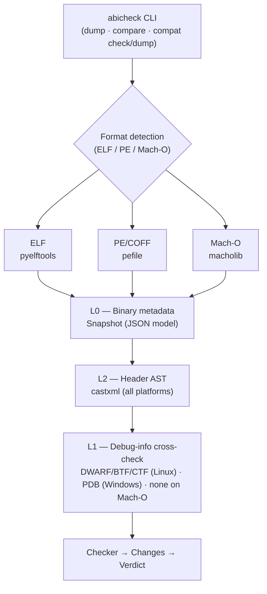

# Architecture

## Overview

abicheck is a Python CLI tool that compares two versions of a C/C++ shared library
to detect ABI and API incompatibilities. Its core design idea is to reason over
**five independent sources of information** about a library — the binary, its
debug symbols, its public headers, its build-system data, and (optionally) its
sources — instead of relying on a single data source. Each source is an additive
**evidence layer** (`L0`–`L4`); feeding more layers both finds breaks the
weaker layers are blind to and suppresses false positives they would raise. See
[Evidence layers: the five sources](#evidence-layers-the-five-sources) below for
the model, and [Evidence & Detectability](evidence-and-detectability.md) for the
conceptual companion.

abicheck supports Linux (ELF), Windows (PE/COFF), and macOS (Mach-O), each with
implemented binary-metadata and header-AST support; debug-info cross-check is
implemented for ELF (DWARF/BTF/CTF) and PE (PDB) but not for Mach-O — see the
[platform support matrix](limitations.md#platform-support-matrix) for the
per-platform tool/format breakdown and per-toolchain CI-validation maturity
(implemented capability and CI-proven maturity are not the same thing,
especially on Windows).

---

## Analysis pipeline

The CLI dumps each input into a normalized snapshot, enriches it with header
AST and debug-info layers, then diffs the two snapshots to produce a verdict:

The analysis layers are independent and additive — each catches changes the
others miss, and the checker reconciles them into a single verdict. The
artifact layers (L0/L1/L2) are described in detail below; the build/source
layers (L3/L4, plus the optional L5 reachability graph) are covered in
[Build & Source Packs](build-source-data.md).

---

## Evidence layers: the five sources

abicheck's accuracy comes from treating compatibility analysis as a question of
*evidence*: the more independent sources of information you give it about a
library (binary, debug symbols, headers, build data, sources — abicheck
additionally derives a sixth, the `L5` reachability graph), the more it can
prove and the fewer false positives it raises. Artifact-backed `L0`/`L1`/`L2`
evidence is authoritative for the shipped-ABI verdict; build/source
`L3`/`L4`/`L5` evidence may explain, localize, or add confidence to a finding,
but never silently deletes an artifact-proven break (the authority rule,
ADR-028). See [Evidence & Detectability](evidence-and-detectability.md) for
the full model (all six layers, the `--depth` dial, and worked examples).

---

## Artifact layers in detail

Each layer is read by a format-specific parser and contributes one kind of
evidence; the exact per-platform reach of each is owned by the reference
pages linked in the table, not restated here.

| Layer | What it reads | Where it is documented in full |
|---|---|---|
| L0 binary metadata | The export table, SONAME or install name, dependencies, symbol binding and versioning — ELF, PE/COFF and Mach-O each through their own parser | [Platform Support](../reference/platforms.md) |
| L1 debug information | Struct/class layout, member offsets, vtable slots and calling conventions from DWARF (with BTF and CTF as fallbacks on ELF) or PDB; separate debug files are found through a resolver chain (`--debug-root`, `--debuginfod`) | [Platform Support](../reference/platforms.md), [Dump & Compare Flags](../use/dump-compare-flags.md) |
| L2 header AST | Declarations, signatures, enums, typedefs, access and `noexcept` from the public headers through castxml or clang (`--ast-frontend`); castxml emulates the external compiler's defines and include paths, and the clang backend is syntactic, so DWARF stays the layout authority on a clang-only host | [Header Backend Capabilities](../reference/header-backend-capabilities.md), [Platform Support § Windows toolchains](../reference/platforms.md#windows-toolchain-support-matrix) |
| L3 build context, L4 source replay | Post-build, opt-in, never authoritative on their own: the ABI-relevant flags and toolchain from the build graph, and the macros, default arguments, `constexpr` values and uninstantiated templates only the sources carry — collected into a content-addressed build/source pack | [Build & Source Packs](build-source-data.md) |

Per the authority rule, every L3/L4 finding defaults to `API_BREAK` or risk
and carries an explicit evidence-tier boundary so it is never read as a
proven shipped-ABI break.

---

## Key modules

For the module-by-module map — every source file grouped by area (data model,
input resolution, binary/debug metadata, core diffing, policy, post-processing,
workflows, reporting, compatibility) — see the
[Codebase Overview](../contribute/codebase-overview.md#1-architecture-overview),
which is the contributor-facing source of truth for the package layout.

---

## Policy model

Policies control how detected changes are classified (BREAKING, API_BREAK, COMPATIBLE).

**Built-in profiles:**

| Profile | Behavior |
|---------|----------|
| `strict_abi` (default) | Every ABI change at maximum severity |
| `sdk_vendor` | Source-only changes downgraded to COMPATIBLE |
| `plugin_abi` | Calling-convention changes downgraded to COMPATIBLE |

**Custom policies:** YAML files with per-kind `break|warn|ignore` overrides.

Source of truth: `BREAKING_KINDS`, `API_BREAK_KINDS`, `COMPATIBLE_KINDS`, and `RISK_KINDS` sets in `checker_policy.py`.

---

## Verdict system

The checker's five verdicts (`NO_CHANGE`, `COMPATIBLE`, `COMPATIBLE_WITH_RISK`,
`API_BREAK`, `BREAKING`) and the exit code each maps to are owned by
[Verdicts](verdicts.md) and [Exit Codes](../reference/exit-codes.md); this
page does not restate the table.

---

## Error model

Public exceptions are defined in `abicheck/errors.py`. Tool errors produce exit code `1`.

---

**Ladder:** ← [Limitations & Known Boundaries](limitations.md) · Concepts c3 · Internals · [Source & Build Data](build-source-data.md) →
