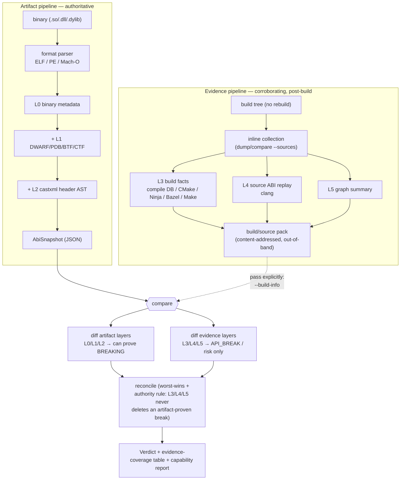

# Source & Build Data

abicheck primarily compares **built artifacts** — binaries (L0), debug info
(L1), and public headers (L2). A **build/source pack** is an *optional* sidecar
that augments a snapshot with **source and build evidence** (ADR-028): build
context (L3), source ABI replay (L4, ADR-030), and source graph summaries
(L5, ADR-031) — all three are implemented and shipped today; see "Evidence
layers" below for what each one requires and produces.

The pack exists to give the existing ABI/API decision engine **more facts** —
to reduce false positives, explain and localize breaks, and detect
source/API risks artifact comparison cannot see. It does **not** turn abicheck
into a general static analyzer.

## The authority rule (the one rule that matters)

Artifact-backed L0/L1/L2 evidence decides shipped-ABI verdicts; source/build
evidence (L3/L4/L5) explains, localizes, scopes or corroborates but never
silently deletes an artifact-proven break — the *authority rule*, defined in
[Evidence & Detectability](evidence-and-detectability.md#how-they-combine).

Findings produced *only* by build/source evidence are ordinary
[change kinds](../reference/change-kinds.md) that default to **`API_BREAK`**
(source-level breaks) or **risk** (deployment/context risk), never **breaking**
unless an artifact diff also proves the break. They flow through the normal
[verdict](verdicts.md) computation with worst-verdict-wins.

## Evidence layers

| Layer | Source | Purpose | Verdict authority |
|---|---|---|---|
| L0 | ELF/PE/Mach-O | Exported binary ABI facts | Authoritative |
| L1 | DWARF/PDB/BTF/CTF | Layout/type/calling-convention | Authoritative when matched to binary |
| L2 | castxml or clang / public headers | Public API declarations | Authoritative for header-visible API |
| **L3** | compile DB, CMake, Ninja, Bazel, Make | Toolchain, flags, target graph, generated-file provenance | Context/confidence |
| **L4** | per-TU source ABI replay | Source-visible ABI/API facts | API/source-risk evidence; never sole shipped-ABI authority |
| **L5** | Clang/Kythe/CodeQL graph summaries | Include/type/call/build reasoning | Explanation, localization, impact |

L3 and L4 are implemented today (ADR-029, ADR-030). L4 ships three extractor
backends — **clang** (the source-based default: inline/template/constexpr body
fingerprints + default arguments), **castxml** (declarations/types/const values),
and an **Android** header-checker adapter — plus the linker, source-replay diff,
replay scopes, and per-TU cache (see [L4 findings](#source-abi-replay-findings-l4)).

L5 has landed (ADR-031, phases 1–4): a compact, abicheck-owned **source graph
summary**. Folded from the L3 build evidence it carries `target`,
`compile_unit`, `source`, `header`, `generated_file`, and `build_option` nodes
linked by `TARGET_HAS_SOURCE` / `TARGET_HAS_PUBLIC_HEADER` / `TARGET_DEPENDS_ON`
/ `COMPILE_UNIT_BUILDS_SOURCE` / `COMPILE_UNIT_USES_OPTION` edges. When an L4
source surface was also collected (L4 source-ABI replay, e.g. `dump --sources <tree>`), it additionally folds in
`source_decl` / `record_type` / `enum_type` / `typedef` / `macro` nodes linked
to their declaring public header (`SOURCE_DECLARES`) and to their exported
binary symbol / debug type (`SOURCE_DECL_MAPS_TO_SYMBOL`,
`SOURCE_TYPE_MAPS_TO_DEBUG_TYPE`, `BINARY_EXPORTS_SYMBOL`) — giving the full
`target → public header → declaration → exported symbol` reachability closure.
Every node and edge carries provenance and a confidence label. `dump --sources <tree>` always builds and embeds it (it is compact by
design, so there is no separate opt-in flag), and two summaries are
compared with `graph compare` (below).
When L4 source-ABI replay is also active, two further edge kinds fold in
**automatically** — no separate flag for either: approximate Clang call
edges (`DECL_CALLS_DECL`) and
compile-unit include edges (`COMPILE_UNIT_INCLUDES_FILE`, preferring
already-recorded build-tool inputs over a fresh `clang -M` invocation). A
further, independent layer folds pre-captured Kythe/CodeQL backends
(`--kythe-entries`/`--codeql-results`). All six graph-derived findings flow
through `graph compare` and the verdict pipeline, and `graph explain`
localizes a single finding through the graph.

**Beyond calls: non-call type/decl dependencies (ADR-041 P0).** A call graph
alone misses a real class of risk — a public struct with a private base class
or private field type, or a public inline function reading an internal
constant, none of which are *calls*. `type_graph.py`'s Clang-AST pass folds
in automatically alongside the call graph (same L4 source-ABI replay
trigger, no
extra flag) and populates three further edge kinds the L5 schema had reserved
since ADR-031 but nothing produced before ADR-041: `TYPE_INHERITS` (a private
base class), `TYPE_HAS_FIELD_TYPE` (a private field/member type), and
`DECL_HAS_TYPE` (a private parameter/return type) — plus `DECL_REFERENCES_DECL`
for a non-call reference (e.g. reading an internal constant). Together with
`DECL_CALLS_DECL` these five kinds form the **dependency-edge family** that
`public_api_internal_dependency_added` (below) and the intra-version
`public_to_internal_dependency` cross-check both walk — "reaches" means any of
the five, not calls alone. Each kind has a dedicated example:
[case160](../reference/examples/case160_public_api_internal_dep_added.md) (`DECL_CALLS_DECL`),
[case187](../reference/examples/case187_public_struct_private_field_type.md)
(`TYPE_HAS_FIELD_TYPE`, the ADR's own headline example),
[case188](../reference/examples/case188_public_class_private_base_class.md)
(`TYPE_INHERITS`), [case189](../reference/examples/case189_public_function_private_parameter_type.md)
(`DECL_HAS_TYPE`), and [case190](../reference/examples/case190_public_inline_function_references_internal_constant.md)
(`DECL_REFERENCES_DECL`, the ADR's *other* headline example, verbatim).

**Header-only graph, no build integration (ADR-041 addendum).** `header_graph.py`
builds the same node/edge shapes straight from a header-only dump — no
`compile_commands.json`, no `--sources` checkout. Since G29 Phase A this is
built automatically by `dump`/`compare` whenever `--depth headers` or deeper
evidence is available (embedded in the written snapshot for `dump`, or for
both sides in-process for `compare`) — no flag required; the include-file
extension (`COMPILE_UNIT_INCLUDES_FILE` edges, one extra `clang -M`
invocation per top-level header) is likewise always attempted. The legacy
`--header-graph`/`--header-graph-includes` flags still exist but are hidden,
deprecated no-ops. Declaration provenance (public vs. internal) still needs
`-H`/`--header` (a directory entry tags everything under it public), same as any other dump — without it
every declaration's visibility is `unknown` and the internal-dependency
findings below have nothing to classify against. Not yet available on `scan`.
With a clang header AST (`--ast-frontend clang`) it reuses
the same Clang-AST extractors for real `TYPE_INHERITS`/`TYPE_HAS_FIELD_TYPE`/
`DECL_HAS_TYPE`/`DECL_REFERENCES_DECL` edges (plus `DECL_CALLS_DECL` for
in-header bodies — inline/template/constexpr functions only, since the flat
model never records out-of-line bodies); without a clang AST (the default
castxml backend, or clang unavailable) it falls back to deriving the three
structural type edges directly from the parsed `AbiSnapshot`'s
`RecordType.bases`/`.fields`/`Function.params` — weaker resolution (bare
unqualified names, always reduced confidence) but works with any L2 backend.
Its own `extractor_passes` names (`header_call_graph`/`header_type_graph`) are
tracked separately from the build-integrated passes so a header-only
confirmation is never mistaken for a full per-TU pass when judging whether an
edge kind's absence is a real zero or missing coverage.
[case191](../reference/examples/case191_header_only_graph_field_type.md) demonstrates
the same `public_api_internal_dependency_added` finding as case187, proven
entirely through this no-build-integration path.

> **Source ABI replay (L4) requires clang** (or castxml for the declaration
> subset, or a pre-captured Android dump). It is the one tier gated on a C++
> front-end. If the tool is missing, abicheck **fails gracefully**: L4 is marked
> partial, the source-only checks are reported as disabled, and the
> artifact-backed tiers (L0–L2) remain fully authoritative — the comparison is
> never aborted.

## What the data actually looks like

Every layer has a fixed record shape, and the shapes are documented with
the schemas they belong to rather than here: the L3 compile-action record
(the option record the diff actually reads) in
[`build-output.json` Reference § The L3 compile-action record](../reference/build-output-schema.md#the-l3-compile-action-record),
and the L4 source-declaration and L5 graph-edge records in
[Source Graph Schema § L4 and L5 records](../reference/source-graph-schema.md#l4-and-l5-records-in-the-buildsource-pack).
The one thing to carry from them: each record names its own provenance
(the TU, the flags, the extractor pass), which is what lets a later
comparison say *why* two sides differ instead of only *that* they do.

## How the data flows

Two independent producers feed one decision engine. The **artifact pipeline**
(always on, authoritative) turns each binary into an `AbiSnapshot`; the
**evidence pipeline** (optional, post-build, never rebuilds) collects an
out-of-band `build/source pack`. At `compare` time both are diffed and reconciled
under the [authority rule](#the-authority-rule-the-one-rule-that-matters):



Three consequences fall out of this shape, all by design:

- The facts are **embedded in the snapshot**. `dump --build-info/--sources`
  folds the normalized build + source facts directly into the `.abi.json`, so a
  later `compare old.json new.json` carries them with **no out-of-band
  directories** (single-artifact UX). A separately produced pack directory
  (a raw source checkout or a build-emitted `abicheck_inputs/` pack) stays
  available as an explicit per-side override (`--build-info`, `--sources`),
  and raw provenance is never embedded — only the normalized facts that feed
  the comparison.
- Collection is **post-build and read-only**: it reads existing build outputs and
  build-system query interfaces; it never rebuilds your project or runs arbitrary
  commands.
- The verdict is only as strong as the evidence behind it, so every
  build/source-aware run prints the `layer_coverage` table and the capability
  report below.

## Workflow

The default path is unchanged. Build/source data is **post-build and opt-in** —
it never rebuilds your project or runs arbitrary commands; it reads existing
build outputs and build-system query interfaces only.

### The source-tree-centric flow (recommended)

The common case is a **shipped binary** (e.g. a prebuilt package) plus a
**source checkout at the tag it was built from**. Point `dump` straight at the
source tree — `--sources <tree>` runs L4 source ABI replay **and** the L5 graph
internally and embeds them; there is no separate L4/L5 toggle flag,
and the graph is always built (it is compact by design):

```bash
# Source ABI replay (L4) + graph (L5) inline from a checkout, plus L3 from a
# compile DB auto-discovered inside the tree (or pass --build-info explicitly):
abicheck dump libfoo.so -H include/ \
  --sources ./libfoo-src/ -o new.abi.json

# Compare — the embedded L3/L4/L5 facts diff automatically, no pack dirs:
abicheck compare old.abi.json new.abi.json
```

`--build-info <path>` is the optional, **decoupled** L3 input: a build dir, a
`compile_commands.json`, or a pre-captured pack. When omitted, a
`compile_commands.json` inside the source tree is auto-discovered; if there is
none, L3 is reported as `not_collected` and the scan continues. Source ABI
replay (L4) still **requires clang** (or castxml for the declaration subset) and
degrades to partial coverage when the front-end is absent — the artifact tiers
stay authoritative (ADR-028 D3).

### Producing binary- and source-side facts separately

Build-side and source-side facts can still be produced independently — on
different machines, at different times. There is no longer a `collect`/`merge`
command to pre-combine them into one baseline file first (ADR-043 — the
library functions survive internally, but are not a documented CLI path).
Instead, feed `compare` (or a later `dump`) the out-of-band pack directly, per
side, and it is ingested inline:

```bash
abicheck dump libfoo.so -H include/   -o libfoo.bin.json   # L0/L1/L2 (+optional L3)
# … built on another machine, at another time …
abicheck compare libfoo.bin.old.json libfoo.bin.new.json \
  --sources old=./libfoo-src-v1/ --sources new=./libfoo-src-v2/
```

`compare` auto-ingests each side's embedded `build_source` facts (from the
binary-bearing snapshot) alongside whatever out-of-band pack `--build-info`/
`--sources` supplies for that side (each layer should come from exactly one
source), so the comparison still sees all of L0–L5 with no separate merge
step. `--build-info`/`--sources` also auto-detect a build-emitted
`abicheck_inputs/` Flow-2 pack directory (see below) the same way.

### Build-emitted facts — the `abicheck_inputs/` protocol (Flow 2)

When the **product build itself** can emit normalized facts (a Clang plugin, a
compiler wrapper, or any tooling that writes the schema), it skips the
source-side replay entirely: the build drops a self-describing
`abicheck_inputs/` directory next to its binary, and abicheck ingests it
**without re-running a compiler frontend** (ADR-035 D5). This is the
vendor/closed-source path — exact build-context facts contribute to the baseline
without shipping sources or letting abicheck rebuild the project.

```text
abicheck_inputs/
  manifest.json                  # kind: abicheck_inputs, library/version, paths
  binary/…  headers/…            # the shipped artifact + public headers (dumped normally)
  build/compile_commands.json    # optional → L3 build evidence
  source_facts/*.jsonl           # PREFERRED — normalized per-TU facts → L4/L5
  raw_ast/*.json.zst             # optional, forensic only — never ingested
```

The pack directory is auto-detected wherever a build/source input is accepted
— no separate combining step needed. Embed it directly on the same `dump`
call as the artifact side:

```bash
abicheck dump libfoo.so -H include/ --sources ./abicheck_inputs/ -o libfoo.full.json
```

or, if the binary was already dumped separately, hand `compare` the pack
per side:

```bash
abicheck compare libfoo.bin.old.json libfoo.bin.new.json \
  --sources old=./abicheck_inputs_v1/ --sources new=./abicheck_inputs_v2/
```

Normalized `source_facts/*.jsonl` are the canonical comparison format; `raw_ast/`
is an MVP-ingest / forensic fallback that abicheck does not read.

For setting up build/source evidence collection (wrappers, plugins, extractors,
packs), see [Build Evidence Setup](../use/build-evidence-setup.md) — it
covers the `abicheck-cc` wrapper and the Clang plugin producers in full.

### Choosing how much to collect — `dump --depth`

`dump --depth` (the unified evidence-depth dial, ADR-037 D5) selects *which*
layers are collected from `--sources` / `--build-info`, trading cost for depth:

```bash
abicheck dump --sources ./src/ --depth build    -o s.json  # +L3 only
abicheck dump --sources ./src/ --depth source   -o s.json  # +L3+L4+L5
abicheck dump --sources ./src/ --depth headers  -o s.json  # embed nothing (L2 only)
abicheck dump --sources ./src/ --depth binary   -o s.json  # L0/L1 only
```

| `--depth` | Layers collected | Replay scope |
|-----------|------------------|--------------|
| `binary` | L0 binary + L1 debug info only | — |
| `headers` (default) | + L2 header AST | — |
| `build` | + L3 build context | — |
| `source` | + L4 source replay + L5 graph | target (the whole current library) |

`binary`, `headers`, `build`, `source` are the **only** four public rungs,
used identically by `dump`/`compare`/`scan --depth`. The old **`full` depth is
gone completely** (no alias) — it collapsed into `source` (the two differed
only in replay *scope*, not evidence kind, and `dump`/`compare` always use the
whole-target scope for `--depth source` anyway). `--max`, `--source-method`,
`--mode`, and the old `symbols`/`graph` depth spellings are all **rejected
outright** — a plain "not one of binary, headers, build, source" usage error,
not a deprecation warning.

`build` is the cheap PR default (build-flag/toolchain drift, no source parse);
the `source` rung adds the L4 source replay and the **L5 structural graph**
(target → source → header → build-option nodes) at target scope. (The graph
is an internal consequence of the `source` rung, never its own user-facing
depth.)

### Build-tool query configuration (`.abicheck.yml`)

A source checkout often *contains* the build system. abicheck can use existing
build outputs from the checkout, while executable build queries are gated by an
explicit trusted config path and the ADR-032 D5 action ceiling (**read by
default, trusted query opt-in, full build never**):

```yaml
# .abicheck.yml at the source-tree root for non-executing settings
# (pass a trusted --config <path> before build.query can run)
build:
  system: bazel            # bazel | cmake | make | meson | auto (default: auto-detect)
  # A command that EMITS flags/exports without performing a full project build —
  # e.g. a configured-graph/action query, not `cmake --build` / `make all`.
  query: "bazel cquery 'deps(//cpp/oneapi/dal:core)' --output=jsonproto"
  compile_db: bazel-out/.../compile_commands.json   # where the flags land
sources:
  public_headers: ["cpp/oneapi/dal/**/*.hpp"]
  exclude: ["**/test/**", "**/backend/**"]
```

- **`inspect` (default, always on):** read existing build outputs / compile DBs
  the checkout already has. No config needed.
- **`query_build_system` (automatic when `--sources` is given):** if no compile
  DB exists, abicheck **detects the build system and runs its own fixed query**
  (`cmake -DCMAKE_EXPORT_COMPILE_COMMANDS=ON`, `bazel aquery`, or a GNU Make
  dry-run `make -B -n -k -w`) to emit flags/exports — no `--allow-build-query` flag
  (that flag is deprecated to a no-op). Make dry-run evidence is reduced confidence
  because it is a transcript scrape rather than an authoritative target graph;
  prefer a real compile DB (`bear -- make` → `--build-info`) when available. It
  also runs an
  *operator-supplied* `build.query` automatically (an
  explicit `--config` or `--build-query`) — but note that path ingests only an
  emitted `compile_commands.json`, so the query must *write* a DB (e.g.
  `bear -- make`), not just print a `make -n` transcript. All commands run with no shell
  (parsed via `shlex`) in the source-tree directory. A `.abicheck.yml`
  auto-discovered from `--sources` is still used for non-executing settings such
  as `build.compile_db`, but its `build.query` is **never** auto-run (it may be
  attacker-controlled) — pass it via an explicit `--config` to trust it. (The
  external-CLI-extractor / manifest plugin path formerly run via the separate
  `collect --extractor-manifest` command is gone from the CLI (ADR-043); its
  action-ceiling gate survives as a library-level mechanism only — see
  [External CLI extractors](../use/build-evidence-setup.md#external-cli-extractors-the-security-model-adr-032)
  for what remains documented.)
- **`run_build` / `wrap_build` (denied):** abicheck never performs a full
  project build or compiler-wrapper interception. The inferred queries above are
  configure/dry-run/aquery only — they do not compile the project. Make dry-run
  can still execute recursive/`+` recipes on some Makefiles; this is now part of
  the default source-query trust boundary.

### Scoping a Bazel query to specific root targets

The zero-config inferred Bazel query above (`query_build_system`) collects the
**whole workspace** (`deps(//...)`) by default — everything reachable from
every package, not just the library under test. In a multi-package workspace
with fixture/test targets alongside the real library, that captures unrelated
compile units too, polluting L3 evidence. `build.targets` declares the actual
root target(s) instead, scoping the inferred `aquery`/`cquery` to just those
targets' transitive dependency closure:

```yaml
build:
  system: bazel
  targets:
    - //:math
```

`dump --build-target TARGET` (repeatable) is the CLI equivalent (e.g. `dump
--sources <tree> --build-target //:math`) and overrides `build.targets` when
both are given; several roots are unioned (`--build-target //:math
--build-target //:util`). The resulting scope is reported machine-readably on
the `L3_build` evidence-coverage row (`requested_roots`/`resolved_roots`/
`transitive_targets`), so a consumer can confirm the collection actually
stayed scoped rather than silently falling back to a workspace-wide query.

For setting up build/source evidence collection — the `.abicheck.yml` project-contract block, out-of-band packs, a full worked CMake example, and external CLI extractors — see [Build Evidence Setup](../use/build-evidence-setup.md).

## Build-evidence findings (L3)

The build-evidence change kinds are ordinary [change kinds](../reference/change-kinds.md);
each one's default verdict and minimum evidence tier is listed in the generated
[Detector Spec](../reference/detector-spec.md) (the `L3` rows), which is
the one place the list lives. The rule that governs all of them is the
[authority rule](evidence-and-detectability.md#how-they-combine): none can
manufacture a `BREAKING` verdict on its own.

## Source ABI replay findings (L4)

The source-ABI-replay change kinds are ordinary [change kinds](../reference/change-kinds.md);
each one's default verdict and minimum evidence tier is listed in the generated
[Detector Spec](../reference/detector-spec.md) (the `L4` rows), which is
the one place the list lives. The rule that governs all of them is the
[authority rule](evidence-and-detectability.md#how-they-combine): none can
manufacture a `BREAKING` verdict on its own.

## Source graph findings (L5)

The source-graph change kinds are ordinary [change kinds](../reference/change-kinds.md);
each one's default verdict and minimum evidence tier is listed in the generated
[Detector Spec](../reference/detector-spec.md) (the `L5` rows), which is
the one place the list lives. The rule that governs all of them is the
[authority rule](evidence-and-detectability.md#how-they-combine): none can
manufacture a `BREAKING` verdict on its own.

## Cross-source validation findings (intra-version hygiene)

The cross-source validation change kinds are ordinary [change kinds](../reference/change-kinds.md);
each one's default verdict and minimum evidence tier is listed in the generated
[Detector Spec](../reference/detector-spec.md) (the `cross-source` rows), which is
the one place the list lives. The rule that governs all of them is the
[authority rule](evidence-and-detectability.md#how-they-combine): none can
manufacture a `BREAKING` verdict on its own.

## Evidence coverage

Every compare and scan that carries build/source evidence reports which
layers it actually got, per side, and what each pass covered — the coverage
table, the capability report, the timing/finding split, and the header parse
context are report fields, and their shape is owned by
[Output Formats § Evidence coverage and metrics](../use/output-formats.md#evidence-coverage-and-metrics-buildsource-pack).
Read them before reading a finding: a layer that reports itself narrowed or
degraded is evidence of *what it saw*, never of what it did not.

## Inputs, expectations & cost — a field guide

Source/build data is opt-in and its value (and price) depends entirely on **what
you can feed it**. This guide maps each realistic input to what you get, what it
*cannot* see, and the rough cost. (Times are order-of-magnitude from a field
evaluation across ~30 conda-forge libraries up to LLVM/oneDAL on a 4-core box;
your numbers scale with translation-unit count and per-TU header weight.)

### What each input buys you

| You have | Layers | Detects | Key limitation | Typical cost |
|---|---|---|---|---|
| Just the `.so`/`.dll`/`.dylib` | L0 | added/removed/renamed symbols, SONAME, linkage, symbol-versioning, binary-only vtable/RTTI size deltas | no types/layout — shipped release binaries are usually DWARF-stripped, so you run `elf_only` (LOW confidence) | dump 0.3–0.6 s small, ~17 s for a 150 MB/150k-symbol lib |
| + debug info (DWARF/PDB/BTF/CTF) | +L1 | struct layout, member/enum/typedef changes, calling convention, signatures | only as good as the debug info shipped; release packages rarely include it (install the `-dbg`/`debuginfo` package) | adds a few seconds + a larger snapshot |
| + public headers (`-H`) | +L2 | API decls absent from the symbol table; **public-surface scoping** to cut internal noise | needs an AST frontend (`--ast-frontend auto\|castxml\|clang\|hybrid`): castxml is the default/reference but castxml ≤0.6.3 cannot parse a modern libstdc++ (`<string>` etc.), so on heavy C++ prefer the **clang** backend (syntactic AST — declarations/signatures only, no record layout/offsets/vtables, so pair it with DWARF/L1 for layout); `hybrid` runs both and merges them (needs both tools, ~2x cost); `-H` should be given the build's `-I` dirs (generated headers) | sub-second per header set |
| + build dir / compile DB (`--build-info` / `--build-query`) | +L3 | toolchain & build-flag drift (visibility, `-std`, ABI flags), target/source/option graph | a plain `compile_commands.json` carries compile units but not targets/toolchains (use the CMake File API for those); command-string DBs under-report normalized options | **flat ~0.3–0.5 s** regardless of project size — it only parses the DB |
| + source checkout (`--sources`) | +L4+L5 | macro / default-arg / inline / template / constexpr **body** changes; full source→symbol graph | **needs clang** and the **generated headers to exist** (configure-only fails on tablegen `*.inc`); the default clang extractor emits body fingerprints, not full decl tables (a pure-C public API yields little) | **dominated by clang re-parsing every TU**: ~0.3 s/TU (simple C) → ~2 s/TU (C++); LLVM-scale = tens of minutes to hours |

### Source-phase by build system

`--sources` needs a `compile_commands.json`. How you get one differs:

| Build system | Compile DB | abicheck flow |
|---|---|---|
| **CMake** | `-DCMAKE_EXPORT_COMPILE_COMMANDS=ON` at configure | auto-discovered if it lands in `build/` (or pass `--build-info`) |
| **Meson** | always emitted by `meson setup` (no build needed) | auto-discovered in `build/`/`builddir` — the smoothest path |
| **Autotools** | none, ever | run `bear -- make` (a real build), or wire `--build-query` |
| **Bazel / custom** | via `bazel aquery` or a wrapper | pre-capture and pass `--build-info`; heavyweight toolchains (e.g. oneDAL: Bazel + oneMKL/DPC++) are impractical to configure in a generic CI box — use the artifact tiers there |

abicheck never runs your build by default. To let it run the configure/query step
itself, pass the command on the CLI (no config file needed):

```bash
abicheck dump libfoo.so --sources ./src \
  --build-query 'cmake -S . -B build -DCMAKE_EXPORT_COMPILE_COMMANDS=ON' \
  --build-compile-db build/compile_commands.json
```

(or set `build.query` / `build.compile_db` in `.abicheck.yml`). An
operator-supplied `--build-query` (or a trusted `--config`) runs on its own — the
old `--allow-build-query` gate is now a deprecated no-op — and it still never runs
`make all` / `cmake --build`.

### Time & resource model and recommended defaults

The cost of each depth, the rules of thumb for choosing one, and the
measured numbers are owned by
[Source-Scan Depth § Cost guide](../use/scan-levels.md#cost-guide-rules-of-thumb)
and [Performance](../contribute/performance.md); this page does not restate
either.

## Schema & storage

The pack's envelope — content addressing, independent versioning, the
raw/normalized split and the redaction rules — is part of the snapshot
storage contract, owned by
[Snapshot Format § The build/source pack envelope](../reference/snapshot-format.md#the-buildsource-pack-envelope).

---

**Ladder:** ← [Architecture](architecture.md) · Concepts c3 · Internals · [Graph Coverage & Negative Evidence](graph-coverage.md) →
