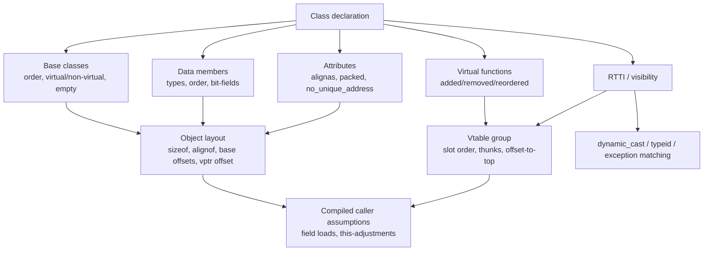

# Class Layout ABI & API: Problems and Detection

This guide is the single place that explains **what a C++ class-layout change
really is**, why some layout changes break the binary contract (ABI) while
others break only the source contract (API), and **exactly how abicheck detects
each one** — which `ChangeKind` it emits, from which evidence, and which
worked example demonstrates it.

It complements two neighbouring pages:

- [Type Layout](abi-series/03-type-layout.md) and [C++ ABI](abi-series/04-cpp-abi.md)
  — the tutorial walk-throughs.
- [Change Kinds](../reference/change-kinds.md) — the exhaustive catalog.
- [Evidence & Detectability](evidence-and-detectability.md) — the L0–L5 model.

---

## ABI vs API, and where "layout" sits

> **Full definitions:** [ABI/API Compatibility](abi-api-handling.md) is the
> canonical page for what these terms mean generally; the two bullets below
> are the *layout-specific* restatement this page needs to talk about class
> objects specifically.

- **API**, here: the *source* contract — declarations, overload sets, access
  control, default arguments, templates, inline bodies, constants. Breaking it
  means a consumer must change or fix their *source* — recompilation is
  required, even if some already-built binaries keep running. abicheck
  classifies these as **`API_BREAK`** (`api_break: true`).
- **ABI**, here: the *compiled* contract — object size and alignment,
  base-subobject offsets, vptr placement, vtable slot order, calling
  convention, mangled names, RTTI representation, symbol visibility. Breaking it
  means an **already-compiled** consumer is now wrong — it reads the wrong
  bytes, dispatches the wrong virtual slot, or adjusts a `this`-pointer by the
  wrong amount. abicheck classifies these as **`BREAKING`** (`abi_break: true`).

A **class layout change is any change that alters a fact a compiled consumer may
already have baked in about a class object.** Under the
[Itanium C++ ABI](https://itanium-cxx-abi.github.io/cxx-abi/abi.html#class-types)
object layout is defined by object size, alignment, and the offset of every
component, built from primary-base choice, base allocation, member allocation,
bit-field rules, empty-base/`[[no_unique_address]]` placement, and virtual-base
allocation. So "layout" is much broader than "member order" — it includes:

- **base-subobject placement** (including empty-base optimization, *EBO*),
- **vptr placement** (whether the class is polymorphic at all),
- **padding / `data size` (`dsize`)** and tail-padding reuse,
- **alignment and packing**,
- **standard-layout / trivially-copyable** eligibility (which control
  `offsetof`/C-interop and the by-value calling convention),
- **potentially-overlapping subobjects** (`[[no_unique_address]]`).



---

## The class-layout change catalog (mapped to abicheck)

Every row below names the **actual `ChangeKind`(s) abicheck emits** (not generic
labels), the evidence tier that first reveals it, and a worked example case. The
verdict bucket follows the [policy partition](../reference/change-kinds.md):
`BREAKING`, `API_BREAK`, or `COMPATIBLE_WITH_RISK`.

| Scenario | Verdict | abicheck `ChangeKind`(s) | First evidence tier | Example |
|----------|---------|--------------------------|:------------------:|---------|
| Add / remove / reorder a non-static data member | BREAKING | `type_field_added` / `type_field_removed` / `type_field_offset_changed`, `struct_field_*` | L1 (DWARF) / L2 (headers) | [case40](../reference/examples/case40_field_layout.md), [case07](../reference/examples/case07_struct_layout.md) |
| Grow a class (private member added, embedded type grew) | BREAKING | `type_size_changed`, `struct_size_changed` | L1 | [case14](../reference/examples/case14_cpp_class_size.md), [case127](../reference/examples/case127_data_object_size_changed.md) |
| Change a member's type or bit-field width | BREAKING | `type_field_type_changed`, `field_bitfield_changed` | L1 | [case41](../reference/examples/case41_type_changes.md), [case63](../reference/examples/case63_bitfield_changed.md) |
| Change alignment or packing | BREAKING | `type_alignment_changed`, `struct_packing_changed` | L1 | [case42](../reference/examples/case42_type_alignment_changed.md), [case56](../reference/examples/case56_struct_packing_changed.md) |
| Reorder bases / insert a base / change virtual inheritance | BREAKING | `type_base_changed`, `base_class_position_changed`, `base_class_virtual_changed` | L1 | [case37](../reference/examples/case37_base_class.md), [case60](../reference/examples/case60_base_class_position_changed.md) |
| **A base subobject *moves* (e.g. EBO lost)** | BREAKING | **`base_class_offset_changed`** | L1 | **[case140](../reference/examples/case140_empty_base_optimization_lost.md)** |
| Non-polymorphic class gains its first virtual → vptr prepended | BREAKING | `vptr_introduced` | L1 (DWARF) / L2 *(descriptor)* | unit-tested, no public example case yet |
| Add / remove / reorder a virtual function | BREAKING | `virtual_method_added`, `func_virtual_added`/`func_virtual_removed`, `type_vtable_changed` | L1 | [case38](../reference/examples/case38_virtual_methods.md), [case68](../reference/examples/case68_virtual_method_added.md) |
| **Vtable slot count changes — from a *stripped* binary** | BREAKING | **`vtable_slot_count_changed`** | **L0 (ELF symbol size)** | **[case142](../reference/examples/case142_vtable_slot_count_binary_only.md)** |
| Inheritance *shape* changes *by enough to resize `_ZTI`* — from a stripped binary | BREAKING | `rtti_inheritance_changed` | L0 (`_ZTI` size) | unit-tested, no public example case yet |
| Type stops being trivially-copyable → by-value calling conv. flips | BREAKING | `trivially_copyable_lost`, `value_abi_trait_changed` | L2 *(descriptor)* / L1 | [case69](../reference/examples/case69_trivial_to_nontrivial.md) |
| Type stops being standard-layout (`offsetof`/C-interop lost) | COMPATIBLE_WITH_RISK | `standard_layout_lost` | L2 *(descriptor)* | unit-tested, no public example case yet |
| `dsize` changes at stable `sizeof` (tail-padding reuse) | COMPATIBLE_WITH_RISK | `tail_padding_reuse_changed` | L2 *(descriptor)* | unit-tested, no public example case yet |
| Change a field's / method's access specifier | API_BREAK | `field_access_changed`, `method_access_changed` | L2 (headers) | [case34](../reference/examples/case34_access_level.md) |
| RTTI / vtable visibility changes across DSOs | BREAKING | `type_visibility_changed` | L1 (DWARF attrs) | — |
| `[[no_unique_address]]` overlap gained/lost | BREAKING | *(no dedicated kind — see below)* `type_size_changed` / `type_field_offset_changed` | L1 | [case117](../reference/examples/case117_no_unique_address.md) |
| Class gained `final` (consumers can no longer derive) | API_BREAK | `type_became_final` | L2 (headers) | [case125](../reference/examples/case125_class_became_final.md) |

> **Why some rows say "L2 *(descriptor)*".** The fine-grained traits
> `is_standard_layout`, `is_trivially_copyable`, `vptr_offset_bits` and
> `data_size_bits` do **not** all come from the same place, so read the
> producer column below rather than assuming "headers give you all four".
> DWARF supplies `base_offsets` (so `base_class_offset_changed` works at L1),
> `sizeof`, offsets, and a *measured* `vptr_offset_bits` — but not the
> C++-semantic traits, which need the direct-clang AST path. `data_size_bits`
> needs the optional layout-tool pass and nothing else provides it. This is why
> the evidence you provide changes what abicheck can prove — see
> [Evidence & Detectability](evidence-and-detectability.md).

---

## How abicheck reads layout: the three detector tiers

> Each tier below is a distinct comparison pass over a distinct slice of the
> layout evidence — worth knowing as *tiers*, since which one applies is what
> decides whether a given change is detectable at all with the evidence you
> supplied. The exact modules that implement each tier are named in this
> page's own front matter (`depends_on`) rather than inline here, so a
> reader learning *what's detectable* isn't also asked to track Python file
> names.

### 1. Coarse type/struct diff (L1/L2)

Compares `sizeof`, `alignof`, the field list (name, type, offset, bit-field
width), the base list, and the vtable list between the two snapshots. This is
the workhorse for the common breaks: `type_size_changed`,
`type_field_offset_changed`, `type_field_type_changed`, `type_base_changed`,
`type_vtable_changed`, `struct_packing_changed`, `type_alignment_changed`.

### 2. Fine-grained layout descriptor (L1/L2)

A class has moving parts the coarse `sizeof` diff under-represents. The
`RecordType` model carries an optional **layout descriptor**:

| Field | Meaning | Populated by |
|-------|---------|--------------|
| `base_offsets` | each base subobject's bit offset | DWARF and castxml directly; **direct-clang only with** the optional `ABICHECK_CLANG_LAYOUT_TOOL` pass — the direct-clang AST backend does not populate it on its own |
| `vptr_offset_bits` | vtable-pointer offset | **DWARF: measured** — read from the artificial vptr member's own `DW_AT_data_member_location`, with inherited offsets propagated, and `0` used only as a last-resort fallback. **Both header backends: derived**, `0` whenever the class has a vtable — a polymorphism witness, not a measured offset |
| `data_size_bits` | `dsize` — bytes the members occupy, excl. tail padding | only the optional `ABICHECK_CLANG_LAYOUT_TOOL` companion pass |
| `is_standard_layout` | standard-layout trait | direct-clang AST only |
| `is_trivially_copyable` | trivially-copyable trait | direct-clang AST only |

The bottom three rows are the ones worth checking before you rely on them.
For the two traits, **castxml deliberately leaves them `None`** rather than
deriving them from polymorphism (which would be unsound and would emit a
spurious `standard_layout_lost`), and DWARF exposes no equivalent attribute at
all — so a castxml-only or DWARF-only run stays silent on
`standard_layout_lost` / `trivially_copyable_lost`. Reach them with
`--ast-frontend clang` (or `hybrid`, which backfills castxml's gaps from a
clang sub-dump). `tail_padding_reuse_changed` is stricter still: `dsize` comes
only from the optional `ABICHECK_CLANG_LAYOUT_TOOL` pass, so without it that
detector never fires at all. The DWARF-side
counterpart of the triviality question is a *separate* finding on a separate
path: `value_abi_trait_changed`, inferred from DIE structure rather than read
from a trait (see [Part 4 §6](abi-series/04-cpp-abi.md#6-trivial-non-trivial-the-invisible-calling-convention-flip)).

From these, abicheck emits `base_class_offset_changed` (a base moved),
`vptr_introduced` (became polymorphic), `trivially_copyable_lost`,
`standard_layout_lost`, and `tail_padding_reuse_changed`.

Every comparison is **tri-state guarded**: it fires only when *both* sides carry
the relevant evidence. An evidence-tier downgrade (a DWARF-only or symbols-only
dump, or an older snapshot whose schema predates these fields) therefore never
*fabricates* a finding. When one side has a populated descriptor and the other
has no layout evidence at all, abicheck emits the calm, non-escalating
`layout_unverifiable` instead of guessing.

### 3. Binary-only C++ layout (L0)

The biggest *narrowing* of the symbol-only blind spot — narrowing, not closing;
see the limits below. The Itanium ABI fixes the on-disk size of two emitted
objects per polymorphic class, and both encode layout facts otherwise visible
only in DWARF. Coverage is per *symbol*, not per class: the detector reads
positive-size `_ZTV`/`_ZTI` entries and reports only keys present on **both**
sides, so a class whose vtable or typeinfo was never emitted, was hidden, or
appears on one side only contributes nothing here.

- **`_ZTV<type>`** (the vtable): for the simple single-inheritance case, laid
  out as `[offset-to-top, typeinfo*, slot0, slot1, …]`, so its `st_size`
  changes by one pointer per vtable **entry** net added or removed. Count
  entries, not source-level virtual functions — the two differ: a virtual
  destructor occupies *two* entries (the complete-object and deleting
  destructors), so adding one to a class grows `_ZTV` by 16 bytes on x86-64,
  not 8 (verified against GCC: 24 → 40). In general
  the symbol covers the whole **vtable group** — vcall/vbase offsets, and a
  secondary table per polymorphic base beyond the primary — so its size also
  moves when the *inheritance shape* changes with no virtual added at all
  (`struct D : A` → `struct D : virtual A` is enough). Either way the finding
  is **`vtable_slot_count_changed`**.
- **`_ZTI<type>`** (the typeinfo): its concrete runtime class
  (`__class_type_info` / `__si_class_type_info` / `__vmi_class_type_info`)
  encodes the inheritance shape, so a base-class change that moves the class
  between those runtime classes — or changes the number of entries a
  `__vmi_class_type_info` carries — resizes it ⇒
  **`rtti_inheritance_changed`**.

So `.dynsym` **alone** — no debug info, no headers — can reveal that a class's
emitted vtable or RTTI object changed *size*, which is exactly what
[case142](../reference/examples/case142_vtable_slot_count_binary_only.md) demonstrates on
a stripped `.so`. Read the signal for what it is, and no further:

| What L0 actually establishes | What it does **not** establish |
|---|---|
| The emitted vtable group changed size | *Why* — added/removed virtuals and an inheritance-shape change both do this |
| The emitted RTTI object changed size | *Which* base changed, or how |
| A structural signal worth investigating | That nothing changed when the size held still |

Both columns matter. On the left, note that `vtable_slot_count_changed` is named
for its commonest cause, not for something L0 can prove: a size delta on a class
with virtual or multiple inheritance may be vcall/vbase offsets or a secondary
table moving, not a slot count at all.

On the right, the last row is the one that bites. A **pure reorder** of virtual
functions leaves every emitted size identical, so it is invisible at L0
entirely, even though it is a hard ABI break. A base-class **replacement or
reorder** that keeps the same `type_info` runtime class and base count is
invisible to the *RTTI* signal specifically — but not necessarily to L0 as a
whole, since swapping in a base with a different virtual surface still resizes
the derived class's `_ZTV` group. A change is only fully invisible here when
**both** emitted symbols keep their size. Establishing
*identity* (which slot, which base) needs L1/L2 evidence. Because the finding is
*inferred* from size,
these findings carry `MEDIUM` confidence; and as always, the finding is a
detected fact, while the verdict it maps to is policy (an append-only virtual
addition means something different for a closed hierarchy than for one consumers
derive from).

---

## What is intrinsically hard or out of scope

- **`[[no_unique_address]]` has no dedicated `ChangeKind` — by design.** When an
  empty member gains the attribute and the compiler overlays it with the next
  member, the only observable effect on the object schema is a *size or offset
  change*, which the existing `type_size_changed` / `type_field_offset_changed`
  kinds already report. [case117](../reference/examples/case117_no_unique_address.md)
  encodes exactly this. (Note: on MSVC targets Clang ignores
  `[[no_unique_address]]` in favour of `[[msvc::no_unique_address]]`, and MSVC
  offers no ABI-stability guarantee for it.)
- **The descriptor traits need the right header backend — not just "headers".**
  Per the producer table above: `standard_layout_lost` and
  `trivially_copyable_lost` need the **direct-clang** AST path (castxml leaves
  both traits `None`); `tail_padding_reuse_changed` additionally needs the
  optional `ABICHECK_CLANG_LAYOUT_TOOL` pass for `dsize`; `vptr_introduced`
  is the exception, reachable from DWARF or either header backend. Where the
  input is `None`, abicheck stays silent rather than guessing. This is a
  property of the *evidence*, not a detector bug — see
  [Limitations](limitations.md).
- **Source-only contract changes leave no object trace.** Default-argument,
  inline-body, and uninstantiated-template changes are API events that only
  source replay (L4) can see; binary/DWARF comparison correctly reports
  `NO_CHANGE`.

---

## Platform notes

| Platform / compiler | Dominant C++ ABI rules | Layout traps that bite first |
|---------------------|------------------------|------------------------------|
| Linux x86-64, GCC/Clang | Itanium C++ ABI + ELF + SysV AMD64 | Layout drift, vtable slot changes, RTTI/visibility, libstdc++ dual ABI. **Use Linux as the canonical gate** (richest validation). |
| Windows x64, MSVC | MS x64 calling conv., decorated names, `/Zp`/`#pragma pack`, `/GR`, `/EH` | Decorated-name drift, packing, cross-DLL concrete C++ types. PDB layout cross-check is supported but non-blocking in places. |
| Windows x64, Clang-cl | MSVC-compat target with known edge-case gaps | Don't assume member-pointer / `[[no_unique_address]]` / vtordisp handling matches MSVC exactly in every corner. |
| Linux AArch64, GCC/Clang | Arm `cppabi64` + generic C++ ABI + AAPCS64 | Same layout/vtable risks as x86-64, plus PCS-sensitive calling convention. |
| 32-bit Arm | AAPCS32 + alternate member-function-pointer rules (Thumb bit) | Member-pointer assumptions and EH interop. |

Symbol versioning and dynamic linking do **not** abstract away layout: GNU
`ld`'s `VERSION` script and the PLT/GOT can redirect a *function symbol*, but an
old caller compiled with a stale field offset or vtable index carries that
assumption *inside its own code*. Layout and dispatch breaks live in the
consumer, where versioning cannot reach.

---

## Recommended workflow

Feed abicheck **old lib + new lib + matching public headers + debug info** so it
can reach every tier above:

```bash
abicheck compare old.so new.so \
  --header old=include/v1/foo.h \
  --header new=include/v2/foo.h \
  --policy strict_abi \
  --format sarif -o abi.sarif
```

- A stripped binary with no headers collapses toward symbol-only checking — you
  still get the L0 `vtable_slot_count_changed` / `rtti_inheritance_changed`
  signals, but the descriptor traits go dark.
- With headers + DWARF you get the full class-layout picture.
- Treat **adding a field to an empty/tag base**, **inserting or reordering a
  virtual**, and **toolchain/language-mode upgrades** (`-fabi-version`,
  `char8_t`, `noexcept`-typing, dual ABI) as ABI-review events, not routine
  edits.

See [Designing for Stability](abi-series/07-designing-for-stability.md) for the
mitigation patterns (opaque handles / pimpl, frozen inheritance, versioned
interfaces) that make most of this catalog impossible to hit.

---

**Ladder:** ← [Part 4 — C++ ABI Specifics](abi-series/04-cpp-abi.md) · Tier 2 · Mechanics · [Part 5 — ELF & Linker-Level Concerns](abi-series/05-linker-elf.md) →
