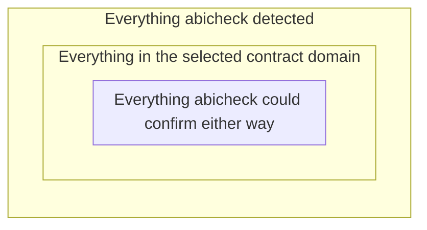

# Contract-Aware Compatibility

Plain `abicheck compare` already applies its own scoping — public-surface
filtering (on by default), suppressions, and redundancy collapsing all
narrow what actually gets scored — but none of that asks about a
*declared contract*: it's about whether a change is public/reachable or
explicitly waived, not whether it belongs to a promise you've made about
what stays stable. **Contract-aware compatibility**
(`compare --contract`, ADR-049) adds that narrower, more useful
question on top: *does this change even touch the compatibility contract
you actually promised?*

This page is the mental model — what a "contract" means here, the three
domains you can select, the outcomes a finding can land in, and why this
can't be used to quietly hide a real break. For the exact field vocabulary
and precedence rules, see [Compatibility Evaluation
Config](../reference/compatibility-evaluation-config.md); for the command
syntax and CI recipes, see [Contract Evaluation](../use/contract-evaluation.md).

## A contract is not the same as the discovered surface

A plain `compare` operates over everything it *found*. Contract-aware
compatibility introduces a third, narrower circle:



- **Everything detected** — the ordinary `compare` output: every difference
  between old and new, regardless of what it means for compatibility.
- **Everything in the declared domain** — the subset that belongs to the
  compatibility contract you selected (see modes below) — a header-only
  internal type is outside this circle even though abicheck detected the
  change to it.
- **Everything abicheck could prove either way** — of the findings that are
  or aren't in the domain, only some come with evidence strong enough to
  *state* the answer confidently. The rest are honestly reported as
  unresolved rather than guessed at.

This is why a finding's fate under `--contract` isn't a single
in/out flag — it's the combination of *where* it falls (in the domain or
not) and *how sure* abicheck is (proven or not).

## Three contract modes

`--contract public|exports|all` selects which evidence domain a finding is
judged against (the legacy `--scope-public-headers`/`--no-scope-public-headers`
flag maps onto `public`/`all`; an explicit `--contract` always outranks it):

| Mode | What's in the contract | Evidence it consults |
|---|---|---|
| `public` (default alias) | The library's declared public headers — the source-level API surface | Header AST, scoped the same way plain `compare`'s public-surface scoping already works |
| `exports` | Whatever the binary's own observed export table actually exports (`.dynsym`/PE export directory/Mach-O export trie) | The **export table alone decides which declarations are roots** — no header-origin/publicness filtering. But header (or debug-info) declaration data still matters afterward: the closure walk from those roots over the record/enum/typedef graph needs typed declarations to resolve, so giving it headers can turn an otherwise-`UNKNOWN_UNRESOLVED` type edge into a provable one. |
| `all` | Everything detected — no exclusion, with two exceptions | Nothing extra; every entity-level finding is trivially `IN_CONTRACT` **unless** it's specifically excluded by a committed `--post-manifest` (see below). A `NOT_APPLICABLE` finding (below) is unaffected by mode entirely — it was never a domain-membership question to begin with. |

**Decision table:**

| Situation | Recommended mode |
|---|---|
| Public SDK with a maintained, documented header surface | `public` |
| C ABI / export-map–driven library where the export table *is* the contract (no reliable header surface, or headers are broader than what you actually promise) | `exports` |
| Diagnosing the full detected surface, or a deliberate rollback/audit where nothing should be excluded | `all` |

`public` and `exports` are genuinely different sources of truth, not two
views of the same thing: a symbol can be in your public headers but not
actually exported (stripped, versioned out) — that's out of contract under
`exports` but in contract under `public` — or vice versa (an
implementation-detail symbol exported for a narrow, undocumented reason).

**`all` isn't quite unconditional, in two independent ways.** A
separately-opted-in `--post-manifest` (a committed, narrower public-symbol
list) is checked *before* the `all` mode shortcut for `public`/`all` — a
finding whose symbol the manifest specifically excludes still comes back
`PROVEN_OUT_OF_CONTRACT`, not `IN_CONTRACT`, under either of those two
modes. `exports` mode is the one exception: it dispatches to its own
export-table-rooted decision *before* the manifest check ever runs, so a
`--post-manifest` is advisory only there — an observed export the manifest
omits can still resolve `IN_CONTRACT` under `--contract exports`. This only
matters if you're also using `--post-manifest`. Separately, and
unconditionally, across all three modes: a
mode-independent check (loader/SONAME/security-hardening/deployment-floor
kinds — the same curated set behind the `NOT_APPLICABLE` row above) runs
*before any mode dispatch at all*, so those findings stay `NOT_APPLICABLE`
under `all` too — not because they're excluded, but because they were never
a domain-membership question in the first place. Without `--post-manifest`,
every *entity-level* finding under `all` is `IN_CONTRACT`, which is the
practical reading most users need.

## What a finding's relevance can be

Each finding gets a `contract_relevance` and lands in one of two buckets
abicheck calls `compatibility_evaluation_status` — **`EVALUATED`** or
**`NOT_EVALUATED`**:

| `contract_relevance` | Bucket | Meaning |
|---|---|---|
| `IN_CONTRACT` | `EVALUATED` | Provably part of the selected domain. Policy scores it normally. |
| `NOT_APPLICABLE` | `EVALUATED` | Not a domain-membership question at all (e.g. a SONAME/loader/security-hardening finding) — scored normally, same as always. |
| `PROVEN_OUT_OF_CONTRACT` | `NOT_EVALUATED` | Confidently excluded — abicheck can *prove* this entity is outside the domain. |
| `UNKNOWN_UNRESOLVED` | `NOT_EVALUATED` | Can't tell, because the evidence needed to decide is missing or incomplete. |
| `UNKNOWN_UNPROVEN` | `NOT_EVALUATED` | *Reserved* by the vocabulary (ADR-049 D1) for "searched but genuinely ambiguous" — today's evaluator doesn't have a per-domain "did we search everything" signal precise enough to emit this distinct from `UNKNOWN_UNRESOLVED`, so it downgrades every such case to `UNKNOWN_UNRESOLVED` instead. Don't expect to see this value in a real report yet. |

Only `IN_CONTRACT`/`NOT_APPLICABLE` findings reach compatibility policy —
everything else has `compatibility_decision: null` in the report: not a
sixth, compatible-leaning verdict, just "policy didn't run on this."

### What actually proves exclusion under `exports` mode

`PROVEN_OUT_OF_CONTRACT` is not a guess — under `exports` mode it requires
every one of these to hold (`ExportSurface.exclusion_is_provable`):

- An export table was actually observed on the authoritative side (removal
  → old side; addition → new side).
- At least one export-table entry resolved to a real, typed declaration.
- **Every** export-table entry resolved to something — no unaccounted
  export.
- **No** unresolved type edge reachable from an export root (a
  signature/field naming a type the snapshot can't account for).

If any of these fails, the answer degrades to `UNKNOWN_UNRESOLVED` rather
than a confident exclusion — the same fail-closed principle `public` mode's
header-origin/private-namespace/system-header checks already use.

## Why this isn't a convenient way to hide a break

Four properties hold regardless of mode, and are worth internalizing before
you turn this on for a real gate:

1. **Contract exclusion never hides the finding.** A `PROVEN_OUT_OF_CONTRACT`/
   `UNKNOWN_UNRESOLVED` finding stays in `changes`, rendered with the reason
   code that explains why it didn't gate — contract relevance by itself
   removes nothing. (A *different*, independent mechanism, `--suppress`,
   can still remove a matching finding from `changes` into
   `suppression.suppressed_changes`, and public-surface/redundancy
   filtering have their own audit ledgers — those are unrelated waiver
   steps, not something contract evaluation does.)
2. **Suppression cannot reach a contract-coverage failure.** A
   `CoverageFailure` is structurally not a `Change` — no `kind`, no
   `symbol`, no `source_location` for `--suppress` to match against — so
   `--suppress` cannot silence "we don't have enough evidence to judge this
   domain," only individual findings.
3. **`contract.unresolved: warn` accepts, it doesn't erase.** A `kind:
   contract` pack setting this zeroes the orthogonal contract-coverage exit
   contribution — but `contract_coverage_failures` stays populated in the
   report either way. Accepting incomplete assurance is a policy decision
   you can audit later, not a way to make the gap vanish.
4. **Missing evidence never becomes "compatible."** `UNKNOWN_UNRESOLVED`
   and `UNKNOWN_UNPROVEN` are `NOT_EVALUATED`, not `COMPATIBLE` — the
   run-level verdict simply doesn't include them, and (unless
   `contract.unresolved: warn` is set) the separate contract-coverage axis
   raises the exit code by exactly this kind of gap.

## Three runnable examples

### 1. Private implementation removal

```bash
# Plain compare, with default public-surface scoping disabled -- the
# internal type change is a real, gating BREAKING finding. (Plain compare's
# OWN default scoping, --scope-public-headers, would filter this exact case
# too -- disabling it here isolates contract evaluation, not ordinary
# surface scoping, as what's making the difference between the two runs.)
abicheck compare old.json new.json --no-scope-public-headers
# verdict: BREAKING

# Contract-aware, public mode -- visible, but not evaluated
abicheck compare old.json new.json --no-scope-public-headers \
  --contract public
# verdict: NO_CHANGE (nothing EVALUATED changed)
# the finding is still in `changes`, with:
#   "contract_relevance": "PROVEN_OUT_OF_CONTRACT",
#   "compatibility_evaluation_status": "NOT_EVALUATED",
#   "compatibility_decision": null,
#   "gate_contribution": 0
```

### 2. Missing evidence for the selected domain

```bash
# --contract exports needs an observed export table; a header-only JSON
# snapshot pair has none, so exclusion can never be proven either way.
abicheck compare old.json new.json --contract exports
# exit code: 1  (contract coverage incomplete, folded orthogonally)
# the finding: "contract_relevance": "UNKNOWN_UNRESOLVED"
# report:      "contract_coverage_failures": [{"provider": "export_table", ...}]
```

### 3. Accepting incomplete assurance explicitly

```yaml
# accept-unresolved.yml
id: accept_unresolved
version: 1
kind: contract
assignments:
  contract.unresolved: warn
```

```bash
abicheck compare old.json new.json --contract exports \
  --pack accept-unresolved.yml
# exit code: back to whatever the ordinary gate says (0 here)
# report still carries the SAME non-empty "contract_coverage_failures" list
# — the gap is accepted, not hidden.
```

## What the report shows, per finding and per run

```json
{
  "kind": "func_removed",
  "contract_relevance": "PROVEN_OUT_OF_CONTRACT",
  "contract_reason_code": "terminal_authoritative_exclusion",
  "contract_assurance": "complete",
  "compatibility_evaluation_status": "NOT_EVALUATED",
  "compatibility_decision": null,
  "gate_contribution": 0
}
```

Run-level, independent of any one finding:

```json
{
  "verdict": "NO_CHANGE",
  "contract_coverage_failures": [],
  "contract_coverage_exit_contribution": 0
}
```

See [Output Formats](../use/output-formats.md) for the full report shape
these fields sit inside, and [Exit Codes](../reference/exit-codes.md) for
exactly how `contract_coverage_exit_contribution` folds into the process
exit code.

## Reason codes

Every `NOT_EVALUATED`/excluded decision carries one of a fixed set of stable
reason codes — see `contract_relevance_types.CONTRACT_REASON_CODES` for the
exhaustive, machine-checked list. The two you'll see most often are
`terminal_authoritative_exclusion` (a confident exclusion) and
`required_evidence_incomplete` (an unresolved one); the rest cover narrower
cases (identity ambiguity, `all`-mode's trivial inclusion, the legacy-alias
variants, and explicit-consumer-evidence promotion — see [Consumer proof
paths](../use/appcompat.md#why-does-this-consumer-depend-on-the-changed-declaration)
for that last one).

## See also

- [Contract Evaluation](../use/contract-evaluation.md) — commands, flags, and CI recipes
- [Compatibility Evaluation Config](../reference/compatibility-evaluation-config.md) — the full field vocabulary and precedence
- [CI Gating](../use/ci-gating.md) — where this stage sits in the overall pipeline
- [Exit Codes → Contract-coverage contribution](../reference/exit-codes.md#contract-coverage-contribution-adr-049)
- [Verdicts → Contract evaluation and the verdict](verdicts.md#contract-evaluation-and-the-verdict)

---

**Ladder:** ← [Verdicts](verdicts.md) · Concepts c1 · Reading a result · [Evidence & Detectability: What Each Method Can and Cannot See](evidence-and-detectability.md) →
