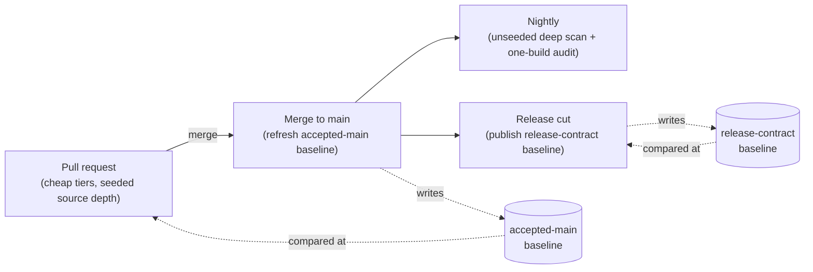

# Where in the Pipeline

A compatibility check can run at four moments in a library's life, and each
one answers a different question at a different cost. This page places
them, says what each catches, and explains the one rule that keeps them
from fighting each other: a break caught *after* merge re-fails every
unrelated pull request until the baseline is refreshed.

## Four moments, two baselines



The **pull request** asks "does this change break the contract we accepted
so far?" — against the *accepted-main* baseline, the snapshot of whatever
last merged. **Merge to main** asks nothing new; its job is to refresh that
baseline so the next PR compares against the right thing. The **nightly**
asks "with all the evidence we can afford, is main still coherent?" — the
deep scan a PR gate cannot wait for. The **release cut** asks "what are we
promising, and did we keep the previous promise?" — against the
*release-contract* baseline, the snapshot of the last release, which is
the one consumers actually hold.

Two baselines, because they answer two questions: what has been accepted
into the tree, and what has been shipped.
[Baseline Management](../use/baseline-management.md) owns how each is
produced, stored, fetched and rotated; this page only places them.

## The PR gate

Run the cheap tiers always — the binary and the public headers see every
symbol, layout and header-AST break — and add source depth *seeded* by the
translation units the change touched, so the facts that reach neither a
binary nor a header AST (a removed public macro, inline function or
typedef, a changed template body) are checked where they changed without
replaying the whole tree. Without that seeded step those breaks are not
covered at all in the PR gate. The report must show breaks *and* additions: "0 breaks" is not
"nothing to review" ([Report the Surface, Not Only the Breaks](surface-growth.md)).

```bash
abicheck scan build/libfoo.so -H include/ --sources . \
  --against baseline.json --since origin/main --depth source
```

Without `--depth`, `scan` picks `auto`, which is risk-driven under a
`--since` seed and may stop short of the source tier; pin it. The
[GitHub Action](../use/github-action.md) equivalent is scan mode — `against`
and `since` are scan-only inputs, so a compare-mode `old-library`/`new-library`
pair cannot express the seeded scan:

```yaml
- uses: abicheck/abicheck@v1
  with:
    mode: scan
    new-library: build/libfoo.so
    new-header: include/
    sources: .
    depth: source
    since: origin/main
    against: baseline.json      # or abi-baseline: latest-release
```

What each depth reaches, and the exact command for every other
combination, is owned by
[Source-Scan Depth § Worked examples](../use/scan-levels.md#worked-examples);
the levels themselves are defined in
[Evidence & Detectability](evidence-and-detectability.md).

## Merge to main

Refresh the accepted-main baseline from the merged tree:

```bash
abicheck dump build/libfoo.so -H include/ -o main-baseline.json
```

When a PR is an intentional break, relax the *gate* — the
`intentional-breaking-change` label pattern that flips `fail-on-breaking`
off for that PR — and never skip the *check*: a skipped check leaves the
baseline stale, so the break lands on main unrecorded and every later PR
fails against it until someone re-baselines by hand.
[Baseline Management](../use/baseline-management.md#two-kinds-of-baseline-release-contract-vs-accepted-main)
explains the failure in full; the rollout order and the label recipe are
in [Rollout and Governance](rollout-and-governance.md).

## Nightly

The nightly is where the expensive evidence goes: the *unseeded* deep scan
(`--depth source` with no `--since`, which replays the whole target), and
the one-build audit (no `--against`) that lints a single build for
accidental exports, private-header leaks and unversioned symbols. This is
also where `--budget` belongs — it fails loudly on overflow rather than
shrinking scope — and where `--dry-run` tells you what a depth would cost
before you spend it.

```bash
abicheck scan libfoo.so -H include/ --sources . --depth source --budget 15m
```

## Release cut

Publish the release-contract baseline and compare the candidate against
the previous release under the release profile, which adds the release
recommendation (SONAME or SemVer action) to the report:

```bash
abicheck compare last-release.json build/libfoo.so -H include/ --profile release-cut
```

The published baseline is what the next release cut compares against, and
what consumers can fetch to check themselves.

## Cost against confidence

| Moment | Depth | What it catches | Cost |
|---|---|---|---|
| Pull request | binary + headers, source seeded by the diff | every symbol, layout and header-level break; source-only facts in the changed TUs | seconds to a few minutes |
| Merge to main | dump only | nothing new — keeps the PR gate honest | seconds |
| Nightly | unseeded source depth, one-build audit | source-only facts anywhere in the tree; hygiene of the build itself | the full replay |
| Release cut | source depth, release profile | the previous promise, plus the recommendation for the next one | the full replay |

Numbers are owned by [Performance](../contribute/performance.md); a scan
always states the depth it actually reached
([case147](../reference/examples/case147_scan_depth_ladder.md)), so a
report never claims more evidence than it had.

## Several libraries or profiles

A product of several libraries, or one library built under several
profiles, runs the same four moments per target and folds the results —
the declarative topology in `.abicheck.yml` is the
[project integration](../integration/concepts.md) layer, with the
[independent-targets](../integration/scenarios/multi-dso-project.md) and
[monorepo](../integration/scenarios/monorepo.md) scenarios as the two
shapes it takes. Which shape a *release* of several binaries is, and what
one contract across them means, is the subject of
[Products, Not Libraries](products-not-libraries.md).

## Now run it

When you are ready to wire a moment into a real project, the tool-track
guides carry the exact commands, flags and CI YAML:

| You want to… | Go to |
|--------------|-------|
| Pick the right command for your situation (binary compare → full source scan → combine evidence → plugin) | [Choose Your Workflow](../start/choose-your-workflow.md) |
| Run `abicheck scan` and pin a depth | [Source-Scan Depth](../use/scan-levels.md) |
| *Produce* the source facts — post-build replay, the `abicheck-cc` wrapper, or the Clang plugin | [Producing Source Facts](../use/producing-source-facts.md) |
| Fold build/source evidence into a baseline snapshot | [Source & Build Data](build-source-data.md) |
| Wire a **full source scan into GitHub Actions** — `sources`/`build-info`/`depth`, audit, estimate, cross-check gating | [GitHub Action: Source Scans](../use/github-action-source-scans.md) |
| Check a host↔plugin ABI contract | [Plugin Systems](../use/plugin-systems.md) |
| Gate CI on the right verdict tier (binary break vs. source/API break) | [CI Gating](../use/ci-gating.md) |

---

**Ladder:** ← [Assurance Beyond Static Checking: What Each Verification Method Actually Proves](assurance-methods.md) · Tier 5 · Practice · [Report the Surface, Not Only the Breaks](surface-growth.md) →
