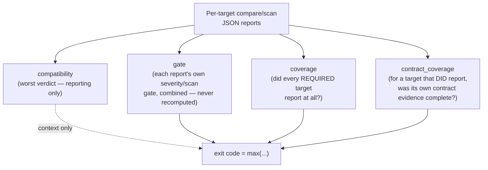

# Aggregate Reports: Folding a CI Matrix into One Gate

`abicheck aggregate` is a **report fan-in**, not another way to compare
binaries. It never parses a `.so`/`.dll`/`.dylib` and never runs a header
scan — it reads a directory of already-produced `compare`/`scan` JSON
reports (one per CI matrix leg) and reconciles them into one gate decision
and, when the reports came from more than one compiler/build profile, one
reconciled finding matrix.

## Three commands, three different jobs

It's easy to conflate `aggregate` with `compare`'s own multi-library mode or
with `project` — all three touch "more than one thing at once," but they
answer different questions:

| Command | Operand | Answers |
|---|---|---|
| `compare OLD NEW` (directory/package inputs) | Real binaries — several DSOs in one release bundle | "Does this **one release**, built once, stay compatible?" Fans a directory/package `compare` out per library through the same Tier-2 `service.run_compare` chokepoint a single-pair `compare` uses, and can additionally check cross-DSO relationships (a release-wide bundle/dependency analysis). |
| `project validate` / `project plan` | `.abicheck.yml`'s `targets:`/`profiles:`/`checks:` | "What *should* CI check, and how do the pieces fit together?" Validates the declared topology and generates the run plan a CI matrix executes — it doesn't read or produce a compare report itself. |
| `aggregate REPORTS_DIR` | A directory of already-produced `*.json` reports | "Given what the matrix actually reported, does the **whole run** pass?" Never analyzes a binary — it reconciles reports against the target set the matrix was supposed to build. |

Put differently: `compare`'s directory/package mode fans **out** within one
toolchain/platform leg (comparing several libraries built the same way in
one process); `aggregate` fans **in** across separate CI legs — different
platforms and/or different compiler profiles for the *same* target(s), each
of which produced its own report independently, possibly using `compare`'s
directory/package mode itself for that one leg.

`aggregate` replaces the hand-written post-matrix `for path in glob('*.json')`
heredoc some projects grew organically — that loop silently drops any target
whose build failed before uploading its report, passing green while a
required platform was never analyzed. `aggregate`'s one invariant is the
fix: **an expected target with no report is unavailable (unknown), never
folded into the result as compatible.**

## The four orthogonal axes

Every aggregate run answers four independent questions, and the exit code is
the worst contribution across all four (`max`, never additive):



- **compatibility** — the worst ABI verdict over the *analyzed* targets.
  Reported for context; it does not by itself decide the exit code, since a
  policy can make a `COMPATIBLE` report block (`addition=error`) or a
  `BREAKING` report pass (a demoted severity preset).
- **gate** — each report already carries its own gate decision
  (`severity.{exit_code,blocking,blocking_categories}`, or a `scan` report's
  own top-level `exit_code`). `aggregate` *combines* those — it never
  recomputes a gate from the compatibility verdict. Reading is fail-closed:
  a report whose gate block is present but corrupt makes that target
  *unavailable*, never silently reverting to the legacy path.
- **coverage** — did every **required** expected target actually report at
  all? A required target with no report is a coverage gap, exit `1` — never
  promoted to a fake ABI-break exit `4`.
- **contract_coverage** (schema `1.3`, ADR-049 Phase 7) — for a target that
  *did* report, was its own selected `--contract` domain's evidence
  complete? Read back from that report's own
  `contract_coverage_exit_contribution` and folded with `max`, exactly the
  way `compare`/`scan --against` fold theirs. **This is a different
  question from plain `coverage`**: a required target can report
  successfully (no coverage gap) while its own contract-evidence domain was
  still incomplete (a contract-coverage gap) — both can independently
  produce exit `1`, for unrelated reasons, and the JSON output records which
  targets caused which.

```json
{
  "aggregate_schema_version": "1.3",
  "status": "fail",
  "compatibility": {"verdict": "BREAKING", "analyzed_targets": 3},
  "coverage": {
    "status": "partial",
    "required_targets": 3,
    "analyzed_required_targets": 2,
    "missing_required_targets": ["windows-x86_64"],
    "blocking": true
  },
  "gate": {
    "passed": false,
    "exit_code": 4,
    "blocking_targets": ["linux-x86_64"],
    "coverage_blocking": true
  },
  "contract_coverage": {
    "exit_contribution": 0,
    "incomplete_targets": []
  },
  "targets": ["..."]
}
```

`contract_coverage` is present in every `--format json` output, with
`exit_contribution: 0` and an empty `incomplete_targets` list when no
target's report used `--contract-evaluation` — it is never omitted.

## Declaring the expected-target set

Exactly one of these is required (a bare `aggregate reports/` with none of
them is a usage error, exit `64` — with no declared target set the gate
cannot tell a missing required target from an intentionally absent one):

- `--manifest abi-targets.json` — `{"targets": [{"id": "linux-x86_64",
  "required": true}, ...]}`. Recommended: generate it once in the plan job
  and feed the same file to both the matrix and the gate.
- `--run-plan run-plan.json` — a `project plan` run-plan, projected
  internally into the same manifest shape.
- `--expect <ids>` (repeatable/comma-separated) with optional `--optional
  <ids>`.
- `--discovered-only` — aggregate whatever reports are present with **no
  required-target coverage gate** (a missing target is simply not counted,
  never a coverage failure). This disables only the `coverage` axis — the
  `contract_coverage` axis is unaffected: a report that *is* present with
  an incomplete contract-evidence domain still floors the exit at `1`, the
  same as in the declared-target-set modes.

`--on-missing-required warn` downgrades a coverage gap to advisory.
`--on-unexpected-target` (`include`/`warn`/`fail`/`ignore`, default
`include`) controls a report whose target isn't in the expected set.

## Reconciling findings across compiler/build profiles

When report ids follow the shape `target@profile#channel@depth` (produced by
`project plan`'s matrix — see [Project Targets
Schema](../reference/project-targets-schema.md)), `aggregate` groups them
back into two additional, **reporting-only** blocks that don't affect the
exit code: `profile_matrix` (one entry per logical target, across profiles)
and `finding_matrix` (one entry per distinct *finding*, reconciled across
profiles). This is the part of `aggregate` worth understanding on its own —
it answers "is this break universal, or specific to one compiler/platform?"

### How two findings from different profiles become one entry

A finding's identity for reconciliation is the same tiered
canonical/normalized/reduced identity `diff_filtering.py` already uses as
its own cross-detector dedup key (ADR-049 Phase 2) — computed from `kind`,
`symbol`, `description`, `old_value`/`new_value`, `source_location`, and
`affected_symbols`, read back off each report's `changes[]` entries. Two
reports naming the *same* symbol removal on GCC and on Clang reconcile to
one `finding_matrix` entry with `affected_profiles` naming both.

A **separate**, narrower mechanism handles cross-ABI mangling: a
`cross_abi_declaration` (an Itanium/MSVC-mangling-independent qualified
name, e.g. both `_ZN3lib3addEii` and `?add@lib@@YAHHH@Z` reduce to
`lib::add`) links declarations across mangling schemes for *display*, but
is deliberately **never used to merge two findings' identities** — it can
only make an ambiguous case withhold a "clean" verdict, never claim
provable sameness it can't back up. A true spelling-equivalence merge (e.g.
macOS's extra leading underscore on an otherwise-identical mangled symbol)
is handled separately, and only when the two spellings are exactly
equivalent.

### The `scope` field

Every `finding_matrix` entry gets exactly one `scope`, resolved by strict
precedence — `undetermined` always wins if it applies, since an unclear
profile can never be reported as either affected or clean:

| `scope` | Meaning | Precedence |
|---|---|---|
| `undetermined` | At least one profile's report was incomplete for this finding (missing, unreadable, not-comparable, or a report format — like a compare-release bundle — that's never `complete`). | Highest — wins over everything else. |
| `all_profiles` | Every profile carries this finding; no profile is confirmed clean of it. | |
| `partial` | Two or more profiles are affected, and at least one other profile is confirmed clean. | |
| `profile_specific` | Exactly one profile is affected, and at least one other is confirmed clean. | Lowest. |

The critical, unssuppressible invariant: **`unaffected_profiles`** requires
a profile's report to be *fully known* (every check for that profile
`complete=True`) — a positive "checked and clean" claim. A profile that
can't clear that bar goes to **`undetermined_profiles`** instead, never
`unaffected_profiles`. Only completeness can *clear* a profile of a
finding; a finding — even from an incomplete report — can always *convict*
one.

### Four worked outcomes

1. **One removal, both GCC and Clang report it** → `scope: all_profiles`,
   `affected_profiles: ["linux-gcc14", "linux-clang20"]`,
   `unaffected_profiles: []`.
2. **A layout break only under MSVC** (GCC/Clang unaffected and their
   reports are complete) → `scope: profile_specific`,
   `affected_profiles: ["windows-msvc"]`,
   `unaffected_profiles: ["linux-gcc14", "linux-clang20"]`.
3. **GCC reports `func_removed`; a stripped Clang lane reports the narrower
   `func_removed_elf_only`** — these reconcile to *one* finding entry (same
   underlying identity, different evidence tier surfaced the same fact
   differently) rather than appearing as two unrelated rows.
4. **The Windows leg's report was never produced** (build failed before
   upload) → that profile lands in `undetermined_profiles` for *every*
   finding in the matrix, never in `unaffected_profiles` — a report that
   was never produced proves nothing was clean.

Neither `profile_matrix` nor `finding_matrix` changes the exit code — they
are reporting views over the same gate/coverage/contract_coverage axes
above. The full field list for both blocks is in
[`aggregate_report.schema.json`](../reference/schemas/v1/aggregate_report.schema.json).

## CLI reference

```bash
abicheck aggregate REPORTS_DIR \
  --manifest abi-targets.json \
  --on-missing-required fail \
  --on-unexpected-target include \
  --format json -o aggregate.json
```

| Flag | Default | Notes |
|---|:---:|---|
| `--manifest PATH` | — | The single source of truth for the expected-target set. |
| `--run-plan PATH` | — | Alternative to `--manifest`: a `project plan` run-plan.json. |
| `--expect <ids>` / `--optional <ids>` | — | Inline alternative to a manifest file. |
| `--discovered-only` | — | No required-target coverage gate (contract coverage still applies). |
| `--report-prefix` | `abi-report-` | Stripped from a report's filename stem when it has no self-identified `target_id`. |
| `--on-missing-required` | `fail` | `fail` \| `warn`. |
| `--on-unexpected-target` | `include` | `include` \| `warn` \| `fail` \| `ignore`. |
| `--format` | `text` | `text` \| `json`. |

See [Exit Codes → `abicheck aggregate`](../reference/exit-codes.md#abicheck-aggregate)
for the exhaustive exit-code matrix, and [GitHub Action:
Recipes](github-action-recipes.md) for the full fan-out/fan-in CI workflow
(matrix job → per-leg report upload → gate job).

## See also

- [Exit Codes](../reference/exit-codes.md) — the canonical per-axis exit-code contract
- [Project Targets Schema](../reference/project-targets-schema.md) — `profiles:`/`checks:`, the source of `target@profile#channel@depth` report ids
- [GitHub Action: Recipes](github-action-recipes.md) — the worked matrix + gate workflow
- [MCP Integration](mcp-integration.md#abi_aggregate--fold-per-target-reports-into-one-gate-decision) — the `abi_aggregate` tool
- [Compatibility Evaluation Config](../reference/compatibility-evaluation-config.md) — what feeds a report's `contract_coverage_exit_contribution`
