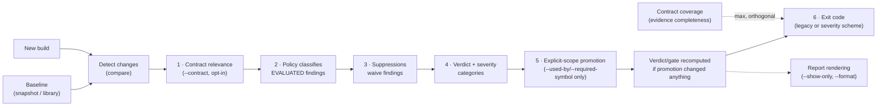

# CI Gating: How the Pieces Fit Together

Several mechanisms decide what fails your build: **baselines** (what you
compare against), **contract relevance** (whether a change even belongs to
your declared compatibility contract — opt-in; see [Contract-Aware
Compatibility](../learn/contract-aware-compatibility.md) for the mental
model), **policy** (how an evaluated change is classified), **suppressions**
(which changes are waived), **severity** (which categories set the exit
code), and **contract coverage** (whether there was enough evidence to make
a contract decision at all — its own, orthogonal axis). Each has its own
reference page; this page is the map — what runs in what order, and how the
knobs interact.



## The order of operations

It starts with detection: `abicheck compare BASELINE NEW` diffs the two ABI
surfaces and produces raw changes. The baseline side is a snapshot or a
library (there is no CLI baseline registry anymore — keep JSON snapshots
yourself, plain files, your own storage/naming convention) — see [Baseline
Management](baseline-management.md). The detected changes then flow through
the stages below (the numbers match the diagram above), which is the
normative order `contract_pipeline.py` fixes (ADR-049 D9) for the ordinary,
unscoped path:

1. **Classify contract relevance — opt-in, `--contract`.** Only
   when this flag is set: each finding is classified against the selected
   [contract mode](../reference/compatibility-evaluation-config.md)
   (`public`/`exports`/`all`, or the legacy `--scope-public-headers` alias)
   as one of five values — `IN_CONTRACT`, `NOT_APPLICABLE`,
   `PROVEN_OUT_OF_CONTRACT`, `UNKNOWN_UNPROVEN`, or `UNKNOWN_UNRESOLVED`.
   Only `IN_CONTRACT` and `NOT_APPLICABLE` are `EVALUATED`; the other three —
   including `PROVEN_OUT_OF_CONTRACT` — are `NOT_EVALUATED`: their
   `compatibility_decision` is JSON `null` and they contribute `0` to the
   gate, but they stay listed in the report with the reason code that says
   why. Without `--contract`, every finding is `EVALUATED` and
   this stage is a no-op — every exit code is unchanged from before this
   feature existed.
2. **Classify (policy).** The active [policy profile](policies.md)
   (`--policy strict_abi|sdk_vendor|plugin_abi` or a custom
   `--policy`) maps each *evaluated* change kind to its impact — the
   same change can be `API_BREAK` under `strict_abi` but `COMPATIBLE` under
   `sdk_vendor`. A `NOT_EVALUATED` finding is not scored by policy at all.
3. **Waive (suppressions).** [Suppression rules](suppressions.md)
   (`--suppress FILE`) remove matching changes **before** the verdict and
   severity counts are computed. A suppressed breaking change does not fail
   the build; it is tallied separately (`suppressed_count` in the JSON
   output). Suppression cannot reach a *contract-coverage* failure (below) —
   that is not a `Change`, so the suppression machinery structurally cannot
   see one.
4. **Score (verdict + severity).** The surviving, evaluated changes produce
   the overall [verdict](../learn/verdicts.md) (`NO_CHANGE` … `BREAKING`)
   and, when [severity](severity.md) is configured, per-category
   (`abi_breaking` / `potential_breaking` / `quality_issues` / `addition`)
   severity levels. `compare()` returns here for a plain, unscoped run.
5. **Explicit-scope promotion — `compare --used-by`/`--required-symbol(s)`
   only, and only after step 4 returned.** This is evidence *precedence*,
   not a step earlier in the pipeline: a `--used-by`/`--required-symbol`
   run has been *told* what the contract is (a concrete consumer's imports,
   or an explicit entrypoint list — ADR-049 §4.3), and that outranks
   whatever the snapshot-derived relevance in step 1 concluded on its own.
   For a finding already carrying a relevance (i.e. `--contract`
   was also set), a match against that explicit scope *promotes* it to
   `IN_CONTRACT` — never demotes — and the affected verdict/gate is then
   recomputed, monotonically: promotion can only raise it. Without
   `--contract`, findings carry no relevance to promote, so this
   step has nothing to do.
6. **Exit.** The exit code comes from one of the two schemes below, folded
   with the orthogonal contract-coverage contribution (next section) —
   computed over the promoted, scoped result for a `--used-by`/
   `--required-symbol` run.

**Contract coverage runs alongside, not inside, this chain.** Under
`--contract`, if the selected domain's required evidence is
incomplete (missing, partial, stale, or contradictory), `compare`/
`scan --against` contribute an additional, independent exit `1` — folded
with `max` against whatever the six stages above produced, so it can raise a
clean `0` to `1` but never lowers a `2`/`4`. This is a genuinely different
question from suppression or policy: those decide what an *observed* finding
means, while contract coverage asks whether there was enough evidence to
make that decision at all. See [Exit Codes → Contract-coverage
contribution](../reference/exit-codes.md#contract-coverage-contribution-adr-049)
for the full contract.

The important distinction to hold onto: **out-of-contract**, **suppressed**,
and **not-checkable** are three different reasons a finding does not block
CI, and they should not be collapsed into one mental "ignored" bucket —
each is visible in the report under a different field
(`contract_relevance`, `suppressed_count`, `contract_coverage_failures`).

**Display filtering is outside the pipeline.** `--show-only`, `--profile
quick`'s one-line summary, `--report-mode`, and `--format` change what the
report *renders*, never the verdict or the exit code.

!!! tip "Shortcut: `--profile ci-gate`"
    A single `--profile ci-gate` bundles the common gating knobs
    (`--depth headers --format review --severity-preset default`) so you
    don't retype them — an explicit flag still overrides the profile. It is a
    single-pair convenience; for a directory/package (release) gate, configure
    the same defaults in `.abicheck.yml`. See the `--profile` section of the
    [CLI usage guide](cli-usage.md).

## The two exit-code schemes

`compare` has two exit-code regimes, and the choice between them is fully
automatic: **any active severity setting — a `--severity-*` flag *or* a
severity value in `.abicheck.yml` (or a `kind: gate` pack's
`gate.severity.<category>`) — switches from the first to the second.** There
is no manual override any more (a `--exit-code-scheme`/`exit_code_scheme`
selector previously let you pin one scheme regardless of severity
configuration; it was removed — the algorithm now always follows whether a
severity setting is in effect, and nothing else):

| Scheme | Active when | Codes |
|---|---|---|
| **Legacy (verdict-based)** | No severity setting active anywhere | `0` compatible / `2` `API_BREAK` / `4` `BREAKING` |
| **Severity-based** | Any severity setting active (CLI flag, `.abicheck.yml` value, or gate pack) | `0` no error-level findings / `1` error in `addition`·`quality_issues` only / `2` error in `potential_breaking` / `4` error in `abi_breaking` |

In both schemes `0` passes and `4` is worst — but under the severity scheme
exit `1` means an error-level *finding*, whereas under the legacy scheme `1`
is a tool/runtime error, never a verdict (usage errors exit `64`). Since
there is no pin, the way to guarantee a given scheme is to control whether a
severity setting is present at all — see the recipes below.
Full matrix, including app/plugin-scoped comparisons (`compare --used-by`/
`--required-symbol`), `deps`, `compat`, and multi-library codes:
[Exit Codes](../reference/exit-codes.md).

## How the knobs interact

- **Contract relevance → policy.** Only `EVALUATED` findings ever reach
  policy classification; a `NOT_EVALUATED` finding (out-of-contract or
  unresolved) never gets a `ChangeKind` verdict at all, so downgrading a kind
  in a custom policy has no effect on a finding contract relevance already
  excluded. This stage is opt-in (`--contract`) and off by
  default — every other bullet below applies unconditionally.
- **Policy → severity.** Severity categorizes changes *after* the policy has
  classified them. If `sdk_vendor` downgrades a kind from `potential_breaking`
  to `quality_issues`, the default preset then treats it as `warning`, not
  `error` — so `--policy sdk_vendor --severity-preset default` will not fail
  on it, while `--severity-preset strict` (everything `error`) still will.
  See [Severity → Policy interaction](severity.md#policy-interaction).
- **Policy → suppressions.** Independent: suppressions match on
  symbol/type/kind/location, regardless of how the policy classified the
  change. A suppression written under one policy keeps working if you switch
  policies.
- **Suppressions → verdict, severity, and exit code.** Suppressed changes are
  removed before scoring, so they affect *all* downstream outputs: the
  verdict, the severity category counts, and therefore the exit code — under
  either scheme. Guard the waiver list itself with `suppression.strict: true`
  (fail on unused/expired rules) and `suppression.require_justification: true`.
- **Baselines → everything.** All of the above only gates what changed
  *relative to the baseline you chose*. Compare against the last release (not
  the previous commit) to catch cumulative drift; see
  [Storing Baselines](baseline-storage.md) for storage workflows.

## Recipes

**Breakage-only gate** — report everything, fail only on binary ABI breaks:

```yaml
# .abicheck.yml
severity:
  preset: info-only
  abi_breaking: error
```

```bash
abicheck compare baseline.json build/libfoo.so --header new=include/
```

**Fail on source-level breaks too** (the legacy scheme, active by default
whenever no severity setting is configured — nothing to pin):

```bash
abicheck compare baseline.json build/libfoo.so --header new=include/
  # 0 / 2 (API_BREAK) / 4 (BREAKING)
```

**Strict API-surface governance** — also fail when new public API appears.
Note that any severity setting switches to the severity scheme, where
`potential_breaking` (which covers `API_BREAK`) defaults to `warning` — raise
it to `error` too, or a source-level break that failed under the legacy
scheme would now exit `0`:

```yaml
# .abicheck.yml
severity:
  potential_breaking: error
  addition: error
```

```bash
abicheck compare baseline.json build/libfoo.so --header new=include/
```

**Vendor-friendly gate with audited waivers**:

```yaml
# .abicheck.yml
suppression:
  strict: true
  require_justification: true
```

```bash
abicheck compare baseline.json build/libfoo.so --header new=include/ \
  --policy sdk_vendor --suppress suppressions.yaml
```

More recipes: [Choose Your Workflow → How should CI behave](../start/choose-your-workflow.md)
and the policy recipes in [Getting Started](../start/getting-started.md).

!!! note "abicheck's own CI also gates its CLI surface"
    Separately from anything on this page, abicheck's own repo runs
    `.github/workflows/cli-interface-check.yml`, which diffs the CLI surface
    between a PR's base and head and labels/comments the PR whenever a
    user-facing flag or command changes — a repo-internal mechanic for
    abicheck contributors, not something you configure for your own project.

!!! warning "A label should relax the gate, not skip the check"
    A common mistake: skipping the whole comparison job whenever a PR
    carries an `intentional-breaking-change` label. That only defers the
    problem — every subsequent, unrelated PR still diffs against the old
    (pre-break) baseline, sees the same accepted break again, and fails.
    Keep the comparison running unconditionally; use the label only to
    relax **every** baseline's gate for that one PR (e.g. lower
    `fail-on-breaking` on both the release-contract and accepted-main jobs —
    that PR is expected to report a break against both), and refresh the
    baseline other PRs compare against once the break lands on the default
    branch, so the label doesn't carry over to unrelated PRs. See [Baseline
    Management → Two kinds of
    baseline](baseline-management.md#two-kinds-of-baseline-release-contract-vs-accepted-main)
    for the release-contract vs. accepted-main split this implies.

## Related pages

- [Baseline Management](baseline-management.md) — producing, storing, and
  pulling the comparison baseline
- [Policy Profiles](policies.md) — built-in profiles and custom YAML policies
- [Suppressions](suppressions.md) — schema, matching semantics, expiry,
  lifecycle
- [Severity Configuration](severity.md) — categories, presets, per-category
  flags
- [Compatibility Evaluation Config](../reference/compatibility-evaluation-config.md) —
  the full field vocabulary and precedence for contract relevance/coverage
- [Exit Codes](../reference/exit-codes.md) — the canonical exit-code matrix
- [GitHub Action](github-action.md) — the same pipeline via `with:` inputs
