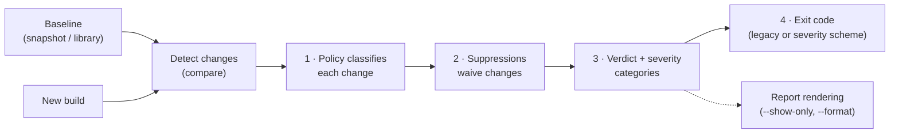

# CI Gating: How the Pieces Fit Together

Four mechanisms decide what fails your build: **baselines** (what you compare
against), **policies** (how each change is classified), **suppressions** (which
changes are waived), and **severity** (which categories set the exit code).
Each has its own reference page; this page is the map — what runs in what
order, and how the knobs interact.



## The order of operations

It starts with detection: `abicheck compare BASELINE NEW` diffs the two ABI
surfaces and produces raw changes. The baseline side is a snapshot or a
library (there is no CLI baseline registry anymore — keep JSON snapshots
yourself, plain files, your own storage/naming convention) — see [Baseline
Management](baseline-management.md). The detected changes then flow through
four stages (the numbers match the diagram above):

1. **Classify (policy).** The active [policy profile](policies.md)
   (`--policy strict_abi|sdk_vendor|plugin_abi` or a custom
   `--policy-file`) maps each change kind to its impact — the same change can
   be `API_BREAK` under `strict_abi` but `COMPATIBLE` under `sdk_vendor`.
2. **Waive (suppressions).** [Suppression rules](suppressions.md)
   (`--suppress FILE`) remove matching changes **before** the verdict and
   severity counts are computed. A suppressed breaking change does not fail
   the build; it is tallied separately (`suppressed_count` in the JSON
   output).
3. **Score (verdict + severity).** The surviving changes produce the overall
   [verdict](../concepts/verdicts.md) (`NO_CHANGE` … `BREAKING`) and, when
   [severity](severity.md) is configured, per-category
   (`abi_breaking` / `potential_breaking` / `quality_issues` / `addition`)
   severity levels.
4. **Exit.** The exit code comes from one of the two schemes below.

**Display filtering is outside the pipeline.** `--show-only`, `--stat`,
`--report-mode`, and `--format` change what the report *renders*, never the
verdict or the exit code.

!!! tip "Shortcut: `--profile ci-gate`"
    A single `--profile ci-gate` bundles the common gating knobs
    (`--depth headers --format review --exit-code-scheme severity`) so you
    don't retype them — an explicit flag still overrides the profile. It is a
    single-pair convenience; for a directory/package (release) gate, configure
    the same defaults in `.abicheck.yml`. See the `--profile` section of the
    [CLI usage guide](cli-usage.md).

## The two exit-code schemes

`compare` has two exit-code regimes, and **any active severity setting — a
`--severity-*` flag *or* a severity value in `.abicheck.yml` — silently
switches from the first to the second** — the most common source of confusion
when wiring up CI:

| Scheme | Active when | Codes |
|---|---|---|
| **Legacy (verdict-based)** | No severity setting active (neither a `--severity-*` flag nor a config severity value) | `0` compatible / `2` `API_BREAK` / `4` `BREAKING` |
| **Severity-based** | Any severity setting active (CLI flag or `.abicheck.yml` value) | `0` no error-level findings / `1` error in `addition`·`quality_issues` only / `2` error in `potential_breaking` / `4` error in `abi_breaking` |

In both schemes `0` passes and `4` is worst — but under the severity scheme
exit `1` means an error-level *finding*, whereas under the legacy scheme `1`
is a tool/runtime error, never a verdict (usage errors exit `64`). Pin the
regime explicitly with `--exit-code-scheme legacy|severity` (or the
`exit_code_scheme` config key) so a later flag change can't silently flip it.
Full matrix, including app/plugin-scoped comparisons (`compare --used-by`/
`--required-symbol`), `deps`, `compat`, and multi-library codes:
[Exit Codes](../reference/exit-codes.md).

## How the knobs interact

- **Policy → severity.** Severity categorizes changes *after* the policy has
  classified them. If `sdk_vendor` downgrades a kind from `potential_breaking`
  to `quality_issues`, the default preset then treats it as `warning`, not
  `error` — so `--policy sdk_vendor --severity-preset default` will not fail
  on it, while `--severity-preset strict` (everything `error`) still will.
  See [Severity → Policy interaction](severity.md#policy-interaction).
- **Policy → suppressions.** Independent: suppressions match on
  symbol/type/kind/location, regardless of how the policy classified the
  change. A suppression written under one policy keeps working if you switch
  policies.
- **Suppressions → verdict, severity, and exit code.** Suppressed changes are
  removed before scoring, so they affect *all* downstream outputs: the
  verdict, the severity category counts, and therefore the exit code — under
  either scheme. Guard the waiver list itself with `--strict-suppressions`
  (fail on unused/expired rules) and `--require-justification`.
- **Baselines → everything.** All of the above only gates what changed
  *relative to the baseline you chose*. Compare against the last release (not
  the previous commit) to catch cumulative drift; see
  [Storing Baselines](baseline-storage.md) for storage workflows.

## Recipes

**Breakage-only gate** — report everything, fail only on binary ABI breaks:

```bash
abicheck compare baseline.json build/libfoo.so --header new=include/ \
  --severity-preset info-only --severity-abi-breaking error
```

**Fail on source-level breaks too** (the legacy default behaviour, pinned
explicitly):

```bash
abicheck compare baseline.json build/libfoo.so --header new=include/ \
  --exit-code-scheme legacy    # 0 / 2 (API_BREAK) / 4 (BREAKING)
```

**Strict API-surface governance** — also fail when new public API appears.
Note that any `--severity-*` flag switches to the severity scheme, where
`potential_breaking` (which covers `API_BREAK`) defaults to `warning` — raise
it to `error` too, or a source-level break that failed under the legacy
scheme would now exit `0`:

```bash
abicheck compare baseline.json build/libfoo.so --header new=include/ \
  --severity-potential-breaking error \
  --severity-addition error
```

**Vendor-friendly gate with audited waivers**:

```bash
abicheck compare baseline.json build/libfoo.so --header new=include/ \
  --policy sdk_vendor --suppress suppressions.yaml \
  --strict-suppressions --require-justification
```

More recipes: [Choose Your Workflow → How should CI behave](choose-your-workflow.md)
and the policy recipes in [Getting Started](../getting-started.md).

!!! note "abicheck's own CI also gates its CLI surface"
    Separately from anything on this page, abicheck's own repo runs
    `.github/workflows/cli-interface-check.yml`, which diffs the CLI surface
    between a PR's base and head and labels/comments the PR whenever a
    user-facing flag or command changes — a repo-internal mechanic for
    abicheck contributors, not something you configure for your own project.

!!! warning "A label should relax the gate, not skip the check"
    A common mistake: skipping the whole comparison job whenever a PR
    carries an `intentional-breaking-change` label. That only defers the
    problem — every subsequent, unrelated PR still diffs against the old
    (pre-break) baseline, sees the same accepted break again, and fails.
    Keep the comparison running unconditionally; use the label only to
    relax **every** baseline's gate for that one PR (e.g. lower
    `fail-on-breaking` on both the release-contract and accepted-main jobs —
    that PR is expected to report a break against both), and refresh the
    baseline other PRs compare against once the break lands on the default
    branch, so the label doesn't carry over to unrelated PRs. See [Baseline
    Management → Two kinds of
    baseline](baseline-management.md#two-kinds-of-baseline-release-contract-vs-accepted-main)
    for the release-contract vs. accepted-main split this implies.

## Related pages

- [Baseline Management](baseline-management.md) — producing, storing, and
  pulling the comparison baseline
- [Policy Profiles](policies.md) — built-in profiles and custom YAML policies
- [Suppressions](suppressions.md) — schema, matching semantics, expiry,
  lifecycle
- [Severity Configuration](severity.md) — categories, presets, per-category
  flags
- [Exit Codes](../reference/exit-codes.md) — the canonical exit-code matrix
- [GitHub Action](github-action.md) — the same pipeline via `with:` inputs
