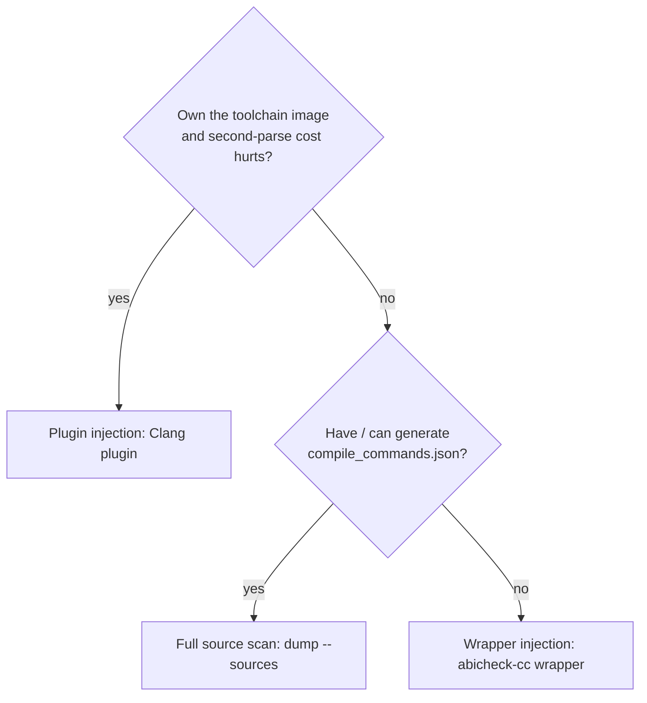

# Producing source facts (Full source scan / Wrapper injection / Plugin injection)

`abicheck`'s deepest evidence — **L4** (the source-ABI replay: inline bodies,
default arguments, templates, `constexpr`, macro values) and **L5** (the source
graph: call/include/dependency edges) — is derived from your **source**, not from
the shipped binary. This page is the practical guide to *choosing and using* a
producer. For what the layers mean, see
[Build Info & Sources](../concepts/build-source-data.md) and
[Evidence & Detectability](../concepts/evidence-and-detectability.md); for a
worked example of the concrete L4/L5 data these producers yield (and what the
lower levels miss), see the
[level-by-level walk-through](../concepts/what-each-level-sees.md).
For how a scan *consumes* it, see [Source-scan depth](scan-levels.md). For the
deeper operational reference on setting up the Clang plugin (per-build-system
wiring, the Bazel/ccache traps, `.abicheck.yml` project-contract blocks,
out-of-band packs, and external CLI extractors), see
[Build Evidence Setup](build-evidence-setup.md).

Whichever producer you pick, the **output contract is identical** — an
`abicheck_inputs/` pack (or an inline `--sources` collection) that
`abicheck dump --build-info ./abicheck_inputs/` folds onto the binary-side
snapshot in one step (auto-detecting the pack; see
[Then: fold the facts onto the binary](#then-fold-the-facts-onto-the-binary)
below). The producer is an implementation choice; the ingest never changes.

## Which producer? (pick one)

| | Full source scan — replay | Wrapper injection — `abicheck-cc` wrapper | Plugin injection — Clang plugin |
|---|---|---|---|
| **How** | `abicheck dump --sources` re-parses each TU from `compile_commands.json` inline | wrap your compiler; it runs the extractor as a companion action | `-fplugin` reads the AST the compile already built |
| **Extra parse** | a full second parse (~5 s/TU on template-heavy C++) | a full second parse | **none** — zero-cost byproduct of the build |
| **Needs** | a compile DB (auto-inferred for cmake/make/bazel) | to front your build with `abicheck-cc` | a plugin built against your exact Clang major |
| **Portable?** | ✅ any toolchain | ✅ any compiler | ❌ ABI-locked to the loading Clang's LLVM major |
| **Reach for it when** | the default — you have (or can generate) a compile DB | you own the build command but not a compile DB | the second-parse cost is measurable on a big build **and** you own the toolchain image |



Full source scan is the supported default. Wrapper injection and Plugin
injection are optimizations for specific situations — they exist to remove a
step (a manual compile DB) or a cost (the second parse), never to change the
result.

## Full source scan — replay from a compile database

```bash
# Source-only: infer the compile DB, replay L4, fold the L5 graph, all inline.
abicheck dump --sources . -H include/ --depth source -o libfoo.src.json

# Or against a real binary in one shot (L0–L5 in one snapshot). Unseeded
# `--depth source` already analyses the whole target (the old separate `full`
# rung collapsed into `source` — ADR-043):
abicheck dump libfoo.so -H include/ --sources . --compile-db build/compile_commands.json \
  --depth source -o libfoo.full.json
```

With just `--sources`, abicheck infers and runs the build-system query itself
(`cmake -DCMAKE_EXPORT_COMPILE_COMMANDS=ON`, `bazel aquery`, or a `make -n`
transcript). Pass `--compile-db` when you already have a `compile_commands.json`
that isn't under the tree — it is the most faithful input.

## Wrapper injection — the `abicheck-cc` compiler wrapper

Front your normal build command with `abicheck-cc`; it compiles as usual and runs
the extractor as a companion action, dropping an `abicheck_inputs/` pack:

```bash
export ABICHECK_INPUTS_DIR=abicheck_inputs
export ABICHECK_CC_HEADERS=include      # the public-header roots (see the trap below)
export ABICHECK_CC_LIBRARY=foo
abicheck-cc c++ -std=c++17 -Iinclude -c src/foo.cpp -o foo.o
```

### Wiring it into a real build system

You rarely invoke the compiler by hand — point the build system's compiler
variable at the wrapper so *every* TU is captured during a normal build. The
wrapper is argv-transparent (it prepends nothing and preserves the exit code),
so it drops in wherever the compiler name is configured:

```bash
# GNU make / autotools — override CC/CXX on the command line:
make CC="abicheck-cc gcc" CXX="abicheck-cc g++"

# EPICS / other make systems that name the C++ compiler CCC:
make CC="abicheck-cc gcc" CCC="abicheck-cc g++"

# CMake — set the launcher (no need to reconfigure the compiler itself). Set it
# for every language your targets use — CXX and, for C or mixed C/C++ targets, C:
cmake -DCMAKE_CXX_COMPILER_LAUNCHER="abicheck-cc" \
      -DCMAKE_C_COMPILER_LAUNCHER="abicheck-cc" -S . -B build && cmake --build build
```

The `ABICHECK_CC_*` variables above are read from the environment, so `export`
them once before the build. Set `ABICHECK_CC_HEADERS` to the public-header root
**as the compiler resolves it** (see the trap below).

### Picking the extractor (`ABICHECK_CC_EXTRACTOR`)

The wrapper runs a second front-end to extract facts. `ABICHECK_CC_EXTRACTOR`
selects which:

| Value | Uses |
|-------|------|
| `auto` *(default)* | the most-capable **available** backend: clang if present, else castxml |
| `castxml` | castxml (the default L2 backend) — declarations/types/const values only; an unavailable castxml is **not** upgraded to clang (that would silently change extractor semantics) — extraction is disabled instead |
| `clang` | `clang -ast-dump=json` — richest source facts (also inline/template/constexpr bodies, macros, constructor mangling); falls back to castxml if clang is unavailable |

`auto` prefers clang over castxml when both are present, because clang observes
strictly more source facts (see the capability table in
[Build Info & Sources](../concepts/build-source-data.md)); this is the opposite
precedence from `--ast-frontend auto` (header-only L2 parsing), which always
prefers castxml and never falls back merely because it is absent. Set
`ABICHECK_CC_EXTRACTOR=castxml` explicitly to pin the L2-consistent backend.

!!! warning "Extraction concurrency is bound by your build's `-jN`, not by `ABICHECK_L4_JOBS`"
    Each `abicheck-cc` invocation extracts its source TUs synchronously, so a
    parallel `make -jN` / `cmake --build -jN` runs **up to N** clang/castxml
    front-ends at once. `ABICHECK_L4_JOBS` only throttles the Full-source-scan
    `dump --sources` replay path — the wrapper does **not** read it. A
    template-heavy TU's clang JSON AST can need several GiB, so on a
    memory-constrained host cap the build parallelism (`-j1`/`-j2`) rather than
    reaching for `ABICHECK_L4_JOBS`.

## Plugin injection — the Clang facts plugin

A compiled plugin that emits the same facts from the AST Clang already built —
**no second parse**. It is **ABI-locked to the loading Clang's LLVM major**
(a plugin built against LLVM 18 only loads into `clang` 18) — that is the price
of the zero-parse path, and why Full source scan and Wrapper injection remain
the portable defaults. See [Build Evidence Setup](build-evidence-setup.md#producing-a-pack-the-clang-plugin-zero-extra-parse)
for the build-it-once / wire-it-into-CMake-Make-Bazel / fold-it-in walkthrough,
including the Bazel-sandbox and ccache/sccache traps.

This also works with vendor compilers built on top of Clang, e.g. Intel's
`icpx`/`icx` oneAPI compilers — the `collect-facts` Action (below) detects the
real LLVM major from the compiler's own `__clang_major__` macro rather than
parsing `--version` (whose banner for `icpx`/`icx` reports a vendor product
version, not an LLVM number), and can build the plugin against a vendor's
bundled LLVM/Clang CMake package via `llvm-cmake-prefix` instead of an apt
package that vendor major may not even have. `llvm-cmake-prefix` auto-detects
from `$CMPLR_ROOT` when a vendor toolchain happens to bundle one there (a
standard `lib/cmake/llvm` layout) — but a *stock* Intel oneAPI DPC++/C++
Compiler install does not usually qualify: it ships `IntelSYCL`/`IntelDPCPP`
CMake modules under `$CMPLR_ROOT/lib/cmake` instead, which configure compiler
flags for projects consuming `icpx`/`icx`, not an LLVM/Clang
plugin-development SDK. For a stock Intel install, expect to set
`llvm-cmake-prefix` explicitly, pointing at a separately obtained or built
LLVM+Clang CMake package matching the compiler's exact LLVM major.

## The one trap: public-roots must match how headers *resolve*

!!! warning "Point the public-header root at the resolved path, not the install dir"
    Wrapper injection (`ABICHECK_CC_HEADERS`) and Plugin injection
    (`public-roots=`) classify a declaration as public by the **physical path
    the compiler resolved its header
    to**. If an earlier `-I` makes `<foo/bar.h>` resolve to `src/foo/bar.h` while
    you set the root to the *installed* `include/`, the root matches **nothing**
    and the pack comes back **empty** — even though it all looks configured.
    Include *order* decides the resolved path, not the install layout.

    **Find the real path** with `-H`, then set the root to that directory:

    ```bash
    clang++ <your -I flags> -H -fsyntax-only src/foo.cpp 2>&1 | grep 'bar.h'
    # . ./src/foo/bar.h   →  public-roots=src/foo  (not include/)
    ```

    Since ADR-038's Plugin injection spec, the plugin **fails loud** here instead of silently: if
    `public-roots` matches zero declarations while header decls were seen outside
    the roots, it prints a `public-roots matched 0 declarations` diagnostic naming
    an example header and the `clang -H` tip, and records it in the pack's
    `diagnostics`.

    And if you omit `public-roots=` entirely, the plugin **auto-derives** roots
    from the compile's own `-I`/`-iquote` include dirs (compiler/system paths
    excluded) and emits a one-time inference note — so a forgotten flag yields a
    populated (if slightly broad) surface rather than an empty pack. Still pass an
    explicit `public-roots=` when you want the surface scoped precisely to your
    installed public headers.

## GitHub Actions: the `collect-facts` Action

The three producers above are CLI-level (`dump --sources`, the `abicheck-cc`
wrapper's environment variables, the plugin's `-fplugin=` flags) — wiring any
of them into CI by hand means writing shell to pick a producer, install its
dependencies, and (for the wrapper/plugin) export the right environment
variables before your build runs. `abicheck/abicheck/actions/collect-facts`
does that wiring once, so an integration doesn't need its own shell scripts
or a separately pinned plugin version:

Branch on `steps.facts.outputs.mode` rather than hard-coding a producer:
`replay` needs nothing further (pass `sources:` straight to `dump`/`scan`),
while `wrapper`/`clang-plugin` need the `phase: verify` step and
`build-info: <pack-path>`. Skipping the branch and always wiring
`build-info: ${{ steps.facts.outputs.pack-path }}` is a trap — for
`producer: auto` resolving to `replay` (the common case on a project with a
`compile_commands.json` or a CMake/Bazel build), `pack-path` is empty, so
`build-info` silently receives nothing and the dump proceeds with **no**
source facts at all, not an error:

```yaml
- uses: abicheck/abicheck/actions/collect-facts@<same-sha-as-below>
  id: facts
  with:
    phase: prepare
    producer: auto            # or: replay | wrapper | clang-plugin
    sources: .
    public-roots: |
      include
    output: abicheck_inputs

- name: Build
  # Always runs -- this produces build/libfoo.so itself, which the dump step
  # below needs regardless of producer. Do NOT gate this on
  # `steps.facts.outputs.mode == 'pack'`: `phase: prepare` only *exports* the
  # env vars/flags wrapper and clang-plugin need (see the notices it prints);
  # nothing invokes them for you, so the configure step below has to wire
  # them in explicitly per producer. producer: replay needs neither -- it
  # collects its facts separately, inline, from `sources:` at dump time
  # below -- but the binary still has to actually get built either way.
  run: |
    case "${{ steps.facts.outputs.producer }}" in
      wrapper)
        # abicheck-cc reads ABICHECK_CC_* (exported by phase: prepare above)
        # but only compiles anything it's actually invoked for -- CMake's
        # compiler-launcher hooks are what puts it in front of every call.
        cmake -DCMAKE_CXX_COMPILER_LAUNCHER=abicheck-cc \
              -DCMAKE_C_COMPILER_LAUNCHER=abicheck-cc -S . -B build
        ;;
      clang-plugin)
        # $ABICHECK_PLUGIN_FLAGS (exported by phase: prepare above) loads the
        # plugin into the real compiler; nothing does this automatically.
        cmake -DCMAKE_CXX_FLAGS="$ABICHECK_PLUGIN_FLAGS" -S . -B build
        ;;
      *)
        cmake -S . -B build
        ;;
    esac
    cmake --build build

- uses: abicheck/abicheck/actions/collect-facts@<same-sha-as-below>
  id: facts-verify
  if: steps.facts.outputs.mode == 'pack'
  with:
    phase: verify
    producer: ${{ steps.facts.outputs.producer }}
    output: abicheck_inputs

- uses: abicheck/abicheck@<same-sha-as-above>
  with:
    mode: dump
    new-library: build/libfoo.so
    header: include/
    # mode: inline (replay) -> pass sources directly; mode: pack (wrapper/
    # clang-plugin) -> pass the verified pack path. Never pass an empty
    # build-info -- that's the silent-no-facts trap above.
    sources: ${{ steps.facts.outputs.mode == 'inline' && '.' || '' }}
    build-info: ${{ steps.facts-verify.outputs.pack-path }}
```

Pin both `uses:` lines to the **same commit SHA** and there is exactly one
version to track: the Action builds the Clang plugin (when
`producer: clang-plugin`) from its own checked-out copy of
`contrib/abicheck-clang-plugin` at that SHA, not a separately versioned
`plugin_ref` — the scanner and the producer can never drift apart the way a
hand-rolled `plugin_ref: v0.5.0` variable next to a differently-pinned
`uses: abicheck/abicheck@v0.5.0` line can.

**`phase: prepare` / `phase: verify`, and why there are two steps.** Wrapper
and Clang-plugin injection both need *your* build command to run in between —
this Action cannot invoke it for you. `phase: prepare` resolves the producer,
installs what it needs (the matching `libclang-<N>-dev` for `clang-plugin`,
`castxml`/`clang` for `wrapper`), and exports the environment variables/flags
your build step reads; `phase: verify` (run after your build) checks the
resulting pack is non-empty and reports its path. `producer: replay` needs
neither — `phase: auto` (the default) completes it in one step, since replay
collects inline at `dump`/`scan`/`compare` time rather than producing a pack
ahead of time; pass `sources:` straight to the next abicheck step and skip
`collect-facts` for that producer entirely if you already know you're on the
replay path.

**`phase: auto` is only ever one step for `producer: replay`.** For
`producer: wrapper`/`clang-plugin` it cannot run your build for you either,
so it silently resolves to running `prepare` only — the same two-step
choreography above still applies, `phase: auto` just doesn't make that
obvious by itself. Don't assume a single `phase: auto` step is enough
without checking: the Action sets an `auto-completed` output (`'true'` when
the pack from this one step is actually ready to consume, `'false'` when
`phase: auto` only ran `prepare` and a build step + a second `phase: verify`
call are still needed) and prints a `::warning::` job annotation in the
`'false'` case. A workflow that always wants an explicit two-step shape for
wrapper/clang-plugin should just pass `phase: prepare`/`phase: verify`
directly instead of relying on `auto`'s resolution:

```yaml
- id: facts
  uses: abicheck/abicheck/actions/collect-facts@<sha>
  with:
    producer: wrapper
    phase: auto
    sources: .
- name: Check the pack is actually ready
  if: steps.facts.outputs.auto-completed != 'true'
  run: |
    echo "phase: auto only ran prepare for producer: ${{ steps.facts.outputs.producer }} -- add your build step, then a phase: verify call." >&2
    exit 1
```

**`producer: auto`** inspects `sources` for an existing compile database or a
CMake/Bazel project (→ `replay`) and falls back to `wrapper` otherwise. It
never auto-selects `clang-plugin` — "you own the toolchain image and the
second-parse cost is worth removing" is an operator decision the Action can't
infer, matching the [decision tree](#which-producer-pick-one) above.

## Then: fold the facts onto the binary

However you produced them, ingest is a single `dump` call — pass the
`abicheck_inputs/` pack as `--build-info` (auto-detected, no separate merge
step):

```bash
abicheck dump libfoo.so --build-info ./abicheck_inputs/ -o libfoo.baseline.json
```

This links each source declaration to the binary's exported symbol (matching
ctor/dtor ABI clone variants — `C1`/`C2`/`C3`, `D0`/`D1`/`D2` — so one source
constructor claims all of its exported symbols). The result is a single
self-contained `.baseline.json` carrying L0–L5, ready for
[`compare`](cli-usage.md) or [`scan --against`](scan-levels.md).

### Reading the L4 coverage numbers

The snapshot carries an L4 coverage summary under
`build_source.source_abi.coverage` (see below) — counters like
`matched_symbols: 471`, `exported_symbols: 834`, `unmatched_symbols: 0`.

Read it as **two different numbers**:

- **`matched`** — exports that map *directly* to a public source declaration.
  For a real C++ library this is often only ~50 %: the rest of the export table
  is compiler-synthesized (vtables/typeinfo/thunks) or stdlib/internal, which
  never carry a source declaration of their own. A low `matched` ratio is
  **not** a coverage gap.
- **`accounted` / `unmatched`** — the completeness number. Every export is
  either matched, *attributed* to its owner (synthesized RTTI/vtable, template
  instantiation, allocator interposer), or *classified* (stdlib/TBB dependency,
  internal/private export). `unmatched` is what's genuinely unexplained — aim
  for **0**.

The full breakdown lives in the resulting snapshot under
`build_source.source_abi.coverage` (and the per-symbol reasons under
`…mappings.non_public_symbol_to_reason` / `…synthesized_symbol_to_owner`):

```bash
python -c "import json,sys; \
c=json.load(open('libfoo.baseline.json'))['build_source']['source_abi']['coverage']; \
print(json.dumps(c, indent=2))"
```

If instead you see a warning that the pack carries **no public entities** or
matched **0/N** exports, that is the `public-roots` / `ABICHECK_CC_HEADERS`
resolution trap above — not an empty API.
