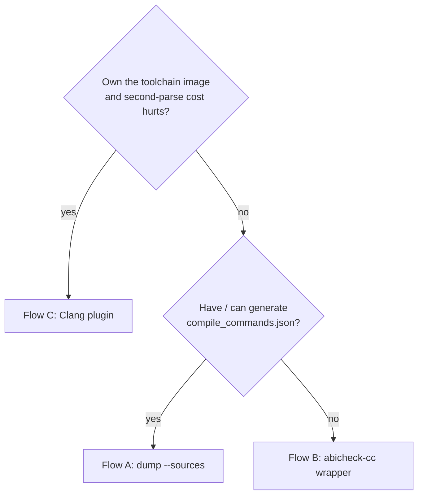

# Producing source facts (Flow A / B / C)

`abicheck`'s deepest evidence — **L4** (the source-ABI replay: inline bodies,
default arguments, templates, `constexpr`, macro values) and **L5** (the source
graph: call/include/dependency edges) — is derived from your **source**, not from
the shipped binary. This page is the practical guide to *producing* that source
evidence. For what the layers mean, see
[Build Info & Sources](../concepts/build-source-data.md) and
[Evidence & Detectability](../concepts/evidence-and-detectability.md); for how a
scan *consumes* it, see [Source-scan levels](scan-levels.md).

Whichever producer you pick, the **output contract is identical** — an
`abicheck_inputs/` pack (or an inline `--sources` collection) that
[`abicheck merge`](baseline-management.md) folds onto the binary-side snapshot.
The producer is an implementation choice; the ingest never changes.

## Which producer? (pick one)

| | Flow A — replay | Flow B — `abicheck-cc` wrapper | Flow C — Clang plugin |
|---|---|---|---|
| **How** | `abicheck dump --sources` / `collect` re-parses each TU from `compile_commands.json` | wrap your compiler; it runs the extractor as a companion action | `-fplugin` reads the AST the compile already built |
| **Extra parse** | a full second parse (~5 s/TU on template-heavy C++) | a full second parse | **none** — zero-cost byproduct of the build |
| **Needs** | a compile DB (auto-inferred for cmake/make/bazel) | to front your build with `abicheck-cc` | a plugin built against your exact Clang major |
| **Portable?** | ✅ any toolchain | ✅ any compiler | ❌ ABI-locked to the loading Clang's LLVM major |
| **Reach for it when** | the default — you have (or can generate) a compile DB | you own the build command but not a compile DB | the second-parse cost is measurable on a big build **and** you own the toolchain image |



Flow A is the supported default. Flow B and Flow C are optimizations for
specific situations — they exist to remove a step (a manual compile DB) or a cost
(the second parse), never to change the result.

## Flow A — replay from a compile database

```bash
# Source-only: infer the compile DB, replay L4, fold the L5 graph, all inline.
abicheck dump --sources . -H include/ --depth source -o libfoo.src.json

# Or against a real binary in one shot (L0–L5 in one snapshot):
abicheck dump libfoo.so -H include/ --sources . --compile-db build/compile_commands.json \
  --depth full -o libfoo.full.json
```

With just `--sources`, abicheck infers and runs the build-system query itself
(`cmake -DCMAKE_EXPORT_COMPILE_COMMANDS=ON`, `bazel aquery`, or a `make -n`
transcript). Pass `--compile-db` when you already have a `compile_commands.json`
that isn't under the tree — it is the most faithful input.

## Flow B — the `abicheck-cc` compiler wrapper

Front your normal build command with `abicheck-cc`; it compiles as usual and runs
the extractor as a companion action, dropping an `abicheck_inputs/` pack:

```bash
export ABICHECK_INPUTS_DIR=abicheck_inputs
export ABICHECK_CC_HEADERS=include      # the public-header roots (see the trap below)
export ABICHECK_CC_LIBRARY=foo
abicheck-cc c++ -std=c++17 -Iinclude -c src/foo.cpp -o foo.o
```

## Flow C — the Clang facts plugin

A compiled plugin that emits the same facts from the AST Clang already built —
**no second parse**. Build it once against your pinned Clang, then inject it:

```bash
clang++ -std=c++17 -Iinclude \
  -fplugin=./libabicheck-facts.so \
  -Xclang -plugin-arg-abicheck-facts -Xclang out=abicheck_inputs \
  -Xclang -plugin-arg-abicheck-facts -Xclang public-roots=include \
  -c src/foo.cpp -o foo.o
```

See [`contrib/abicheck-clang-plugin/README.md`](https://github.com/abicheck/abicheck/blob/main/contrib/abicheck-clang-plugin/README.md)
for the build. The plugin is **ABI-locked to the loading Clang's LLVM major**
(a plugin built against LLVM 18 only loads into `clang` 18) — that is the price
of the zero-parse path, and why Flow A/B remain the portable defaults.

## The one trap: public-roots must match how headers *resolve*

!!! warning "Point the public-header root at the resolved path, not the install dir"
    Flow B (`ABICHECK_CC_HEADERS`) and Flow C (`public-roots=`) classify a
    declaration as public by the **physical path the compiler resolved its header
    to**. If an earlier `-I` makes `<foo/bar.h>` resolve to `src/foo/bar.h` while
    you set the root to the *installed* `include/`, the root matches **nothing**
    and the pack comes back **empty** — even though it all looks configured.
    Include *order* decides the resolved path, not the install layout.

    **Find the real path** with `-H`, then set the root to that directory:

    ```bash
    clang++ <your -I flags> -H -fsyntax-only src/foo.cpp 2>&1 | grep 'bar.h'
    # . ./src/foo/bar.h   →  public-roots=src/foo  (not include/)
    ```

    Since ADR-038 Flow C, the plugin **fails loud** here instead of silently: if
    `public-roots` matches zero declarations while header decls were seen outside
    the roots, it prints a `public-roots matched 0 declarations` diagnostic naming
    an example header and the `clang -H` tip, and records it in the pack's
    `diagnostics`.

## Then: fold the facts onto the binary

However you produced them, ingest is the same — dump the binary side, then merge:

```bash
abicheck dump libfoo.so -o libfoo.bin.json
abicheck merge libfoo.bin.json ./abicheck_inputs/ -o libfoo.baseline.json
```

`merge` links each source declaration to the binary's exported symbol (matching
ctor/dtor ABI clone variants — `C1`/`C2`/`C3`, `D0`/`D1`/`D2` — so one source
constructor claims all of its exported symbols). The result is a single
self-contained `.baseline.json` carrying L0–L5, ready for
[`compare`](local-compare.md) or [`scan --baseline`](scan-levels.md).
